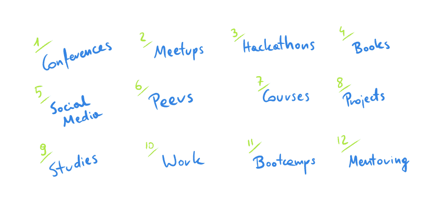
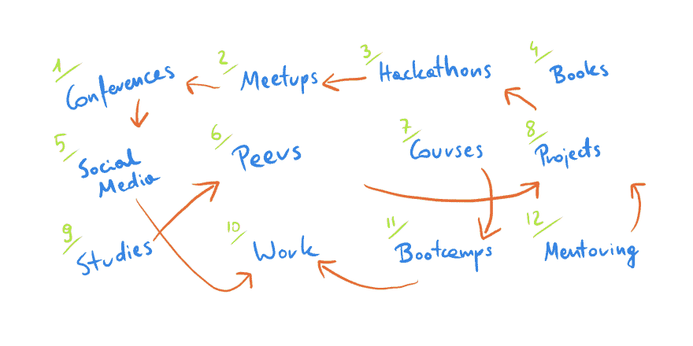
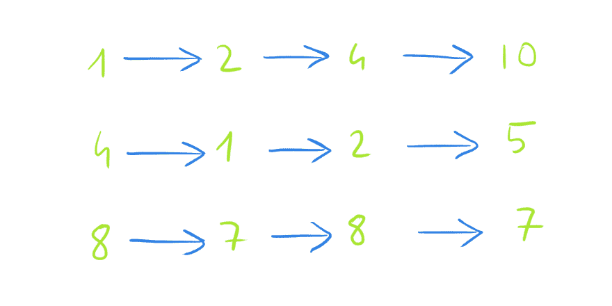

# 学习漏斗

> 原文：<https://dev.to/psmyrdek/the-learning-funnel-133i>

感谢我参与的各种与软件开发相关的活动，我不时有机会与进入这条职业道路的人交谈，倾听他们的挣扎。最常出现的问题之一是由所谓的“选择悖论”引起的，这种情况下，一个人必须面对的选择总数(就技术、编程语言或次佳框架而言)使得他不可能专注于最重要的主题并有效地学习。

此外，考虑到我们的行业充满了关于成长和个人发展的强烈观点(并不总是如此微弱)，很难定义一个人为了成为更好的软件开发人员而迈出有意义的一步应该完成的任务列表。有些人认为参加会议是浪费时间，有些人说这本书没什么好的，当然，也有很多人让你相信这种工具带来的价值是不可否认的。

最近，我一直在试图找出解决这两个问题的方法，这可以让你更容易地找到自己在软件开发中的学习道路，我想我终于准备好与大家分享我的想法了。更具体的说，是时候多了解一下学习编程的分层模型了(名字很不稳定)。

## 关键问题

让我问你一个问题——作为一名程序员，你有多少种方式可以开始你自己的旅程？定义至少一打是很容易的——有无数的聚会、会议、课程、书籍、文章、训练营、黑客马拉松或宠物项目，你可以感兴趣地了解这个疯狂的软件开发世界。

我能想到的开始这种旅程的最流行的方式之一是报名参加计算机科学班，在那里你会第一次发现和使用像 Python、Java 或 C++这样的语言。然而，我们中的一些人决定跳过这一步，而宁愿参加训练营或其他专注于软件开发人员强化课程的“任务组”。在这些活动的同时，一个雄心勃勃的程序员可以让自己置身于行业专家撰写的书籍之中，订阅他们的社交媒体档案，在那里他们可以分享有意义的见解，或者参加一些会议，以了解更多关于“下一件大事”的信息。最后，我们开始我们的第一份工作，我们终于有机会在现实生活中测试所有这些理论概念。

在这一点上，我们中的一些人可能会对一个人可以走的不同道路感到不知所措。大多数程序员都有一个众所周知的困境，那就是我们想知道要成为专家，完成任务和活动的正确顺序是什么？

我应该尽早找工作吗？参加会议是个好主意，还是浪费时间？如果我的经常账户余额等于零，我真的需要购买这个付费课程吗？对于我这样的人来说,《干净的代码》是一本值得一读的书吗？最近发布的这个新框架怎么样——我应该了解更多吗？根据我在程序员职业生涯的不同阶段指导他们的经验，我可以告诉你，这些问题比你想象的更受欢迎。

关于学习软件开发的最大谬误是，对我们中的一些人来说，这是一条一维的道路，其中最重要的因素是我们参与的活动的顺序。

难怪这样的模式没有帮助我们在没有压力的情况下学习和成长，也许是自我怀疑甚至焦虑。当唯一重要的事情是活动的顺序时，我们所想的是我们是否应该在那之前做这件事，还是在那之后做别的事？先看书再上课？训练营前的谈话？一本书之后的会议？XYZ 是浪费时间吗？XYZ 是个好选择吗？还有更多...

一般来说，有两个问题值得回答，以理清学习编程的道路:

*   在我职业生涯的这个阶段，我应该对多少话题感兴趣？我应该重视广泛的技能而不是狭窄的专业，或者相反？
*   我应该在我面前的话题上投入多少时间和精力？浅层学习和深层学习之间的良好平衡是什么，以及何时偏向于一个而不是另一个？

今天我想向你展示我对回答这些问题的建议。

## 下一维度

对于每个考虑成功学习和发展编程技能的人来说，有两个关键目标:

*   **建立竞争优势**在少数几个明确界定的领域比普通人更有经验和技能，为每个想和你一起工作的人带来价值
*   **了解市场上技术、实践、框架和语言方面的情况**,以延长您作为软件开发人员的“到期日”,并能够与其他领域的专家合作

我相信你很容易同意我的这两个观点，但是找到一个好的模型来涵盖这个概念是一个更困难的任务。

在花了很长时间试图找出一个基于这两点的稳定的学习框架后，我回忆起我所有来自营销和销售界的朋友每天都在使用的东西。我说的这个东西叫做销售漏斗。

> “销售漏斗是潜在客户在成为客户的过程中所走过的道路的视觉隐喻。销售漏斗经常被销售和营销组织使用，帮助公司理解和可视化他们的销售过程，并衡量漏斗每个步骤之间的整体转化成功。
> 
> 销售漏斗的形状像一个倒金字塔，类似于隐喻所暗示的真实世界的漏斗。漏斗各部分的宽度反映了受众规模，漏斗顶部最宽，底部最小。”~ [来源](https://www.optimizely.com/optimization-glossary/sales-funnel/)

它与我们在这篇文章中讨论的事情有什么关系？让我给你一个惊喜——以一种非常直接的方式！我们唯一需要做的就是用我们想了解的话题和我们想参与的活动来代替客户:

这样一个“分层学习漏斗”可以被开发者用来管理他们学习的主题，投入时间并与之互动。关于这个漏斗的关键点是，它通过引入参与程度的概念，为我们作为软件开发人员的学习和成长增加了新的维度。

事实证明，通过注意到要学习的东西的顺序和参与程度之间的差异，我们获得了一个非常有用的模型，基本上可以接触到每一个新概念，而不需要将你的专业知识局限在你最熟悉的领域。

为了了解所有这些是如何工作的，让我解释一下这个模型的规则。

## 都是关于层次的

我今天要向你展示的概念由多个层次(桶)组成，包括(或可能)与你的成长相关的一切——书籍、课程、演讲、会议、研究、论文、文档、框架、语言等等。

学习漏斗上部的层可能包含多个主题，您只需“收集”这些主题，以了解当今的工作方式，以及对于在软件开发的不同领域工作的同行来说，下一件大事是什么(您了解较少的语言、您没有机会使用的框架等)。).在较低部分的层需要更多的努力，但他们帮助你建立你的专业知识和市场价值。

关于所有这些层面，最重要的是，你越深入，你带来的话题就越少(因为每天的时间有限)，但你的参与程度必须提高(因为这是专注和深入工作的地方)。

让我们看看这个漏斗的每一层，看看它是如何工作的。

### 觉察

对于对软件开发世界感兴趣的人来说，这是一个各种活动的桶，不管提到的是什么语言、技术或框架。意识层是指参加会议，在聚会上与人交谈，关注社交媒体档案，或者只是简单地阅读一些文件，以了解你周围发生的一切。参与程度相对较低，但涵盖的主题范围很广。

### 兴趣

前一层中有一些你可能特别感兴趣的主题。例如，在一次会议上，您听到了关于您必须检查的全新框架的讨论，或者可能有人提到 BigCo 每天使用的这种伟大的语言，您决定在它上面花一些时间是值得的。您从认知层过滤掉一些主题，只是为了从您自己的角度简要检查一下这个新工具看起来如何。

### 比较

比较层包含了所有非常吸引你注意力的话题，同时在现实生活中的实际应用方面也非常有前途。这是你想比较这些闪亮的新玩具和你每天用来制作东西的工具的地方。这也是思考它们的弱点、不好的部分、它应该工作的环境或者这种特定的框架、语言或技术带来的价值的时候。这一层结束了我们对给定主题的干巴巴的分析，因为接下来的一切大多是关于实际应用的。

### 评价

是时候检查一下你选择的题目在现实中的效果了。例如，您可以为一个演示项目创建一个存储库，在那里您将测试这个新发现的实践或框架，您可以在您喜欢的项目中引入它，或者甚至基于它构建一个 MVP。关键是，在这个阶段引入这个全新工具的风险应该相对较低——总而言之，你只是在评估它，而不是做出任何最终决定。

### 动作

行动层中的所有内容都可以立即传播到你的投资组合、LinkedIn 个人资料或你的专业知识总结中。行动桶是我们保存语言、技术和实践的地方，这些语言、技术和实践帮助我们构建稳定、可靠的解决方案，尽可能地将风险最小化。我们放入这个桶中的主题不会给我们带来浪费时间的感觉，因为它们与我们的日常工作、我们从事的项目以及我们获得报酬的原因直接相关。

### 倡导

对于大多数程序员来说，宣传层是完全可选的，但是它带来的价值迫使我将它包括在内。那么里面是什么呢？我们不时会从这些“可操作的”桶中发现一些让我们如此兴奋的东西，以至于我们迫不及待地与我们的同事或我们想要回报的社区分享这些消息。我们开始在网上推广它，我们在会议上谈论它，或者我们录制视频解释它的基本原理。在一些公司，我们会被称为这个特定主题的传播者。这一层的活动通常非常耗时，但与此同时，它们的投资回报以一种非常有意义的方式回报(建立个人品牌，与专家会面并与他们分享知识，甚至为你接下来的一切奠定基础)。

## 向我展示它是如何工作的

作为一名主要从事 Angular 项目的前端开发人员，我的学习漏斗可以是这样的:

我的意识层里有什么？基本上整个软件工程世界。我非常渴望学习新的语言、技术或框架。我喜欢关注社交媒体上关于各种东西的风暴，以及关于 TDD 是否是编写测试的正确方式的争论。我想保持对事物的了解，我想为未来可能等待我的变化做好准备，我想在没有太多参与的情况下发现新世界。

在兴趣层，大多是和我前端体验直接相关的话题。到今天为止，我一直在关注 Svelte framework 的开发，我很好奇它将如何改变我们编写客户端解决方案的方式，我迫不及待地想在这个主题上花更多的时间。Nest 也是如此，它似乎是 raw Node.js 环境的一个非常有前途的替代品。

对比？当然，“三巨头”中的两个——Vue 和 React。尽管我大部分职业时间都在 Angular 前度过，但我对绿色和蓝色标识下发布的新想法充满热情。我阅读了关于钩子的文章，阅读了关于单文件组件的文章，我试图将其中的一些想法借用到我最熟悉的世界中，这个世界是有棱角的。

评估层目前只关注模板和 Web 组件。我已经成功发布了几个基于这两个的产品级项目，并且我一直在寻找这些领域的更多知识。一段时间以前，我爱上了构建真正可重用的组件的想法，这些组件可以注入到您最喜欢的前端技术中，那时我不仅有机会构建基于 WC 的解决方案，还可以与 Stencil 的核心团队和其他倡导者讨论不同的想法和问题。

现在转到动作层，在这里我大部分时间使用 Angular(一般来说是 JavaScript 本身)来构建东西。这是我感觉最舒服的框架，到目前为止，它帮助我建立了几十个项目，所以我很自然地把很多注意力放在我职业生活的这一部分。此外，作为一个从基本原则解决问题的狂热爱好者，我试图提高原始 JavaScript 的水平，这比你想象的更经常地拯救了我的生命。

最后但并非最不重要的一点是，这里有一个宣传层，由于我是知识共享运动的大力提倡者，今天你可以阅读这篇文章，在 YouTube 上观看我的视频，或者在当地会议上听一个演讲。我在这些领域投入的时间总量相当大，我每天感受到的结果也是如此。

在您的情况下，我刚刚描述的所有这些层可能会包括一组完全不同的活动。如果阅读技术书籍是你建立意识的原因，那么它肯定会和我的情况有所不同。如果您的日常工作给了您大量的空间来试验不同的库和框架，您也会以不同的方式对待这些“风险相关”的活动。总而言之，这并不是要找到一种唯一的方式来给这些活动贴上“阅读一本书”或“参加一个会议”的标签，而是要在这个二维的漏斗中学习，在这个漏斗中，除了任务的顺序之外，我们还要考虑参与的正确程度。

## 真的为你带来了什么价值吗？

是的，当然，它是。由于模拟了我自己学习软件开发工艺的方式，我所做的一切都有了一个更好的结构，以一种更好的方式组织起来，并且让我更有意识地工作在我自己的技能上。

例如，由于将我参与的不同活动分成不同的层次，我在参加了一两个会议(对我来说这是一个意识层)后，不会仅仅因为有人说这是浪费时间而感到内疚。一方面，我明白这是一种很好的方式，可以让我掌握编程的脉搏，并与最前沿的想法、技术或框架保持联系；另一方面，错过一两次活动后，我并不真的那么难过，因为这不会立即毁掉我的职业生涯。与此同时，当我们进入漏斗的较低部分时，我知道有必要以更专注和深入的方式在相当有限的几个主题上工作，因为如果没有明确定义的专业领域，我就不会像我希望的那样感到舒服。

由于这个额外的维度(参与程度)，我可以更有意识地处理不同的活动，并期待不同的结果，而不会因为缺乏结果而失望。我对某样东西(一个想法、一个框架、一个工具)越熟悉，它看起来越有前途，我就越注意学习它，并把它提升到我的漏斗的后面几层。

此外，我在这里解释的模型不是一个只有初学者才能包含在他们的工作流程中的工具，而是任何试图导航他们职业道路的人都可以每天使用的工具。最后，学习一件事情的过程是无止境的，所以我想不出为什么把更多的顺序放进去会给你带来麻烦。给它五分钟，并与我分享你的反馈-我真的很好奇你对这个话题的看法！