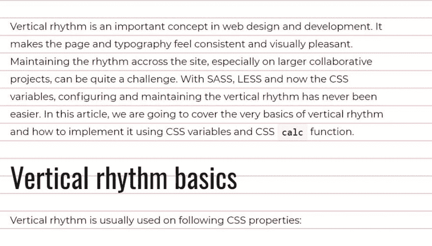

# 掌握 CSS:垂直节奏

> 原文：<https://dev.to/adrianbdesigns/mastering-css-vertical-rhythm-om9>

垂直节奏是网页设计和开发中的一个重要概念。它使页面和排版感觉一致，视觉上令人愉快。保持整个网站的节奏，尤其是在大型协作项目中，可能是一个相当大的挑战。有了 SASS、LESS 和现在的 CSS 变量，配置和维护垂直节奏变得前所未有的简单。在这篇文章中，我们将介绍垂直节奏的基础知识，以及如何使用 CSS 变量和 CSS `calc`函数来实现它。

## 垂直节奏基础

垂直节奏通常用于以下 CSS 属性:

*   排版- `line-height`
*   间距- `padding`(顶部和底部)，`margin`(顶部和底部)
*   偏移- `top`，`bottom`
*   尺寸- `height`、`min-height`、`max-height`

注意我们没有使用垂直节奏。模块比例通常用于印刷字体大小。垂直节奏只用于间距和垂直大小。

首先，我们需要确定**节奏单位**。这将作为计算垂直 ryhthm 的乘法基础。因为垂直节奏是与重复联系在一起的，任何网站上最重复的间距是一个`body`元素的`line-height`，一个页面的基线高度。我们将使用这个基线高度作为节奏单位。

```
html {
    /* Set parent font size */
    font-size: 18px;
}

body {
    /* Set base line-height */
    line-height: 1.778rem;
} 
```

请注意，为了便于计算，我们使用了`px`值，建议尽可能使用相对值。从这个配置我们可以计算出节奏单位值:`Rhythm unit = 18px * 1.778rem = 32px`。或者，我们可以在元素检查器中检查`body`元素的`line-height`。

<figure>

[](https://res.cloudinary.com/practicaldev/image/fetch/s--oaqQ8Yb4--/c_limit%2Cf_auto%2Cfl_progressive%2Cq_auto%2Cw_880/https://thepracticaldev.s3.amazonaws.com/i/lvrlol0l26foyy1za8gz.jpg)

<figcaption>Vertical rhythm example with 32px rhythm unit from this article (very meta!)</figcaption>

</figure>

在图像上，我们可以看到 32px (1 个节奏单位)的基线网格，以及文本如何很好地适应它。注意标题的行高正好是基本节奏单位的 2 倍。这意味着标题的行高的节奏单位乘数为 2(下边距为 1 个节奏单位)。

## 节奏单位乘数

当然，我们不能只有一个间距值。这就是节奏单位乘数的用武之地。

```
html {
    /* Set parent font size */
    font-size: 18px;
}

body {
    /* rhythmUnit = 32px */
    line-height: 1.778rem;
}

.spacing__vertical--1 {
    /* 1x rhythmUnit = 32px */
    padding-bottom: 1.778rem;
}

.spacing__vertical--2 {
    /* 2x rhythmUnit = 64px */
    padding-bottom: 3.556rem;
}

.spacing__vertical--3 {
    /* 3x rhythmUnit = 96px */
    padding-bottom: 5.334rem;
} 
```

我们有间距的基本分类，它是通过将节奏单位乘以 2，3，4 等来计算的。但是这些类不够灵活，它们不会涵盖垂直节奏的所有用例。这就是为什么我们将创建 CSS 变量(也可以在 SASS 和 LESS 中完成)来存储和动态计算垂直节奏值。

```
:root {
    /* Base values */
    --typography__fontSize: 18px;
    --spacing__rhythmUnit: 1.778rem; /* 1.778rem * 18px = 32px */

    /* Calculations */
    --spacing__vertical--1: var(--spacing__rhythmUnit);
    --spacing__vertical--2: calc(2 * var(--spacing__rhythmUnit));
    --spacing__vertical--3: calc(3 * var(--spacing__rhythmUnit));
}

html {
    font-size: var(--typography__fontSize);
}

body {
    line-height: var(--spacing__vertical--1);
}

.spacing--default {
    padding-bottom: var(--spacing__vertical--1);
}

.button--default {
    height: var(--spacing__vertical--2);
}

.heading--primary {
    line-height: var(--spacing__vertical--3);
} 
```

我们改进了前面的例子，创建了可重复使用的变量，可以用于所有提到的用例(排版、间距、偏移、高度等)。).通过使用这些变量，我们可以确保网站上所有元素的垂直节奏一致。但我们需要记住，当我们添加一些 CSS 规则(如边框)时，可以将内容向下推，而不必遵守垂直节奏的规则。

## 补偿边界

当我们为元素添加垂直(顶部或底部)边框时，它们会增加元素的整体高度，并将内容向下推。这也会影响我们的垂直节奏(如果边框宽度不在垂直节奏值中)，我们必须通过减少垂直`padding`、`margin`或`line-height`(如果元素没有填充或空白)的节奏值来补偿添加垂直边框。

```
:root {
    /* Base values */
    --typography__fontSize: 18px;
    --spacing__rhythmUnit: 1.778rem; /* 1.778rem * 18px = 32px */

    --border__width--default: 0.111rem; /* 2px */

    /* Calculations */
    --spacing__vertical--1: var(--spacing__rhythmUnit);
    --spacing__vertical--2: calc(2 * var(--spacing__rhythmUnit));
    --spacing__vertical--3: calc(3 * var(--spacing__rhythmUnit));
}

html {
    font-size: var(--typography__fontSize);
}

body {
    line-height: var(--spacing__vertical--1);
}

.heading--primary {
    border-bottom: var(--border__width--default) solid #aaa; /* 2px */
    padding-bottom: calc(
        var(--spacing__vertical--1) - var(--border__width--default)
    ); /* 32px - 2px */
    line-height: var(--spacing__vertical--3); /* 96px */
} 
```

看一看`.heading--primary`类，我们可以看到我们已经设置了底部边框、填充和行高。由于我们有填充，我们将通过减少底部填充的边框宽度来补偿增加的底部边框。

如果我们假设标题包含一行文本，那么元素高度的计算如下:`2px + (32px - 2px) + 96px = 128px`它等于垂直单位的 4 倍。