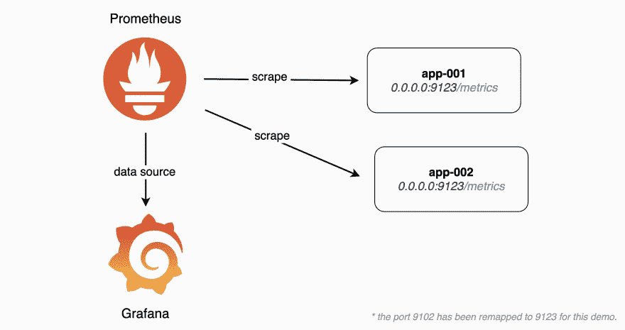
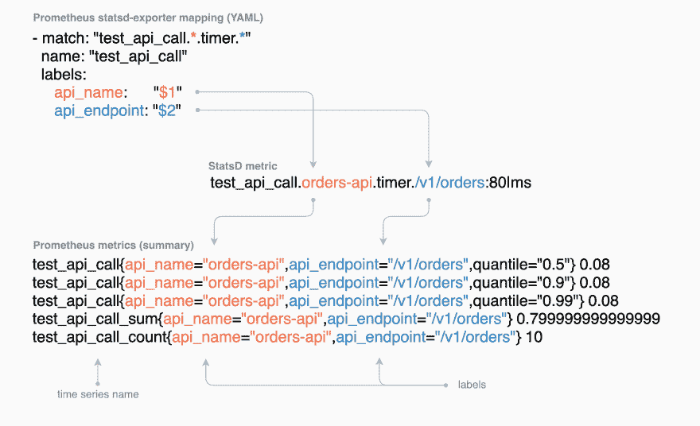
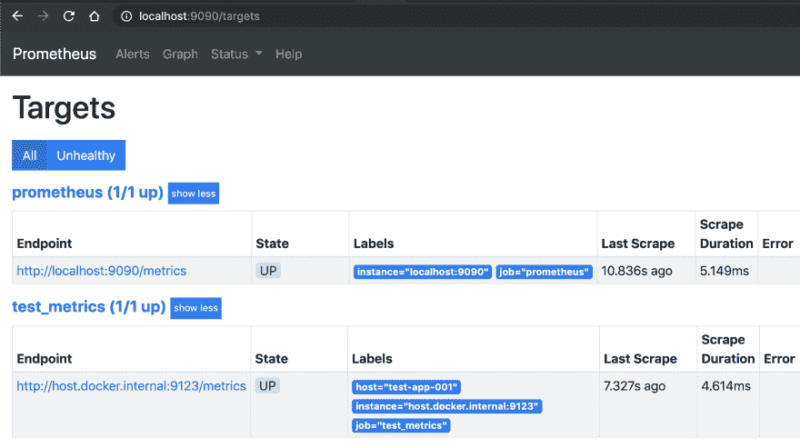

# Prometheus StatsD Exporter 和 Grafana 的指标

> 原文：<https://dev.to/kirklewis/metrics-with-prometheus-statsd-exporter-and-grafana-5145>

这篇文章解释了如何使用 Prometheus StatsD-exporter 来转换 [StatsD](https://github.com/statsd/statsd#statsd--) 指标，然后用 Grafana 可视化它们。

我将从一个应用程序的角度进行解释，该应用程序使用 StatsD，但是由 Prometheus 服务器监控。因此，我将把终端作为一个假想的应用程序来使用，这个应用程序发出度量标准**；Prometheus 将监控应用程序并收集任何指标**；**最后 Grafana 将使用普罗米修斯作为数据源来绘制图形。**

## 所用技术概述

本节简要介绍了为什么要使用每项技术，但是要了解更多信息，您可以使用[推荐阅读](#recommended-reading)部分中的链接来阅读每项技术。

### 度量标准

在系统运行期间，对其任何属性的测量被称为*度量*。这些度量标准通常是与一些信息相关联的*数据点*的形式，以便为其提供上下文。指标包括使用的内存字节数、网站访客数、完成任务所用的时间等。

StatsD 指标允许使用[文本格式](https://github.com/b/statsd_spec#statsd-metrics-export-specification-v01)规范来记录和表示这些信息。下面是两条 StatsD 度量线，每条线代表一个 API 请求花费的时间。

```
# metric format: <metric name>:<value>|ms
test_api_call.orders-api.timer./v1/orders:84|ms
test_api_call.orders-api.timer./v1/orders:95|ms 
```

Enter fullscreen mode Exit fullscreen mode

在上面的例子中，对`GET /api/orders`的两个 API 调用分别测量为 84 和 95 毫秒。`|ms`与 StatsD 定时器度量一起使用。StatsD 还支持其他度量类型，如计数器、量表、直方图和更多的。

#### 为什么用点分隔？

为了记录关于指标的信息，在本例中是 API 及其端点的名称，`<metric name>`部分是用*点分隔的*，这样就可以捕获这些细节。

[](https://res.cloudinary.com/practicaldev/image/fetch/s--womLAdQQ--/c_limit%2Cf_auto%2Cfl_progressive%2Cq_auto%2Cw_880/https://thepracticaldev.s3.amazonaws.com/i/ytsp6k7bu0c591vz0hu1.png)

*稍后您将看到 Statsd-exporter 如何帮助我们捕获我们关心的点分隔部分。*

### 普罗米修斯进行监控

Prometheus 可用于监控仪表系统的性能，如微服务、主机服务器等。系统需要公开它的度量标准，以便普罗米修斯收集它们——这也称为抓取。然后可以使用 Prometheus [表达式浏览器](https://prometheus.io/docs/visualization/browser/#expression-browser)可视化或查询收集到的指标。Prometheus 还有一个[警报管理器](https://prometheus.io/docs/alerting/alertmanager/)，它可以发送关于被监控的某些指标的警报——它支持 Slack、PagerDuty、email 和[等等](https://prometheus.io/docs/introduction/faq/#can-i-send-alerts)。

下图显示了 Prometheus 抓取在`/metrics`路径上公开的应用程序指标。Grafana 然后可以使用这些指标进行可视化。

[](https://res.cloudinary.com/practicaldev/image/fetch/s--3BoPCI3U--/c_limit%2Cf_auto%2Cfl_progressive%2Cq_auto%2Cw_880/https://thepracticaldev.s3.amazonaws.com/i/seqaahl8z0q0hhgrslck.png)

### stat 出口公司

statsd-exporter 用于将 statsd 指标转换为 Prometheus 指标。这是因为 StatsD [文本格式](https://github.com/b/statsd_spec#statsd-metrics-export-specification-v01)表示的度量不同于普罗米修斯的[展示格式](https://github.com/prometheus/docs/blob/master/content/docs/instrumenting/exposition_formats.md#text-format-example)，后者表示如下:

```
<time series name>{<label name>=<label value>,...} 
```

Enter fullscreen mode Exit fullscreen mode

下图显示了如何使用导出器的映射规则将 StatsD 指标转换为 Prometheus 指标。

[](https://res.cloudinary.com/practicaldev/image/fetch/s--Rw5B8LPL--/c_limit%2Cf_auto%2Cfl_progressive%2Cq_auto%2Cw_880/https://thepracticaldev.s3.amazonaws.com/i/2vvlwz5t26l5fu6dzl69.png)

> 对于一个系统来说，以不同于普罗米修斯的格式记录它的指标是很常见的，因此有许多[导出器](https://prometheus.io/docs/instrumenting/exporters)允许这样的指标被转换成普罗米修斯的时间序列符号

#### 计数、总和、分位数从何而来？

StatsD-exporter 自动将计时器指标转换为[普罗米修斯摘要](https://prometheus.io/docs/concepts/metric_types/#summary)。摘要包含额外的信息，如当前观察的计数、总和以及每个分位数。*默认情况下，分位数为 0.5、0.9 和 0.99* 。

在上图中，10 个 API 请求每个花费了 80 毫秒来响应。因此，生成的摘要包含以下详细信息:

*   `_count`共 10 个。
*   0.7999999999999999。
*   和每个`_quantile`，其中 0.5(第 50 百分位)是中间值。

现在已经了解了每种技术彼此之间的关系，我们可以开始实现我们的测试应用程序了。

* * *

## 配置 Prometheus 和 Statsd-exporter

在本节中，将创建 Prometheus 和 statsd-exporter 的配置文件。

### 创建目录和文件

创建一个名为`.prometheus`的目录来包含文件`prometheus.yml`和`test-mapping.yml`，如下:

```
# I have created mine in $HOME/.prometheus/
mkdir ~/.prometheus && cd $_
touch ./{prometheus,test-mapping}.yml 
```

Enter fullscreen mode Exit fullscreen mode

运行`tree`或`find .`来验证文件。

### 普罗米修斯配置

这为我们提供了 Prometheus 服务器的一些基本配置，比如静态服务发现，以及每隔多长时间抓取一次发现的服务。

将以下内容添加到`prometheus.yml`文件并保存。

```
global:
  scrape_interval:      15s
  evaluation_interval:  15s

scrape_configs:
  # optional: this makes the metrics available to us about Promethus itself.
  - job_name: 'prometheus'
    static_configs:
      - targets: ['localhost:9090']

  # tells Prometheus to scrape metrics an address over port 9123
  - job_name: 'test_metrics'
    static_configs:
      - targets: ['host.docker.internal:9123'] # see statsd-exporter further down
        labels: {'host': 'test-app-001'} # optional: just a way to identify the system exposing metrics 
```

Enter fullscreen mode Exit fullscreen mode

Prometheus 还支持[动态服务发现](https://github.com/prometheus/prometheus/tree/master/discovery)，如果您在 AWS ECS 或其他可扩展的云解决方案上部署应用程序，这将非常有用。

### Statsd-导出器配置

这是 Prometheus[statsd-exporter](#)使用的文件，因此它知道如何将 StatsD 指标转换为 Prometheus 指标。

将以下内容添加到`test-mapping.yml`文件并保存。

```
mappings:
    # usage: test_api_call.product-api.timer./v1/product
  - match: "test_api_call.*.timer.*"
    name: "test_api_call"
    labels:
        api_name: "$1"
        api_endpoint: "$2" 
```

Enter fullscreen mode Exit fullscreen mode

## 启动 Statsd 导出器

在用 Grafana 可视化任何指标之前，我们可以检查我们的 Statsd 指标是否被正确转换。

首先，运行正式的 Prometheus[statsd-exporter](https://hub.docker.com/r/prom/statsd-exporter)Docker 映像，然后通过端口 8125 向其发送指标。

### 跑步

*确保您在`.prometheus`目录中。*T3】

```
docker run --name=prom-statsd-exporter \
    -p 9123:9102 \
    -p 8125:8125/udp \
    -v $PWD/test-mapping.yml:/tmp/test-mapping.yml \
    prom/statsd-exporter \
        --statsd.mapping-config=/tmp/test-mapping.yml \
        --statsd.listen-udp=:8125 \
        --web.listen-address=:9102 
```

Enter fullscreen mode Exit fullscreen mode

### 这有什么用

*   监听发送到端口`8125` - *上某个地址的指标，例如* `echo "hello:1|c" | nc -w 0 -u 127.0.0.1 8125`
*   使用之前创建的`test-mapping.yml`文件将 Statsd 指标转换为 Prometheus 指标。
*   公开 Prometheus 的指标，以抓取(在本例中是通过主机端口`9123` -容器端口`9102`)。

运行图像后，您应该看到如下输出:
[](https://res.cloudinary.com/practicaldev/image/fetch/s--3LaWbTLG--/c_limit%2Cf_auto%2Cfl_progressive%2Cq_auto%2Cw_880/https://thepracticaldev.s3.amazonaws.com/i/5hh4mcrkzrfzmv011932.png)

## 启动普罗米修斯

现在可以启动 Prometheus 服务器，这样它就可以收集端口 9123 上显示的指标。

> *回想一下,`prom-statsd-exporter`容器公开了容器端口 9102 上的指标，这些指标被重新映射到主机端口 9123。*

首先，运行官方的普罗米修斯 Docker 映像。

### 跑步

*确保您在`.prometheus`目录中。*T3】

```
docker run --name=prometheus \
    -p 9090:9090 \
    -v $PWD/prometheus.yml:/prometheus.yml \
    prom/prometheus \
        --config.file=/prometheus.yml \
        --log.level=debug \
        --web.listen-address=:9090 \
        --web.page-title='Prometheus - Test Metrics Demo' 
```

Enter fullscreen mode Exit fullscreen mode

### 这有什么用

*   运行 Prometheus 服务器，并告诉它从`prometheus.yml`中定义的目标获取指标
*   允许我们使用 Prometheus 浏览器可视化指标，甚至使用 [PromQL](#) 查询它们
*   允许 Grafana 通过地址端口 9090 使用 Prometheus 作为数据源

运行图像后，您应该看到如下输出:
[](https://res.cloudinary.com/practicaldev/image/fetch/s--Fnzs5Wiv--/c_limit%2Cf_auto%2Cfl_progressive%2Cq_auto%2Cw_880/https://thepracticaldev.s3.amazonaws.com/i/xw8h1lwgymu21aju5mrp.png)

*上面告诉我们,`prometheus.yml`文件已经加载，普罗米修斯知道要刮擦的两个目标。*

### 验证目标已启动并正在运行

前往 [localhost:9090/targets](http://localhost:9090/targets) 。每个目标的每个端点都应该是`up`。

[](https://res.cloudinary.com/practicaldev/image/fetch/s--S50ctYh2--/c_limit%2Cf_auto%2Cfl_progressive%2Cq_auto%2Cw_880/https://thepracticaldev.s3.amazonaws.com/i/3ljdorq2rdwmzlj4g1gg.jpg)

我们可以开始发送指标，普罗米修斯会刮他们。

## 发送一些指标

现在尝试使用下面几行代码通过本地主机 IP 地址和端口 127.0.0.1:8125 发送一对度量。

```
echo "test_api_call.orders-api.timer./v1/orders:89|ms" | nc -w 0 -u 127.0.0.1 8125
echo "test_api_call.orders-api.timer./v1/orders:68|ms" | nc -w 0 -u 127.0.0.1 8125 
```

Enter fullscreen mode Exit fullscreen mode

现在转到 [http://localhost:9123](http://localhost:9123) 查看指标。如果您已经更新了您的`hosts`文件以将`host.docker.internal`解析为`localhost`，那么您可以改为访问`http://host.docker.internal:9123`。

搜索`test_api_call`，你应该会看到类似下面的普罗米修斯摘要。

[](https://res.cloudinary.com/practicaldev/image/fetch/s--ilMBBizb--/c_limit%2Cf_auto%2Cfl_progressive%2Cq_auto%2Cw_880/https://thepracticaldev.s3.amazonaws.com/i/zbv3qxzvj9a2l4i072j8.jpg)

* * *

## 可视化 Grafana 中的 API 调用指标

这最后一节着眼于在端口 3000 上启动 Grafana，添加一个 Prometheus 数据源，并创建一个图形来可视化 API 调用度量。

首先运行官方的 [Grafana](https://hub.docker.com/r/grafana/grafana) Docker 图像。

```
docker run -d --name=grafana -p 3000:3000 grafana/grafana 
```

Enter fullscreen mode Exit fullscreen mode

Grafana 默认的*用户名*和*密码*分别是*管理员*和*管理员*。

### 向 Grafana 添加普罗米修斯数据源

要添加 Prometheus 数据源和图表，您可以按照 Prometheus 网站- *上的说明进行操作，而不是我在这里重复同样的说明*。

*   [创建普罗米修斯数据源](https://prometheus.io/docs/visualization/grafana/#creating-a-prometheus-data-source)
*   [创建普罗米修斯图](https://prometheus.io/docs/visualization/grafana/#creating-a-prometheus-graph)

**绘制平均请求持续时间**
在*“创建普罗米修斯图”*一节中，提到“在查询字段中输入普罗米修斯表达式”，使用如下所示的表达式`rate(test_api_call_sum[1m]) / rate(test_api_call_count[1m])`。此表达式使用`test_api_call`的普罗米修斯摘要计算最后一分钟的平均请求持续时间

或者，您也可以将图例字段更新为`{{api_name}} - {{api_endpoint}}`，如下所示——这样做将显示如下图例:`orders-api - /v1/orders`。

[](https://res.cloudinary.com/practicaldev/image/fetch/s--NDkuUwsE--/c_limit%2Cf_auto%2Cfl_progressive%2Cq_auto%2Cw_880/https://thepracticaldev.s3.amazonaws.com/i/qsp44osw217xnqte0kbq.jpg)

### 连续发出度量值

现在，为了让我们不必手动发送指标- *只是为了更频繁地更新图表*，我们可以编写一个简单的命令行语句，每秒发送一个指标。这将在两个 shells 中完成，以模拟对虚构的`orders-api`和`invoice-api`的 API 调用。

下面的 [shuf](https://explainshell.com/explain?cmd=shuf+-i+50-150+-n+1) 命令用于生成 50 到 150 毫秒之间的随机范围。

**Shell 1:订单-api**

```
while true; do echo -n "test_api_call.orders-api.timer./v1/orders:$(shuf -i 50-150 -n 1)|ms" | \
    nc -w 1 -u 127.0.0.1 8125; done 
```

Enter fullscreen mode Exit fullscreen mode

**外壳 2:发票-api**

```
while true; do echo -n "test_api_call.invoice-api.timer./v1/invoice:$(shuf -i 50-150 -n 1)|ms" | \
    nc -w 1 -u 127.0.0.1 8125; done 
```

Enter fullscreen mode Exit fullscreen mode

> *使用 **ctrl** + **c** 停止任一循环*

### 观想

几秒钟后，您应该会看到图形绘制。一段时间后——在我的例子中是 5 分钟，你的图表应该看起来类似下图。*确保仪表板的刷新率至少为 5 秒。*

[](https://res.cloudinary.com/practicaldev/image/fetch/s--4XVeZJu5--/c_limit%2Cf_auto%2Cfl_progressive%2Cq_auto%2Cw_880/https://thepracticaldev.s3.amazonaws.com/i/q6h9iruipr7vnt4gydmm.jpg)

## 如何从一个真实的应用程序中发出指标？

有为 Go、Node、Python、Perl 等编写的 StatsD 客户端库。参见下面的链接:
[https://github . com/statsd/statsd/wiki # client-implementations](https://github.com/statsd/statsd/wiki#client-implementations)
有些库还默认了主机`localhost`和端口`8125`，这样你就可以快速启动并运行了。

### 节点 StatsD 客户端示例

这个例子使用了 NPM 模块[节点-statsd](https://github.com/sivy/node-statsd#node-statsd) 。

```
const StatsD = require('node-statsd');
const statsdClient = new StatsD(); // defaults to localhost:8125

statsdClient.timing('example.response_time', 80); // record 80ms response time
statsdClient.increment('example.site_visit');     // record a new site visitor count +1 
```

Enter fullscreen mode Exit fullscreen mode

## 我可以只发出 metrics 到 Prometheus 格式而不是 StatsD 吗？

是的，可以用 Prometheus 格式来记录度量数据。这种方法消除了使用 Prometheus exporter sidecar 的需要和创建映射文件的额外工作。

要使用 Prometheus 来检测您的应用程序，请使用一个官方或非官方的客户端库。

* * *

## 结论

将 Statsd 指标从应用程序(本演示中为终端)中取出并放入 Grafana 中，只需执行以下操作:

*   两个配置文件。
*   运行 statsd-exporter，Prometheus 和 Grafana。
*   使用 Statsd 线路协议通过 UDP 在主机地址和端口上发出度量。
*   在 Grafana 中将 Prometheus 设置为数据源并配置图形。

就是这样！这篇文章的大部分内容是解释一些我认为理解起来非常重要的要点。尽管终端被用作一个虚拟的应用程序来“发出度量”，但是对于一个真实的应用程序来说，原理是相同的。因此，无论您是用 Go、Node、Python 等语言编写应用程序，您都可以使用 StatsD 客户端库来从中获取指标。

#### 推荐阅读

*   了解更多关于普罗米修斯- [https://prometheus.io](https://prometheus.io)
*   普罗米修斯出口商-[https://prometheus.io/docs/instrumenting/exporters](https://prometheus.io/docs/instrumenting/exporters)
*   使用 Prometheus 本身对应用程序进行检测-[https://prometheus.io/docs/instrumenting/clientlibs](https://prometheus.io/docs/instrumenting/clientlibs)
*   stat github-[https://github . com/stat/stat # stat SD—](https://github.com/statsd/statsd#statsd--)

感谢您的阅读！

[封面图片](https://www.flickr.com/photos/kirklewis/48423312857/)