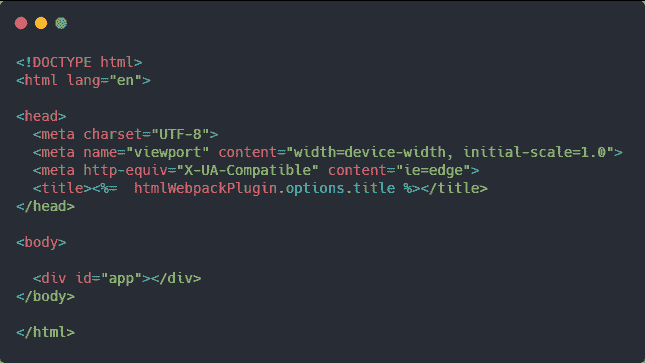
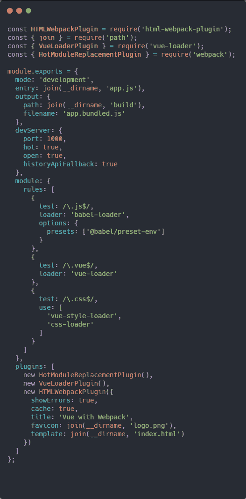
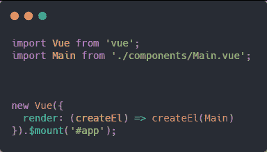
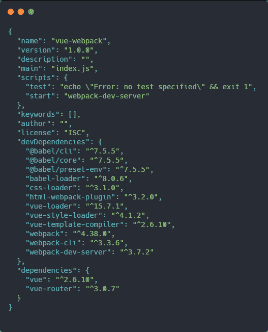
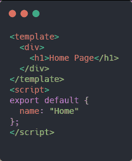
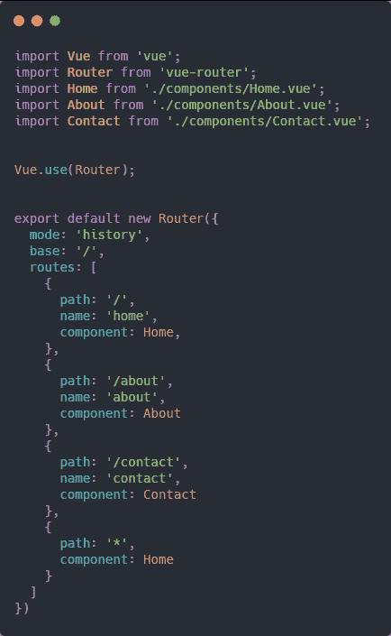

# 如何从头开始配置 Webpack 和 Vue

> 原文：<https://dev.to/macmacky/how-to-configure-webpack-and-vue-from-the-ground-up-4c19>

大家好！

像 **vue-cli** 、 **create-react-app** 和 **@angular/cli** 这样的工具免去了开发者配置项目和应用的麻烦。它节省了开发人员阅读 webpack 文档和构建这些工具所需的其他插件或库的大量时间。我们只需安装一次，运行它或在命令行中调用它，瞧，我们面前就有一个预配置的项目，我们可以立即编码或编程。

但我是个好奇的人。我想知道事情是如何运作的。所以还是言归正传吧。

请在执行此操作之前安装 **Node.js** 。
从你的桌面运行这个命令。

```
 mkdir vue-webpack && cd vue-webpack
   npm init --y 
```

<svg width="20px" height="20px" viewBox="0 0 24 24" class="highlight-action crayons-icon highlight-action--fullscreen-on"><title>Enter fullscreen mode</title></svg> <svg width="20px" height="20px" viewBox="0 0 24 24" class="highlight-action crayons-icon highlight-action--fullscreen-off"><title>Exit fullscreen mode</title></svg>

基本上，这意味着我们正在创建一个名为 **vue-webpack** 的目录( **md** ，并将当前目录( **cd** ) **Desktop** 更改为 **vue-webpack** ，并使用默认配置的 **npm init - y** 命令创建一个 **package.json** 文件。

```
 npm i -D @babel/cli @babel/core @babel/preset-env babel-loader 
   webpack webpack-cli webpack-dev-server html-webpack-plugin vue-loader 
   vue-template-compiler css-loader vue-style-loader 
```

<svg width="20px" height="20px" viewBox="0 0 24 24" class="highlight-action crayons-icon highlight-action--fullscreen-on"><title>Enter fullscreen mode</title></svg> <svg width="20px" height="20px" viewBox="0 0 24 24" class="highlight-action crayons-icon highlight-action--fullscreen-off"><title>Exit fullscreen mode</title></svg>

**i** 别名为**安装**。
**-D** 表示我们把它作为开发依赖来安装。

**[@babel](https://dev.to/babel) /cli** 和 **[@babel](https://dev.to/babel) /core** :这些包让我们可以在命令行中传输我们的 JavaScript 代码，或者我们可以通过编程来传输它。

**[@ babel](https://dev.to/babel)/preset-env**:这个包让我们在代码中使用 JavaScript 的最新特性，主要是 ES6 特性和一些 ES7 和 ES8 特性。如果你想使用**异步/等待**特性，你可能需要 **[@babel](https://dev.to/babel) /polyfill** 库。

babel-loader : Webpack 需要它来用 babel 传输我们的 Javascript 代码。

webpack 和**webpack-CLI**:webpack 核心功能和 web pack 命令行实用程序，因此我们可以运行一些定制的 web pack 命令。

webpack-dev-server :这提供了一个动态开发服务器，它在每次文件改变时重新加载浏览器页面。

html-webpack-plugin :这个插件生成一个 html 文件，或者我们可以指定一个现有的文件来服务我们的包。

vue-loader 和 **vue-template-compiler** :我们需要这两个工具，这样 webpack 就可以理解和传输扩展名为**的文件。vue** 。

css-loader 和 **vue-style-loader** :我们需要这两个，这样我们就可以在 vue 文件中使用 **css style** 标签。

```
 npm i -P vue 
```

<svg width="20px" height="20px" viewBox="0 0 24 24" class="highlight-action crayons-icon highlight-action--fullscreen-on"><title>Enter fullscreen mode</title></svg> <svg width="20px" height="20px" viewBox="0 0 24 24" class="highlight-action crayons-icon highlight-action--fullscreen-off"><title>Exit fullscreen mode</title></svg>

**-P** 表示我们将其安装为生产依赖项。

显然，我们需要这个来制作 vue 应用。咄😃。

我们的**index.html**文件。
T3T5】

我们的 **webpack.config.js** 文件。
T3T5】

好吧，我不打算解释所有这些只是重要的部分。我们借助于 **path.join** 方法和节点提供给我们的全局变量 **__dirname** 来指定主文件的**条目**路径。我们使用两个属性来指定输出:到要创建的文件夹的路径和捆绑的文件名。在 **devServer** 对象中，我们将端口(在本例中为 **1000** )和 **open** 属性指定为 true，这将在我们启动应用程序时自动打开浏览器，并将 **hot** 属性指定为 true，这将在我们更改目录中的文件时重新加载页面。 **historyApiFallback** 属性指定将提供**index.html**文件，而不是 404 响应。我们的**模块**
中的数组**规则**属性是我们对加载器文件的配置。在**插件**属性中，我们指定了应用程序中需要的插件，首先我们实例化了**HotModuleReplacementPlugin**，这样我们就可以在应用程序中启用热重载。
我们的 **vue** 文件需要 **VueLoaderPlugin** 最后，在 **HTMLWebpackPlugin** 中，我们传递必要的选项，我们指定 **favicon** 的路径，如果没有 favicon，去掉这个选项，我们的**模板**文件的路径，在这种情况下是 index.html 文件。

我们的 **app.js** 文件。
T3T5】

顺便说一下，在 **vue-webpack** 文件夹的根目录下运行这个命令。

```
 mkdir components 
```

<svg width="20px" height="20px" viewBox="0 0 24 24" class="highlight-action crayons-icon highlight-action--fullscreen-on"><title>Enter fullscreen mode</title></svg> <svg width="20px" height="20px" viewBox="0 0 24 24" class="highlight-action crayons-icon highlight-action--fullscreen-off"><title>Exit fullscreen mode</title></svg>

我们的 **Main.vue** 文件。
T3T5】

我们的 **package.json** 文件。
T3T5】

在命令行中运行。

```
 npm start 
```

<svg width="20px" height="20px" viewBox="0 0 24 24" class="highlight-action crayons-icon highlight-action--fullscreen-on"><title>Enter fullscreen mode</title></svg> <svg width="20px" height="20px" viewBox="0 0 24 24" class="highlight-action crayons-icon highlight-action--fullscreen-off"><title>Exit fullscreen mode</title></svg>

太好了，我们刚刚用 Webpack 从头开始制作了一个 Vue 应用程序。

好，我将在我们的应用程序中添加 **vue-router** 插件。

在命令行中运行。

```
 npm i -P vue-router 
```

<svg width="20px" height="20px" viewBox="0 0 24 24" class="highlight-action crayons-icon highlight-action--fullscreen-on"><title>Enter fullscreen mode</title></svg> <svg width="20px" height="20px" viewBox="0 0 24 24" class="highlight-action crayons-icon highlight-action--fullscreen-off"><title>Exit fullscreen mode</title></svg>

制作新的 3 个 vue 文件。

**Home.vue** 、 **About.vue** 和 **Contact.vue** 。

[](https://res.cloudinary.com/practicaldev/image/fetch/s--GAzych5x--/c_limit%2Cf_auto%2Cfl_progressive%2Cq_auto%2Cw_880/https://thepracticaldev.s3.amazonaws.com/i/2zf3n6oz88qpsldmlkkl.png)
[](https://res.cloudinary.com/practicaldev/image/fetch/s--j40fKxpT--/c_limit%2Cf_auto%2Cfl_progressive%2Cq_auto%2Cw_880/https://thepracticaldev.s3.amazonaws.com/i/lc4ymaq9j0c4mg407qgm.png)
[](https://res.cloudinary.com/practicaldev/image/fetch/s--bslttKQk--/c_limit%2Cf_auto%2Cfl_progressive%2Cq_auto%2Cw_880/https://thepracticaldev.s3.amazonaws.com/i/52p1dr5pn2ytqb4mulad.png)

我们修改的 **Main.vue** 文件。
T3T5】

在根文件夹中创建一个 router.js 文件。
[T3】](https://res.cloudinary.com/practicaldev/image/fetch/s--Hbv7sOwJ--/c_limit%2Cf_auto%2Cfl_progressive%2Cq_auto%2Cw_880/https://thepracticaldev.s3.amazonaws.com/i/xmk18d4s63e3mbzbepsm.png)

我们修改的 **app.js** 文件。
T3T5】

再次运行 **npm start** 命令。

#### 感谢阅读本帖。

### 祝大家愉快😃。