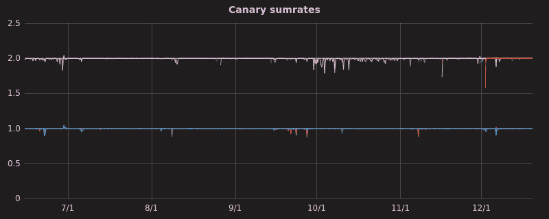

# 在托管石墨上的连续自测——为什么我们每秒都发送外部金丝雀

> 原文：<https://dev.to/bbhnn/continuous-self-testing-at-hosted-graphite-why-we-send-external-canaries-every-second-4hh7>

*最初发布在[主持的石墨博客](https://www.hostedgraphite.com/blog/continuous-self-testing-at-hosted-graphite-why-we-send-external-canaries-every-second)上。*

在 Hosted Graphite，内部系统监控是我们的工程师一直关心的问题。为了检测任何降级，我们持续对所有端点进行自测——每秒、每天。它为我们提供了小变化的早期警告信号，这可能是更大问题的指示器，并让我们知道我们的服务运行得有多好。我们努力衡量客户的实际体验，这也是我们衡量服务质量的主要指标之一。

# 它是如何工作的？

1.  每个 canary 服务每秒向我们接受度量流量的每个端点发送一次带有适当时间戳的值“1”。

2.  在任何 TCP 连接的情况下，我们每次都重新建立一个新的连接(并记录花费的时间),以允许测量网络延迟和服务过载。

3.  然后，我们可以持续监控这些指标的任何价值下降。

这个系统让我们知道是否出了问题:当我们记录的流量低于特定服务的可接受损失量时，我们的警报工具就会发出警报。然后，我们可以通过查看仪表板上显示的 [sum dataviews](https://www.hostedgraphite.com/docs/advanced/data-views.html) 来检查失败数据点的确切数量。这些数字按照协议和源网络进行汇总和分组，使我们一眼就能确定性能下降的程度。我们可以回答“只有一个 AWS 专区？”或者“所有 UDP 服务？”因为这种连续的、分布式的监控，所以提问速度极快。

###### 加那利群岛仪表板的‍A 片段——现在全是绿色的！

## 多汁的细节

我们测试所有的终点。这包括 TCP、TCP w/ TLS、UDP、Pickle、Pickle w/ TLS 和 HTTPS。我们的测试每秒发送一个数据点，以确保我们发现任何服务质量下降。为了确保我们没有错误地掩盖接受数据或建立连接的延迟，金丝雀被精心设计为每秒发送一个数据点，如果超过一秒钟就放弃尝试，确保无论如何每秒一个值的非常可靠的连续速率。

如果连接和提交数据点的时间超过一秒，我们会将其记录为丢弃的数据点，因为我们关心数据传输速率以及接受它需要多长时间。

每个协议都会发送一个数据点，这些数据点会到达我们的 Graphite 兼容端点。然后在我们的警报服务中呈现这些指标的总比率，如果该值低于特定服务的可接受损失，则呼叫待命工程师。

# 地点

我们的金丝雀服务位于三个地方:

## 外部

外部鸭翼都位于主石墨架构/管道的外部。它们被贴上标签，从世界各地发送过来。我们这样做是为了了解来自特定地区的流量是否有问题。

## 内部

我们在自己的数据中心运行更多的金丝雀。这使我们能够测试我们的本地网络，以便我们能够区分可能是由于我们自己的服务中的一些事故而不是外部连接问题造成的故障。

## 机上

虽然我们从网络内外的许多位置发送金丝雀数据，但我们也从本地的每个摄取服务向自身发送连续的金丝雀数据流，因此单台机器或服务的故障会立即显现。我们的集群和服务发现工具也会自动使用这些数据，允许自动修复最常见的单个机器故障类型。

###### 状态页面(包括完整的事件历史)

为了透明起见，[我们在我们的状态页面](https://status.hostedgraphite.com/)上公布了所有细节，因此我们的客户可以完全了解我们服务中的任何问题和实时状态信息。我们详细分析了问题的起因、影响对象以及问题的解决方式。

由丹·福克斯撰写，SRE 在主持石墨。