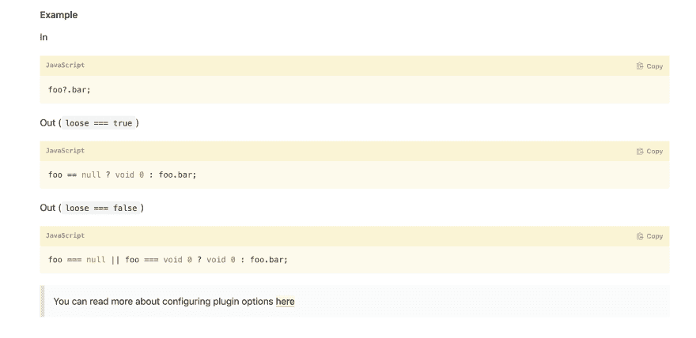

# 😰可选链接陷阱！

> 原文：<https://dev.to/slashgear_/optional-chaining-trap-3820>

几天前，TC39 第三阶段发布了一个公告，这是许多人所期待的。**可选链接**

这里的例子有

[](/thelarkinn)

## [肖恩·拉金](/thelarkinn)

[/thelarkinn](/thelarkinn)

液体错误:内部

对于 Javascript 来说，这是一个好消息！这个功能很棒，但是...

请同意我的观点，这项功能明天将不会在我们的浏览器中提供。在第 3 阶段，很有可能在 ES 的下一个版本中添加这个特性。

# 但是

我们需要在很长一段时间内把它混淆起来。

如果你看一看[@ babel/plugin-proposal-optional-chaining](https://babeljs.io/docs/en/babel-plugin-proposal-optional-chaining)，这就是 babel 将如何传输它。

[](https://res.cloudinary.com/practicaldev/image/fetch/s--0IUdYEe_--/c_limit%2Cf_auto%2Cfl_progressive%2Cq_auto%2Cw_880/https://thepracticaldev.s3.amazonaws.com/i/vtjdvqtvw5h6ti11xh7u.png)

这是一个非常冗长的输出。

让我们想象一下，我们在一个 web 应用程序中多次使用这个特性，而您将它用于深层情况。

```
const foo = everything?.could?.be.nullable?.maybe

// Babel will generate this output

var _everything, _everything$could, _everything$could$be$;

var foo = (_everything = everything) === null || _everything === void 0 ? void 0 : (_everything$could = _everything.could) === null || _everything$could === void 0 ? void 0 : (_everything$could$be$ = _everything$could.be.nullable) === null || _everything$could$be$ === void 0 ? void 0 : _everything$could$be$.maybe;

// Terser would modify like this
l,n,o;null===(l=everything)||void 0===l||null===(n=l.could)||void 0===n||null===(o=n.be.nullable)||void 0===o||o.maybe 
```

<svg width="20px" height="20px" viewBox="0 0 24 24" class="highlight-action crayons-icon highlight-action--fullscreen-on"><title>Enter fullscreen mode</title></svg> <svg width="20px" height="20px" viewBox="0 0 24 24" class="highlight-action crayons-icon highlight-action--fullscreen-off"><title>Exit fullscreen mode</title></svg>

在你的包里会非常冗长。babel 在状态中所做的转换根本不像`lodash.get`所能做的那样共享 *nullsafe* 访问机制。即使*洛达什*非常/太重。它提供了更有效的空安全实现，同时生成更少的代码。

你要告诉我，

> “什么鬼东西！Antoine，这不是我们第一次使用不太好的 polyfill 来使用 EcmaScript 的新功能”

# 耶

好的，但是这次我们仍然可以花几分钟的时间来提出一个更简单的 polyfill 实现。这个解决方案在一个 web 开发人员变成猎人的世界里无法真正应用。

我们来看看`lodash.get`是如何工作的。 [Github 链接](https://github.com/lodash/lodash/blob/master/.internal/baseGet.js)T3】

```
import castPath from './castPath.js'
import toKey from './toKey.js'

/**
 * The base implementation of `get` without support for default values.
 *
 * @private
 * @param {Object} object The object to query.
 * @param {Array|string} path The path of the property to get.
 * @returns {*} Returns the resolved value.
 */
function baseGet(object, path) {
  path = castPath(path, object)

  let index = 0
  const length = path.length

  while (object != null && index < length) {
    object = object[toKey(path[index++])]
  }
  return (index && index == length) ? object : undefined
}

export default baseGet 
```

<svg width="20px" height="20px" viewBox="0 0 24 24" class="highlight-action crayons-icon highlight-action--fullscreen-on"><title>Enter fullscreen mode</title></svg> <svg width="20px" height="20px" viewBox="0 0 24 24" class="highlight-action crayons-icon highlight-action--fullscreen-off"><title>Exit fullscreen mode</title></svg>

很有效(很紧凑)。如果可选链接的**聚合填充涉及到像`lodash.get`这样的实用函数的应用会怎样？**

你对此有什么看法？

如果你喜欢这篇文章，请随意分享和回应。