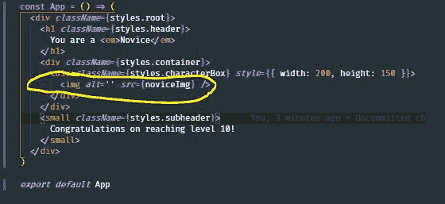
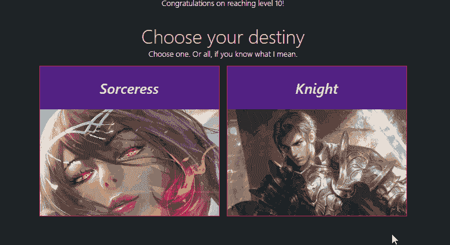
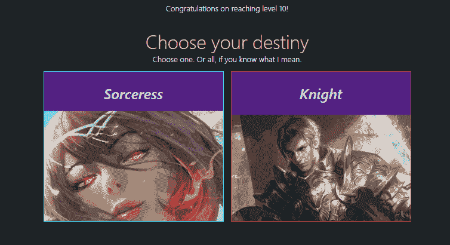
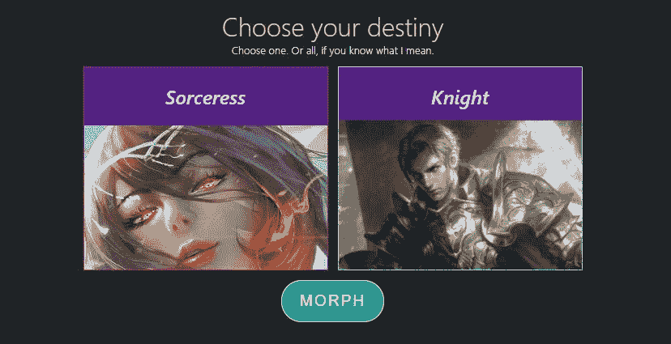
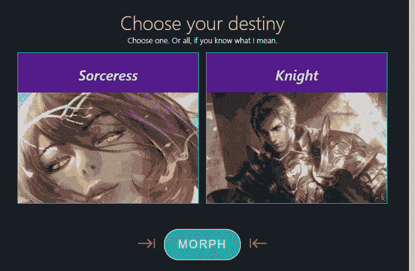
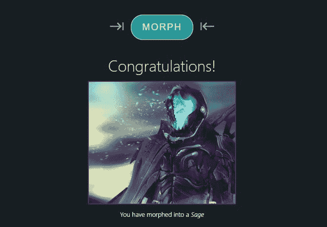

# 在 React 中构建一个角色选择屏幕

> 原文：<https://dev.to/jsmanifest/build-a-character-select-screen-in-react-4o2e>

在[媒体](https://medium.com/@jsmanifest)上找到我

React 是一个 JavaScript 库，以其简单性而闻名，同时仍然能够构建令人惊叹的用户界面。像[脸书](https://facebook.com)、[网飞](https://www.netflix.com/)和[纽约时报](https://www.nytimes.com/)这样的大型网站已经非常成功地使用 React 维护了他们的网络应用。感谢[对开源库的不可思议的积极参与](https://github.com/facebook/react/pulls)，它每天都在变得更好。

也就是说，本文将通过步骤来构建一个基本的角色选择屏幕，利用 react 的机制来使它变得逼真。

这篇文章的目的显然是建立一个角色选择界面，但也展示了我们的思考过程，并揭示了如何在问题出现之前解决问题。希望这种方法可以帮助新的 react 开发人员！

在这篇文章结束时，你应该会有这样的东西:

[](https://res.cloudinary.com/practicaldev/image/fetch/s--y0ipVFYi--/c_limit%2Cf_auto%2Cfl_progressive%2Cq_66%2Cw_880/https://jsmanifest.s3-us-west-1.amazonaws.com/posts/build-a-cool-character-select-screen-in-react/morph5.gif)

如果您想要包含附加字符的 GitHub repo 的链接，请点击[此处](https://github.com/jsmanifest/character-select)。

在这篇文章中，除了安装一个 loading spinner 之外，我不会使用任何 UI 库来制作任何效果，因为我希望每个人都能够跟随，而不必研究库的 API 来理解示例。

事不宜迟，让我们开始吧！

(**更新**:我想添加更多的东西，但是这个帖子越来越长了！)

在本教程中，我们将使用`create-react-app`快速生成一个 react 项目

继续使用下面的命令创建一个项目。在本教程中，我称我们的项目为*角色选择*。

```
npx create-react-app character-select 
```

<svg width="20px" height="20px" viewBox="0 0 24 24" class="highlight-action crayons-icon highlight-action--fullscreen-on"><title>Enter fullscreen mode</title></svg> <svg width="20px" height="20px" viewBox="0 0 24 24" class="highlight-action crayons-icon highlight-action--fullscreen-off"><title>Exit fullscreen mode</title></svg>

一旦完成，现在进入目录:

```
cd character-select 
```

<svg width="20px" height="20px" viewBox="0 0 24 24" class="highlight-action crayons-icon highlight-action--fullscreen-on"><title>Enter fullscreen mode</title></svg> <svg width="20px" height="20px" viewBox="0 0 24 24" class="highlight-action crayons-icon highlight-action--fullscreen-off"><title>Exit fullscreen mode</title></svg>

在主条目 src/index.js 中，我们将对其进行一些清理:

```
import React from 'react'
import ReactDOM from 'react-dom'
import * as serviceWorker from './serviceWorker'
import App from './App'

ReactDOM.render(<App />, document.getElementById('root'))
serviceWorker.unregister() 
```

<svg width="20px" height="20px" viewBox="0 0 24 24" class="highlight-action crayons-icon highlight-action--fullscreen-on"><title>Enter fullscreen mode</title></svg> <svg width="20px" height="20px" viewBox="0 0 24 24" class="highlight-action crayons-icon highlight-action--fullscreen-off"><title>Exit fullscreen mode</title></svg>

以下是开始的风格:

*src/styles.css*

```
body {
  margin: 0;
  font-family: -apple-system, BlinkMacSystemFont, 'Segoe UI', 'Roboto',
    'Oxygen', 'Ubuntu', 'Cantarell', 'Fira Sans', 'Droid Sans',
    'Helvetica Neue', sans-serif;
  -webkit-font-smoothing: antialiased;
  -moz-osx-font-smoothing: grayscale;
  background: rgb(23, 30, 34);
}

code {
  font-family: source-code-pro, Menlo, Monaco, Consolas, 'Courier New',
    monospace;
}

.root {
  padding: 20px 0;
} 
```

<svg width="20px" height="20px" viewBox="0 0 24 24" class="highlight-action crayons-icon highlight-action--fullscreen-on"><title>Enter fullscreen mode</title></svg> <svg width="20px" height="20px" viewBox="0 0 24 24" class="highlight-action crayons-icon highlight-action--fullscreen-off"><title>Exit fullscreen mode</title></svg>

现在转到 src/App.js，从根元素开始，因为我们已经定义了样式:

```
import React from 'react'
import styles from './styles.module.css'

const App = () => <div className={styles.root}>{null}</div> 
export default App 
```

<svg width="20px" height="20px" viewBox="0 0 24 24" class="highlight-action crayons-icon highlight-action--fullscreen-on"><title>Enter fullscreen mode</title></svg> <svg width="20px" height="20px" viewBox="0 0 24 24" class="highlight-action crayons-icon highlight-action--fullscreen-off"><title>Exit fullscreen mode</title></svg>

在我们继续之前，让我们解释一下我们将要构建的这个角色选择屏幕的流程，这样我们在进行的时候就在同一个页面上了。

让我们假装在玩 MMORPG 游戏。所有玩家都从创造一个角色开始。默认情况下，每个玩家都从`Novice`职业开始，一旦他们升到 10 级，他们就可以转变成 2 级职业(在这篇文章中，我们只有一个*女巫*和一个*骑士*可用，但 MMORPG 游戏通常有更多的职业，如弓箭手和死灵法师等。).当他们到达 10 级时，一旦他们选择了一个要变形的职业，他们就可以点击一个写着“变形”的按钮，他们的角色就会改变外观。在这些动作之间，它们会自动向下滚动，这样我们就能让玩家保持互动。然后，在结束时，它将被引导到另一个新的屏幕。

让我们首先展示一个祝贺他们的屏幕，然后给他们展示两个二级职业，他们可以选择变形他们的角色。

如果他们选择*女巫*，他们将能够变成一个女巫，继续他们的旅程，成为游戏中最好的玩家。同样的概念也适用于骑士期权。然而，有一个秘密的选择。如果玩家足够聪明和爱管闲事，他们会意识到他们可以选择*和*两者，然后变身成人类尚未见证的非凡生物。生活充满了惊喜，我们的游戏应该反映这一点，以保持现实。呵呵。

为了展示屏幕，我们将向他们展示一个标题、一张他们新手班级的照片(因为他们再也看不到了)，以及一条温暖人心的消息
来提醒他们，他们的努力得到了回报。

(如果您想使用相同的图片，可以在上面的 GitHub 链接中找到这些图片)

```
import React from 'react'
import noviceImg from './resources/novice.jpg'
import styles from './styles.module.css'

const App = () => (
  <div className={styles.root}>
    <h1 className={styles.header}>
      You are a <em>Novice</em>
    </h1>
    <div className={styles.content}>
      <div className={styles.characterBox} style={{ width: 200, height: 150 }}>
        
      </div>
    </div>
    <small className={styles.subheader}>
      Congratulations on reaching level 10!
    </small>
  </div> )

export default App 
```

<svg width="20px" height="20px" viewBox="0 0 24 24" class="highlight-action crayons-icon highlight-action--fullscreen-on"><title>Enter fullscreen mode</title></svg> <svg width="20px" height="20px" viewBox="0 0 24 24" class="highlight-action crayons-icon highlight-action--fullscreen-off"><title>Exit fullscreen mode</title></svg>

以下是 CSS 的新增内容:

*styles.css*

```
.content {
  display: flex;
  justify-content: center;
}

.header {
  text-align: center;
  color: rgb(252, 216, 169);
  font-weight: 300;
  margin: 0;
}

.subheader {
  color: #fff;
  text-align: center;
  font-weight: 300;
  width: 100%;
  display: block;
}

.characterBox {
  transition: all 0.1s ease-out;
  width: 300px;
  height: 250px;
  border: 1px solid rgb(194, 5, 115);
  background: rgb(82, 26, 134);
  margin: 12px 6px;
  overflow: hidden;
}

.characterBox img {
  width: 100%;
  height: 100%;
  object-fit: cover;
  cursor: pointer;
} 
```

<svg width="20px" height="20px" viewBox="0 0 24 24" class="highlight-action crayons-icon highlight-action--fullscreen-on"><title>Enter fullscreen mode</title></svg> <svg width="20px" height="20px" viewBox="0 0 24 24" class="highlight-action crayons-icon highlight-action--fullscreen-off"><title>Exit fullscreen mode</title></svg>

查看组件，我们可以看到根元素包含一个标题、一个内容容器和一个子标题作为直接子元素。不久前我提到我们将向用户展示一张新手的照片，这就是在类名为`styles.content`的 div 元素中发生的事情:

[](https://res.cloudinary.com/practicaldev/image/fetch/s--JD2P8v36--/c_limit%2Cf_auto%2Cfl_progressive%2Cq_auto%2Cw_880/https://jsmanifest.s3-us-west-1.amazonaws.com/posts/build-a-cool-character-select-screen-in-react/novice2.jpg)

我们为 header 和 subheader 定义了 CSS 类名，因为有些东西告诉我这些可以在进一步的界面中重用，比如当播放器被引导到一个新的部分时。当我想到单词“section”时，我认为它包含一些标题和主体，所以这看起来像是一个有效的移动。我们也可能对其他角色使用“角色箱”,比如法师或其他什么，所以我们定义了一个`.characterBox`类名称来在我们继续的时候保持这个想法。

既然我们已经建立了本教程最简单的部分，让我们继续更有趣的部分！

接下来我们要做的是制作*选项*或*选择*屏幕。这个屏幕将负责向玩家显示角色类别的选择。这些角色被称为*女巫*和*骑士*。这是玩家一到达 10 级就会被提示的画面。

我们可以有效地解决这个问题的方法是思考玩家下一步的目的是什么。目的是让他们在女巫或骑士之间做出选择，所以抓住一些角色选择框并呈现给玩家是有意义的。

现在，我们希望尽可能避免创建基本上做相同事情的多个组件，因为这不是一个很好的做法，因为将来你将越来越难以返回和修改代码，甚至在调试小错误时也是如此。

考虑到这一点，带有字符选择选项的下一个*部分*可以具有与上一个相同的结构(标题、内容/正文和副标题)，如前面的示例所示。

我们将重用这个概念，通过提取出*标题*、*副标题*和*容器*(或内容)来创建角色选择屏幕。

通常我会将这些可重用的组件提取到它们自己的文件中，这样我们就可以直接将它们作为单独的模块`import`，但是为了节省时间和空间，我们将把它们全部放入`src/components.js`

因此，继续在同一个目录中创建一个`components.js`文件，并将可重用文件定义为命名导出:

*src/components.js*

```
export const Header = ({ children, ...rest }) => (
  // eslint-disable-next-line
  <h1 className={styles.header} {...rest}>
    {children}
  </h1>
)

export const Subheader = ({ children, ...rest }) => (
  <small className={styles.subheader} {...rest}>
    {children}
  </small>
)

export const Content = ({ children, ...rest }) => (
  <div className={styles.content} {...rest}>
    {children}
  </div>
) 
```

<svg width="20px" height="20px" viewBox="0 0 24 24" class="highlight-action crayons-icon highlight-action--fullscreen-on"><title>Enter fullscreen mode</title></svg> <svg width="20px" height="20px" viewBox="0 0 24 24" class="highlight-action crayons-icon highlight-action--fullscreen-off"><title>Exit fullscreen mode</title></svg>

现在，让我们用新的可重用组件替换应用组件:

```
import React from 'react'
import noviceImg from './resources/novice.jpg'
import styles from './styles.module.css'
import { Header, Subheader, Content } from './components'

const App = () => (
  <div className={styles.root}>
    <Header>
      You are a <em>Novice</em>
    </Header>
    <Content>
      <div className={styles.characterBox} style={{ width: 200, height: 150 }}>
        
      </div>
    </Content>
    <Subheader>Congratulations on reaching level 10!</Subheader>
  </div>
)

export default App 
```

<svg width="20px" height="20px" viewBox="0 0 24 24" class="highlight-action crayons-icon highlight-action--fullscreen-on"><title>Enter fullscreen mode</title></svg> <svg width="20px" height="20px" viewBox="0 0 24 24" class="highlight-action crayons-icon highlight-action--fullscreen-off"><title>Exit fullscreen mode</title></svg>

代码现在开始变得更好看了，不是吗？现在，我们将继续制作显示角色类别的屏幕:

```
import React from 'react'
import noviceImg from './resources/novice.jpg'
import sorceressImg from './resources/sorceress.jpg'
import knightImg from './resources/knight.jpg'
import styles from './styles.module.css'
import { Header, Subheader, Content } from './components'

const App = () => (
  <div className={styles.root}>
    <Header>
      You are a <em>Novice</em>
    </Header>
    <Content>
      <div className={styles.characterBox} style={{ width: 200, height: 150 }}>
        
      </div>
    </Content>
    <Subheader>Congratulations on reaching level 10!</Subheader>
    <div style={{ margin: '25px auto' }}>
      <Header>Choose your destiny</Header>
      <Subheader>Choose one. Or all, if you know what I mean.</Subheader>
      <Content>
        <div className={styles.characterBox}>
          <h2>Sorceress</h2>
          
        </div>
        <div className={styles.characterBox}>
          <h2>Knight</h2>
          
        </div>
      </Content>
    </div>
  </div>
)

export default App 
```

<svg width="20px" height="20px" viewBox="0 0 24 24" class="highlight-action crayons-icon highlight-action--fullscreen-on"><title>Enter fullscreen mode</title></svg> <svg width="20px" height="20px" viewBox="0 0 24 24" class="highlight-action crayons-icon highlight-action--fullscreen-off"><title>Exit fullscreen mode</title></svg>

这里是对`styles.module.css`的新补充:

```
.characterBox h2 {
  transition: all 0.3s ease-out;
  text-align: center;
  color: rgb(213, 202, 255);
  font-style: italic;
  font-weight: 500;
} 
```

<svg width="20px" height="20px" viewBox="0 0 24 24" class="highlight-action crayons-icon highlight-action--fullscreen-on"><title>Enter fullscreen mode</title></svg> <svg width="20px" height="20px" viewBox="0 0 24 24" class="highlight-action crayons-icon highlight-action--fullscreen-off"><title>Exit fullscreen mode</title></svg>

经过这一更改，我们的界面现在看起来像这样:

[](https://res.cloudinary.com/practicaldev/image/fetch/s--MjldgOpZ--/c_limit%2Cf_auto%2Cfl_progressive%2Cq_auto%2Cw_880/https://jsmanifest.s3-us-west-1.amazonaws.com/posts/build-a-cool-character-select-screen-in-react/selectionscreen1.jpg)

你可以看到，在代码中，我们能够为下一个*部分*重用`Header`、`Subheader`和`Content`。界面看起来*一致*，我们获得了一个非常重要的好处:我们现在只需要在*的一个*位置更改页眉/副标题/内容组件，而不是将来在多个位置！从这种方法中获得的其他一些显著的好处是*隐式文档*(我们现在仅仅*知道*那些是 header 和 subheader 组件，可以很容易地返回并理解代码)。

我们要做的下一件事是让女巫和骑士盒子在被点击时调用某种类型的动作。

我们将只定义一个无用的`onSelect`处理程序，这样我们就定义了一些*“结构”*，这样我们就可以不断地被提醒有一些点击动作供以后使用:

```
const App = () => {
  const onSelect = (e) => {
    console.log("Don't mind me. I'm useless until I become useful")
  }

  return (
    <div className={styles.root}>
      <Header>
        You are a <em>Novice</em>
      </Header>
      <Content>
        <div
          className={styles.characterBox}
          style={{ width: 200, height: 150 }}
        >
          
        </div>
      </Content>
      <Subheader>Congratulations on reaching level 10!</Subheader>
      <div style={{ margin: '25px auto' }}>
        <Header>Choose your destiny</Header>
        <Subheader>Choose one. Or all, if you know what I mean.</Subheader>
        <Content>
          <div onClick={onSelect} className={styles.characterBox}>
            <h2>Sorceress</h2>
            
          </div>
          <div onClick={onSelect} className={styles.characterBox}>
            <h2>Knight</h2>
            
          </div>
        </Content>
      </div>
    </div>
  )
} 
```

<svg width="20px" height="20px" viewBox="0 0 24 24" class="highlight-action crayons-icon highlight-action--fullscreen-on"><title>Enter fullscreen mode</title></svg> <svg width="20px" height="20px" viewBox="0 0 24 24" class="highlight-action crayons-icon highlight-action--fullscreen-off"><title>Exit fullscreen mode</title></svg>

一切看起来都很好，但是没有办法在没有任何视觉变化的情况下判断玩家选择了哪个角色(因为我们所做的只是将“我是无用的”记录到控制台):

[](https://res.cloudinary.com/practicaldev/image/fetch/s--Z1MM7xID--/c_limit%2Cf_auto%2Cfl_progressive%2Cq_66%2Cw_880/https://jsmanifest.s3-us-west-1.amazonaws.com/posts/build-a-cool-character-select-screen-in-react/selectionscreen2.gif)

我们可以首先通过提供悬停效果使它更具交互性，这仍然是一个进步，因为它比静态图像更好。

现在，既然我们要开始合并类名，这样我们就可以对单个元素产生并行的影响，我将安装方便的 [classnames](https://github.com/JedWatson/classnames) 库来为我们合并:

```
npm install --save classnames 
```

<svg width="20px" height="20px" viewBox="0 0 24 24" class="highlight-action crayons-icon highlight-action--fullscreen-on"><title>Enter fullscreen mode</title></svg> <svg width="20px" height="20px" viewBox="0 0 24 24" class="highlight-action crayons-icon highlight-action--fullscreen-off"><title>Exit fullscreen mode</title></svg>

在需要根据具体情况应用类名时，`classnames`的实力大放异彩。我们将需要它，因为某些元素只需要在特定时间可见或隐藏。

现在让我们为字符框元素添加一些样式:

```
.characterBox:hover h2 {
  color: rgb(191, 255, 241);
}

.characterBox img {
  transition: all 0.3s ease-out;
  width: 100%;
  height: 100%;
  object-fit: cover;
  cursor: pointer;
}

.characterBox img.tier2:hover {
  animation: hueRotate 2s infinite;
  transform: scale(1.05);
}

@keyframes hueRotate {
  0% {
    filter: hue-rotate(0deg);
  }
  50% {
    filter: hue-rotate(260deg) grayscale(100%);
  }
  100% {
    filter: hue-rotate(0deg);
  }
} 
```

<svg width="20px" height="20px" viewBox="0 0 24 24" class="highlight-action crayons-icon highlight-action--fullscreen-on"><title>Enter fullscreen mode</title></svg> <svg width="20px" height="20px" viewBox="0 0 24 24" class="highlight-action crayons-icon highlight-action--fullscreen-off"><title>Exit fullscreen mode</title></svg>

当玩家悬停在上面时，我们会应用一个无限变化的`hue-rotate`过滤器来突出这些。玩家应该很兴奋变成第二层职业！:)

现在，这些悬停效果不会做任何事情，因为我们需要应用 CSS 中显示的新类名。我们需要做的就是将`className`属性应用于 tier2 图像元素:

```
<div style={{ margin: '25px auto' }}>
  <Header>Choose your destiny</Header>
  <Subheader>Choose one. Or all, if you know what I mean.</Subheader>
  <Content>
    <div onClick={onClick} className={styles.characterBox}>
      <h2>Sorceress</h2>
      
    </div>
    <div onClick={onClick} className={styles.characterBox}>
      <h2>Knight</h2>
      
    </div>
  </Content>
</div> 
```

<svg width="20px" height="20px" viewBox="0 0 24 24" class="highlight-action crayons-icon highlight-action--fullscreen-on"><title>Enter fullscreen mode</title></svg> <svg width="20px" height="20px" viewBox="0 0 24 24" class="highlight-action crayons-icon highlight-action--fullscreen-off"><title>Exit fullscreen mode</title></svg>

瞧啊。我们现在有一些颜色变化的悬停效果:

[](https://res.cloudinary.com/practicaldev/image/fetch/s--54b0JQon--/c_limit%2Cf_auto%2Cfl_progressive%2Cq_66%2Cw_880/https://jsmanifest.s3-us-west-1.amazonaws.com/posts/build-a-cool-character-select-screen-in-react/selectionscreen3.gif.gif)

所以我们有了悬停效果，但是我们现在需要一个样式来处理其中一个被选中的情况。这意味着当玩家选择一个角色时，我们必须让一些风格*保持不变*。

也就是说，我们现在可以在游戏中引入反应钩。因此，让我们继续在 App 组件上方创建一个名为`useLevelUpScreen`的定制钩子，并定义`select`状态以及一个用于更新它的`onSelect`处理程序:

```
import React from 'react'
import cx from 'classnames'
import noviceImg from './resources/novice.jpg'
import sorceressImg from './resources/sorceress.jpg'
import knightImg from './resources/knight.jpg'
import styles from './styles.module.css'
import { Header, Subheader, Content } from './components'

const useLevelUpScreen = () => {
  const [selected, setSelected] = React.useState([])

  const onSelect = (type) => (e) => {
    setSelected((prevSelected) => {
      if (prevSelected.includes(type)) {
        return prevSelected.filter((t) => t !== type)
      }
      return [...prevSelected, type]
    })
  }

  return {
    selected,
    onSelect,
  }
}

const App = () => {
  const { selected, onSelect } = useLevelUpScreen()

  return (
    <div className={styles.root}>
      <Header>
        You are a <em>Novice</em>
      </Header>
      <Content>
        <div
          className={styles.characterBox}
          style={{ width: 200, height: 150 }}
        >
          
        </div>
      </Content>
      <Subheader>Congratulations on reaching level 10!</Subheader>
      <div style={{ margin: '25px auto' }}>
        <Header>Choose your destiny</Header>
        <Subheader>Choose one. Or all, if you know what I mean.</Subheader>
        <Content>
          <div onClick={onSelect('Sorceress')} className={styles.characterBox}>
            <h2>Sorceress</h2>
            
          </div>
          <div onClick={onSelect('Knight')} className={styles.characterBox}>
            <h2>Knight</h2>
            
          </div>
        </Content>
      </div>
    </div>
  )
}

export default App 
```

<svg width="20px" height="20px" viewBox="0 0 24 24" class="highlight-action crayons-icon highlight-action--fullscreen-on"><title>Enter fullscreen mode</title></svg> <svg width="20px" height="20px" viewBox="0 0 24 24" class="highlight-action crayons-icon highlight-action--fullscreen-off"><title>Exit fullscreen mode</title></svg>

在`useLevelUpScreen`中，我们定义了`selected`状态，这将帮助我们决定玩家选择哪个等级 2。`onSelect`处理程序是更新该状态的 API。它使用`useState`的回调版本，以确保它准确地接收到对`selected`状态的最新更新。在回调函数中，它检查是否已经选择了`type`(在我们的例子中是`Knight`或`Sorceress`)。如果是，那么我们将假设玩家决定取消选择，所以我们在下一次状态更新时将其过滤掉，反之亦然。

然后，我们将`onSelect`处理程序应用于`App`组件中需要它们的元素:

```
const App = () => {
  const { selected, onSelect } = useLevelUpScreen()

  return (
    <div className={styles.root}>
      <Header>
        You are a <em>Novice</em>
      </Header>
      <Content>
        <div
          className={styles.characterBox}
          style={{ width: 200, height: 150 }}
        >
          
        </div>
      </Content>
      <Subheader>Congratulations on reaching level 10!</Subheader>
      <div style={{ margin: '25px auto' }}>
        <Header>Choose your destiny</Header>
        <Subheader>Choose one. Or all, if you know what I mean.</Subheader>
        <Content>
          <div onClick={onSelect('Sorceress')} className={styles.characterBox}>
            <h2>Sorceress</h2>
            
          </div>
          <div onClick={onSelect('Knight')} className={styles.characterBox}>
            <h2>Knight</h2>
            
          </div>
        </Content>
      </div>
    </div>
  )
} 
```

<svg width="20px" height="20px" viewBox="0 0 24 24" class="highlight-action crayons-icon highlight-action--fullscreen-on"><title>Enter fullscreen mode</title></svg> <svg width="20px" height="20px" viewBox="0 0 24 24" class="highlight-action crayons-icon highlight-action--fullscreen-off"><title>Exit fullscreen mode</title></svg>

我们现在应该会收到关于哪个角色被选中，哪个没有被选中的更新。这还不会反映在玩家的用户界面上，因为我们还没有在组件中应用它，所以我们接下来会这样做。对于下一步，我们将使用`classnames`包有条件地将类名应用于元素，如下所示:

```
const App = () => {
  const { selected, onSelect } = useLevelUpScreen()

  return (
    <div className={styles.root}>
      <Header>
        You are a <em>Novice</em>
      </Header>
      <Content>
        <div
          className={styles.characterBox}
          style={{ width: 200, height: 150 }}
        >
          
        </div>
      </Content>
      <Subheader>Congratulations on reaching level 10!</Subheader>
      <div style={{ margin: '25px auto' }}>
        <Header>Choose your destiny</Header>
        <Subheader>Choose one. Or all, if you know what I mean.</Subheader>
        <Content>
          <div
            onClick={onSelect('Sorceress')}
            className={cx(styles.characterBox, {
              [styles.selectedBox]: selected.includes('Sorceress'),
            })}
          >
            <h2>Sorceress</h2>
            
          </div>
          <div
            onClick={onSelect('Knight')}
            className={cx(styles.characterBox, {
              [styles.selectedBox]: selected.includes('Knight'),
            })}
          >
            <h2>Knight</h2>
            
          </div>
        </Content>
      </div>
    </div>
  )
} 
```

<svg width="20px" height="20px" viewBox="0 0 24 24" class="highlight-action crayons-icon highlight-action--fullscreen-on"><title>Enter fullscreen mode</title></svg> <svg width="20px" height="20px" viewBox="0 0 24 24" class="highlight-action crayons-icon highlight-action--fullscreen-off"><title>Exit fullscreen mode</title></svg>

随着这些新样式的加入，我们必须更新样式以适应它:

*src/styles.css*

```
.selectedBox {
  border: 1px solid rgb(24, 240, 255) !important;
}

.characterBox img.tier2:hover,
.characterBox img.selected {
  animation: hueRotate 2s infinite;
  transform: scale(1.05);
} 
```

<svg width="20px" height="20px" viewBox="0 0 24 24" class="highlight-action crayons-icon highlight-action--fullscreen-on"><title>Enter fullscreen mode</title></svg> <svg width="20px" height="20px" viewBox="0 0 24 24" class="highlight-action crayons-icon highlight-action--fullscreen-off"><title>Exit fullscreen mode</title></svg>

^(注意偷偷摸摸的“`.characterBox img.selected`”作为兄弟被附加在`hover`行之后)

有了这个改变，我们现在应该有两个漂亮的反应角色选择框了！

[](https://res.cloudinary.com/practicaldev/image/fetch/s--zV08XPme--/c_limit%2Cf_auto%2Cfl_progressive%2Cq_66%2Cw_880/https://jsmanifest.s3-us-west-1.amazonaws.com/posts/build-a-cool-character-select-screen-in-react/selectionscreen4.gif.gif)

在教程的早些时候，我们确实提到过，如果玩家够八卦够聪明，他们会发现如果他们同时选择了*女巫和骑士并试图变形(玩家最初的意图是选择*一个*角色，但他们几乎不知道我们提供了一个很酷的秘密角色)，他们将能够这样做并变形为意想不到的东西。很明显，我们需要给玩家一些 UI 元素，这样他们就可以代表自己变形新手。在这种情况下，我们需要一个`button`。*

 *我们将编写一个简单的`button`并附加一个我们将要创建的`onMorph`处理程序，同时将`styles.morph`应用于按钮的`className`:

```
const App = () => {
  const { selected, onSelect, morphed, onMorph } = useLevelUpScreen()

  return (
    <div className={styles.root}>
      <Header>
        You are a <em>Novice</em>
      </Header>
      <Content>
        <div
          className={styles.characterBox}
          style={{ width: 200, height: 150 }}
        >
          
        </div>
      </Content>
      <Subheader>Congratulations on reaching level 10!</Subheader>
      <div style={{ margin: '25px auto' }}>
        <Header>Choose your destiny</Header>
        <Subheader>Choose one. Or all, if you know what I mean.</Subheader>
        <Content>
          <div
            onClick={onSelect('Sorceress')}
            className={cx(styles.characterBox, {
              [styles.selectedBox]: selected.includes('Sorceress'),
            })}
          >
            <h2>Sorceress</h2>
            
          </div>
          <div
            onClick={onSelect('Knight')}
            className={cx(styles.characterBox, {
              [styles.selectedBox]: selected.includes('Knight'),
            })}
          >
            <h2>Knight</h2>
            
          </div>
        </Content>
      </div>
      <div className={styles.morph}>
        <button
          name="morph"
          type="button"
          className={styles.morph}
          onClick={onMorph}
        >
          Morph
        </button>
      </div>
    </div>
  )
} 
```

<svg width="20px" height="20px" viewBox="0 0 24 24" class="highlight-action crayons-icon highlight-action--fullscreen-on"><title>Enter fullscreen mode</title></svg> <svg width="20px" height="20px" viewBox="0 0 24 24" class="highlight-action crayons-icon highlight-action--fullscreen-off"><title>Exit fullscreen mode</title></svg>

如果你看看从`useLevelUpScreen`钩子返回的内容，我们可以看到有两个新的添加:`morphed`和`onMorph`。它们将在自定义挂钩中定义:

*src/usedeveloupscreen . js*T2】

```
const useLevelUpScreen = () => {
  const [selected, setSelected] = React.useState([])
  const [morphed, setMorphed] = React.useState(false)

  const onSelect = (type) => (e) => {
    setSelected((prevSelected) => {
      if (prevSelected.includes(type)) {
        return prevSelected.filter((t) => t !== type)
      }
      return [...prevSelected, type]
    })
  }

  const onMorph = () => {
    setTimeout(() => {
      setMorphed(true)
    }, 1500) // simulating a real server / api call response time
  }

  return {
    selected,
    onSelect,
    morphed,
    onMorph,
  }
} 
```

<svg width="20px" height="20px" viewBox="0 0 24 24" class="highlight-action crayons-icon highlight-action--fullscreen-on"><title>Enter fullscreen mode</title></svg> <svg width="20px" height="20px" viewBox="0 0 24 24" class="highlight-action crayons-icon highlight-action--fullscreen-off"><title>Exit fullscreen mode</title></svg>

下面是`styles.morph`类名的样式:

*src/styles . module . CSS*T2】

```
.morph {
  margin: 50px auto;
  text-align: center;
} 
```

<svg width="20px" height="20px" viewBox="0 0 24 24" class="highlight-action crayons-icon highlight-action--fullscreen-on"><title>Enter fullscreen mode</title></svg> <svg width="20px" height="20px" viewBox="0 0 24 24" class="highlight-action crayons-icon highlight-action--fullscreen-off"><title>Exit fullscreen mode</title></svg>

以下是我们目前掌握的情况:

[](https://res.cloudinary.com/practicaldev/image/fetch/s--H4p0MT51--/c_limit%2Cf_auto%2Cfl_progressive%2Cq_auto%2Cw_880/https://jsmanifest.s3-us-west-1.amazonaws.com/posts/build-a-cool-character-select-screen-in-react/morph1.jpg)

就我个人而言，我更喜欢隐藏变形按钮，直到做出选择，让玩家只专注于选择一个角色类别。所以我应用了一些隐藏的可见性效果，直到`selected`被填充了一些东西:

```
{
  !!selected.length && (
    <div>
      <button
        name="morph"
        type="button"
        className={styles.morph}
        onClick={onMorph}
      >
        Morph
      </button>
    </div>
  )
} 
```

<svg width="20px" height="20px" viewBox="0 0 24 24" class="highlight-action crayons-icon highlight-action--fullscreen-on"><title>Enter fullscreen mode</title></svg> <svg width="20px" height="20px" viewBox="0 0 24 24" class="highlight-action crayons-icon highlight-action--fullscreen-off"><title>Exit fullscreen mode</title></svg>

注意:我们用一个`div`元素包装了按钮，这样我们可以更好地控制按钮的位置和间距。

现在，用户清楚地知道他或她需要选择某样东西，因为这将是我们向他们提供的唯一选项:

[](https://res.cloudinary.com/practicaldev/image/fetch/s--YEPsoSPd--/c_limit%2Cf_auto%2Cfl_progressive%2Cq_66%2Cw_880/https://jsmanifest.s3-us-west-1.amazonaws.com/posts/build-a-cool-character-select-screen-in-react/morph2.gif)

这个钮扣似乎有点朴素。我们试图让玩家保持动力，并为他们已经到了 10 级而感到高兴。所以对于下一步，我在变形按钮的左边和右边放置了图标，你也可以通过安装`react-icons`来跟随它。

```
npm install --save react-icons 
```

<svg width="20px" height="20px" viewBox="0 0 24 24" class="highlight-action crayons-icon highlight-action--fullscreen-on"><title>Enter fullscreen mode</title></svg> <svg width="20px" height="20px" viewBox="0 0 24 24" class="highlight-action crayons-icon highlight-action--fullscreen-off"><title>Exit fullscreen mode</title></svg>

(注意:如果您在使用 NPM 安装软件包时遇到错误，请尝试安装 yarn 并通过运行`yarn add react-icons`再次添加软件包。之后可以回 NPM 启动服务器)

然后，我导入了这个图标组件:

```
import { MdKeyboardTab } from 'react-icons/md' 
```

<svg width="20px" height="20px" viewBox="0 0 24 24" class="highlight-action crayons-icon highlight-action--fullscreen-on"><title>Enter fullscreen mode</title></svg> <svg width="20px" height="20px" viewBox="0 0 24 24" class="highlight-action crayons-icon highlight-action--fullscreen-off"><title>Exit fullscreen mode</title></svg>

在按钮前插了一个，然后又插了一个。现在箭头图标是静止的，它们都面向同一个方向。除了将右箭头图标的方向固定为指向按钮之外，我们还必须通过设计它们的样式并赋予它们无限循环的颜色变化效果来为它们添加一些活力:

[](https://res.cloudinary.com/practicaldev/image/fetch/s--pBNZ0uND--/c_limit%2Cf_auto%2Cfl_progressive%2Cq_66%2Cw_880/https://jsmanifest.s3-us-west-1.amazonaws.com/posts/build-a-cool-character-select-screen-in-react/morph3.gif)

使用的样式:

*src . styles . module . CSS*T2】

```
.morphArrow {
  color: rgb(123, 247, 199);
  transform: scale(2);
  animation: morphArrow 2s infinite;
}

.morphArrowFlipped {
  composes: morphArrow;
  transform: scale(-2, 2);
}

@keyframes morphArrow {
  0% {
    opacity: 1;
    color: rgb(123, 247, 199);
  }
  40% {
    opacity: 0.4;
    color: rgb(248, 244, 20);
  }
  100% {
    opacity: 1;
    color: rgb(123, 247, 199);
  }
} 
```

<svg width="20px" height="20px" viewBox="0 0 24 24" class="highlight-action crayons-icon highlight-action--fullscreen-on"><title>Enter fullscreen mode</title></svg> <svg width="20px" height="20px" viewBox="0 0 24 24" class="highlight-action crayons-icon highlight-action--fullscreen-off"><title>Exit fullscreen mode</title></svg>

现在，与以前相比，我们可以确信玩家将会更加兴奋地开始他们冒险的下一个篇章！

我们当前的`onMorph`函数在点击时将`morphed`状态设置为真，所以我们现在可以在`morphed`转换为真时显示玩家选择变形的秘密角色类别。我们将把它放在包含变形按钮的 div 元素的正下方:

```
// at the top:
import sageImg from './resources/sage.jpg'

// ...

{
  morphed && (
    <div className={styles.morphed}>
      <Header>Congratulations!</Header>
      <Content>
        <div className={styles.characterBox}>
          
        </div>
      </div>
      <Subheader>
        You have morphed into a <em>Sage</em>
      </Subheader>
    </div>
  )
} 
```

<svg width="20px" height="20px" viewBox="0 0 24 24" class="highlight-action crayons-icon highlight-action--fullscreen-on"><title>Enter fullscreen mode</title></svg> <svg width="20px" height="20px" viewBox="0 0 24 24" class="highlight-action crayons-icon highlight-action--fullscreen-off"><title>Exit fullscreen mode</title></svg>

*src/styles . module . CSS*T2】

```
.morphed {
  animation: flashfade 4s forwards;
  opacity: 0;
}

@keyframes flashfade {
  0% {
    opacity: 0;
  }
  60% {
    opacity: 0.7;
  }
  100% {
    opacity: 1;
  }
} 
```

<svg width="20px" height="20px" viewBox="0 0 24 24" class="highlight-action crayons-icon highlight-action--fullscreen-on"><title>Enter fullscreen mode</title></svg> <svg width="20px" height="20px" viewBox="0 0 24 24" class="highlight-action crayons-icon highlight-action--fullscreen-off"><title>Exit fullscreen mode</title></svg>

他们将要变成的秘密职业是圣人！现在看起来是这样的:

[](https://res.cloudinary.com/practicaldev/image/fetch/s--GTOGpwIz--/c_limit%2Cf_auto%2Cfl_progressive%2Cq_auto%2Cw_880/https://jsmanifest.s3-us-west-1.amazonaws.com/posts/build-a-cool-character-select-screen-in-react/morph4.jpg)

我*会不会*对这样的结局感到满意。但在我看来，一切还是有点“僵硬”。换句话说，我认为玩家需要一些滚动动作，这样他们就可以一直忙于我们的界面。我们将安装一个名为`react-scroll-to-component`的小库，它将允许我们通过传入元素的引用
来将玩家的屏幕滚动到任何元素中

```
npm install --save react-scroll-to-component 
```

<svg width="20px" height="20px" viewBox="0 0 24 24" class="highlight-action crayons-icon highlight-action--fullscreen-on"><title>Enter fullscreen mode</title></svg> <svg width="20px" height="20px" viewBox="0 0 24 24" class="highlight-action crayons-icon highlight-action--fullscreen-off"><title>Exit fullscreen mode</title></svg>

在`src/App.js` :
中导入

```
import scrollToComponent from 'react-scroll-to-component' 
```

<svg width="20px" height="20px" viewBox="0 0 24 24" class="highlight-action crayons-icon highlight-action--fullscreen-on"><title>Enter fullscreen mode</title></svg> <svg width="20px" height="20px" viewBox="0 0 24 24" class="highlight-action crayons-icon highlight-action--fullscreen-off"><title>Exit fullscreen mode</title></svg>

现在，让我们继续创建一个引用，并将该引用附加到元素:

```
const App = () => {
  const morphedRef = React.createRef()
  const { selected, onSelect, morphed, onMorph } = useLevelUpScreen({ morphedRef })

// ...

   {morphed && (
    <div
      className={cx({
        [styles.morphed]: morphed,
        [styles.hidden]: !morphed,
      })}
    >
      <Header>Congratulations!</Header>
      <Content>
        <div ref={morphedRef} className={styles.characterBox}>
          
        </div>
      </Content>
      <Subheader>
        You have morphed into a <em>Sage</em>
      </Subheader>
    </div>
  )} 
```

<svg width="20px" height="20px" viewBox="0 0 24 24" class="highlight-action crayons-icon highlight-action--fullscreen-on"><title>Enter fullscreen mode</title></svg> <svg width="20px" height="20px" viewBox="0 0 24 24" class="highlight-action crayons-icon highlight-action--fullscreen-off"><title>Exit fullscreen mode</title></svg>

因为我们希望这种滚动效果看起来平滑，我们需要增加页面底部的高度，这样我们就有更多的空间。实际上，当`morphed`切换到 true:
时，我们可以通过添加一个具有高度的空 div 来轻松做到这一点

```
{
  morphed && (
    <div
      className={cx({
        [styles.morphed]: morphed,
        [styles.hidden]: !morphed,
      })}
    >
      <Header>Congratulations!</Header>
      <Content>
        <div ref={morphedRef} className={styles.characterBox}>
          
        </div>
      </Content>
      <Subheader>
        You have morphed into a <em>Sage</em>
      </Subheader>
    </div>
  )
}
{
  morphed && <div style={{ height: '30vh' }} />
} 
```

<svg width="20px" height="20px" viewBox="0 0 24 24" class="highlight-action crayons-icon highlight-action--fullscreen-on"><title>Enter fullscreen mode</title></svg> <svg width="20px" height="20px" viewBox="0 0 24 24" class="highlight-action crayons-icon highlight-action--fullscreen-off"><title>Exit fullscreen mode</title></svg>

但是现在有一个问题。在贤者区域变得可见之前，高度将不能按时出现在屏幕上。换句话说，滚动到功能不起作用，因为在调用它的时候，还没有*看到*更多的空间。我们将通过添加一个叫做`morphing`的额外状态来解决这个问题，这将给我们一些时间来破坏 UI，直到`morphed`变成`true` :

```
const useLevelUpScreen = ({ morphedRef }) => {
  const [selected, setSelected] = React.useState([])
  const [morphing, setMorphing] = React.useState(false)
  const [morphed, setMorphed] = React.useState(false)

  const onSelect = (type) => (e) => {
    setSelected((prevSelected) => {
      if (prevSelected.includes(type)) {
        return prevSelected.filter((t) => t !== type)
      }
      return [...prevSelected, type]
    })
  }

  const onMorph = () => {
    setMorphing(true)
    setTimeout(() => {
      setMorphed(true)
      setMorphing(false)
    }, 1500)
  }

  React.useEffect(() => {
    if (morphed) {
      scrollToComponent(morphedRef.current, {
        offset: 100,
        align: 'middle',
        duration: 1000,
      })
    }
  }, [morphed, morphedRef])

  return {
    selected,
    onSelect,
    morphed,
    onMorph,
    morphing,
  }
} 
```

<svg width="20px" height="20px" viewBox="0 0 24 24" class="highlight-action crayons-icon highlight-action--fullscreen-on"><title>Enter fullscreen mode</title></svg> <svg width="20px" height="20px" viewBox="0 0 24 24" class="highlight-action crayons-icon highlight-action--fullscreen-off"><title>Exit fullscreen mode</title></svg>

然而，我们现在面临一个新的问题。似乎`morphed`阻止了内部元素的渲染，从而阻止了我们在 1.5 秒的时间框架内应用逻辑:

```
const App = () => {
  const morphedRef = React.createRef()
  const { selected, onSelect, morphing, morphed, onMorph } = useLevelUpScreen()

// ...

{morphed && (
  <div
    className={cx({
      [styles.morphed]: morphed,
      [styles.hidden]: !morphed,
    })}
  >
    <Header>Congratulations!</Header>
    <Content>
      <div ref={morphedRef} className={styles.characterBox}>
        
      </div>
    </Content>
    <Subheader>
      You have morphed into a <em>Sage</em>
    </Subheader>
  </div>
)}
{morphed && <div style={{ height: '30vh' }} />} 
```

<svg width="20px" height="20px" viewBox="0 0 24 24" class="highlight-action crayons-icon highlight-action--fullscreen-on"><title>Enter fullscreen mode</title></svg> <svg width="20px" height="20px" viewBox="0 0 24 24" class="highlight-action crayons-icon highlight-action--fullscreen-off"><title>Exit fullscreen mode</title></svg>

我们要做的是去掉`morphed &&`条件，代之以使用*类名*包来合并一些额外的样式。这些样式将模仿行为，并将*保留反应树*中的元素，以便它们可以支持动画等特性:

```
;<div
  className={cx({
    [styles.morphed]: morphed,
    [styles.hidden]: !morphed,
  })}
>
  <Header>Congratulations!</Header>
  <Content>
    <div ref={morphedRef} className={styles.characterBox}>
      
    </div>
  </Content>
  <Subheader>
    You have morphed into a <em>Sage</em>
  </Subheader>
</div>
{
  morphing || (morphed && <div style={{ height: '30vh' }} />)
} 
```

<svg width="20px" height="20px" viewBox="0 0 24 24" class="highlight-action crayons-icon highlight-action--fullscreen-on"><title>Enter fullscreen mode</title></svg> <svg width="20px" height="20px" viewBox="0 0 24 24" class="highlight-action crayons-icon highlight-action--fullscreen-off"><title>Exit fullscreen mode</title></svg>

编辑:我忘了包括当玩家选择一个角色类别时，我们应用另一个 ref 到 morph 按钮使页面滚动到那里的部分。很抱歉。

*:* 

 *```
const useLevelUpScreen = ({ morphRef, morphedRef }) => {
// ...

const onSelect = (type) => (e) => {
  setSelected((prevSelected) => {
    if (prevSelected.includes(type)) {
      return prevSelected.filter((t) => t !== type)
    }
    return [...prevSelected, type]
  })
  scrollToComponent(morphRef.current, {
    offset: 300,
    align: 'bottom',
    duration: 1000,
  })
}

const onMorph = () => {
  if (!morphing) setMorphing(true)
  setTimeout(() => {
    setMorphing(false)
    setMorphed(true)
  }, 1500)
}

// ...

return {
  selected,
  onSelect,
  morphed,
  morphing,
  onMorph,
}

const App = () => {
  const morphRef = React.createRef()
  const morphedRef = React.createRef()

  // ...

 <div
   ref={morphRef}
    className={cx(styles.morph, {
      [styles.hidden]: !selected.length,
    })}
  >
  <MdKeyboardTab className={styles.morphArrow} />
  <button
    ref={morphRef}
    name='morph'
    type='button'
    className={styles.morph}
    style={{ opacity: morphed ? '0.4' : 1 }}
    onClick={onMorph}
    disabled={morphed}
  >
    {morphing ? 'Morphing...' : morphed ? 'Morphed' : 'Morph'}
  </button>
  <MdKeyboardTab className={styles.morphArrowFlipped} />
</div> 
```

<svg width="20px" height="20px" viewBox="0 0 24 24" class="highlight-action crayons-icon highlight-action--fullscreen-on"><title>Enter fullscreen mode</title></svg> <svg width="20px" height="20px" viewBox="0 0 24 24" class="highlight-action crayons-icon highlight-action--fullscreen-off"><title>Exit fullscreen mode</title></svg>

在上面的例子中，一旦变形完成，我们就应用一个`style={{ opacity: morphed ? '0.4' : 1 }}`来通知玩家这个按钮将不再可用。我们应用了一个禁用属性来禁用带有`disabled={morphed}`的点击事件。我们还用`{morphing ? 'Morphing...' : morphed ? 'Morphed' : 'Morph'}`根据形态状态更新改变了文本，让用户不断忙于查看变化的事物。哦，是的，我们还删除了包裹变形按钮的`{!!selected.length && (`，因为它阻挡了我们的动画，就像我们最近在代码的其他部分谈到的那样，并应用了`morphRef`引用，如上所示。哦，对了，在自定义钩子中，我们还在`onSelect`函数的末尾应用了`scrollToComponent`实现，以动画显示滚动到变形按钮。

* *结束编辑*

一旦变形完成，我们将模拟某种加载动画，让用户知道我们正在处理下一步:

```
<div
  className={cx(styles.next, {
    [styles.hidden]: !ready,
  })}
>
  <div>
    <RingLoader size={60} color="rgb(213, 202, 255)" loading />
    <p>Loading...</p>
  </div>
</div> 
```

<svg width="20px" height="20px" viewBox="0 0 24 24" class="highlight-action crayons-icon highlight-action--fullscreen-on"><title>Enter fullscreen mode</title></svg> <svg width="20px" height="20px" viewBox="0 0 24 24" class="highlight-action crayons-icon highlight-action--fullscreen-off"><title>Exit fullscreen mode</title></svg>

款式:

```
.next {
  text-align: center;
  margin: 35px auto;
  display: flex;
  justify-content: center;
}

.next p {
  font-family: Patua One, sans-serif;
  font-weight: 300;
  text-align: center;
  color: #fff;
} 
```

<svg width="20px" height="20px" viewBox="0 0 24 24" class="highlight-action crayons-icon highlight-action--fullscreen-on"><title>Enter fullscreen mode</title></svg> <svg width="20px" height="20px" viewBox="0 0 24 24" class="highlight-action crayons-icon highlight-action--fullscreen-off"><title>Exit fullscreen mode</title></svg>

您可以看到还有一个名为`ready`的新状态，因此我们必须在自定义钩子:
中实现它

```
const useLevelUpScreen = ({ morphRef, morphedRef }) => {
  const [selected, setSelected] = React.useState([])
  const [morphing, setMorphing] = React.useState(false)
  const [morphed, setMorphed] = React.useState(false)
  const [ready, setReady] = React.useState(false)

  const onSelect = (type) => (e) => {
    setSelected((prevSelected) => {
      if (prevSelected.includes(type)) {
        return prevSelected.filter((t) => t !== type)
      }
      return [...prevSelected, type]
    })
    scrollToComponent(morphRef.current, {
      offset: 300,
      align: 'bottom',
      duration: 1000,
    })
  }

  const onMorph = () => {
    setMorphing(true)
    setTimeout(() => {
      setMorphing(false)
      setMorphed(true)
    }, 1500)
  }

  React.useEffect(() => {
    if (morphed && !ready) {
      scrollToComponent(morphedRef.current, {
        offset: 100,
        align: 'middle',
        duration: 1000,
      })
      setTimeout(() => {
        setReady(true)
      }, 2000)
    }
  }, [morphed, morphedRef, ready])

  return {
    selected,
    onSelect,
    morphed,
    morphing,
    onMorph,
    ready,
  }
} 
```

<svg width="20px" height="20px" viewBox="0 0 24 24" class="highlight-action crayons-icon highlight-action--fullscreen-on"><title>Enter fullscreen mode</title></svg> <svg width="20px" height="20px" viewBox="0 0 24 24" class="highlight-action crayons-icon highlight-action--fullscreen-off"><title>Exit fullscreen mode</title></svg>

最后，我们将淡化整个页面，这样我们就可以在当前页面完成后开始下一页。这意味着我们将向名为`shutdown`的定制钩子添加另一个状态，并向根`div`元素应用一个新的类名。只有当 `ready`变为真时，`shutdown`状态才会切换为真*。* 

```
const useLevelUpScreen = ({ morphRef, morphedRef }) => {
  const [selected, setSelected] = React.useState([])
  const [morphing, setMorphing] = React.useState(false)
  const [morphed, setMorphed] = React.useState(false)
  const [ready, setReady] = React.useState(false)
  const [shutdown, setShutdown] = React.useState(false)

  const onSelect = (type) => (e) => {
    setSelected((prevSelected) => {
      if (prevSelected.includes(type)) {
        return prevSelected.filter((t) => t !== type)
      }
      return [...prevSelected, type]
    })
    scrollToComponent(morphRef.current, {
      offset: 300,
      align: 'bottom',
      duration: 1000,
    })
  }

  const onMorph = () => {
    setMorphing(true)
    setTimeout(() => {
      setMorphing(false)
      setMorphed(true)
    }, 1500)
  }

  React.useEffect(() => {
    if (morphed && !ready) {
      scrollToComponent(morphedRef.current, {
        offset: 100,
        align: 'middle',
        duration: 1000,
      })
    setTimeout(() => {
      setReady(true)
    }, 2000)
    }
  }, [morphed, morphedRef, ready])

  React.useEffect(() => {
    if (ready && !shutdown) {
      setTimeout(() => {
        setShutdown(true)
      }, 2000)
    }
  }, [ready, shutdown])

  return {
    selected,
    onSelect,
    morphed,
    morphing,
    onMorph,
    ready,
    shutdown,
  }
}

const App = () => {
  const morphRef = React.createRef()
  const morphedRef = React.createRef()
  const {
    selected,
    onSelect,
    morphing,
    morphed,
    onMorph,
    ready,
    shutdown,
  } = useLevelUpScreen({
    morphRef,
    morphedRef,
  })

  const onClick = (e) => {
    console.log("Don't mind me. I'm useless until I become useful")
  }

  return (
    <div
      className={cx(styles.root, {
        [styles.shutdown]: shutdown,
      })} 
```

<svg width="20px" height="20px" viewBox="0 0 24 24" class="highlight-action crayons-icon highlight-action--fullscreen-on"><title>Enter fullscreen mode</title></svg> <svg width="20px" height="20px" viewBox="0 0 24 24" class="highlight-action crayons-icon highlight-action--fullscreen-off"><title>Exit fullscreen mode</title></svg>

这是最终的结果！

[](https://res.cloudinary.com/practicaldev/image/fetch/s--y0ipVFYi--/c_limit%2Cf_auto%2Cfl_progressive%2Cq_66%2Cw_880/https://jsmanifest.s3-us-west-1.amazonaws.com/posts/build-a-cool-character-select-screen-in-react/morph5.gif)

下面是整个代码的样子:

```
import React from 'react'
import cx from 'classnames'
import { RingLoader } from 'react-spinners'
import { MdKeyboardTab } from 'react-icons/md'
import scrollToComponent from 'react-scroll-to-component'
import noviceImg from './resources/novice.jpg'
import sorceressImg from './resources/sorceress.jpg'
import knightImg from './resources/knight.jpg'
import sageImg from './resources/sage.jpg'
import styles from './styles.module.css'
import { Header, Subheader, Content } from './components'

const useLevelUpScreen = ({ morphRef, morphedRef }) => {
  const [selected, setSelected] = React.useState([])
  const [morphing, setMorphing] = React.useState(false)
  const [morphed, setMorphed] = React.useState(false)
  const [ready, setReady] = React.useState(false)
  const [shutdown, setShutdown] = React.useState(false)

  const onSelect = (type) => (e) => {
    setSelected((prevSelected) => {
      if (prevSelected.includes(type)) {
        return prevSelected.filter((t) => t !== type)
      }
      return [...prevSelected, type]
    })
    scrollToComponent(morphRef.current, {
      offset: 300,
      align: 'bottom',
      duration: 1000,
    })
  }

  const onMorph = () => {
    setMorphing(true)
    setTimeout(() => {
      setMorphing(false)
      setMorphed(true)
    }, 1500)
  }

  React.useEffect(() => {
    if (morphed && !ready) {
      scrollToComponent(morphedRef.current, {
        offset: 100,
        align: 'middle',
        duration: 1000,
      })
      setTimeout(() => {
        setReady(true)
      }, 2000)
    }
  }, [morphed, morphedRef, ready])

  React.useEffect(() => {
    if (ready && !shutdown) {
      setTimeout(() => {
        setShutdown(true)
      }, 2000)
    }
  }, [ready, shutdown])

  return {
    selected,
    onSelect,
    morphed,
    morphing,
    onMorph,
    ready,
    shutdown,
  }
}

const App = () => {
  const morphRef = React.createRef()
  const morphedRef = React.createRef()
  const {
    selected,
    onSelect,
    morphing,
    morphed,
    onMorph,
    ready,
    shutdown,
  } = useLevelUpScreen({
    morphRef,
    morphedRef,
  })

  return (
    <div
      className={cx(styles.root, {
        [styles.shutdown]: shutdown,
      })}
    >
      <Header>
        You are a <em>Novice</em>
      </Header>
      <Content>
        <div
          className={styles.characterBox}
          style={{ width: 200, height: 150 }}
        >
          
        </div>
      </Content>
      <Subheader>Congratulations on reaching level 10!</Subheader>
      <div style={{ margin: '25px auto' }}>
        <Header>Choose your destiny</Header>
        <Subheader>Choose one. Or all, if you know what I mean.</Subheader>
        <Content>
          <div
            onClick={onSelect('Sorceress')}
            className={cx(styles.characterBox, {
              [styles.selectedBox]: selected.includes('Sorceress'),
            })}
          >
            <h2>Sorceress</h2>
            
          </div>
          <div
            onClick={onSelect('Knight')}
            className={cx(styles.characterBox, {
              [styles.selectedBox]: selected.includes('Knight'),
            })}
          >
            <h2>Knight</h2>
            
          </div>
        </Content>
      </div>
      <div
        ref={morphRef}
        className={cx(styles.morph, {
          [styles.hidden]: !selected.length,
        })}
      >
        <MdKeyboardTab className={styles.morphArrow} />
        <button
          ref={morphRef}
          name="morph"
          type="button"
          className={styles.morph}
          style={{ opacity: morphed ? '0.4' : 1 }}
          onClick={onMorph}
          disabled={morphed}
        >
          {morphing ? 'Morphing...' : morphed ? 'Morphed' : 'Morph'}
        </button>
        <MdKeyboardTab className={styles.morphArrowFlipped} />
      </div>
      <div
        className={cx({
          [styles.morphed]: morphed,
          [styles.hidden]: !morphed,
        })}
      >
        <Header>Congratulations!</Header>
        <Content>
          <div ref={morphedRef} className={styles.characterBox}>
            
          </div>
        </Content>
        <Subheader>
          You have morphed into a <em>Sage</em>
        </Subheader>
      </div>
      <div
        className={cx(styles.next, {
          [styles.hidden]: !ready,
        })}
      >
        <div>
          <RingLoader size={60} color="rgb(213, 202, 255)" loading />
          <p>Loading...</p>
        </div>
      </div>
    </div>
  )
}

export default App 
```

<svg width="20px" height="20px" viewBox="0 0 24 24" class="highlight-action crayons-icon highlight-action--fullscreen-on"><title>Enter fullscreen mode</title></svg> <svg width="20px" height="20px" viewBox="0 0 24 24" class="highlight-action crayons-icon highlight-action--fullscreen-off"><title>Exit fullscreen mode</title></svg>

*src/components.js*

```
import React from 'react'
import cx from 'classnames'
import styles from './styles.module.css'

export const Header = ({ children, ...rest }) => (
  // eslint-disable-next-line
  <h1 className={styles.header} {...rest}>
    {children}
  </h1>
)

export const Subheader = ({ children, ...rest }) => (
  <small className={styles.subheader} {...rest}>
    {children}
  </small>
)

export const Content = ({ children, ...rest }) => (
  <div className={styles.container} {...rest}>
    {children}
  </div>
) 
```

<svg width="20px" height="20px" viewBox="0 0 24 24" class="highlight-action crayons-icon highlight-action--fullscreen-on"><title>Enter fullscreen mode</title></svg> <svg width="20px" height="20px" viewBox="0 0 24 24" class="highlight-action crayons-icon highlight-action--fullscreen-off"><title>Exit fullscreen mode</title></svg>

*src/styles . module . CSS*T2】

```
body {
  margin: 0;
  font-family: -apple-system, BlinkMacSystemFont, 'Segoe UI', 'Roboto',
    'Oxygen', 'Ubuntu', 'Cantarell', 'Fira Sans', 'Droid Sans',
    'Helvetica Neue', sans-serif;
  -webkit-font-smoothing: antialiased;
  -moz-osx-font-smoothing: grayscale;
  background: rgb(23, 30, 34);
}

code {
  font-family: source-code-pro, Menlo, Monaco, Consolas, 'Courier New',
    monospace;
}

.root {
  padding: 20px 0;
}

.container {
  display: flex;
  justify-content: center;
}

.header {
  text-align: center;
  color: rgb(252, 216, 169);
  font-weight: 300;
  margin: 0;
}

.subheader {
  color: #fff;
  text-align: center;
  font-weight: 300;
  width: 100%;
  display: block;
}

.characterBox {
  transition: all 0.1s ease-out;
  width: 300px;
  height: 250px;
  border: 1px solid rgb(194, 5, 115);
  background: rgb(82, 26, 134);
  margin: 12px 6px;
  overflow: hidden;
}

.characterBox img {
  width: 100%;
  height: 100%;
  object-fit: cover;
  cursor: pointer;
}

.selectedBox {
  border: 1px solid rgb(24, 240, 255) !important;
}

.characterBox h2 {
  transition: all 0.3s ease-out;
  text-align: center;
  color: rgb(213, 202, 255);
  font-style: italic;
  font-weight: 500;
}

.characterBox:hover h2 {
  color: rgb(191, 255, 241);
}

.characterBox img {
  transition: all 0.3s ease-out;
  width: 100%;
  height: 100%;
  object-fit: cover;
  cursor: pointer;
}

.characterBox img.tier2:hover,
.characterBox img.selected {
  animation: hueRotate 2s infinite;
  transform: scale(1.05);
}

.morph {
  margin: 30px auto;
  text-align: center;
}

.morphArrow {
  color: rgb(123, 247, 199);
  transform: scale(2);
  animation: morphArrow 2s infinite;
}

.morphArrowFlipped {
  composes: morphArrow;
  transform: scale(-2, 2);
}

@keyframes morphArrow {
  0% {
    opacity: 1;
    color: rgb(123, 247, 199);
  }
  40% {
    opacity: 0.4;
    color: rgb(248, 244, 20);
  }
  100% {
    opacity: 1;
    color: rgb(123, 247, 199);
  }
}

button.morph {
  cursor: pointer;
  transition: all 0.2s ease-out;
  border-radius: 25px;
  padding: 14px 22px;
  color: #fff;
  background: rgb(35, 153, 147);
  border: 1px solid #fff;
  font-family: Patua One, sans-serif;
  font-size: 1.2rem;
  text-transform: uppercase;
  letter-spacing: 2px;
  margin: 0 20px;
}

button.morph:hover {
  background: none;
  border: 1px solid rgb(35, 153, 147);
  color: rgb(35, 153, 147);
}

.morphed {
  animation: flashfade 4s forwards;
  opacity: 0;
}

@keyframes flashfade {
  0% {
    opacity: 0;
  }
  60% {
    opacity: 0.7;
  }
  100% {
    opacity: 1;
  }
}

.hidden {
  visibility: hidden;
}

.next {
  text-align: center;
  margin: 35px auto;
  display: flex;
  justify-content: center;
}

.next p {
  font-family: Patua One, sans-serif;
  font-weight: 300;
  text-align: center;
  color: #fff;
}

@keyframes hueRotate {
  0% {
    filter: hue-rotate(0deg);
  }
  50% {
    filter: hue-rotate(260deg) grayscale(100%);
  }
  100% {
    filter: hue-rotate(0deg);
  }
}

.shutdown {
  animation: shutdown 3s forwards;
}

@keyframes shutdown {
  100% {
    opacity: 0;
  }
} 
```

<svg width="20px" height="20px" viewBox="0 0 24 24" class="highlight-action crayons-icon highlight-action--fullscreen-on"><title>Enter fullscreen mode</title></svg> <svg width="20px" height="20px" viewBox="0 0 24 24" class="highlight-action crayons-icon highlight-action--fullscreen-off"><title>Exit fullscreen mode</title></svg>

如果你已经注意到在整个教程中有几个重复的代码。假设你不得不突然调整字符选择框，比如调整大小。如果你改变了一个，你必须扫描整个文件，找到其他的选择框，使界面一致。目前，`Sorceress`和`Knight`选择框是相同的，它们需要保持同步。但是如果我们在游戏中加入更多的第二层角色会怎么样呢？你会有一堆重复的代码，所以把它们抽象成自己的组件是个好主意。这带来了一个非常重要的好处:更好的*定制*能力。

如果您抽象出字符选择框，代码看起来可能是这样的:

```
const characterSelections = [
  { type: 'Sorceress', src: sorceressImg },
  { type: 'Knight', src: knightImg },
  { type: 'Shapeshifter', src: shapeshifterImg },
  { type: 'Bandit', src: banditImg },
  { type: 'Archer', src: archerImg },
  { type: 'Blade Master', src: bladeMasterImg },
  { type: 'Destroyer', src: destroyerImg },
  { type: 'Summoner', src: summonerImg },
  { type: 'Phantom', src: phantomImg },
]

const charSelectionMapper = characterSelections.reduce(
  (acc, { type, src }) => ({
    ...acc,
    [type]: src,
  }),
  {},
)

const App = () => {
  const morphRef = React.createRef()
  const morphedRef = React.createRef()
  const {
    selected,
    onSelect,
    morphing,
    morphed,
    onMorph,
    ready,
    shutdown,
  } = useLevelUpScreen({
    morphRef,
    morphedRef,
  })

  return (
    <div
      className={cx(styles.root, {
        [styles.shutdown]: shutdown,
      })}
    >
      <Header>
        You are a <em>Novice</em>
      </Header>
      <Content>
        <CharacterBox
          style={{ width: 200, height: 150 }}
          imgProps={{ src: noviceImg }}
          disableFlashing
        />
      </Content>
      <Subheader>Congratulations on reaching level 10!</Subheader>
      <div style={{ margin: '25px auto' }}>
        <Header>Choose your destiny</Header>
        <Subheader>Choose one. Or all, if you know what I mean.</Subheader>
        <Content display="grid">
          {characterSelections.map((props, index) => (
            <CharacterBox
              key={`char_selection_${index}`}
              onClick={onSelect(props.type)}
              isSelected={selected === props.type}
              {...props}
            />
          ))}
        </Content>
      </div>
      <div
        ref={morphRef}
        className={cx(styles.morph, {
          [styles.hidden]: !selected,
        })}
      >
        <MdKeyboardTab className={styles.morphArrow} />
        <button
          ref={morphRef}
          name="morph"
          type="button"
          className={styles.morph}
          style={{ opacity: morphed ? '0.4' : 1 }}
          onClick={onMorph}
          disabled={morphed}
        >
          {morphing ? 'Morphing...' : morphed ? 'Morphed' : 'Morph'}
        </button>
        <MdKeyboardTab className={styles.morphArrowFlipped} />
      </div>
      <div
        className={cx({
          [styles.morphed]: morphed,
          [styles.hidden]: !morphed,
        })}
      >
        <Header>Congratulations!</Header>
        <Content>
          <CharacterBox
            ref={morphedRef}
            type={selected}
            headerProps={{ className: styles.unique }}
            imgProps={{ src: charSelectionMapper[selected] }}
          />
        </Content>
        <Subheader>
          You have morphed into a <em>{selected}</em>
        </Subheader>
      </div>
      <div
        className={cx(styles.next, {
          [styles.hidden]: !ready,
        })}
      >
        <div>
          <RingLoader size={60} color="rgb(213, 202, 255)" loading />
          <p>Loading...</p>
        </div>
      </div>
    </div>
  )
} 
```

<svg width="20px" height="20px" viewBox="0 0 24 24" class="highlight-action crayons-icon highlight-action--fullscreen-on"><title>Enter fullscreen mode</title></svg> <svg width="20px" height="20px" viewBox="0 0 24 24" class="highlight-action crayons-icon highlight-action--fullscreen-off"><title>Exit fullscreen mode</title></svg>

*src/components.js*

```
// ...

const CharacterBox = React.forwardRef(
  (
    {
      isSelected,
      type,
      headerProps = {},
      imgProps = {},
      src,
      disableFlashing,
      ...rest
    },
    ref,
  ) => (
    <div
      ref={ref}
      className={cx(styles.characterBox, {
        [styles.selectedBox]: isSelected,
      })}
      {...rest}
    >
      {type && <h3 {...headerProps}>{type}</h3>}
      
    </div>
  ),
) 
```

<svg width="20px" height="20px" viewBox="0 0 24 24" class="highlight-action crayons-icon highlight-action--fullscreen-on"><title>Enter fullscreen mode</title></svg> <svg width="20px" height="20px" viewBox="0 0 24 24" class="highlight-action crayons-icon highlight-action--fullscreen-off"><title>Exit fullscreen mode</title></svg>

## 结论

本文到此结束！我希望你喜欢它，并在未来继续寻找更多！

在[媒体](https://medium.com/@jsmanifest)上找到我**