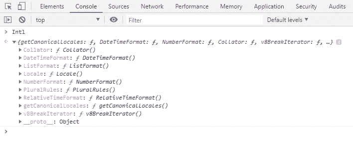
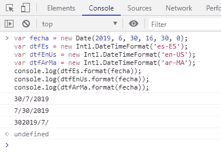
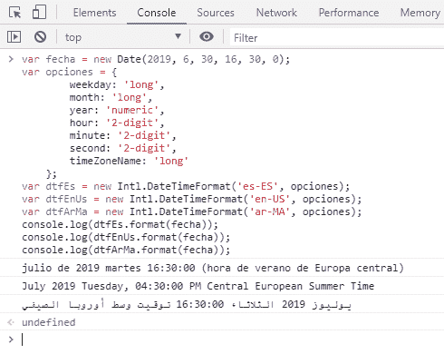
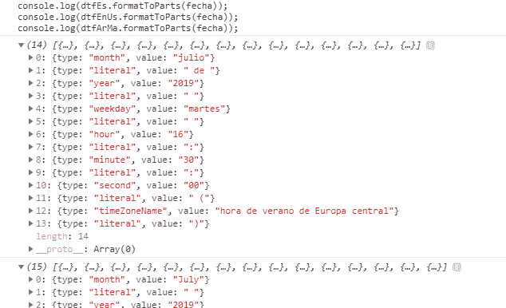
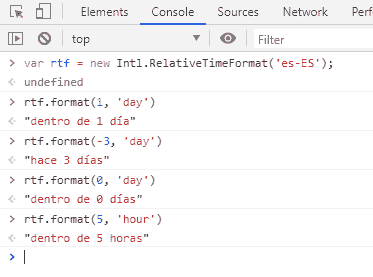
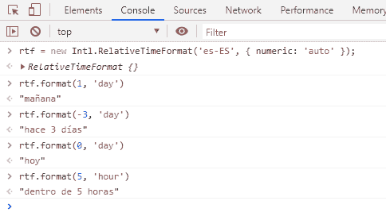
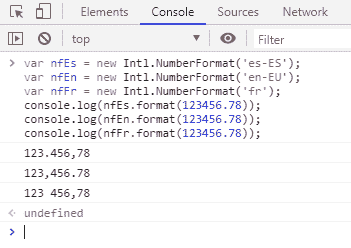
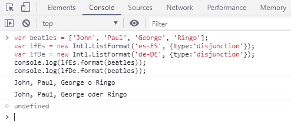
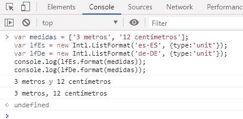

# Intl:原生 JavaScript 本地化 API

> 原文：<https://dev.to/jmalarcon/intl-la-api-de-localizacion-nativa-de-javascript-5288>

> 文章原载于[jassoft . org](https://www.jasoft.org/Blog/post/intl-la-api-de-localizacion-nativa-de-javascript.aspx)

如您所知，翻译和本地化是相关的概念 **[，但却截然不同](https://www.campusmvp.es/recursos/post/como-localizar-aplicaciones-con-c-y-net.aspx#traducci-n-y-localizaci-n-dos-conceptos-distintos)** 。

为了翻译你基于 Web 的应用程序，恐怕你别无选择，只能使用某种语言文件和一些专业图书馆。但是对于**本地化**，即应用程序适应每种语言的特殊性，**您需要的一切都包含在您的浏览器**中。

## intl 对象

很多人不知道，但 JavaScript 有一个特定的全局对象来帮助我们将应用程序本地化为其他语言和文化:**:**

 **[](https://res.cloudinary.com/practicaldev/image/fetch/s--Ovku7pho--/c_limit%2Cf_auto%2Cfl_progressive%2Cq_auto%2Cw_880/https://www.jasoft.org/Blog/image.axd%3Fpicture%3D/2019/intl/intl-001.png)

我们可以使用上图所示的不同关联对象来查找有关任何语言的大量本地化信息。

我们去看看他们-我...。

## Intl.Collator:比较文字字串

[对象`Collator`T2】用于根据当地特点进行字符串比较。](https://developer.mozilla.org/en-US/docs/Web/JavaScript/Reference/Global_Objects/Collator)

很少使用，因为通常不需要，因为`string`课有进行这种比较的具体方法: [**`localeCompare()`**](https://developer.mozilla.org/en-US/docs/Web/JavaScript/Reference/Global_Objects/String/localeCompare) 。

只有当我们需要在一个循环中进行大量的比较时(这是非常不寻常的)，我们才会使用它，因为它会给我们带来更高的性能。在其他情况下，你可以忽略它。

## 国际。DateTimeFormat: para dar 格式为 fechas y 小时

顾名思义，它有助于我们根据每个国家的具体情况来确定日期和时间的格式。

像所有的物件一样，`Intl`是透过传递格式为[【IETF bcp 47】](https://en.wikipedia.org/wiki/Codes_for_constructed_languages)的文字字串做为引数来实例化的，这听起来很复杂，但一般不过是语言的国际缩写名称(`es`、`en`、`it`-我...。)对于通用语言，或以上后面加上一个连字符和国家/文化的大写缩写(`es-ES`、`es-AR`、`en-US`、`en-UK`-我...。页:1。你看，很简单。

所以，举例来说，要得到一个格式好的日期用几种语言，我们只需要这样做:

```
var fecha = new Date(2019, 6, 30, 16, 30, 0);
var dtfEs = new Intl.DateTimeFormat('es-ES');
var dtfEnUs = new Intl.DateTimeFormat('en-US');
var dtfArMa = new Intl.DateTimeFormat('ar-MA');
console.log(dtfEs.format(fecha));
console.log(dtfEnUs.format(fecha));
console.log(dtfArMa.format(fecha)); 
```

它将通过控制台将该日期(2019 年 7 月 29 日，请注意，月份编号从 0 开始)返回到摩洛哥的西班牙文、英文和阿拉伯文(格式非常复杂):

[](https://res.cloudinary.com/practicaldev/image/fetch/s--wf3rUV_---/c_limit%2Cf_auto%2Cfl_progressive%2Cq_auto%2Cw_880/https://www.jasoft.org/Blog/image.axd%3Fpicture%3D/2019/intl/intl-002.png)

请确保它不会返回时间，我们也无法控制我们要获取的每个组件的确切格式。这将通过“T0”构造函数选项来控制，我在前面的片段中省略了这些选项。

`Intl`中的所有对象都有选项的第二个可选参数(值得冗馀)。以`DateTimeFormat`为例，它有很多我不会详述的可能属性，因为[你在 MDN](https://developer.mozilla.org/en-US/docs/Web/JavaScript/Reference/Global_Objects/DateTimeFormat#Parameters) 中有它们。但让我们来看一个如何使用它们的例子:

```
var fecha = new Date(2019, 6, 30, 16, 30, 0);
var opciones = {
        weekday: 'long',
        month: 'long',
        year: 'numeric',
        hour: '2-digit',
        minute: '2-digit',
        second: '2-digit',
        timeZoneName: 'long'
    };
var dtfEs = new Intl.DateTimeFormat('es-ES', opciones);
var dtfEnUs = new Intl.DateTimeFormat('en-US', opciones);
var dtfArMa = new Intl.DateTimeFormat('ar-MA', opciones);
console.log(dtfEs.format(fecha));
console.log(dtfEnUs.format(fecha));
console.log(dtfArMa.format(fecha)); 
```

结果如下:

[](https://res.cloudinary.com/practicaldev/image/fetch/s--Hl_It-XR--/c_limit%2Cf_auto%2Cfl_progressive%2Cq_auto%2Cw_880/https://www.jasoft.org/Blog/image.axd%3Fpicture%3D/2019/intl/intl-003.png)

请注意，此程式码与上述程式码完全相同，只是我们已将具有适当选项的物件当做建构函式的第二个引数传递给您。通过具体说明我们对日期的每一部分感兴趣的格式，包括时间(以便显示)，它已适当地用每一种语言的适当文字，甚至用摩洛哥阿拉伯语从右向左书写。

如果我们想用****的方法得到日期的每一部分，这样，如果需要的话，我们可以用任何定制格式(虽然我不建议你这样做，因为你有对象提供的便利，而不用自己的格式):****

 **[](https://res.cloudinary.com/practicaldev/image/fetch/s--ARtGqjfr--/c_limit%2Cf_auto%2Cfl_progressive%2Cq_auto%2Cw_880/https://www.jasoft.org/Blog/image.axd%3Fpicture%3D/2019/intl/intl-004.png)

根据我们选择的选项，我们可以用每种语言精确地获得最后一个环节的每一部分。

## 【intl . relative mey format:方便阅读相对时间间隔

大多数应用程序的另一个常见要求是表示相对于当前日期的时间间隔。例如，如果我们有一个任务列表，则在“到期日”列中，我们可以按原样设置日期，或者对用户友好得多，并写下“3 天到期”或“5 小时前到期”之类的内容-我...。

这比看起来一致的方式要复杂得多，而且如果我们还要用多种语言这样做，我也不想告诉你。幸运的是，`Intl`还为我们提供了相应的功能来轻松实现这一目标。

与以前一样，我们只需通过传递要用于本地化的语言标识符来实例化类:

```
var rtf = new Intl.RelativeTimeFormat('es-ES'); 
```

现在，我们可以通过调用`format()`方法并传递区间数和区间类型(一个英文字符串)来获得该语言的适当区间。例如:

```
rtf.format(1, 'day') //dentro de 1 día
rtf.format(-3, 'day') //hace 3 días
rtf.format(0, 'day') //dentro de 0 días
rtf.format(5, 'hour') //dentro de 5 horas 
```

[](https://res.cloudinary.com/practicaldev/image/fetch/s--hV-SjBDZ--/c_limit%2Cf_auto%2Cfl_progressive%2Cq_auto%2Cw_880/https://www.jasoft.org/Blog/image.axd%3Fpicture%3D/2019/intl/intl-005.png)

这太棒了，节省了很多 KB 的 JavaScript 库，我们再也不用下载了。

此外，在构造函数中，我们可以设置[一些选项](https://developer.mozilla.org/en-US/docs/Web/JavaScript/Reference/Global_Objects/RelativeTimeFormat#Parameters)，以指定我们希望它们生成这些间隔的方式。例如，我不喜欢他们的默认风格，总是使用数字，所以我可以通过将属性`numeric`设置为`'auto'` :
来改变它

```
var rtf = new Intl.RelativeTimeFormat('es-ES', { numeric: 'auto' }); 
```

比如说，如果这是一天前的事，就说"昨天"，如果是一天，就说"明天"，这样更自然些:

[](https://res.cloudinary.com/practicaldev/image/fetch/s--S_Qh5sC3--/c_limit%2Cf_auto%2Cfl_progressive%2Cq_auto%2Cw_880/https://www.jasoft.org/Blog/image.axd%3Fpicture%3D/2019/intl/intl-006.png)

就像我们看到的，非常有用。

和以前一样，也有`formatToParts()`方法来获取一个矩阵，分别包含格式的每一个片段。

## 【intl . number format:用于格式化数字和金钱

我们还在追踪他们的电话号码。如你所知，每种语言对于货币数量和数量的许多事情都有不同的格式。例如，在西班牙，千位分隔符是句点，小数是逗号，货币是数字的后面。但在美国正好相反:千位用逗号分隔，小数用句点分隔，货币先于数量。

我们是否为地球上的任何语言简单地管理这一点？以前很复杂。现在通过`Intl.NumberFormat`很简单。

与上述所有实例一样，通过传递带有语言的字符串(如果不输入任何内容，将使用操作系统语言):

```
var nfEs = new Intl.NumberFormat('es-ES');
var nfEn = new Intl.NumberFormat('en-EU');
var nfFr = new Intl.NumberFormat('fr');
console.log(nfEs.format(123456.78));
console.log(nfEn.format(123456.78));
console.log(nfFr.format(123456.78)); 
```

正如我们所看到的，它以适合每种情况的格式生成分隔符:

[](https://res.cloudinary.com/practicaldev/image/fetch/s--j8u8IaVS--/c_limit%2Cf_auto%2Cfl_progressive%2Cq_auto%2Cw_880/https://www.jasoft.org/Blog/image.axd%3Fpicture%3D/2019/intl/intl-007.png)

例如，看看法国人如何使用千位分隔符。

至于[到](https://developer.mozilla.org/en-US/docs/Web/JavaScript/Reference/Global_Objects/NumberFormat#Parameters)选项，我们甚至可以设置不用阿拉伯盐的编号制度，如果是一笔金额的话[货币类型](http://www.currency-iso.org/en/home/tables/table-a1.html)，以及货币的命名方式等诸多选项。最重要的是`style`让我们选择是要显示小数(`'decimal'`，预设值)、`'currency'`还是百分比(`'percent'`。

例如，要显示以欧元或美元表示的金额，我们会写:

```
var nfEs = new Intl.NumberFormat('es-ES', {style: 'currency', currency: 'EUR'});
var nfEn = new Intl.NumberFormat('en-EU', {style: 'currency', currency: 'USD'});
var nfFr = new Intl.NumberFormat('fr', {style: 'currency', currency: 'EUR', currencyDisplay: 'name'});
console.log(nfEs.format(123456.78));
console.log(nfEn.format(123456.78));
console.log(nfFr.format(123456.78)); 
```

了解如何使格式适合每种语言，以及如何根据以下选项使用符号或名称:

[](https://res.cloudinary.com/practicaldev/image/fetch/s---4XwCPJY--/c_limit%2Cf_auto%2Cfl_progressive%2Cq_auto%2Cw_880/https://www.jasoft.org/Blog/image.axd%3Fpicture%3D/2019/intl/intl-008.png)

## 国际。ListFormat:将格式解析为列表

应用程序中的另一个经典要求:从元素列表或数组中生成每种语言的可读列表。

例如，如果我们有这个矩阵，通常在一个应用程序中，我们会从一个远程服务中获得它:

```
var beatles = ['John', 'Paul', 'George', 'Ringo']; 
```

并且我们想把它们放在用户友好的名单上形成句子:`'Los Beatles eran John, Paul, George y Ringo'`。这种简单的东西需要很大的努力才能适应不同的语言。不是每个人都用逗号分隔，最后一个元素当然也不必是“和”。

以**为例，事情很简单:** 

 **```
var beatles = ['John', 'Paul', 'George', 'Ringo'];
var lfEs = new Intl.ListFormat('es-ES');
var lfDe = new Intl.ListFormat('de-DE');
console.log(lfEs.format(beatles));
console.log(lfDe.format(beatles)); 
```

如您所见，每个本地化项目的格式化清单都会传回给我们，在本例中，会以适当的语言包含「and」一词:

[](https://res.cloudinary.com/practicaldev/image/fetch/s--MmSAOD41--/c_limit%2Cf_auto%2Cfl_progressive%2Cq_auto%2Cw_880/https://www.jasoft.org/Blog/image.axd%3Fpicture%3D/2019/intl/intl-009.png)

当然，我们并不总是希望该清单具有包容性，但有时我们可能需要它是一份备选方案清单，例如"和"成为"或"。要在构造函数选项中更改此行为，我们具有属性`type`，该属性可以采用以下值:

*   `'conjunction'`，para listas de tipo“y”
*   `'disjunction'`para listas de tipo“o”
*   `'unit'`如果列表是以度量单位表示的，通常以列表的形式排列。

所以，有了以上的清单，我们可以把这个放进去:

```
var beatles = ['John', 'Paul', 'George', 'Ringo'];
var lfEs = new Intl.ListFormat('es-ES', {type:'disjunction'});
var lfDe = new Intl.ListFormat('de-DE', {type:'disjunction'});
console.log(lfEs.format(beatles));
console.log(lfDe.format(beatles)); 
```

要使用“或”类型，请执行以下操作:

[](https://res.cloudinary.com/practicaldev/image/fetch/s--td-vKd6g--/c_limit%2Cf_auto%2Cfl_progressive%2Cq_auto%2Cw_880/https://www.jasoft.org/Blog/image.axd%3Fpicture%3D/2019/intl/intl-010.png)

如果是单位，例如建筑应用程式中的梁长度，我们会放置:

```
var medidas = ['3 metros', '12 centímetros'];
var lfEs = new Intl.ListFormat('es-ES', {type:'unit'});
var lfDe = new Intl.ListFormat('de-DE', {type:'unit'});
console.log(lfEs.format(medidas));
console.log(lfDe.format(medidas)); 
```

[](https://res.cloudinary.com/practicaldev/image/fetch/s--UXUrLhJi--/c_limit%2Cf_auto%2Cfl_progressive%2Cq_auto%2Cw_880/https://www.jasoft.org/Blog/image.axd%3Fpicture%3D/2019/intl/intl-011.png)

> 注意一个重要的细节:虽然**本地化**运作良好，因为清单的格式适合每种语言，但**翻译**却不好，因为在德语中仍将措施放在西班牙语中。很明显，这不是`Intl`的责任，因为**是翻译，是应用**的责任。在建立字串清单之前，我们必须确定测量语言正确。

有[的一些参数加上](https://developer.mozilla.org/en-US/docs/Web/JavaScript/Reference/Global_Objects/ListFormat#Parameters)的构造选项，但重要的是我们所看到的。

## 【intl . plural rules:用于多元化

这已经是一个高级功能。与我们看到的其他种类不同，它不是要通过一个字符串，并返回复数形式，而是在较低的级别。他所做的是让我们更容易得到对应于他的方法`select()`的每一个数字的复数形式。

例如，在西班牙语、英语或其他西方语言中，梁的尺寸为 1 米(单数)、3 米(复数)或奇怪的是 0 米(复数，即使为零)。但是，在阿拉伯语中，它对某些数字有不同的理解。

如果我们用班级 [`PluralRules`](https://developer.mozilla.org/en-US/docs/Web/JavaScript/Reference/Global_Objects/PluralRules) :
进行测试

```
var prEs = new Intl.PluralRules('es-ES');
var prMa = new Intl.PluralRules('ar-MA');
console.log('ESPAÑOL:');
console.log(prEs.select(0));
console.log(prEs.select(1));
console.log(prEs.select(3));
console.log(prEs.select(0.5));
console.log('ÁRABE:');
console.log(prMa.select(0));
console.log(prMa.select(1));
console.log(prMa.select(3));
console.log(prMa.select(0.5)); 
```

我们将看到:

[](https://res.cloudinary.com/practicaldev/image/fetch/s--zslnAzkW--/c_limit%2Cf_auto%2Cfl_progressive%2Cq_auto%2Cw_880/https://www.jasoft.org/Blog/image.axd%3Fpicture%3D/2019/intl/intl-012.png)

你可以看到，对于西方语言来说，通常有两种可能性:T1(单数)或 t1(复数)，这样我们就可以决定是否在末尾加上“s”。

> **注**:以上是极大的简化，因为在西班牙语中比这复杂得多。复数有时带有“s”(猫、猫)，有时带有“is”(花、花)，有时不带任何东西(在西班牙语中，∞是“病毒”的复数？因为“病毒”在复数中是不变的，而在英语中则是“病毒”。在这方面，英语等其他语言要简单得多。

但在其他语言中，事情要复杂得多，你可以用阿拉伯语来证明。

因此，虽然此功能适用于某些非常具体的应用程序，但在生成多个“严重”应用程序时，它对我们没有多大帮助，因此您通常不会使用它。

## 支撑

当前的浏览器支持已经普及多年了，所以使用应该没有问题。与大多数情况一样，Internet Explorer 也是例外，但其版本 11 中的大多数类都支持 internet explorer。在[这个 MDN 表](https://developer.mozilla.org/en-US/docs/Web/JavaScript/Reference/Global_Objects/Intl#Browser_compatibility)中，你有很好的按类和浏览器分列的具体支持的详细总结。

你还有[一种聚合体](https://github.com/andyearnshaw/Intl.js/)，必要时可以在这些旧浏览器中使用，虽然并不那么强大。

## 总之

对于几乎所有常见的应用程序本地化任务，JavaScript 都为我们提供了集成的帮助，我们不需要使用会增加复杂性和重量的外部库，而且这些库肯定不如这些任务的操作系统好。由于 JavaScript 国际化 API 通过全局对象`Intl`在操作系统服务之下使用来实现，因此我们可以确保快速正确的结果。

我们应该习惯使用此 API，因为它将帮助我们更好地连接到用户并使应用程序更加友好。

顺便说一下，如果你喜欢这篇文章的话，你会喜欢上‘t0’[我在校园 MVP](https://www.campusmvp.es/catalogo/Product-Programaci%C3%B3n-avanzada-con-JavaScript-y-ECMAScript_206.aspx) 上的高级 JavaScript 课程所能学到的东西。开始认真学习 JavaScript，停止“耳鸣”。此外，您还将拥有实用视频、最佳实践、评估、交叉引用、学习里程碑...我...并且你会有**与我和 eduard tomàs 现象直接联系，回答你所有的疑问**并跟踪你的进展。

愿它对你有用！

> 文章原载于[jassoft . org](https://www.jasoft.org/Blog/post/intl-la-api-de-localizacion-nativa-de-javascript.aspx)******