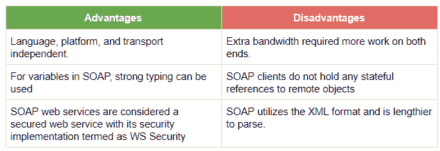
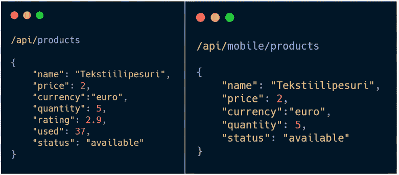
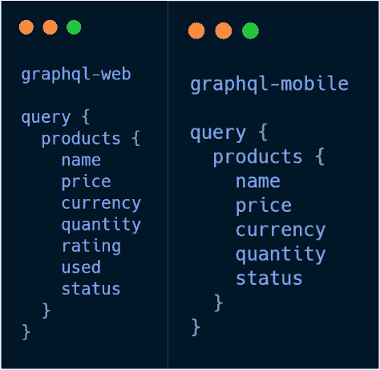
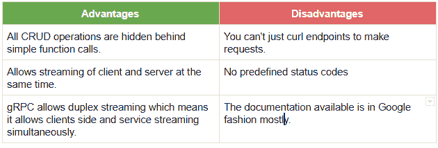

# 现代和传统 API 架构

> 原文：<https://dev.to/mkamranhamid/api-architecture-4p5h>

让我们来谈谈我们是如何设计我们的 API 的，以及我们已经走了多远。一直以来，只有 SOAP 和 ReST 架构引领着这个行业。现在，经过这么多年，我们有 gRPC、graphQL 和更多可供选择。

> 权力越大，责任越大

使用新架构有优点也有缺点。所以你需要自己找出哪一个适合你的项目需求。

SOAP:
SOAP 被称为简单对象访问协议。换句话说，SOAP 是一种协议，它定义了互联网服务如何相互通信或者如何与调用它们的应用程序交互。SOAP 是一种基于 XML 的协议，用于通过 HTTP 访问 web 服务。它被设计为在 HTTP 上使用 XML，并且有某种可以用于每个应用程序的规范。用 Java 和。net 使用 SOAP 架构。

**ReST:**
也称为 ReSTful web 服务。它提供了一些优秀的特性，包括无状态服务器和对资源的访问。

> 按照 REST(表述性“状态”传输)架构，服务器不在服务器端存储任何关于客户端会话的状态。这种限制被称为无国籍状态。

此外，它提供了不同类型的方法，您可以向服务器发送请求，如 get、post、delete、put。这些方法用于执行创建、检索、更新、删除等操作。此外，RESTful 允许多种数据格式，而 SOAP 只允许 XML。

GraphQL:
由脸书开发，于 2015 年公开发布。它是一种强类型的查询语言，用来定义请求和响应，让应用程序能够更好地控制它需要从 API 获得什么数据。它旨在满足对更高灵活性和效率的需求。许多大型企业，如 Spotify、脸书、GitHub、纽约时报、网飞、沃尔玛都在使用它。

**ReST vs GraphQL**
假设我有一个产品列表，其中包含每个索引上的一些产品信息，我们希望在移动和 web 上显示该列表，两者具有完全不同的 ui，我们不想从 API 获取额外的数据。使用 ReST，使用单一 API 是不可能的，我们需要为 web 或移动设备创建另一个 API

但是使用 graphQL 可以轻松处理这种类型的场景。

**GRPC** :
GRPC 是一个递归首字母缩略词，意思是 GRPC 远程过程调用。RPC 是一种协议，程序可以使用它向不同计算机上的程序请求服务，而无需了解网络的详细信息。GRPC 是一个基于谷歌的 RPC 平台，于 2015 年 2 月底宣布开源。该框架基于远程过程调用的客户机-服务器模型。
RPC 功能是发送方或客户端为远程服务器创建请求，远程服务器以过程、函数或过程调用的形式翻译并发送 RPC。如果远程服务器收到请求，应用程序会将其回复返回给客户并继续处理。

**结论**
最后，我们希望得出这样的结论:没有通用的解决方案来选择构建 API 的协议。每个应用程序都是独一无二的，您应该做出最适合您项目的决定。此外，为了达到最佳效果，您可以结合架构。