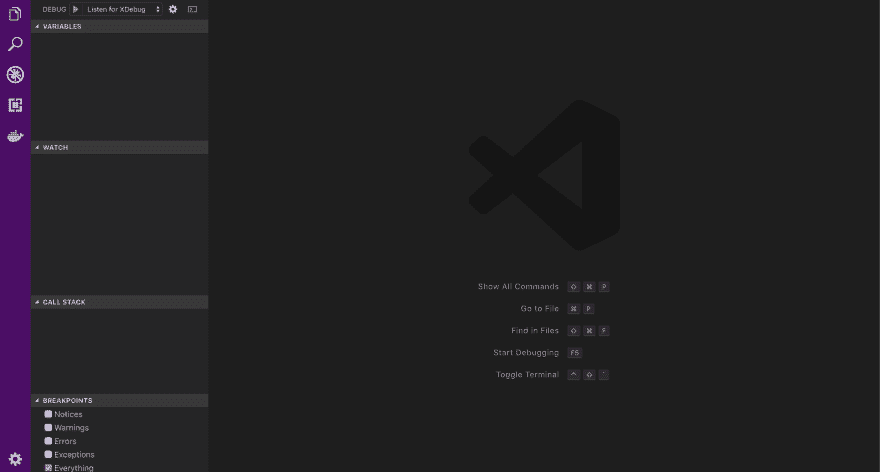
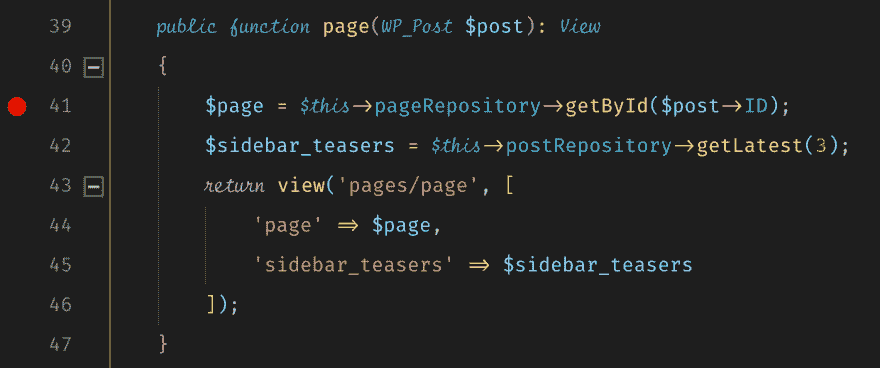
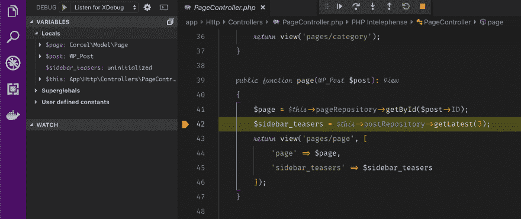

# 在 Docker 环境中为 VSCode 设置 Xdebug🙌

> 原文：<https://dev.to/fuxide/setting-up-xdebug-for-vscode-in-an-docker-environment-27a9>

*由 Adi Goldstein 在 Unsplash 上拍摄的封面照片*

在我不得不第三次在谷歌上搜索这个问题之后，我决定在 Docker 环境中写下我的 Xdebug 设置，同时使用 VSCode，这样可能有人会比我更容易得到这个工作:p。

但首先要做的是。我为什么要在本地开发工作流中使用 Xdebug 这样的东西呢？！答案很简单: [Xdebug](https://xdebug.org/) 是一个 php 扩展，旨在帮助开发 php 应用程序，因为它实现了*(除了其他东西*😅 *)* 一个单步调试程序，可以在你的 IDE 环境中使用。这意味着您不必再依赖使用 *var_dump()的*之类的东西来调试您的代码，因为您可以在 IDE 中定义断点，调试器将在断点上停止代码执行并显示您代码的当前状态。这使您能够在执行代码时检查例如变量的当前值，并且您可以“单步调试”您的代码来调试它。

直到几个月前，我还在使用 Jetbrains 的 PHPStorm，对于这个 IDE，Xdebug 的设置有很好的文档记录。但是由于我个人改用了 VSCode，并且非常依赖 Xdebug，所以我想让它在 Docker 上也能工作。

那么，我对本地开发的基本设置是什么？！大约一年半以来，我完全放弃了使用流浪虚拟机，转而使用 Docker 构建我的本地环境。大多数时候有两个容器在使用。1 台 web 服务器和 1 台 MySql 服务器。后者对于设置 Xdebug 这样的工具完全可以忽略。与大多数默认 php 容器相比，您需要更改的重要内容要么是 *php.ini* 文件，要么您可以完全添加一个新的 *xdebug.ini* 文件来保存您的配置。您可以在 web 服务器容器的 */etc/php* 目录中实现这些方法。
不管你选择上面的哪一个，在你添加或编辑的文件的最后应该包含下面几行*(当然，如果你愿意，你可以根据自己的需要替换它们，但是这些应该可以快速启动)* :

```
 zend_extension=xdebug.so
      xdebug.remote_enable=1
      xdebug.remote_autostart=1
      xdebug.remote_connect_back=0
      xdebug.remote_host=docker.for.mac.localhost
      xdebug.remote_handler=dbgp
      xdebug.max_nesting_level=1500 
```

<svg width="20px" height="20px" viewBox="0 0 24 24" class="highlight-action crayons-icon highlight-action--fullscreen-on"><title>Enter fullscreen mode</title></svg> <svg width="20px" height="20px" viewBox="0 0 24 24" class="highlight-action crayons-icon highlight-action--fullscreen-off"><title>Exit fullscreen mode</title></svg>

接下来，您需要在 VSCode 中设置调试。你可以通过点击左侧工具条上的小 bug 图标来实现。当你这样做的时候，你会看到 VSCode 的调试部分。

[](https://res.cloudinary.com/practicaldev/image/fetch/s--Ttg-fo7F--/c_limit%2Cf_auto%2Cfl_progressive%2Cq_auto%2Cw_880/https://thepracticaldev.s3.amazonaws.com/i/32gz9crtqkweffus4q9d.png)

现在你只需要点击左上方的小齿轮来打开你的 ide 的 *launch.json* 文件，在其中你可以添加你自己的配置来监听特定端口上的 Xdebug。我的将看起来像下面这样:

```
 {  "name":  "Listen for XDebug",  "type":  "php",  "request":  "launch",  "port":  9000,  "pathMappings":  {  "/application":  "${workspaceFolder}"  },  "ignore":  [  "**/vendor/**/*.php"  ]  } 
```

<svg width="20px" height="20px" viewBox="0 0 24 24" class="highlight-action crayons-icon highlight-action--fullscreen-on"><title>Enter fullscreen mode</title></svg> <svg width="20px" height="20px" viewBox="0 0 24 24" class="highlight-action crayons-icon highlight-action--fullscreen-off"><title>Exit fullscreen mode</title></svg>

如果您希望调试器忽略某些目录，您可以如上所示指定这些目录。如你所见，我完全想忽略我的 */vendor* 目录，因为我不想让调试器运行整个 php 依赖树。
你还需要为你的设置找出正确的*路径映射*，因为不是所有你在 docker 注册表中找到的 php 容器都指定 */application* 为根路径。只需检查您的 webroot 的路径，并将其映射到 *${workspaceFolder}* ，假设您是从应用程序根目录启动 VSCode 的。

接下来，您可以通过在您想要仔细查看的部分定义断点来开始调试您的应用程序，并通过单击 VSCode 左上角的小 play 按钮来启动您之前定义的*‘Listen for XDebug’*脚本。
你可以在一个打开的*中点击行号旁边的右键来定义断点。php* 文件显示为一个红点。

[](https://res.cloudinary.com/practicaldev/image/fetch/s--47Gw98Nv--/c_limit%2Cf_auto%2Cfl_progressive%2Cq_auto%2Cw_880/https://thepracticaldev.s3.amazonaws.com/i/x6d1ip99rirjb39zpbm6.png)

现在，您只需在 webbrowser 中打开您的本地应用程序，当执行过程中遇到定义的断点时，VSCode 将跳转到代码的标记部分，显示当前状态，或者更具体地说，显示变量的当前值，供您检查。

[](https://res.cloudinary.com/practicaldev/image/fetch/s--LTzUjPgq--/c_limit%2Cf_auto%2Cfl_progressive%2Cq_auto%2Cw_880/https://thepracticaldev.s3.amazonaws.com/i/ig7nxe4p5bymvscq21i2.png)

如果您定义了多个断点，现在可以单步执行代码到下一个断点，并在浏览器运行代码时继续检查和调试应用程序。