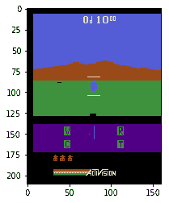
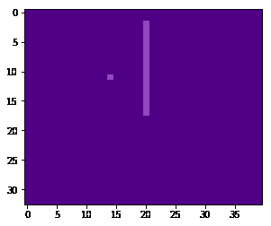
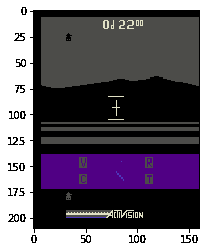
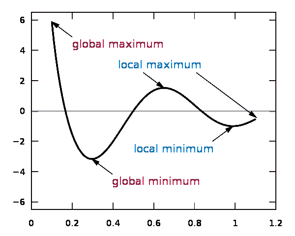
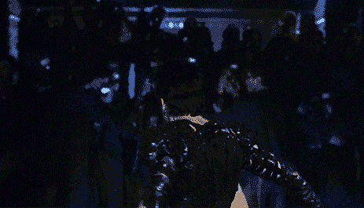

# 用 Python 开坦克

> 原文：<https://dev.to/charlesdlandau/drive-a-tank-with-python-3caf>

之前，我回顾了强化学习(RL)中的核心概念，并介绍了 OpenAI Gym API 的重要部分。您可以在这里查看介绍:

[](/charlesdlandau) [## 用埃隆·马斯克和微软资助的软件训练机器人向外星人发射激光

### 查尔斯·兰道 7 月 25 日 196 分钟阅读

#tutorial #machinelearning #python #beginners](/charlesdlandau/train-robots-to-shoot-lazers-at-aliens-with-software-funded-by-elon-musk-and-microsoft-1m34)

在这一期中，我们将训练一名坦克指挥官。我在这里分享了这个项目的一些代码:

## [CharlesDLandau](https://github.com/CharlesDLandau)/[rl 笔记本](https://github.com/CharlesDLandau/rlNotebooks)

### 强化学习笔记本

<article class="markdown-body entry-content container-lg" itemprop="text">

# rl 笔记本

张贴在互联网上的强化学习笔记本。

由于这些笔记本是教学和实验性的，我不建议在本地运行它们。在运行之前，我会在谷歌实验室或 T2 的 Kaggle 上测试和运行这些笔记本——你也可以在那里做！

</article>

[View on GitHub](https://github.com/CharlesDLandau/rlNotebooks)

#### 侧注:OpenAI 健身房安装

...是有些痛苦的。许多在线笔记本服务，如 [colab](https://colab.research.google.com) 和 [Kaggle](https://kaggle.org) 不允许你安装一些 OpenAI 环境，所以我现在还是坚持使用雅达利。如果你有兴趣尝试建立更灵活的 OpenAI 健身房，你可能会从[这篇有趣的文章](https://medium.com/coinmonks/preparing-a-headless-environment-for-openais-gym-with-docker-and-tensorflow-1bd0e0d31663)开始。

为了编写在决策时真正考虑游戏屏幕的代理，我们需要更新上次的`run_job`工具:

```
 action = model.decision_function(obs=observation, env=env) 
```

Enter fullscreen mode Exit fullscreen mode

我们的随机代理将需要相应地修改:

```
class RandomAgentContainer:
    """A model that takes random actions and doesn't learn"""

    def __init__(self):
        pass

    def decision_function(self, obs=None, env=None):
        if env:
            return env.action_space.sample()
        else:
            return 0

    def train_on_history(self, history):
        pass

model = RandomAgentContainer() 
```

Enter fullscreen mode Exit fullscreen mode

现在，我们可以使用我们的 RandomAgent 来探索我们的工作所产生的所有信息。

```
result = run_job("Robotank-v0", model,
        10000, episodes_per_train=0);

result.keys()

# Output dict_keys(['history', 'env', 'parameters']) 
```

Enter fullscreen mode Exit fullscreen mode

我们的工作是制作正在进行的游戏的视频，以及图像、动作、预测和奖励的历史。它还从 OpenAI Gym 中保存了环境对象。

让我们从理解我们在视频中的观察开始:

```
render_video(0, result['env']); 
```

Enter fullscreen mode Exit fullscreen mode

[](https://res.cloudinary.com/practicaldev/image/fetch/s--ZmCYkUjQ--/c_limit%2Cf_auto%2Cfl_progressive%2Cq_66%2Cw_880/https://serve-md.charlesdlandau.net/img/tank-lesson-randomagent.gif)

如果你像我一样，从未在雅达利上玩过机器人坦克...可以[看手册](http://www.atarimania.com/game-atari-2600-vcs-robot-tank_s6928.html)！您可以了解平视显示器及更多信息。

总之，看起来图像里有一堆噪声。让我们看看能否从中提取一些信息...

```
import matplotlib
from matplotlib.image import imread
from matplotlib.pyplot import imshow 
```

Enter fullscreen mode Exit fullscreen mode

```
observation_sample = [im['observation'] for im in result.get('history')]

imshow(observation_sample[0]) 
```

Enter fullscreen mode Exit fullscreen mode

[](https://res.cloudinary.com/practicaldev/image/fetch/s--y6XLMdvq--/c_limit%2Cf_auto%2Cfl_progressive%2Cq_auto%2Cw_880/https://serve-md.charlesdlandau.net/img/robotank-viewport.png)

因此，使用轴上的刻度，通过一点点尝试和错误，我们可以找到雷达面板和潜望镜的边界框。

```
imshow(observation_sample[0][139:172, 60:100, :]) 
```

Enter fullscreen mode Exit fullscreen mode

```
<matplotlib.image.AxesImage at 0x7f48ad329b38> 
```

Enter fullscreen mode Exit fullscreen mode

[](https://res.cloudinary.com/practicaldev/image/fetch/s--QIigVwCX--/c_limit%2Cf_auto%2Cfl_progressive%2Cq_auto%2Cw_880/https://serve-md.charlesdlandau.net/img/output_9_1.png)

因此，我们当然可以裁剪这个图像，减少对噪声的担心...

```
radar_bounding_box = ((139, 172), (60, 100), (None)) 
```

Enter fullscreen mode Exit fullscreen mode

通过阅读手册，我们知道包围这个雷达显示器的四个指示器之一是代表“雷达”的“R”换句话说，我们不能依赖雷达作为唯一的输入，因为所有这些指标都代表着可以被禁用的子系统。

让我们也为潜望镜取一个包围盒:

```
imshow(observation_sample[0][80:124, 12:160, :]) 
```

Enter fullscreen mode Exit fullscreen mode

```
<matplotlib.image.AxesImage at 0x7f48ad693b38> 
```

Enter fullscreen mode Exit fullscreen mode

[](https://res.cloudinary.com/practicaldev/image/fetch/s--NNn3pkRM--/c_limit%2Cf_auto%2Cfl_progressive%2Cq_auto%2Cw_880/https://serve-md.charlesdlandau.net/img/output_13_1.png)T3】

```
peri_bounding_box=((80, 124), (12, 160), (None)) 
```

Enter fullscreen mode Exit fullscreen mode

让我们也检查一下`info`字段，因为它有时会有观察数据。

```
result.get('history')[0].get('info')

# Output {'ale.lives': 4} 
```

Enter fullscreen mode Exit fullscreen mode

我将有意忽略 V、C、R、T 框，如果我们认为性能即将提高，我们可以随时重新引入它们。你在手册中已经看到了它们是如何工作的，所以我认为这没什么可担心的...

我们也试着理解一下动作空间。

```
env = result['env']

print(env.action_space)

# Output: Discrete(18) 
```

Enter fullscreen mode Exit fullscreen mode

嗯（表示踌躇等）...一点帮助都没有。但这是你自然会想到要做的...原来提取动作含义在`gym` API 中有自己的名称空间。

```
# https://ai.stackexchange.com/a/3557 env.unwrapped.get_action_meanings() 
```

Enter fullscreen mode Exit fullscreen mode

```
# Output
['NOOP',
 'FIRE',
 'UP',
 'RIGHT',
 'LEFT',
 'DOWN',
 'UPRIGHT',
 'UPLEFT',
 'DOWNRIGHT',
 'DOWNLEFT',
 'UPFIRE',
 'RIGHTFIRE',
 'LEFTFIRE',
 'DOWNFIRE',
 'UPRIGHTFIRE',
 'UPLEFTFIRE',
 'DOWNRIGHTFIRE',
 'DOWNLEFTFIRE'] 
```

Enter fullscreen mode Exit fullscreen mode

所以“NOOP”大概意味着“不操作”，即“什么都不做”其余的显然构成了客户可用的所有动作的排列。这就是我们所期望的行动空间。这些也是**离散的**动作，因此我们可以对模型进行编码，使其每步只采取一个动作。

最后，让我们来想象一下回报

```
set([r['reward'] for r in result['history']]) # Unique rewards across history 
```

Enter fullscreen mode Exit fullscreen mode

```
# Output
{0.0, 1.0} 
```

Enter fullscreen mode Exit fullscreen mode

```
import matplotlib.pyplot as plt
plt.plot([r['reward'] for r in result['history']]) 
```

Enter fullscreen mode Exit fullscreen mode

[](https://res.cloudinary.com/practicaldev/image/fetch/s--e6aYZSHO--/c_limit%2Cf_auto%2Cfl_progressive%2Cq_auto%2Cw_880/https://serve-md.charlesdlandau.net/img/output_25_1.png)

看来奖励函数简单来说就是“命中得分=1 否则 0”。我们可以通过在奖励时间观察来确认。

```
# Observations when reward was given reward_incidents = list(filter(lambda i: i['reward'], result['history']))

i = 0
imshow(reward_incidents[i]['observation']) 
```

Enter fullscreen mode Exit fullscreen mode

[](https://res.cloudinary.com/practicaldev/image/fetch/s--3PK-Bhmn--/c_limit%2Cf_auto%2Cfl_progressive%2Cq_auto%2Cw_880/https://serve-md.charlesdlandau.net/img/output_27_1.png)T3】

```
i = 1
imshow(reward_incidents[i]['observation']) 
```

Enter fullscreen mode Exit fullscreen mode

[](https://res.cloudinary.com/practicaldev/image/fetch/s--mfAuO3hH--/c_limit%2Cf_auto%2Cfl_progressive%2Cq_auto%2Cw_880/https://serve-md.charlesdlandau.net/img/output_28_1.png)T3】

```
i = 2
imshow(reward_incidents[i]['observation']) 
```

Enter fullscreen mode Exit fullscreen mode

[](https://res.cloudinary.com/practicaldev/image/fetch/s--jhZu8Val--/c_limit%2Cf_auto%2Cfl_progressive%2Cq_auto%2Cw_880/https://serve-md.charlesdlandau.net/img/output_29_1.png)

这些图像似乎都是在坦克击中目标后拍摄的。

#### 写作坦克指挥官

##### 大脑

坦克指挥官代理需要学习如何决定采取何种行动。所以，我们首先需要给它一个学习的机制。在这种情况下，我们将使用一种特殊的图表。在此图中，有三种节点:

1.  输入节点

    它接收我们的输入，并向与之相连的节点发送信号

2.  常规节点

    这些节点可以有许多来自其他节点(包括输入节点)的连接。)有的人脉强，有的人脉弱。该节点使用来自所有连接的信号和信号强度来决定沿着它自己的所有输出连接发送什么信号。

3.  输出节点

    这些节点与常规节点的不同之处仅在于我们读取它们的
    信号。

这些节点被组织成“层”,这些层可以共享许多连接，并且在决定如何聚集和发送信号方面具有共同的功能。

现在，我已经简化了很多，但我们正在讨论的图表，如果组织得当，是一个深度学习神经网络。要创建一个，我们可以像这样使用`tensorflow`:

```
import tensorflow as tf
from tensorflow.keras import datasets, layers, models, preprocessing, callbacks
import numpy as np
import random

inputs = layers.Input(shape=(44, 148, 3))
x = layers.Conv2D(16, (3, 3), activation='relu')(inputs)
x = layers.BatchNormalization(axis=-1)(x) # Channels @ -1 x = layers.MaxPooling2D((2, 2))(x)
x = layers.Flatten()(x)
x = layers.Dense(64)(x)
x = layers.Activation('relu')(x)
x = layers.Dense(64)(x)
x = layers.Activation('sigmoid')(x)
x = layers.BatchNormalization(axis=-1)(x)
x = layers.Dropout(0.02)(x)
x = layers.Dense(18, activation='linear')(x)
model = models.Model(inputs, x)
model.compile(optimizer='sgd',
      loss='mae',
      metrics=['accuracy']) 
```

Enter fullscreen mode Exit fullscreen mode

我们来分解一下:

```
 inputs = layers.Input(shape=(44, 148, 3)) 
```

Enter fullscreen mode Exit fullscreen mode

你会记得这是我们的一个潜望镜图像的尺寸。这些映射到我们的输入节点。

```
x = layers.Conv2D(16, (3, 3), activation='relu')(inputs)
x = layers.BatchNormalization(axis=-1)(x) # Channels @ -1 x = layers.MaxPooling2D((2, 2))(x)
x = layers.Flatten()(x)
x = layers.Dense(64)(x)
x = layers.Activation('relu')(x)
x = layers.Dense(64)(x)
x = layers.Activation('sigmoid')(x)
x = layers.BatchNormalization(axis=-1)(x)
x = layers.Dropout(0.02)(x)
x = layers.Dense(18, activation='linear')(x)
model = models.Model(inputs, x) 
```

Enter fullscreen mode Exit fullscreen mode

这在我们的图中建立了规则节点层和它们的相互作用。我过于简单化了。

```
model.compile(optimizer='sgd',
      loss='mae',
      metrics=['accuracy']) 
```

Enter fullscreen mode Exit fullscreen mode

最后我们`compile`这个模型，给它一些特殊的参数。为了教会我们的图形驾驶坦克，我们需要调用`fit`方法，例如`model.fit(data, correct_prediction)`。每当这种情况发生时，我们的模型就会返回并更新常规连接的强度(也称为“权重”)。这个有趣的名字叫做“反向传播”总之，`model.compile`的参数有助于确定如何执行反向传播。

##### 经历

现在我们有了大脑，大脑需要经验来训练。从我们的手册和对数据的小小探索中我们知道，每一集都映射到一个完整的机器人坦克游戏中。然而，在每场游戏中，玩家会得到几辆坦克，如果一辆坦克被摧毁，玩家只需“重生”一辆新坦克。所以这一集实际上并不是体验的最小单位，而是游戏中单个坦克的“生活”。

我们可以从
中提取

```
 episodes = [list(filter(lambda h: h["episode"]==e , history)
                      ) for e in range(n_episodes)
]

game_lives = [
            list(
              filter(lambda h: h.get('info').get('ale.lives')==l, episode)
        ) for l in range(5)
] 
```

Enter fullscreen mode Exit fullscreen mode

对于这些生命中的每一个，我们可以获得一个累积奖励(在生命结束前有多少命中得分。)

```
 rewards = [obs.get('reward') for obs in game_life]
        cum_rewards = sum(rewards) 
```

Enter fullscreen mode Exit fullscreen mode

利用这个数字，我们可以确定我们想要大脑对这种经历做出多强烈的反应

```
 # Positive experience
        if cum_rewards:
            nudge = cum_rewards * 0.03
        # Negative experience
        else:
           nudge = 0 - 0.03 
```

Enter fullscreen mode Exit fullscreen mode

现在，对于给定的步骤，我们可以:

1.  以我们原来的`action`、`prediction`和潜望镜`image`为数据
2.  我们的`prediction`只限于`action`指数，因为我们只能从我们采取的行动中学习。
3.  呼叫`model.fit(image, prediction_with_nudge)`

为了形象化这个问题，想象你蒙着眼睛骑自行车下山。当你奇迹般地骑马下山而没有撞死自己时，你可能会到达一个似乎已经到达谷底的点。无论你想去哪个方向，你都必须踩着踏板上坡。你摘下眼罩，才意识到你刚刚走了一英里，在到达山脚之前，你还有很长的路要走。对此的一个奇特术语是“局部最小值”

[](https://res.cloudinary.com/practicaldev/image/fetch/s--P7xLXZTI--/c_limit%2Cf_auto%2Cfl_progressive%2Cq_auto%2Cw_880/https://upload.wikimedia.org/wikipedia/commons/thumb/1/1e/Extrema_example.svg/600px-Extrema_example.svg.png)

为了解决这个问题，我们有时可以强迫指挥官随机采取行动:

```
for obs in game_life:

    action, prediction = obs.get('action')
    if self.epsilon and (random.uniform(0, 1.0) < self.epsilon):
      action = random.randrange(18)

    # Copy
    update = list(prediction)

    # Update only the target action
    update[0][action] = update[0][action] + displacement 
```

Enter fullscreen mode Exit fullscreen mode

只有 12 万步，我们的坦克似乎已经决定了一个策略，如这张长长的 gif 图所示。

如你所见，在 Robotank 中左转威力巨大——整整一个中队阵亡！

[](https://i.giphy.com/media/qJsJI0MhazjGw/giphy.gif)

...但之后它就死了。我认为这对于一个只在潜望镜视窗上训练的矮胖模型来说是相当强大的。如果时间允许，我可能会继续修改这个——增加 epsilon 值，修改图形参数，添加视图，所有这些都有助于推动坦克指挥官采取更细致的策略。

无论如何，你已经学习了一点用 Python 实现 DL 和 RL 的知识。你学到了:

1.  DL 基本概念
2.  RL 的探索性数据分析
3.  有选择地将奖励应用于特定的行为，以及最小的可分割的经验单位
4.  引入随机行动，帮助探索“行动空间”

感谢阅读！如有任何问题，请联系我们。