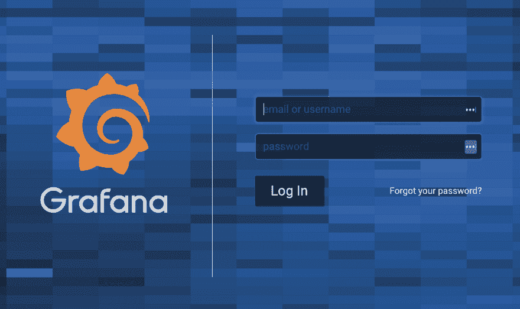
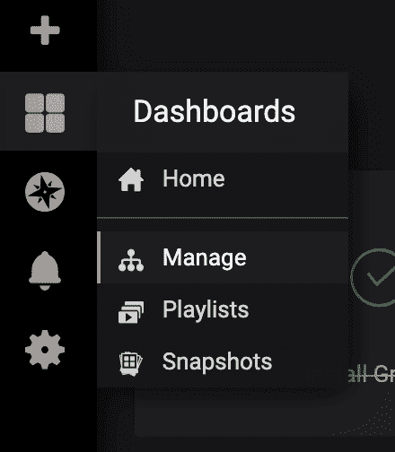
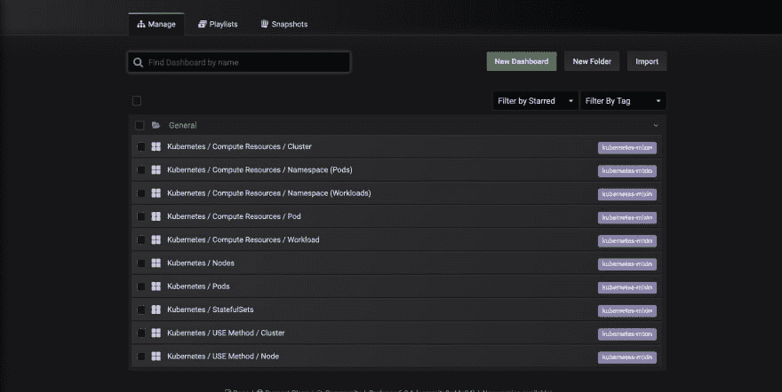
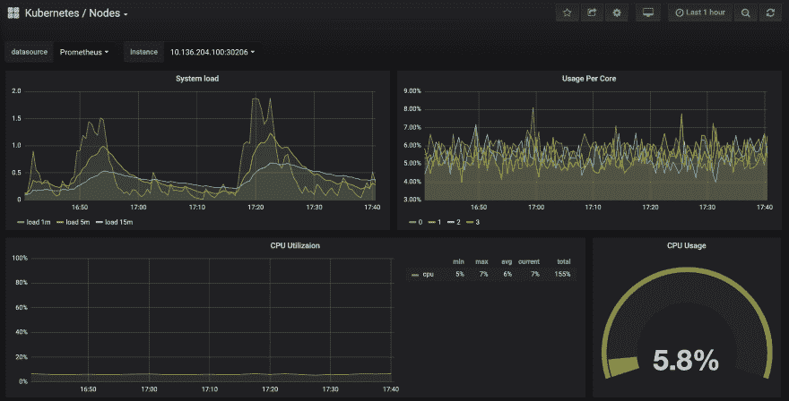

# 如何在 DigitalOcean Kubernetes 上设置 Prometheus、Grafana 和 Alertmanager 监控堆栈

> 原文：<https://dev.to/digitalocean/how-to-set-up-a-prometheus-grafana-and-alertmanager-monitoring-stack-on-digitalocean-kubernetes-268j>

### 简介

除了跟踪和日志记录之外，监控和警报也是 Kubernetes 可观察性堆栈的重要组成部分。为您的 DigitalOcean Kubernetes 集群设置监控可让您跟踪资源使用情况，并分析和调试应用程序错误。

监控系统通常由一个存储度量数据的时序数据库和一个可视化层组成。此外，警报层创建和管理警报，并在必要时将它们交给集成和外部服务。最后，一个或多个组件生成或公开度量数据，这些数据将被堆栈存储、可视化和处理以发出警报。

一个流行的监控解决方案是开源的 [Prometheus](https://prometheus.io/) 、 [Grafana](https://grafana.com/) 和 [Alertmanager](https://github.com/prometheus/alertmanager) 栈，与 [kube-state-metrics](https://github.com/kubernetes/kube-state-metrics) 和 [node_exporter](https://github.com/prometheus/node_exporter) 一起部署，以公开集群级 Kubernetes 对象指标以及机器级指标，如 CPU 和内存使用情况。

在 Kubernetes 集群上部署这个监控堆栈需要配置单独的组件、清单、Prometheus metrics 和 Grafana 仪表板，这可能需要一些时间。由 DigitalOcean 社区开发人员教育团队发布的 [DigitalOcean Kubernetes 集群监控快速入门](https://github.com/do-community/doks-monitoring)，包含 Prometheus-Grafana-alert manager 集群监控堆栈的完整定义清单，以及一组预配置的警报和 Grafana 仪表板。它可以帮助您快速启动和运行，并为构建您的可观测性堆栈奠定坚实的基础。

在本教程中，我们将在 DigitalOcean Kubernetes 上部署这个预配置的堆栈，访问 Prometheus、Grafana 和 Alertmanager 界面，并描述如何对其进行定制。

## 先决条件

在开始之前，您需要一个可用的 [DigitalOcean Kubernetes 集群](https://www.digitalocean.com/docs/kubernetes/quickstart/)，以及安装在本地开发环境中的以下工具:

*   安装在本地机器上并配置为连接到集群的`kubectl`命令行界面。你可以在官方文档中阅读更多关于安装和配置`kubectl` [的信息。](https://kubernetes.io/docs/tasks/tools/install-kubectl/)
*   安装在本地机器上的 [git](https://git-scm.com/book/en/v2/Getting-Started-Installing-Git) 版本控制系统。要了解如何在 Ubuntu 18.04 上安装 git，请参考[如何在 Ubuntu 18.04 上安装 Git](https://www.digitalocean.com/community/tutorials/how-to-install-git-on-ubuntu-18-04)。
*   安装在本地机器上的 Coreutils [base64](https://www.gnu.org/software/coreutils/manual/html_node/base64-invocation.html) 工具。如果您使用的是 Linux 机器，这很可能已经安装了。如果你使用的是 OS X，你可以使用默认安装的`openssl base64`。

**注意:**集群监控快速启动仅在 DigitalOcean Kubernetes 集群上进行了测试。要将 Quickstart 用于其他 Kubernetes 集群，可能需要对清单文件进行一些修改。

## 步骤 1 —克隆 GitHub 库并配置环境变量

首先，使用 git:
将 DigitalOcean Kubernetes 集群监控 [GitHub 存储库](https://github.com/do-community/doks-monitoring)克隆到您的本地机器上

```
git clone git@github.com:do-community/doks-monitoring.git 
```

然后，导航至回购:

```
cd doks-monitoring 
```

您应该会看到下面的目录结构:

```
ls 
```

```
Output
LICENSE
README.md
changes.txt
manifest 
```

`manifest`目录包含所有监控栈组件的 Kubernetes 清单，包括[服务帐户](https://kubernetes.io/docs/tasks/configure-pod-container/configure-service-account/)、[部署](https://kubernetes.io/docs/concepts/workloads/controllers/deployment/)、[状态集](https://kubernetes.io/docs/concepts/workloads/controllers/statefulset/)、[配置映射](https://kubernetes.io/docs/tasks/configure-pod-container/configure-pod-configmap/)等。要了解关于这些清单文件以及如何配置它们的更多信息，请跳到[配置监控堆栈](https://www.digitalocean.com/community/tutorials/how-to-set-up-a-prometheus-grafana-and-alertmanager-monitoring-stack-on-digitalocean-kubernetes#step-6-%E2%80%94-configuring-the-monitoring-stack-optional)。

如果您只是想让事情正常运行，首先设置`APP_INSTANCE_NAME`和`NAMESPACE`环境变量，这将用于为栈的组件配置一个唯一的名称，并配置栈将被部署到的[名称空间](https://kubernetes.io/docs/concepts/overview/working-with-objects/namespaces/):

```
export APP_INSTANCE_NAME=sammy-cluster-monitoring
export NAMESPACE=default 
```

在本教程中，我们将`APP_INSTANCE_NAME`设置为`sammy-cluster-monitoring`，这将预先考虑所有的监控堆栈 Kubernetes 对象名称。您应该为您的监视堆栈替换一个唯一的描述性前缀。我们还将名称空间设置为`default`。如果您想将监控堆栈部署到名称空间**而不是**而不是`default`，请确保您首先在集群中创建它:

```
kubectl create namespace "$NAMESPACE" 
```

您应该会看到以下输出:

```
Output
namespace/sammy created 
```

在这种情况下，`NAMESPACE`环境变量被设置为`sammy`。在本教程的其余部分，我们将假设`NAMESPACE`已经被设置为`default`。

现在，使用`base64`命令对一个安全的 Grafana 密码进行 base64 编码。确保用您选择的密码替换`<span class="highlight">your_grafana_password</span>` :

```
export GRAFANA_GENERATED_PASSWORD="$(echo -n 'your_grafana_password' | base64)" 
```

如果您使用的是 macOS，您可以替换默认安装的`openssl base64`命令。

至此，您已经获得了栈的 Kubernetes 清单并配置了所需的环境变量，因此现在可以将配置的变量替换到 Kubernetes 清单文件中，并在 Kubernetes 集群中创建栈。

## 步骤 2 —创建监控堆栈

digital ocean Kubernetes Monitoring quick start repo 包含以下监控、抓取和可视化组件的清单:

*   **Prometheus** 是一个时间序列数据库和监控工具，它通过轮询指标端点并抓取和处理这些端点公开的数据来工作。它允许您使用一种时间序列数据查询语言 [PromQL](https://prometheus.io/docs/prometheus/latest/querying/basics/) 来查询这些数据。Prometheus 将作为具有 2 个副本的[状态集](https://kubernetes.io/docs/concepts/workloads/controllers/statefulset/)部署到集群中，该副本使用具有数字海洋[块存储](https://www.digitalocean.com/products/block-storage/)的[永久卷](https://kubernetes.io/docs/concepts/storage/persistent-volumes/)。此外，一组预配置的 Prometheus 警报、规则和作业将存储为一个[配置图](https://kubernetes.io/docs/tasks/configure-pod-container/configure-pod-configmap/)。要了解更多信息，请跳到配置监控堆栈的 [Prometheus](https://www.digitalocean.com/community/tutorials/how-to-set-up-a-prometheus-grafana-and-alertmanager-monitoring-stack-on-digitalocean-kubernetes#prometheus) 部分。
*   通常与 Prometheus 一起部署的 Alertmanager 构成了堆栈的警报层，处理 Prometheus 生成的警报，并对其进行重复数据删除、分组，然后将其路由到电子邮件或[页面任务](https://www.pagerduty.com/)等集成。Alertmanager 将安装为具有 2 个副本的状态集。要了解更多关于 Alertmanager 的信息，请参考普罗米修斯文档中的 [Alerting](https://prometheus.io/docs/practices/alerting/) 。
*   **Grafana** 是一款数据可视化和分析工具，允许您为指标数据构建仪表盘和图表。Grafana 将作为有一个副本的状态集安装。此外，由 [kubernetes-mixin](https://github.com/kubernetes-monitoring/kubernetes-mixin) 生成的一组预配置的仪表板将被存储为 ConfigMap。
*   kube-state-metrics 是一个附加代理，它监听 Kubernetes API 服务器并生成关于 Kubernetes 对象(如部署和 pod)状态的指标。这些度量在 HTTP 端点上作为明文提供，由 Prometheus 使用。kube-state-metrics 将作为一个可自动扩展的[部署](https://kubernetes.io/docs/concepts/workloads/controllers/deployment/)安装，并带有一个副本。
*   **node-exporter** ，运行在集群节点上的 Prometheus exporter，向 Prometheus 提供操作系统和硬件指标，如 CPU 和内存使用情况。这些度量在 HTTP 端点上也作为明文提供，由 Prometheus 使用。节点导出器将作为[守护进程](https://kubernetes.io/docs/concepts/workloads/controllers/daemonset/)安装。

默认情况下，除了由 node-exporter、kube-state-metrics 和上面列出的其他组件生成的抓取指标，Prometheus 还将被配置为从以下组件抓取指标:

*   kube-apiserver， [Kubernetes API 服务器](https://kubernetes.io/docs/reference/command-line-tools-reference/kube-apiserver/)。
*   [kubelet](https://kubernetes.io/docs/concepts/overview/components/#kubelet) ，主节点代理，与 kube-apiserver 交互以管理节点上的 pod 和容器。
*   [cAdvisor](https://kubernetes.io/docs/tasks/debug-application-cluster/resource-usage-monitoring/#cadvisor) ，一个节点代理，它发现正在运行的容器并收集它们的 CPU、内存、文件系统和网络使用度量。

要了解有关配置这些组件和 Prometheus 抓取作业的更多信息，请跳到[配置监控堆栈](https://www.digitalocean.com/community/tutorials/how-to-set-up-a-prometheus-grafana-and-alertmanager-monitoring-stack-on-digitalocean-kubernetes#step-6-%E2%80%94-configuring-the-monitoring-stack-optional)。现在，我们将把上一步中定义的环境变量替换到 repo 的清单文件中，并将各个清单连接成一个主文件。

首先使用`awk`和`envsubst`填充回购清单文件中的`APP_INSTANCE_NAME`、`NAMESPACE`和`GRAFANA_GENERATED_PASSWORD`变量。代入变量值后，文件将被合并并保存到一个名为`<span class="highlight">sammy-cluster-monitoring</span>_manifest.yaml`的主清单文件中。

```
awk 'FNR==1 {print "---"}{print}' manifest/* \
 | envsubst '$APP_INSTANCE_NAME $NAMESPACE $GRAFANA_GENERATED_PASSWORD' \
 > "${APP_INSTANCE_NAME}_manifest.yaml" 
```

您应该考虑将该文件存储在版本控制中，以便可以跟踪对监视堆栈的更改并回滚到以前的版本。如果您这样做，请确保从文件中删除`admin-password`变量，这样您就不会将您的 Grafana 密码签入版本控制。

现在您已经生成了主清单文件，使用`kubectl apply -f`应用清单并在您配置的名称空间中创建栈:

```
kubectl apply -f "${APP_INSTANCE_NAME}_manifest.yaml" --namespace "${NAMESPACE}" 
```

您应该会看到类似如下的输出:

```
Output
serviceaccount/alertmanager created
configmap/sammy-cluster-monitoring-alertmanager-config created
service/sammy-cluster-monitoring-alertmanager-operated created
service/sammy-cluster-monitoring-alertmanager created

. . .

clusterrolebinding.rbac.authorization.k8s.io/prometheus created
configmap/sammy-cluster-monitoring-prometheus-config created
service/sammy-cluster-monitoring-prometheus created
statefulset.apps/sammy-cluster-monitoring-prometheus created 
```

您可以使用`kubectl get all`跟踪堆栈的部署进度。一旦所有的堆栈组件都是`RUNNING`，您就可以通过 Grafana web 界面访问预配置的 Grafana 仪表板。

## 第 3 步—访问 Grafana 并浏览指标数据

Grafana 服务清单将 Grafana 公开为一个`ClusterIP`服务，这意味着它只能通过集群内部的 IP 地址访问。要访问 Kubernetes 集群之外的 Grafana，您可以使用`kubectl patch`将服务就地更新为面向公众的类型，如`NodePort`或`LoadBalancer`，或者使用`kubectl port-forward`将本地端口转发到 Grafana Pod 端口。在本教程中，我们将转发端口，因此您可以跳到[转发本地端口以访问 Grafana 服务](https://www.digitalocean.com/community/tutorials/how-to-set-up-a-prometheus-grafana-and-alertmanager-monitoring-stack-on-digitalocean-kubernetes#forwarding-a-local-port-to-access-the-grafana-service)。以下关于外部暴露 Grafana 的部分仅供参考。

### 使用负载均衡器公开 Grafana 服务(可选)

如果您想为 Grafana 创建一个带有外部公共 IP 的 DigitalOcean 负载平衡器，请使用`kubectl patch`将现有的 Grafana 服务就地更新为`LoadBalancer`服务类型:

```
kubectl patch svc "$APP_INSTANCE_NAME-grafana" \
  --namespace "$NAMESPACE" \
  -p '{"spec": {"type": "LoadBalancer"}}' 
```

kubectl `patch`命令允许您就地更新 Kubernetes 对象以进行更改，而不必重新部署对象。您还可以直接修改主清单文件，向 [Grafana 服务规范](https://github.com/do-community/doks-monitoring/blob/master/manifest/grafana-service.yaml#L9)添加一个`type: LoadBalancer`参数。要了解更多关于`kubectl patch`和 Kubernetes 服务类型的信息，您可以参考官方 Kubernetes 文档中的[Update API Objects in Place Using kubectl patch](https://kubernetes.io/docs/tasks/run-application/update-api-object-kubectl-patch/)和 [Services](https://kubernetes.io/docs/concepts/services-networking/service/) 资源。

运行上面的命令后，您应该看到以下内容:

```
Output
service/sammy-cluster-monitoring-grafana patched 
```

创建负载平衡器并为其分配公共 IP 可能需要几分钟时间。您可以使用以下带有`-w`标志的命令来跟踪它的进度，以观察变化:

```
kubectl get service "$APP_INSTANCE_NAME-grafana" -w 
```

一旦创建了数字海洋负载平衡器并为其分配了外部 IP 地址，您可以使用以下命令获取其外部 IP:

```
SERVICE_IP=$(kubectl get svc $APP_INSTANCE_NAME-grafana \
  --namespace $NAMESPACE \
  --output jsonpath='{.status.loadBalancer.ingress[0].ip}')
echo "http://${SERVICE_IP}/" 
```

您现在可以通过导航到`http://<span class="highlight">SERVICE_IP</span>/`来访问 Grafana UI。

### 转发本地端口访问 Grafana 服务

如果您不想对外公开 Grafana 服务，您也可以使用`kubectl port-forward`将本地端口`3000`直接转发到集群中的 Grafana Pod。

```
kubectl port-forward --namespace ${NAMESPACE} ${APP_INSTANCE_NAME}-grafana-0 3000 
```

您应该会看到以下输出:

```
Output
Forwarding from 127.0.0.1:3000 -> 3000
Forwarding from [::1]:3000 -> 3000 
```

这将把本地端口`3000`转发到 Grafana Pod `<span class="highlight">sammy-cluster-monitoring</span>-grafana-0`的`containerPort`T2。要了解更多关于将端口转发到 Kubernetes 集群的信息，请参考[使用端口转发来访问集群中的应用](https://kubernetes.io/docs/tasks/access-application-cluster/port-forward-access-application-cluster/)。

在您的网络浏览器中访问`http://localhost:3000`。您应该会看到以下 Grafana 登录页面:

[](https://res.cloudinary.com/practicaldev/image/fetch/s--Z1Zabp4s--/c_limit%2Cf_auto%2Cfl_progressive%2Cq_auto%2Cw_880/https://assets.digitalocean.com/articles/doks_helm_monitoring/grafana_login.png)

要登录，请使用默认用户名`admin`(如果您没有修改`admin-user`参数)，以及您在步骤 1 中配置的密码。

您将被带到以下**主页仪表盘**:

[](https://res.cloudinary.com/practicaldev/image/fetch/s--gYkEuIZY--/c_limit%2Cf_auto%2Cfl_progressive%2Cq_auto%2Cw_880/https://assets.digitalocean.com/articles/doks_helm_monitoring/grafana_home.png)

在左侧导航栏中，选择**仪表盘**按钮，然后点击**管理**:

[](https://res.cloudinary.com/practicaldev/image/fetch/s--4G1uOHsO--/c_limit%2Cf_auto%2Cfl_progressive%2Cq_auto%2Cw_880/https://assets.digitalocean.com/articles/doks_helm_monitoring/grafana_dashboard.png)

您将进入以下仪表板管理界面，该界面列出了在 [`dashboards-configmap.yaml`](https://github.com/do-community/doks-monitoring/blob/master/manifest/dashboards-configmap.yaml) 清单中配置的仪表板:

[](https://res.cloudinary.com/practicaldev/image/fetch/s--sptufjd3--/c_limit%2Cf_auto%2Cfl_progressive%2Cq_auto%2Cw_880/https://assets.digitalocean.com/articles/doks_helm_monitoring/grafana_dashboard_list.png)

这些仪表板由`kubernetes-mixin`生成，这是一个开源项目，允许您创建一组标准化的集群监控 Grafana 仪表板和 Prometheus 警报。要了解更多信息，请咨询[kubernetes-mixin GitHub repo](https://github.com/kubernetes-monitoring/kubernetes-mixin)。

点击进入 **Kubernetes / Nodes** 仪表板，该仪表板显示给定节点的 CPU、内存、磁盘和网络使用情况:

[](https://res.cloudinary.com/practicaldev/image/fetch/s--uhG0_mjm--/c_limit%2Cf_auto%2Cfl_progressive%2Cq_auto%2Cw_880/https://assets.digitalocean.com/articles/doks_helm_monitoring/grafana_nodes_dash.png)

描述如何使用这些仪表板超出了本教程的范围，但是您可以参考以下资源来了解更多信息:

*   要了解有关分析系统性能的使用方法的更多信息，您可以参考 Brendan Gregg 的[利用率饱和与错误(使用)方法](http://www.brendangregg.com/usemethod.html)页面。
*   谷歌的 [SRE 书](https://landing.google.com/sre/books/)是另一个有用的资源，特别是第 6 章:[监控分布式系统](https://landing.google.com/sre/sre-book/chapters/monitoring-distributed-systems/)。
*   要了解如何构建自己的 Grafana 仪表盘，请查看 Grafana 的[入门](https://grafana.com/docs/guides/getting_started/)页面。

在下一步中，我们将按照类似的过程连接并探索 Prometheus 监控系统。

## 步骤 4 —访问 Prometheus 和 Alertmanager

为了连接到普罗米修斯舱，我们可以使用`kubectl port-forward`来转发本地端口。如果你完成了格拉夫纳的探索，你可以点击`CTRL-C`关闭左舷通道。或者，您可以打开一个新的 shell 并创建一个新的端口转发连接。

首先在`default`名称空间中列出正在运行的 pod:

```
kubectl get pod -n default 
```

您应该会看到以下窗格:

```
Output
sammy-cluster-monitoring-alertmanager-0                      1/1     Running   0          17m
sammy-cluster-monitoring-alertmanager-1                      1/1     Running   0          15m
sammy-cluster-monitoring-grafana-0                           1/1     Running   0          16m
sammy-cluster-monitoring-kube-state-metrics-d68bb884-gmgxt   2/2     Running   0          16m
sammy-cluster-monitoring-node-exporter-7hvb7                 1/1     Running   0          16m
sammy-cluster-monitoring-node-exporter-c2rvj                 1/1     Running   0          16m
sammy-cluster-monitoring-node-exporter-w8j74                 1/1     Running   0          16m
sammy-cluster-monitoring-prometheus-0                        1/1     Running   0          16m
sammy-cluster-monitoring-prometheus-1                        1/1     Running   0          16m 
```

我们将把本地端口`9090`转发到`<span class="highlight">sammy-cluster-monitoring</span>-prometheus-0` Pod:
的端口`9090`

```
kubectl port-forward --namespace ${NAMESPACE} sammy-cluster-monitoring-prometheus-0 9090 
```

您应该会看到以下输出:

```
Output
Forwarding from 127.0.0.1:9090 -> 9090
Forwarding from [::1]:9090 -> 9090 
```

这表明本地端口`9090`正被成功转发到 Prometheus Pod。

在您的网络浏览器中访问`http://localhost:9090`。你应该看到下面的普罗米修斯**图**页面:

[](https://res.cloudinary.com/practicaldev/image/fetch/s--A-Ov3To8--/c_limit%2Cf_auto%2Cfl_progressive%2Cq_auto%2Cw_880/https://assets.digitalocean.com/articles/doks_monitoring_quickstart/prometheus.png)

在这里，您可以使用 Prometheus 查询语言 PromQL 来选择和聚合存储在其数据库中的时间序列指标。要了解有关 PromQL 的更多信息，请参考 Prometheus 官方文档中的[查询 Prometheus](https://prometheus.io/docs/prometheus/latest/querying/basics/) 。

在**表达式**字段中，输入`kubelet_node_name`并点击**执行**。您应该会看到一个带有指标`kubelet_node_name`的时间序列列表，它报告了 Kubernetes 集群中的节点。您可以在指标标签中看到哪个节点生成了指标，哪个作业抓取了指标:

[](https://res.cloudinary.com/practicaldev/image/fetch/s--7NPC5pw5--/c_limit%2Cf_auto%2Cfl_progressive%2Cq_auto%2Cw_880/https://assets.digitalocean.com/articles/doks_monitoring_quickstart/prometheus_results.png)

最后，在顶部导航栏中，单击**状态**，然后单击**目标**，查看 Prometheus 已配置为清除的目标列表。您应该看到与[步骤 2](https://www.digitalocean.com/community/tutorials/how-to-set-up-a-prometheus-grafana-and-alertmanager-monitoring-stack-on-digitalocean-kubernetes#step-2-%E2%80%94-creating-the-monitoring-stack) 开头描述的监控端点列表相对应的目标列表。

要了解更多关于 Prometheus 以及如何查询集群指标的信息，请查阅 Prometheus 官方文档。

要连接到管理 Prometheus 生成的警报的 Alertmanager，我们将遵循与连接 Prometheus 类似的过程。。一般来说，您可以通过点击 Prometheus 顶部导航栏中的 **Alerts** 来浏览 Alertmanager 警报。

为了连接到 Alertmanager Pods，我们将再次使用`kubectl port-forward`来转发一个本地端口。如果您已经探索完普罗米修斯，您可以点击`CTRL-C`关闭端口转发隧道，或者打开一个新的 shell 来创建一个新的连接。。

我们将把本地端口`9093`转发到`<span class="highlight">sammy-cluster-monitoring</span>-alertmanager-0` Pod:
的端口`9093`

```
kubectl port-forward --namespace ${NAMESPACE} sammy-cluster-monitoring-alertmanager-0 9093 
```

您应该会看到以下输出:

```
Output
Forwarding from 127.0.0.1:9093 -> 9093
Forwarding from [::1]:9093 -> 9093 
```

这表明本地端口`9093`正被成功转发到 Alertmanager Pod。

在您的网络浏览器中访问`http://localhost:9093`。您应该会看到下面的警报管理器**警报**页面:

[](https://res.cloudinary.com/practicaldev/image/fetch/s--ub5KCwOp--/c_limit%2Cf_auto%2Cfl_progressive%2Cq_auto%2Cw_880/https://assets.digitalocean.com/articles/doks_monitoring_quickstart/alertmanager.png)

从这里，您可以探索触发警报和选择性地使它们静音。要了解更多关于 Alertmanager 的信息，请查阅官方 Alertmanager 文档。

在下一步中，您将了解如何选择性地配置和扩展一些监控堆栈组件。

## 步骤 6 —配置监控堆栈(可选)

digital ocean Kubernetes Cluster Monitoring quick start 存储库中包含的清单可以修改为使用不同的容器映像、不同数量的 Pod 副本、不同的端口和定制的配置文件。

在这一步中，我们将提供每个清单用途的高级概述，然后演示如何通过修改主清单文件将 Prometheus 扩展到 3 个副本。

首先，导航到 repo 中的`manifests`子目录，并列出该目录的内容:

```
cd manifest
ls 
```

```
Output
alertmanager-0serviceaccount.yaml
alertmanager-configmap.yaml
alertmanager-operated-service.yaml
alertmanager-service.yaml
. . .
node-exporter-ds.yaml
prometheus-0serviceaccount.yaml
prometheus-configmap.yaml
prometheus-service.yaml
prometheus-statefulset.yaml 
```

在这里，您可以找到不同监视堆栈组件的清单。要了解清单中特定参数的更多信息，请单击链接并查阅 YAML 文件中包含的注释:

### 报警管理器

*   [`alertmanager-0serviceaccount.yaml`](https://github.com/do-community/doks-monitoring/blob/master/manifest/alertmanager-0serviceaccount.yaml):alert manager 服务帐号，用于给 Alertmanager Pods 一个 Kubernetes 标识。要了解有关服务帐户的更多信息，请咨询[为 pod 配置服务帐户](https://kubernetes.io/docs/tasks/configure-pod-container/configure-service-account/)。

*   [`alertmanager-configmap.yaml`](https://github.com/do-community/doks-monitoring/blob/master/manifest/alertmanager-configmap.yaml) :一个 ConfigMap，包含一个最小的 Alertmanager 配置文件，称为`alertmanager.yml`。配置 Alertmanager 超出了本教程的范围，但是您可以通过查阅 Alertmanager 文档的[配置](https://prometheus.io/docs/alerting/configuration/)部分了解更多信息。

*   [`alertmanager-operated-service.yaml`](https://github.com/do-community/doks-monitoring/blob/master/manifest/alertmanager-operated-service.yaml):alert manager`mesh`服务，用于在当前双副本高可用性配置中的 Alertmanager Pods 之间路由请求。

*   [`alertmanager-service.yaml`](https://github.com/do-community/doks-monitoring/blob/master/manifest/alertmanager-service.yaml):alert manager`web`服务，用于访问 Alertmanager web 界面，您可能已经在上一步中完成了。

*   [`alertmanager-statefulset.yaml`](https://github.com/do-community/doks-monitoring/blob/master/manifest/alertmanager-statefulset.yaml) :报警管理器 StatefulSet，配置 2 个副本。

### 格拉法纳

*   [`dashboards-configmap.yaml`](https://github.com/do-community/doks-monitoring/blob/master/manifest/dashboards-configmap.yaml) :包含预配置 [JSON](https://www.digitalocean.com/community/tutorials/an-introduction-to-json) Grafana 监控仪表板的 ConfigMap。从头生成一组新的仪表板和警报超出了本教程的范围，但是要了解更多信息，您可以参考[kubernetes-mixin GitHub repo](https://github.com/kubernetes-monitoring/kubernetes-mixin)。

*   [`grafana-0serviceaccount.yaml`](https://github.com/do-community/doks-monitoring/blob/master/manifest/grafana-0serviceaccount.yaml):Grafana 服务账号。

*   [`grafana-configmap.yaml`](https://github.com/do-community/doks-monitoring/blob/master/manifest/grafana-configmap.yaml) :包含一组默认的最小 Grafana 配置文件的配置图。

*   [`grafana-secret.yaml`](https://github.com/do-community/doks-monitoring/blob/master/manifest/grafana-secret.yaml) :包含 Grafana 管理员用户和密码的 Kubernetes 秘密。要了解更多关于 Kubernetes 的秘密，请咨询[秘密](https://kubernetes.io/docs/concepts/configuration/secret/)。

*   [`grafana-service.yaml`](https://github.com/do-community/doks-monitoring/blob/master/manifest/grafana-service.yaml) :定义 Grafana 服务的清单。

*   [`grafana-statefulset.yaml`](https://github.com/do-community/doks-monitoring/blob/master/manifest/grafana-statefulset.yaml):Grafana stateful set，配置 1 个副本，不可伸缩。缩放 Grafana 超出了本教程的范围。要了解如何创建高可用性 Grafana 设置，您可以参考 Grafana 官方文档中的[如何为高可用性](https://grafana.com/docs/tutorials/ha_setup/)设置 Grafana。

### kube-状态-度量

*   [`kube-state-metrics-0serviceaccount.yaml`](https://github.com/do-community/doks-monitoring/blob/master/manifest/kube-state-metrics-0serviceaccount.yaml):kube-state-metrics 服务账户和 ClusterRole。要了解更多关于集群角色的信息，请参考 Kubernetes 文档中的[角色和集群角色](https://kubernetes.io/docs/reference/access-authn-authz/rbac/#role-and-clusterrole)。

*   [`kube-state-metrics-deployment.yaml`](https://github.com/do-community/doks-monitoring/blob/master/manifest/kube-state-metrics-deployment.yaml) :主 kube-state-metrics 部署清单，使用 [`addon-resizer`](https://github.com/kubernetes/autoscaler/tree/master/addon-resizer) 配置 1 个动态可伸缩副本。

*   [`kube-state-metrics-service.yaml`](https://github.com/do-community/doks-monitoring/blob/master/manifest/kube-state-metrics-service.yaml) :公开`kube-state-metrics`部署的服务。

### 节点导出器

*   [`node-exporter-0serviceaccount.yaml`](https://github.com/do-community/doks-monitoring/blob/master/manifest/node-exporter-0serviceaccount.yaml) :节点出口商服务账号。

*   [`node-exporter-ds.yaml`](https://github.com/do-community/doks-monitoring/blob/master/manifest/node-exporter-ds.yaml) :节点导出方 DaemonSet 清单。由于节点导出程序是一个 DaemonSet，因此一个节点导出程序 Pod 在集群中的每个节点上运行。

### 普罗米修斯

*   [`prometheus-0serviceaccount.yaml`](https://github.com/do-community/doks-monitoring/blob/master/manifest/prometheus-0serviceaccount.yaml) :普罗米修斯服务账号，ClusterRole 和 ClusterRoleBinding。
*   [`prometheus-configmap.yaml`](https://github.com/do-community/doks-monitoring/blob/master/manifest/prometheus-configmap.yaml) :包含三个配置文件的 ConfigMap:

    *   `alerts.yaml`:包含由`kubernetes-mixin`生成的一组预配置的警报(也用于生成 Grafana 仪表板)。要了解有关配置警报规则的更多信息，请参考 Prometheus 文档中的[警报规则](https://prometheus.io/docs/prometheus/latest/configuration/alerting_rules/)。
    *   `prometheus.yaml`:普罗米修斯主配置文件。Prometheus 已经过预先配置，可以清除第二步开始时列出的所有组件。配置 Prometheus 超出了本文的范围，但是要了解更多，您可以从 Prometheus 官方文档中查阅[配置](https://prometheus.io/docs/prometheus/latest/configuration/configuration/)。
    *   一组普罗米修斯记录规则，使普罗米修斯能够计算经常需要或计算量大的表达式，并将结果保存为一组新的时间序列。这些也是由`kubernetes-mixin`生成的，配置它们超出了本文的范围。要了解更多，可以从普罗米修斯官方文档中查阅[记录规则](https://prometheus.io/docs/prometheus/latest/configuration/recording_rules/#recording-rules)。
*   [`prometheus-service.yaml`](https://github.com/do-community/doks-monitoring/blob/master/manifest/prometheus-service.yaml) :暴露普罗米修斯状态集的服务。

*   [`prometheus-statefulset.yaml`](https://github.com/do-community/doks-monitoring/blob/master/manifest/prometheus-statefulset.yaml) :普罗米修斯状态集，配置 2 个副本。该参数可以根据您的需要进行调整。

### 举例:缩放普罗米修斯

为了演示如何修改监控堆栈，我们将把 Prometheus 副本的数量从 2 个扩展到 3 个。

使用您选择的编辑器
打开`<span class="highlight">sammy-cluster-monitoring</span>_manifest.yaml`主清单文件

```
nano sammy-cluster-monitoring_manifest.yaml 
```

向下滚动到清单的普罗米修斯状态集部分:

```
Output
. . .
apiVersion: apps/v1beta2
kind: StatefulSet
metadata:
  name: sammy-cluster-monitoring-prometheus
  labels: &Labels
    k8s-app: prometheus
    app.kubernetes.io/name: sammy-cluster-monitoring
    app.kubernetes.io/component: prometheus
spec:
  serviceName: "sammy-cluster-monitoring-prometheus"
  replicas: 2
  podManagementPolicy: "Parallel"
  updateStrategy:
    type: "RollingUpdate"
  selector:
    matchLabels: *Labels
  template:
    metadata:
      labels: *Labels
    spec:
. . . 
```

将副本数量从 2 个更改为 3 个:

```
Output
. . .
apiVersion: apps/v1beta2
kind: StatefulSet
metadata:
  name: sammy-cluster-monitoring-prometheus
  labels: &Labels
    k8s-app: prometheus
    app.kubernetes.io/name: sammy-cluster-monitoring
    app.kubernetes.io/component: prometheus
spec:
  serviceName: "sammy-cluster-monitoring-prometheus"
  replicas: 3
  podManagementPolicy: "Parallel"
  updateStrategy:
    type: "RollingUpdate"
  selector:
    matchLabels: *Labels
  template:
    metadata:
      labels: *Labels
    spec:
. . . 
```

完成后，保存并关闭文件。

使用`kubectl apply -f` :
应用更改

```
kubectl apply -f sammy-cluster-monitoring_manifest.yaml --namespace default 
```

您可以使用`kubectl get pods`来跟踪进度。使用同样的技术，您可以更新许多 Kubernetes 参数和这个可观察性栈的许多配置。

## 结论

在本教程中，您在 DigitalOcean Kubernetes 集群中安装了一个 Prometheus、Grafana 和 Alertmanager 监控堆栈，其中包含一组标准的仪表板、Prometheus 规则和警报。

您也可以选择使用 [Helm](https://helm.sh/) Kubernetes 包管理器来部署这个监控栈。要了解更多信息，请咨询[如何使用 Helm 和 Prometheus](https://www.digitalocean.com/community/tutorials/how-to-set-up-digitalocean-kubernetes-cluster-monitoring-with-helm-and-prometheus-operator) 设置数字海洋 Kubernetes 集群监控。让这个堆栈运行起来的另一个方法是使用数字海洋市场 [Kubernetes 监控堆栈解决方案](https://marketplace.digitalocean.com/apps/kubernetes-monitoring-stack-beta)，目前处于测试阶段。

digital ocean Kubernetes Cluster Monitoring quick start 存储库在很大程度上基于谷歌云平台的[点击部署普罗米修斯解决方案](https://github.com/GoogleCloudPlatform/click-to-deploy/tree/master/k8s/prometheus)并对其进行了修改。可以在快速启动存储库的 [`changes.md`文件](https://github.com/do-community/doks-monitoring/blob/master/changes.md)中找到原始存储库的修改和变更的完整清单。

* * *

[](http://creativecommons.org/licenses/by-nc-sa/4.0/)

*本作品根据[知识共享署名-非商业性使用-类似共享 4.0 国际许可证](http://creativecommons.org/licenses/by-nc-sa/4.0/)* 进行许可