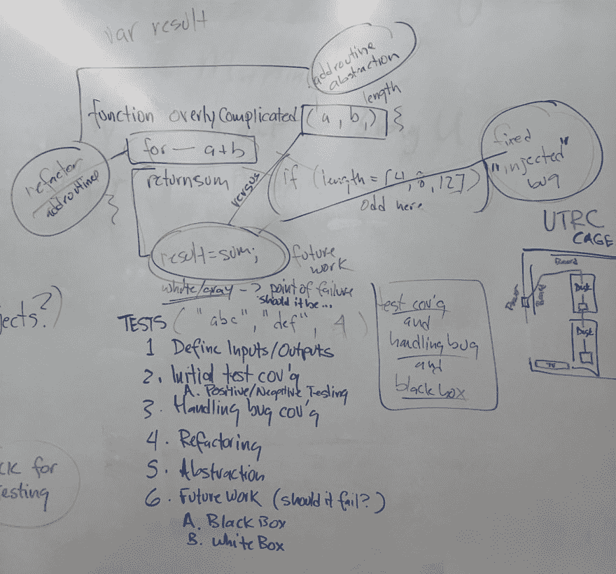

# 受测试代码的生命周期

> 原文：<https://dev.to/rfornal/a-lifecycle-of-code-under-test-16f0>

这篇文章是与丹·威皮斯基(我的一个同事)一起写的。

这是这篇文章/演讲的原文...

[](https://res.cloudinary.com/practicaldev/image/fetch/s--c0MV50PN--/c_limit%2Cf_auto%2Cfl_progressive%2Cq_auto%2Cw_880/https://thepracticaldev.s3.amazonaws.com/i/u53ad2sbzw4momh0va66.jpg)

如今，当检查前端代码模式时，开发人员也应该将测试视为开发周期的一部分。

这篇文章是关于单元和集成测试的，开发人员编写这些测试是为了立即测试他们的代码，而不是关于由 QA 个人或部门编写的更高级别的测试。在这篇文章中，我将搁置测试驱动开发和/或行为驱动开发的“先有鸡还是先有蛋”的讨论。有关更高级别的视图，请参见...

*   [单元和集成测试](https://dev.to/rfornal/unit-and-integration-testing-bco)
*   [前端测试中的灰度](https://dev.to/rfornal/shades-of-gray-in-front-end-testing-3li1)

我想在每个生命周期阶段更全面地关注代码和测试。

当想到这些测试时，我总是担心我已经“做得够多了”。我如何知道代码被适当地覆盖，奇怪的错误不会突然出现？我是否涵盖了所有的用例，如果有人中途更改了我的代码怎么办？

测试有一个明确的生命周期...

1.  定义输入和输出
2.  编写初始测试覆盖率
3.  处理 Bug 覆盖率
4.  重构
5.  抽象
6.  未来的工作(测试会受到怎样的影响？)

这里使用的代码更接近伪代码，而不是真实的 JavaScript(这意味着我没有运行代码或测试来查看是否工作)。这里的代码说明了正在讨论的要点。

## 基础代码

为了检查代码测试生命周期，假设下面是我们已经编写或想要编写的一些过于复杂的代码块(BDD 或 TDD)。

这个函数 ***过于复杂*** 应该取两个字符串( **a** 和 **b** )，将它们相加，然后返回结果字符串的第一个 **len** 字符。

“复杂”和“注入”的 bug 部分是故意的；允许生命周期有一个前进的路径。

```
function overlyComplicated(a, b, len) {
  var sum = "";

  if (len < 1) {
    return "";
  }

  for (var i = 0; i < a.length; i++) {
    sum = sum + a[i];
  }
  for (var i = 0; i < b.length; i++) {
    sum = sum + b[i];
  }

  // "INJECTED" BUG HERE
  if (len === 2 || len === 4 || len === 6) {
    return "unexpected";
  }

  return sum.subsrt(0, len);
}

var oC = overlyComplicated; 
```

Enter fullscreen mode Exit fullscreen mode

## 定义输入输出

看代码: ***函数 overly compliced(a，b，len)******return sum . substr(0，len)*** ，我们可以开始定义这个函数的输入输出了。

### 输入

*   **a** :一定长度的字符串。
*   **b** :一定长度的字符串。
*   **len** :要返回的组合的字符数(整数)。

### 输出

*   “len”字符串。

### 例子

*   (" abc "，" def "，0)返回""
*   (" abc "，" def "，1)返回" a "
*   (" abc "，" def "，3)返回" abc "
*   (“abc”，“def”，5)返回“abcde”

## 编写初始测试覆盖率

### 所有分支(路径)

*   此代码中没有分支；如果它们存在的话，每个都应该被覆盖。

### 阳性检测

正面测试，通常被称为**快乐路径测试**通常是开发人员对某些代码进行测试的第一种形式。它是针对代码运行典型场景的过程。因此，正如所暗示的，正面测试需要运行一个只有正确有效数据的测试场景。

*   expect(oC("abc "，" def "，1))。to equal(" a ")；
*   expect(oC("abc "，" def "，3))。to equal(“ABC”)；
*   expect(oC("abc "，" def "，5))。to equal(" abcde ")；

### 阴性检测

通常被称为**错误路径测试**或**失败测试**的负面测试通常是为了确保代码的稳定性。

这是一个应用创造性并针对无效数据验证代码的过程。这意味着它的预期目的是检查错误是否得到妥善处理。

对于这段代码，我们将只检查 **len** 输入的非正值的结果。

*   expect(oC("abc "，" def "，0))。to equal(" ")；
*   expect(oC("abc "，" def "，-1))。to equal(" ")；

## 处理 Bug 覆盖率

在这里，检查“错误”代码...

```
// "INJECTED" BUG HERE
if (len === 2 || len === 4 || len === 6) {
  return "unexpected";
} 
```

Enter fullscreen mode Exit fullscreen mode

### 在测试表单中重复 Bug...

expect(oC("abc "，" def "，2))。to equal(" ab ")；

*   返回...期待“意料之外”等于“ab”。

expect(oC("abc "，" def "，4))。to equal(" ABCD ")；

*   返回...期待“意料之外”等于“abcd”。

expect(oC("abc "，" def "，6))。to equal(" abcdef ")；

*   返回...期望“意外”等于“abcdef”。

### 修复 Bug

删除“错误”代码后...

```
function overlyComplicated(a, b, len) {
  var sum = "";

  if (len < 1) {
    return "";
  }

  for (var i = 0; i < a.length; i++) {
    sum = sum + a[i];
  }
  for (var i = 0; i < b.length; i++) {
    sum = sum + b[i];
  }

  // "INJECTED" BUG HERE
  // if (len === 2 || len === 4 || len === 6) {
  //   return "unexpected";
  // }

  return sum.substr(0, len);
}

var oC = overlyComplicated; 
```

Enter fullscreen mode Exit fullscreen mode

这三项测试现在都应该通过了...

*   expect(oC("abc "，" def "，2))。to equal(" ab ")；
*   expect(oC("abc "，" def "，4))。to equal(" ABCD ")；
*   expect(oC("abc "，" def "，6))。to equal(" abcdef ")；

## 重构

为了展示一个简单的重构，让我们注释掉代码中“过于复杂”的部分，构建一个简单得多的表单。

```
function overlyComplicated(a, b, len) {
  var sum = "";

  if (len < 1) {
    return "";
  }

  sum = a + b;
  sum = sum.substr(0, len);
  return sum;

  // for (var i = 0; i < a.length; i++) {
  //   sum = sum + a[i];
  // }
  // for (var i = 0; i < b.length; i++) {
  //   sum = sum + b[i];
  // }

  // return sum.substr(0, len);
}

var oC = overlyComplicated; 
```

Enter fullscreen mode Exit fullscreen mode

基于这一代码更改，所有之前的测试应该仍然可以通过。如果没有覆盖，开发人员需要采取每一个步骤来覆盖代码，不变。

### 阳性检测

*   expect(oC("abc "，" def "，1))。to equal(" a ")；
*   expect(oC("abc "，" def "，3))。to equal(“ABC”)；
*   expect(oC("abc "，" def "，5))。to equal(" abcde ")；

### 阴性测试

*   expect(oC("abc "，" def "，0))。to equal(" ")；
*   expect(oC("abc "，" def "，-1))。to equal(" ")；

### Bug 测试

*   expect(oC("abc "，" def "，2))。to equal(" ab ")；
*   expect(oC("abc "，" def "，4))。to equal(" ABCD ")；
*   expect(oC("abc "，" def "，6))。to equal(" abcdef ")；

### 抽象

现在，让我们检查代码中的一个抽象...

```
function getSum(a, b) {
  return a + b;
}

function overlyComplicated(sumFn, a, b, len) {
  var sum = "";

  if (len < 1) {
    return "";
  }

  sum = sumFn(a, b).substr(0, len);
  // sum = a + b;
  // sum = sum.substr(0, len);
  return sum;
}

function oC(a, b, len) {
  return overlyComplicated(getSum, a, b, len);
} 
```

Enter fullscreen mode Exit fullscreen mode

鉴于这一代码更改，所有先前的测试应该仍然通过。但是，我们现在可以添加针对 ***getSum*** 函数的测试。

*   expect(getSum("abc "，" dev "))。to equal(" abcdef ")；

当然，可以做更多的测试:更多的阳性测试，以及阴性测试。此外，过于复杂的***现在被赋予了一种手段来模仿、替换或窥探 ***getSum*** 函数，如果需要的话。***

## 未来工作(考试是如何受到影响的？)

从刚才应用的抽象开始，如果将来有人来添加一个全局对象，并将一行代码注入到过于复杂的*函数中，将总和添加到该对象中，会怎么样呢？* 

```
var global = {};

function getSum(a, b) {
  return a + b;
}

function overlyComplicated(sumFn, a, b, len) {
  var sum = "";

  if (len < 1) {
    return "";
  }

  sum = sumFn(a, b).substr(0, len);
  global.sum = sum;
  return sum;
}

function oC(a, b, len) {
  return overlyComplicated(getSum, a, b, len);
} 
```

Enter fullscreen mode Exit fullscreen mode

### 测试是如何受到影响的？

*   根据**黑盒测试**，任何测试都不应失败(纯粹检查输入到输出)。
*   根据**白盒测试**，应该编写测试来覆盖新代码。

## 未来工作测试

...考虑到

*   oC("abc "，" def "，1)；
    ...然后

*   expect(global.sum)。to equal(" a ")；

## 总结

测试中明确清晰的生命周期包括...

1.  定义输入和输出
2.  编写初始测试覆盖率
3.  处理 Bug 覆盖率
4.  重构
5.  抽象
6.  未来的工作(测试会受到怎样的影响？)

适当水平的测试将确保开发者...

1.  已经“做得够多了”
2.  知道代码被适当地覆盖。
3.  是安全的，因为奇怪的错误不会继续存在
4.  并且代码将在未来的变化中继续存在。

测试，以系统的方式应用，将允许开发者...

*   为了对无缺陷发布的代码有信心，
*   以及证明它有效的证据。