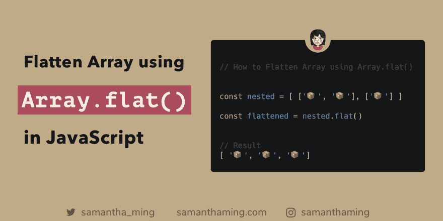

# 在 JavaScript 中使用 Array.flat()展平数组

> 原文：<https://dev.to/samanthaming/flatten-array-using-array-flat-in-javascript-1ieg>

[](https://res.cloudinary.com/practicaldev/image/fetch/s--y1GIj3gF--/c_limit%2Cf_auto%2Cfl_progressive%2Cq_auto%2Cw_880/https://thepracticaldev.s3.amazonaws.com/i/pgj0iqvm5nuuksuok6i8.png)

在#JavaScript 中展平数组总是很复杂。不再是了！ES2019 引入了一种展平阵列的新方法。还有一个“深度”参数，所以你可以传递任何层次的嵌套。令人惊异的🤩

```
const nested = [ ['📦', '📦'], ['📦']];

const flattened = nested.flat();

console.log(flattened);
// ['📦', '📦', '📦'] 
```

## 设置`depth`参数

下面是这个方法的语法:

```
array.flat(<depth>); 
```

默认情况下，`flat()`只会展平一层深度。换句话说，`depth`就是`1`。

```
array.flat();

// Same as

array.flat(1); 
```

## 更深层次的嵌套数组

最棒的是，这种方法也适用于 1 级以上的深度。您只需设置适当的`depth`参数来展平更深的嵌套数组。

```
const twoLevelsDeep = [[1, [2, 2], 1]];

// depth = 1
twoLevelsDeep.flat()
// [1, [2, 2], 1]

// depth = 2
twoLevelsDeep.flat(2)
// [1, 2, 2, 1] 
```

## 无限嵌套的数组

比方说，你想无限深入。没问题，我们也能做到。刚过`Infinity`。

```
const veryDeep = [[1, [2, 2, [3,[4,[5,[6]]]]], 1]];

veryDeep.flat(Infinity);
// [1, 2, 2, 3, 4, 5, 6, 1] 
```

## 空槽阵列

`flat()`可以做的另一件很酷的事情是移除数组中的空槽。

```
const missingNumbers = [1, ,3, ,5];

missingNumbers.flat();
// [1, 3, 5]; 
```

## 浏览器支持

`flat`是 ES2019 中引入的超级新功能，所以忘记 Internet Explorer 或 Edge 吧。但这并不奇怪😅

[浏览器支持:平面](https://developer.mozilla.org/en-US/docs/Web/JavaScript/Reference/Global_Objects/Array/flat#Browser_compatibility)

## 备选方案

既然支持力度不大。以下是一些替代解决方案。

### ES6 解决方案

这里有一个 ES6 解决方案。这只对一级嵌套数组有效。

```
const oneLevelDeep = [ [1, 2], [3]];

const flattened = [].concat(...oneLevelDeep);
// [1, 2, 3,] 
```

### 旧版浏览器解决方案

这里有一个是给老浏览器和 ES6 之前的。同样，这只适用于一级嵌套数组。

```
const oneLevelDeep = [ [1, 2], [3]];

const flattened = [].concat.apply([], oneLevelDeep);
// [1, 2, 3,] 
```

### 递归

对于嵌套更深的数组，可以使用递归。下面是来自 [MDN 网络文档](https://developer.mozilla.org/en-US/docs/Web/JavaScript/Reference/Global_Objects/Array/flat#Alternative) :
的解决方案

```
var arr1 = [1,2,3,[1,2,3,4, [2,3,4]]];

function flattenDeep(arr1) {
   return arr1.reduce((acc, val) => Array.isArray(val) ? acc.concat(flattenDeep(val)) : acc.concat(val), []);
}
flattenDeep(arr1);// [1, 2, 3, 1, 2, 3, 4, 2, 3, 4] 
```

## 社区输入

💬Array.flat()有什么有趣的用例吗？

*   *[@ hocine _ Abdel Latif](https://www.instagram.com/hocine_abdellatif/):*有点远的用例但可能值得一提的是，在机器学习中如果你有一个世代数组，每个世代都是一个学生数组，如果你想让每个世代的每个学生，这个方法会非常实用。

*   *[@devjacks](https://twitter.com/devjacks/status/1155273208595021825?s=20) :* 几周前我用这样的问题写了一个代码测试。这会让我的生活变得容易得多！😂

```
// Please write a function to search for 213

function search(needle, haystack) {}

const haystack =[1, 4, [5,6,7, [8, 18, [34,177,[98,[210,[213]]]]]]];
const needle = 213; 
```

## 资源

*   [MDN 网络文档:](https://developer.mozilla.org/en-US/docs/Web/JavaScript/Reference/Global_Objects/Array/flat)
*   [鳄鱼:用 flat 和 flatMap 在普通 JavaScript 中展平数组](https://alligator.io/js/flat-flatmap/)
*   [用 JavaScript 展平数组的数组](http://joelabrahamsson.com/flatten-array-of-arrays-with-javascript/)
*   [堆栈溢出:合并/展平数组的数组](https://stackoverflow.com/questions/10865025/merge-flatten-an-array-of-arrays)
*   [在 JavaScript 中展平多维数组](https://www.jstips.co/en/javascript/flattening-multidimensional-arrays-in-javascript/)
*   [用 flat 和 flatMap 在 JavaScript 中展平数组](https://davidtang.io/2019/03/09/flattening-arrays-in-javascript-with-flat-and-flatMap.html)

* * *

**感谢阅读❤**
问好！[insta gram](https://www.instagram.com/samanthaming/)|[Twitter](https://twitter.com/samantha_ming)|[脸书](https://www.facebook.com/hisamanthaming) | [博客](https://www.samanthaming.com/blog)|[SamanthaMing.com](https://www.samanthaming.com/)