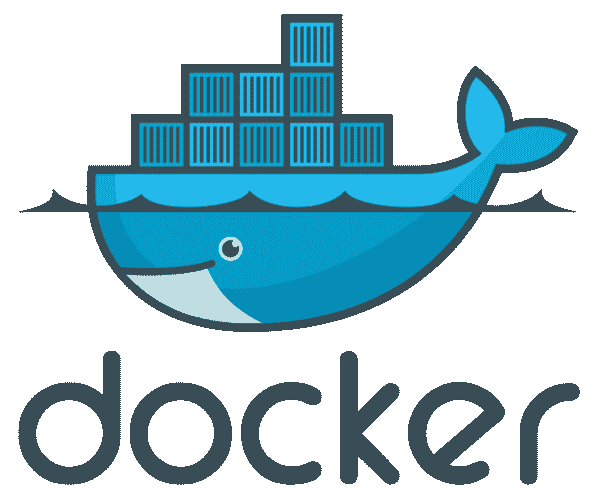
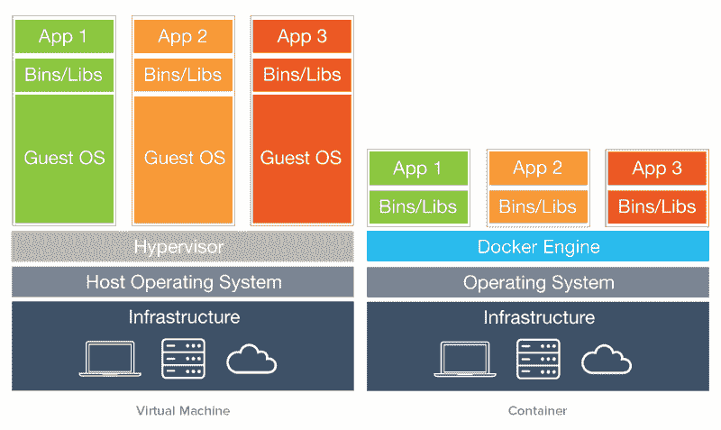
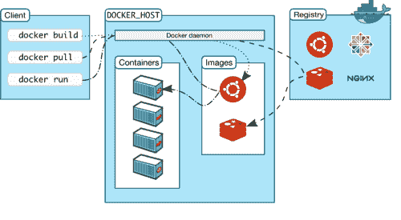
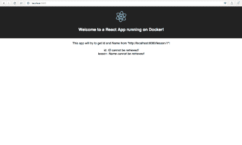

# 用 Docker 介绍容器世界

> 原文：<https://dev.to/peaonunes/an-introduction-to-the-container-world-with-docker-37g7>

> 这是转贴自我 2017 年关于[介质](https://medium.com/@peaonunes/an-introduction-to-the-container-world-with-docker-6fd613f6b9c2)的文章。虽然今天 Docker 比以前更为人所知，但我认为让我在这篇文章中分享的基础知识也可以在 dev.to 平台上使用可能会很好。我借此机会更新了帖子，并对其进行了改进。所以如果你是新手，一起来享受吧=)

# 用 Docker 介绍容器世界

我将实现什么？在本文结束时，您将理解 docker 的核心概念，如图像、容器、Docker 文件，并将其与有用的 Docker 命令一起使用。理解为什么它对生产和开发有益，并且能够使用 Dockerfile 和 Docker Compose 运行您的应用程序。

这时你可能听到有人在谈论或读到一些引用 Docker 的文章。但是这是怎么回事呢？为什么要用 Docker？以及为什么它对开发和生产系统都有好处。

## 为什么要用容器？

想象你有两个不同的服务(1 和 2)在同一台主机上运行于 [AWS](https://aws.amazon.com/free/?sc_channel=PS&sc_campaign=acquisition_BR&sc_publisher=google&sc_medium=english_cloud_computing_b&sc_content=aws_core_e&sc_detail=a.w.s&sc_category=cloud_computing&sc_segment=89108828668&sc_matchtype=e&sc_country=BR&s_kwcid=AL!4422!3!89108828668!e!!g!!a.w.s&ef_id=V3yH-wAABIFQ5XJP:20170501150650:s&all-free-tier.sort-by=item.additionalFields.SortRank&all-free-tier.sort-order=asc) ，它们有相同的技术依赖，都运行于**框架 v2** 下。现在你必须将**服务 1** 升级到新版本**框架 v3** ，因为它与你公司的货币化平台相集成。

所以你必须使用命令行工具进入运行 AWS 的机器内部，现在你要更新框架了！不幸的是**服务 2** 与这个新版本不兼容，一切都开始崩溃！你可以在 AWS 上租另一台机器，进入它，复制**服务 2** 的所有文件并安装旧版本的框架，现在它运行良好。

然而，这是不是意味着团队有了另一个版本的**服务 2** ，而你只是安装了旧版本，因为你复制了错误的代码库！过程又重新开始了！是不是越来越无聊了？

当涉及到供应机器和配置依赖关系以运行一些应用程序时，有一些选项。像 X 这样的工具允许你把基础设施写成代码，自动配置和部署机器和相关的。我们可以超越这一点。

使用云服务或不托管、交付和运行服务会增加一些相关问题，如:

*   我如何保证我的应用程序有一个稳定的环境？
*   如何管理我的应用程序的环境配置？
*   我如何高效地扩展和升级我的服务？
*   如何将我的服务依赖与其他服务隔离开来？

## 容器

容器并不是一个新概念，从 30 年代早期开始使用，直到 1956 年由马尔孔·麦克林获得专利。运输具有不同约束(大小、尺寸、重量……)的不同包装的产品的需求导致了称为集装箱的运输模型的标准化。

抛开隐喻不谈，在软件生产领域，我们发现了同样的需求。接下来是软件容器，它将软件产品打包并管理其配置以供运输。

[](https://res.cloudinary.com/practicaldev/image/fetch/s--SsvjHKQS--/c_limit%2Cf_auto%2Cfl_progressive%2Cq_auto%2Cw_880/https://cdn-images-1.medium.com/max/600/1%2AIp-5CxcjDNwDuninfBXstA.png)

## 码头工人

软件容器也不是一个新概念，但是对大多数工程师来说，处理它是一项艰难的低级工作。然而，Docker 是一个快速、易用、强大的软件容器化工具。

使用 Docker，您可以定义描述软件环境设置和命令的**图像**。从这些映像中，您可以运行容器，它们是实际的可执行包。

## docker 是如何工作的？

Docker 在主机系统内核下运行，容器仅包含用户空间文件，所有资源、所需配置、库、依赖项和可执行命令都通过**映像**来定义，这些映像很轻，很容易适应不同的用途。

[](https://res.cloudinary.com/practicaldev/image/fetch/s--zRaCNWD5--/c_limit%2Cf_auto%2Cfl_progressive%2Cq_auto%2Cw_880/https://cdn-images-1.medium.com/max/800/1%2AZXebwLEaHI_a6Bv9_wdbFw.png)

与虚拟机不同的是，Docker 并不模拟主机上的整个操作系统，这也是它比虚拟机轻的原因。Docker 引擎的工作方式类似于管理主机操作系统上的容器进程的中间件。带有 Docker 的容器只加载**必需的 bin/libs**(显然还有 app😛)供您的应用程序运行。

当你开始使用的时候，这些商品就不会过时。

*   **资源效率:**您可以配置磁盘空间、内存使用、库和 bin 来加载您的容器。能够为您的应用程序创建最轻便高效的环境。
*   **兼容:**兼容 Linux、Windows、MacOS 发行版。
*   **易于运行和快速:**易于安装、命令行工具的使用以及构建和运行容器的优化。
*   **软件维护:**发布新版本，更换容器，保证合适的环境。
*   **可扩展性:**只要您的流量很大，就扩展您的服务复制容器，当流量不太大时，就关闭一些复制容器。
*   安全:容器与主机是隔离的，所以它不能访问自己边界之外的任何东西。
*   **可再现性:**容器是一个定义良好的环境，您可以在一组定义上保证相同的基础设施。

## 动起手来！🙌🏽

让我们现在就试用 Docker 吧！安装:在 [Install Docker](https://docs.docker.com/install/) 上，你会找到正确系统的说明。有适用于 Mac、Windows 和 Linux 的 dist。

一旦你在你的机器上安装并运行了 docker，跳到你的终端，点击`docker -v`来检查你的 docker 版本。现在尝试运行以下命令:

```
$ docker run -it alpine sh 
```

<svg width="20px" height="20px" viewBox="0 0 24 24" class="highlight-action crayons-icon highlight-action--fullscreen-on"><title>Enter fullscreen mode</title></svg> <svg width="20px" height="20px" viewBox="0 0 24 24" class="highlight-action crayons-icon highlight-action--fullscreen-off"><title>Exit fullscreen mode</title></svg>

这个命令告诉 docker 在交互模式下运行，`-it`标志， [Linux Alpine](https://hub.docker.com/_/alpine) 并运行`sh`命令。因此，由于您的机器上可能没有 alpine 映像，Docker 会在运行之前下载它。

如果一切顺利，你应该在阿尔卑斯山的`sh shell`模式。没错，只需几秒钟，您就可以在一个容器内运行的 Linux 的终端上了！尝试`ls`检查文件和文件夹。

[](https://res.cloudinary.com/practicaldev/image/fetch/s--IL7IyilX--/c_limit%2Cf_auto%2Cfl_progressive%2Cq_auto%2Cw_880/https://miro.medium.com/max/700/1%2A28BUgCTlWvcfCRFruJeXRQ.png)

现在输入`exit`就完成了。您将退出并停止容器。

***注意**:Docker 是为 Linux 开发的，现在它也是 Windows 自带的。然而，在 Mac 上，它仍然需要在后台运行一个虚拟机来模拟主机。这仍然比使用虚拟机来完成所有工作要轻松得多。*

## 图像

你可能会问自己，码头工人是怎么知道阿尔卑斯山的，他是从哪里得到的。阿尔卑斯山来自[码头](https://hub.docker.com)上的这个[仓库](https://hub.docker.com/_/alpine/)。DockerHub 是容器图像的存储库。用户和组织可以发布他们的[软件、语言、系统、操作系统、…]的官方 docker 映像。

[](https://res.cloudinary.com/practicaldev/image/fetch/s--aCQgJZCW--/c_limit%2Cf_auto%2Cfl_progressive%2Cq_auto%2Cw_880/https://miro.medium.com/max/500/1%2AC6u7ZD0b5g_cfVvgmCO2dQ.png)

DockerHub 是容器的 GitHub。你可以像在 GitHub 上运行代码一样获取一些启动容器的图像。守护进程在主机中寻找镜像，如果找不到，就在 DockerHub 上寻找镜像。

使用一个 **Dockerfile** 你可以从一个非常基本的图像定义开始，并在其上创建**层**，描述图像执行的下一步。这样做，你可以增加和适应你的需求。

## Dockerfile

克隆下面的代码以简化接下来的步骤。[下载这里](https://github.com/peaonunes/intro-docker-examples)。有两个文件夹保存两个不同的应用程序，一个叫做**节点服务**，另一个叫做 **webapp** 。让我们从 webapp 开始，在 webapp 文件夹下创建一个名为 Dockerfile 的新文件。

我推荐阅读[文档](https://docs.docker.com/engine/reference/builder/)了解更多细节。

我们在 docker 文件上设置的第一件事是来自我们应用程序的起始图像。在这种情况下， **webapp** 是一个 React 应用程序，所以安装了 Node.js 的环境对我们来说很好。谢天谢地，DockerHub 上有一张这样的图片。

```
FROM node:6.3.1 
```

<svg width="20px" height="20px" viewBox="0 0 24 24" class="highlight-action crayons-icon highlight-action--fullscreen-on"><title>Enter fullscreen mode</title></svg> <svg width="20px" height="20px" viewBox="0 0 24 24" class="highlight-action crayons-icon highlight-action--fullscreen-off"><title>Exit fullscreen mode</title></svg>

该命令表示从起始图像`node:6.3.1`开始执行其余操作。[这个映像](https://hub.docker.com/_/node/)包含安装在 Linux 发行版下的 Node.js 版本 6.3.1。让我们继续写下其他命令:

```
FROM node:6.3.1

# Run a command for creating the following path on container
RUN mkdir -p /usr/web-app

# Sets the work directory of our app to be the new path
WORKDIR /usr/web-app

# Copy all files from current directory to the new path in container
COPY . /usr/web-app

# Run the command for installing our node dependencies 
RUN npm install

# Define the command that will execute when the container start
CMD npm start 
```

<svg width="20px" height="20px" viewBox="0 0 24 24" class="highlight-action crayons-icon highlight-action--fullscreen-on"><title>Enter fullscreen mode</title></svg> <svg width="20px" height="20px" viewBox="0 0 24 24" class="highlight-action crayons-icon highlight-action--fullscreen-off"><title>Exit fullscreen mode</title></svg>

现在我们有了文件集。让我们在容器内部运行应用程序。

```
$ cd webapp
$ docker build -t web-app . 
```

<svg width="20px" height="20px" viewBox="0 0 24 24" class="highlight-action crayons-icon highlight-action--fullscreen-on"><title>Enter fullscreen mode</title></svg> <svg width="20px" height="20px" viewBox="0 0 24 24" class="highlight-action crayons-icon highlight-action--fullscreen-off"><title>Exit fullscreen mode</title></svg>

下载运行`build`的节点的映像可能需要一些时间，根据当前(`.`)目录中的 Dockerfile 构建映像。`-t`是一面标记该图像的旗帜，并将其命名为`web-app`。

```
$ docker images 
```

<svg width="20px" height="20px" viewBox="0 0 24 24" class="highlight-action crayons-icon highlight-action--fullscreen-on"><title>Enter fullscreen mode</title></svg> <svg width="20px" height="20px" viewBox="0 0 24 24" class="highlight-action crayons-icon highlight-action--fullscreen-off"><title>Exit fullscreen mode</title></svg>

应该会列出您的`web-app`图像。现在让我们运行我们的应用程序！

```
$ docker run -d --name web-app-container -p 3000:3000 web-app 
```

<svg width="20px" height="20px" viewBox="0 0 24 24" class="highlight-action crayons-icon highlight-action--fullscreen-on"><title>Enter fullscreen mode</title></svg> <svg width="20px" height="20px" viewBox="0 0 24 24" class="highlight-action crayons-icon highlight-action--fullscreen-off"><title>Exit fullscreen mode</title></svg>

docker 通过标志`d`以非交互模式运行您的容器，然后用`--name web-app-container`命名您的容器，并使用`-p`映射端口(格式为`port-on-your-machine:port-on-the-container`)。并使用我们的形象命名为`web-app`。尝试在`http://localhost:3000`使用您的浏览器。

[](https://res.cloudinary.com/practicaldev/image/fetch/s--ygEa32v---/c_limit%2Cf_auto%2Cfl_progressive%2Cq_auto%2Cw_880/https://miro.medium.com/max/500/1%2A2sF2r111hPpv7GHyYeyu0A.png)

React 应用程序正在`localhost:3000`的容器内运行。容器上的这个端口被映射到我们的主机，因此我们可以访问应用程序。

**webapp** 依赖于来自**节点服务**的一些数据，因此您可以看到在 id 和 name❗️
处显示了一条错误消息

```
$ docker ps 
```

<svg width="20px" height="20px" viewBox="0 0 24 24" class="highlight-action crayons-icon highlight-action--fullscreen-on"><title>Enter fullscreen mode</title></svg> <svg width="20px" height="20px" viewBox="0 0 24 24" class="highlight-action crayons-icon highlight-action--fullscreen-off"><title>Exit fullscreen mode</title></svg>

上面的命令列出了所有正在运行的容器，尝试使用`-a`来显示所有创建的容器。现在我们可以看到它真的在运行，如果你还不确定的话，试着停止容器并重新加载浏览器！

```
$ docker stop <container-id-listed-on-ps> 
```

<svg width="20px" height="20px" viewBox="0 0 24 24" class="highlight-action crayons-icon highlight-action--fullscreen-on"><title>Enter fullscreen mode</title></svg> <svg width="20px" height="20px" viewBox="0 0 24 24" class="highlight-action crayons-icon highlight-action--fullscreen-off"><title>Exit fullscreen mode</title></svg>

让我们转到并启动**节点服务**应用程序。转到它的根文件夹，并为此服务创建一个新的 Dockerfile。因为它是一个节点应用程序，所以非常相似。

```
FROM node:6.3.1

RUN mkdir -p /usr/node-service

WORKDIR /usr/node-service

COPY . /usr/node-service

RUN npm install

CMD npm start 
```

<svg width="20px" height="20px" viewBox="0 0 24 24" class="highlight-action crayons-icon highlight-action--fullscreen-on"><title>Enter fullscreen mode</title></svg> <svg width="20px" height="20px" viewBox="0 0 24 24" class="highlight-action crayons-icon highlight-action--fullscreen-off"><title>Exit fullscreen mode</title></svg>

让我们构建并运行**节点服务**容器，然后重新加载 **webapp** ！

```
$ cd ../node-service
$ docker build -t node-service .
$ docker run -d --name node-service-container -p 8080:8080 node-service 
```

<svg width="20px" height="20px" viewBox="0 0 24 24" class="highlight-action crayons-icon highlight-action--fullscreen-on"><title>Enter fullscreen mode</title></svg> <svg width="20px" height="20px" viewBox="0 0 24 24" class="highlight-action crayons-icon highlight-action--fullscreen-off"><title>Exit fullscreen mode</title></svg>

[](https://res.cloudinary.com/practicaldev/image/fetch/s--mRICNl7p--/c_limit%2Cf_auto%2Cfl_progressive%2Cq_auto%2Cw_880/https://miro.medium.com/max/700/1%2AifIjvV1xyyAO7m2sw5Kd5Q.png)

完美！您的容器现在正在运行并相互通信！✅
如果出于任何原因你需要删除一个**图像**或者一个**容器**构建使用:

*   图像使用`$ docker rmi <containerID>`
*   容器用途`$ docker rm <containerID>`

在交互模式下运行你的容器可能有助于在容器环境中调试或工作，在这种情况下，在`docker run`上使用`-it`标志。

但是，如果你想在`bash`进入容器，例如，并且你的容器已经在运行 go for:

```
$ docker exec -it <containerID> bash 
```

<svg width="20px" height="20px" viewBox="0 0 24 24" class="highlight-action crayons-icon highlight-action--fullscreen-on"><title>Enter fullscreen mode</title></svg> <svg width="20px" height="20px" viewBox="0 0 24 24" class="highlight-action crayons-icon highlight-action--fullscreen-off"><title>Exit fullscreen mode</title></svg>

您可以在我们刚刚创建的容器中尝试所有这些命令。

⭐️:现在你知道一点点使用 Docker 的容器，并且已经真正运行它了！太好了！我想再讲几个话题。

> 现在，我建议你喝杯咖啡，放松一下，然后再继续。

## 复合坞站

Docker Compose 是一个随 Docker 一起安装的工具，对不同容器的编排很有用。重点是让您的作曲家管理构建和运行您的所有项目。

容器编排是管理服务生命周期的下一个层次。我们能够管理和控制大量的事情，例如:负载平衡、冗余、资源分配、实例的伸缩等。

Docker compose 是与 [Docker Swarm](https://docs.docker.com/engine/swarm) orchestrator 一起使用的默认格式。

[](https://res.cloudinary.com/practicaldev/image/fetch/s--Zy3N6TJ4--/c_limit%2Cf_auto%2Cfl_progressive%2Cq_auto%2Cw_880/https://thepracticaldev.s3.amazonaws.com/i/m6pkbaefw4996fqv5fy9.png)

然而，我们可以在我们刚刚制作的项目中尝试它！我们只需要创建`docker-compose.yml`文件！

访问项目的根文件夹`intro-docker-examples`并创建`docker-compose.yml`文件。现在让我们正确地配置它。

在这个文件中，您必须在 services 属性下定义我们的应用程序。我们将首先定义 **webapp** 。

```
version: "2"
services:
  webapp:
    build: ./webapp
    ports:
      - "3000:3000"
    depends_on:
      - node-service 
```

<svg width="20px" height="20px" viewBox="0 0 24 24" class="highlight-action crayons-icon highlight-action--fullscreen-on"><title>Enter fullscreen mode</title></svg> <svg width="20px" height="20px" viewBox="0 0 24 24" class="highlight-action crayons-icon highlight-action--fullscreen-off"><title>Exit fullscreen mode</title></svg>

我们在上面用构建指令定义了 **webapp** 服务，用于构建项目文件夹(它将查找我们的 Dockerfile)、端口映射，就像我们在前面的命令中所做的一样，我们说要运行此服务，它依赖于**节点服务**，因此 docker compose 将首先运行**节点服务**以保证这种依赖性。

```
version: "2"
services:
  node-service:
    build: ./node-service
    ports:
      - "8080:8080"
  webapp:
    build: ./webapp
    ports:
      - "3000:3000"
    depends_on:
      - node-service 
```

<svg width="20px" height="20px" viewBox="0 0 24 24" class="highlight-action crayons-icon highlight-action--fullscreen-on"><title>Enter fullscreen mode</title></svg> <svg width="20px" height="20px" viewBox="0 0 24 24" class="highlight-action crayons-icon highlight-action--fullscreen-off"><title>Exit fullscreen mode</title></svg>

所以我们现在定义了**节点服务**，就像我们为 webapp 所做的那样。版本定义了 docker 组合配置的类型，该模板与版本 2！

如果旧容器仍在运行，现在停止它们，并使用我之前展示的命令删除它们。现在我们可以看到 Docker Compose 再次构建一切。从命令行上的根文件夹转到:

```
$ docker-compose up 
```

<svg width="20px" height="20px" viewBox="0 0 24 24" class="highlight-action crayons-icon highlight-action--fullscreen-on"><title>Enter fullscreen mode</title></svg> <svg width="20px" height="20px" viewBox="0 0 24 24" class="highlight-action crayons-icon highlight-action--fullscreen-off"><title>Exit fullscreen mode</title></svg>

这将为您的项目创建新的图像，构建容器并在交互式视图上运行它们。您现在将看到来自服务的日志。

访问`http://localhost:3000`并检查现在一切都工作正常！

[](https://res.cloudinary.com/practicaldev/image/fetch/s--ciqUHAEp--/c_limit%2Cf_auto%2Cfl_progressive%2Cq_auto%2Cw_880/https://miro.medium.com/max/500/1%2ARn0No7dAwANDcFzBry4V-Q.png)

要停止容器，请转到终端上的另一个选项卡，导航到该文件夹并运行下面的命令。它将按顺序停止每个容器。

```
$ docker-compose down 
```

<svg width="20px" height="20px" viewBox="0 0 24 24" class="highlight-action crayons-icon highlight-action--fullscreen-on"><title>Enter fullscreen mode</title></svg> <svg width="20px" height="20px" viewBox="0 0 24 24" class="highlight-action crayons-icon highlight-action--fullscreen-off"><title>Exit fullscreen mode</title></svg>

太好了！一切正常，但是如果我必须改变 Dockerfiles 的定义，会发生什么呢？如果您使用的是`docker-compose`，那么只需运行:

```
$ docker-compose up --build 
```

<svg width="20px" height="20px" viewBox="0 0 24 24" class="highlight-action crayons-icon highlight-action--fullscreen-on"><title>Enter fullscreen mode</title></svg> <svg width="20px" height="20px" viewBox="0 0 24 24" class="highlight-action crayons-icon highlight-action--fullscreen-off"><title>Exit fullscreen mode</title></svg>

如果您对 docker 文件进行了编辑，您可以使用标志`-- build``来强制重建图像和容器。任何 docker 容器的重建都使用**缓存步骤**进行优化。这意味着 docker 仅重建从更改的步骤到最终步骤的步骤。

这个实现的最终文件可以在[这里](https://github.com/peaonunes/intro-docker-examples/tree/feature/dockerization)找到。

## 码头工人超越生产

使用 Docker 进行生产部署是现实的，并且有很多好处。不过在开发环境下使用 Docker 也是一个不错的做法。

在 docker 文件上定义项目的配置和依赖关系，可以为将要参与项目的任何人正确地设置环境！这**避免了与主机和库版本相关的问题**,并允许您的主机环境保持干净。

例如，您可以在一个容器中启动一个本地数据库，比如 postgres 或 mongodb，并让您的应用程序本地连接到它，而不是将它安装在您的计算机中。

给开发者的一个好建议是寻找[卷](https://docs.docker.com/engine/tutorials/dockervolumes)。这将创建一个通道，使容器内的文件夹和主机之间能够同步。因此，如果您在主机上编写代码，它将与容器中的代码同步。

一些语言和应用程序，比如 webapps，有热重新加载的能力。因此，只要您从您的主机上编码，您就可以看到正在编译并运行到容器中的更改。但是如果你的技术没有这个功能，你可以打开一个终端标签进入容器并重新编译/运行项目。

您还可以在您的 **CI/CD** 管道中使用 docker 构建 Docker 映像来运行测试，如果它是健康的，就发布它们。

## 结束？

实际上，这是我们使用 Docker 的旅程的开始！有很多东西需要学习和练习！期待 Docker 更多的话题和概念。

随着 Kubernetes 变得越来越受欢迎，是这个领域最受欢迎的容器编制器。你的下一步肯定是探索与容器或分类相关的工作！

如果这篇文章对你有所帮助，请留下你的赞赏❤，如果它没有满足你的期望，请发送你的反馈✉️，并在下面的评论区分享你的想法📃！

下次见=]