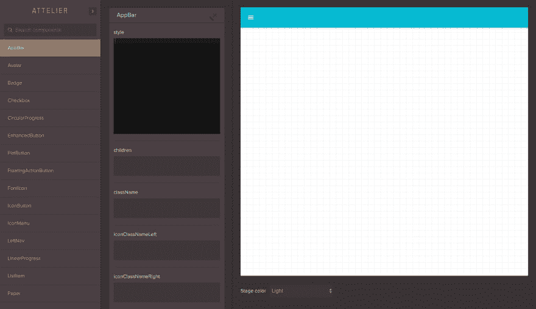
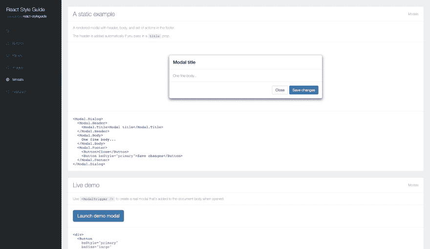
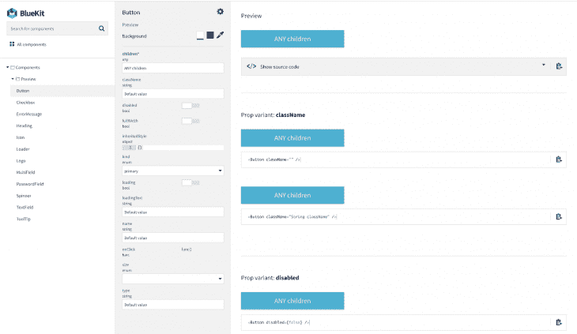

# 反应故事书的替代品

> 原文：<https://dev.to/bnevilleoneill/alternatives-to-react-storybook-1lkb>

[](https://res.cloudinary.com/practicaldev/image/fetch/s--GKM0TvqK--/c_limit%2Cf_auto%2Cfl_progressive%2Cq_auto%2Cw_880/https://thepracticaldev.s3.amazonaws.com/i/y1vyo7kfj4sa7nos0qql.png)

[React Storybook](https://storybook.js.org/docs/guides/guide-react/) 是一个用户界面开发环境，也是 UI 组件的游乐场。它允许开发人员开发他们的组件，并在一个隔离的环境中交互展示它们。

Storybook 还允许开发人员提供组件用法的代码示例，这些示例又可以作为组件的文档。Storybook 被世界各地的工程师广泛用于加速 UI 开发并为他们的组件提供文档。

故事书也有惊人的文档，这个[演练](https://www.learnstorybook.com/react/en/get-started/)将从头开始设置。他们还在[现场演示了故事书是如何运作的。你可能也想看看](https://storybooks-official.netlify.com/?path=/story/ui-panel--default)[这篇关于故事书如何简化组件测试的文章](https://dev.to/bnevilleoneill/how-react-storybook-can-simplify-component-testing-1l8m)。

很有用吧？它变得越来越好，因为有许多其他方式来实现类似于故事书提供的结果。在本文中，我们将关注 React 应用程序故事书的其他替代方案。这些替代方案包括:

*   研讨会
*   反应宇宙
*   docx
*   白色卡片
*   反应样式向导生成器
*   反应 Bluekit

[](https://logrocket.com/signup/)

## 抛光

Atellier 可能是我们列表中更多样的选择之一。Atellier 由 [Scup](https://www.scup.com/social/en/) 开发，允许你预览和共享组件，同时提供编辑属性、状态和附加到组件的功能以及操纵样式的能力。使用这个[现场演示](http://scup.github.io/atellier/material-ui-atellier/)，你可以看到这有多详细，它的材料用户界面展示了各种组件。

Atellier 也很容易设置。为此，安装`react-attelier package`如下:

```
npm install react-atellier 
```

<svg width="20px" height="20px" viewBox="0 0 24 24" class="highlight-action crayons-icon highlight-action--fullscreen-on"><title>Enter fullscreen mode</title></svg> <svg width="20px" height="20px" viewBox="0 0 24 24" class="highlight-action crayons-icon highlight-action--fullscreen-off"><title>Exit fullscreen mode</title></svg>

接下来，让我们将它导入并设置在我们的项目中:

```
import ReactAtellier from 'react-atellier';
import myComponent from 'myComponent';
//import other components here

const componentList = [{
  componentName : myComponent.displayName,
  component : myComponent
  },
  //...map other components
];

//pass the list of components to atellier via props 
var AtellierWrapper = React.createClass({
  render: function() {
    return (
      <ReactAtellier components={componentList} />
    );
  }
});

//render atellier somewhere in your app
render((
  <Router history={browserHistory}>
    <Route path="/" component={App}>
      <Route path="atellier" component={AtellierWrapper}/>
    </Route>
  </Router>
), document.body) 
```

<svg width="20px" height="20px" viewBox="0 0 24 24" class="highlight-action crayons-icon highlight-action--fullscreen-on"><title>Enter fullscreen mode</title></svg> <svg width="20px" height="20px" viewBox="0 0 24 24" class="highlight-action crayons-icon highlight-action--fullscreen-off"><title>Exit fullscreen mode</title></svg>

就这样，在你的应用程序的 atellier 路径上，你会找到演示中呈现的组件，其中包含 Atellier 的所有可用功能。

Atellier 是开源的，他们对开发者开放贡献，目前正在开发 CLI 以改善开发体验。

需要注意的是，这个包从 2016 年开始就没有更新过。

[](https://res.cloudinary.com/practicaldev/image/fetch/s--rp-QOwLu--/c_limit%2Cf_auto%2Cfl_progressive%2Cq_auto%2Cw_880/https://i2.wp.com/blog.logrocket.com/wp-content/uploads/2019/07/attelier.png%3Fresize%3D1600%252C923%26ssl%3D1)

## 反应宇宙

React Cosmos 是另一个很好的选择。Cosmos 扫描您的项目，使您能够执行以下操作:

*   在道具、上下文和状态的任意组合下呈现组件
*   模仿每一个外部依赖(例如 API 响应、本地存储等)
*   在与正在运行的实例交互时，查看应用状态的实时变化

Cosmos 首先是一个开发工具，旨在改进所有组件，无论大小，而不仅仅是无状态的 UI 位。 [fixture](https://github.com/react-cosmos/react-cosmos#fixtures) 和 [proxy](https://github.com/react-cosmos/react-cosmos#proxies) 架构兼作[自动化测试工具](https://github.com/react-cosmos/react-cosmos#headless-testing)，为开发健壮且可重用的组件提供完整的解决方案。Cosmos 还使创建生活方式指南变得容易，但这是次要目标，如果这是你的主要关注点，你可能会从备选方案中获得更多价值。

工作中的宇宙的现场演示可以在这里找到。

[](https://res.cloudinary.com/practicaldev/image/fetch/s--2gOds2qt--/c_limit%2Cf_auto%2Cfl_progressive%2Cq_auto%2Cw_880/https://i2.wp.com/blog.logrocket.com/wp-content/uploads/2019/07/cosmos.png%3Fresize%3D512%252C282%26ssl%3D1)

## Docz

Docz 是一个神奇的工具，可以零配置和实时预览地记录你的组件。《Docz》由[盖茨比](https://www.gatsbyjs.org/)驱动，速度极快。它建立在五个主要原则之上:

*   **零配置且易于学习**–没有不必要的构建步骤和混乱的设置
*   **超快的速度**–它从一开始就考虑到了性能
*   **易于定制**–创造易于使用和定制的东西
*   **基于 MDX 的**–编写文档的最佳标准
*   **可插拔**–当您需要定制和灵活的解决方案时，插件是最佳选择

Docz 还提供插件和主题支持，因此提高了定制和可用性。

[](https://res.cloudinary.com/practicaldev/image/fetch/s--4yhQDmUI--/c_limit%2Cf_auto%2Cfl_progressive%2Cq_auto%2Cw_880/https://i2.wp.com/blog.logrocket.com/wp-content/uploads/2019/07/docz.png%3Fresize%3D512%252C334%26ssl%3D1)

[](https://res.cloudinary.com/practicaldev/image/fetch/s--yABoT8si--/c_limit%2Cf_auto%2Cfl_progressive%2Cq_auto%2Cw_880/https://i1.wp.com/blog.logrocket.com/wp-content/uploads/2019/07/docz2.png%3Fresize%3D512%252C297%26ssl%3D1)

## 空白卡

[全权委托](https://github.com/carteb/carte-blanche)是一个隔离的开发空间，为您的组件集成了模糊测试。单独查看它们，在不同状态下探索它们，并快速自信地开发它们。

设置全权委托是一个简单的两步过程:

```
var CarteBlanche = require('carte-blanche');
/* … */
plugins: [
  new CarteBlanche({
    componentRoot: './src/components'
  })
], 
```

<svg width="20px" height="20px" viewBox="0 0 24 24" class="highlight-action crayons-icon highlight-action--fullscreen-on"><title>Enter fullscreen mode</title></svg> <svg width="20px" height="20px" viewBox="0 0 24 24" class="highlight-action crayons-icon highlight-action--fullscreen-off"><title>Exit fullscreen mode</title></svg>

就是这样，现在启动你的开发环境，去/全权委托看看你的全权委托。该团队非常友好地提供了这个[短片](https://www.youtube.com/watch?v=6g3-TQ6aaw8)来展示可用的功能。

和 Atellier 一样，需要注意的是，这个包从 2016 年开始就没有更新过。

## 反应样式向导生成器

[React 样式指南生成器](https://github.com/pocotan001/react-styleguide-generator)用于通过向 React 项目添加一些文档来轻松生成好看的样式指南。

你可以在这里找到一个用 React-Bootstrap 创建的演示,展示了许多组件的文档。

[](https://res.cloudinary.com/practicaldev/image/fetch/s--kjDU2Xf9--/c_limit%2Cf_auto%2Cfl_progressive%2Cq_auto%2Cw_880/https://i0.wp.com/blog.logrocket.com/wp-content/uploads/2019/07/rsg.png%3Fresize%3D1600%252C925%26ssl%3D1)

## React Bluekit

由 [Blueberry](https://www.blueberry.io/) 、 [Bluekit](http://bluekit.blueberry.io/) 创建，是一个看起来很棒的组件文档工具，可以与 [gulp](https://gulpjs.com/) 无缝集成。

要安装它，请运行`npm install react-bluekit --save`。

将以下几行添加到您的 gulp 文件中:

```
import createBlueKit from 'react-bluekit/lib/createBlueKit';

createBlueKit({
 // your directory where components are located
 baseDir: `${__dirname}/src/browser`,
 // relative paths from base dir where to look for components
 paths: ['./components', './auth']
}); 
```

<svg width="20px" height="20px" viewBox="0 0 24 24" class="highlight-action crayons-icon highlight-action--fullscreen-on"><title>Enter fullscreen mode</title></svg> <svg width="20px" height="20px" viewBox="0 0 24 24" class="highlight-action crayons-icon highlight-action--fullscreen-off"><title>Exit fullscreen mode</title></svg>

然后运行`gulp build-bluekit`来生成关于组件的信息。

```
import Bluekit from 'react-bluekit';
import componentsIndex from './componentsIndex';

<BlueKit
 componentsIndex={componentsIndex}
 inline // display inline (not full page)
/> 
```

<svg width="20px" height="20px" viewBox="0 0 24 24" class="highlight-action crayons-icon highlight-action--fullscreen-on"><title>Enter fullscreen mode</title></svg> <svg width="20px" height="20px" viewBox="0 0 24 24" class="highlight-action crayons-icon highlight-action--fullscreen-off"><title>Exit fullscreen mode</title></svg>

您还可以设置在应用程序启动时构建 BlueKit，然后使用`gulp watch-bluekit`任务:
来观察组件的变化

```
gulp.task('default', ['build-bluekit', 'server', 'watch-bluekit']); 
```

<svg width="20px" height="20px" viewBox="0 0 24 24" class="highlight-action crayons-icon highlight-action--fullscreen-on"><title>Enter fullscreen mode</title></svg> <svg width="20px" height="20px" viewBox="0 0 24 24" class="highlight-action crayons-icon highlight-action--fullscreen-off"><title>Exit fullscreen mode</title></svg>

[](https://res.cloudinary.com/practicaldev/image/fetch/s--Xo5u5DaI--/c_limit%2Cf_auto%2Cfl_progressive%2Cq_auto%2Cw_880/https://i1.wp.com/blog.logrocket.com/wp-content/uploads/2019/07/bluekit.png%3Fresize%3D730%252C423%26ssl%3D1)

## 结论

文档甚至对 UI 组件也很重要，因为它有助于创建一个环境，让开发人员可以轻松协作并更快地构建应用程序。上面的工具可以帮助实现这一点。如果你有一个开源的 UI 组件库，这也可以帮助你的用户更快地熟悉你的工具。

* * *

## Plug: [LogRocket](https://logrocket.com/signup/) ，一款适用于网络应用的 DVR

[](https://res.cloudinary.com/practicaldev/image/fetch/s--6FG5kvEL--/c_limit%2Cf_auto%2Cfl_progressive%2Cq_auto%2Cw_880/https://i2.wp.com/blog.logrocket.com/wp-content/uploads/2017/03/1d0cd-1s_rmyo6nbrasp-xtvbaxfg.png%3Fresize%3D1200%252C677%26ssl%3D1)

[log rocket](https://logrocket.com/signup/)是一个前端日志工具，让你重放问题，就像它们发生在你自己的浏览器中一样。LogRocket 不需要猜测错误发生的原因，也不需要向用户询问截图和日志转储，而是让您重放会话以快速了解哪里出错了。它可以与任何应用程序完美配合，不管是什么框架，并且有插件可以记录来自 Redux、Vuex 和@ngrx/store 的额外上下文。

除了记录 Redux 动作和状态，LogRocket 还记录控制台日志、JavaScript 错误、stacktraces、带有头+体的网络请求/响应、浏览器元数据、自定义日志。它还使用 DOM 来记录页面上的 HTML 和 CSS，甚至为最复杂的单页面应用程序重新创建像素级完美视频。

[免费试用](https://logrocket.com/signup/)。

* * *

帖子[反应故事书](https://blog.logrocket.com/alternatives-to-react-storybook/)最先出现在[日志博客](https://blog.logrocket.com)上。