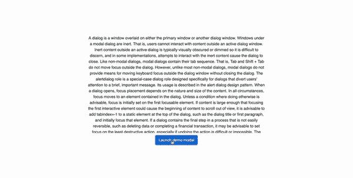
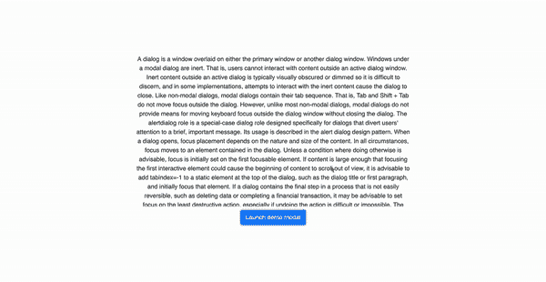
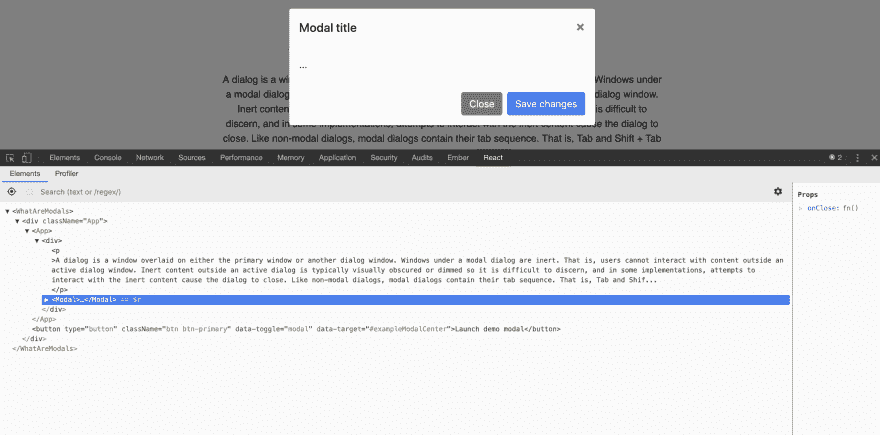

# 反应入口亮了🔥

> 原文：<https://dev.to/theaswathprabhu/portals-are-lit-31l8>

最近，有人向我介绍了 Reacts 的 createPortal API，这简直太棒了。

我来和它分享一下我的经历吧！

作为一名专业的 Ember 开发者，我对 React 的热爱从未消退。React 的面向组件的架构提高了生产率，确保了代码的稳定性，并得到了强大社区的支持。

我不想让你厌烦，你(可能是许多网络开发者)在**例行程序**中听到的这类事情。

我想，是时候用门户网站弄脏我们的手了🔥

**'门户提供了一种一流的方式来将子组件呈现到一个 DOM 节点中，该节点存在于父组件'**'的 DOM 层次结构之外

一般来说，世界上不是每个人都能一眼就理解官方文件中的定义！至少不是我！(开个玩笑，门户网站上的 Reacts 文档更适合初学者，[去看看](https://reactjs.org/docs/portals.html))

所以我决定采用一种实用的方法:

如定义中所述，门户提供了一种在 DOM 中的其他地方呈现 react 组件**的子组件的方式，而不是在同一个层次结构中！**

当我意识到这一点时，我除了问题什么都没有了。

OMG 事件冒泡怎么办？和许多...

作为一名专业的 ember 开发者，我使用过 [Ember 虫洞](https://github.com/yapplabs/ember-wormhole)，它是一个插件，可能在 Ember 中做类似的工作。

我继续深入研究传送门。我探索的一件事是它在[模态对话框](https://www.w3.org/TR/wai-aria-practices-1.1/#dialog_modal)中的用例。

我在 react 中用 bootstrap 构建了一个模态组件(覆盖了一些 bootstrap 样式),如下所示👇

```
//Modal.js
import React from "react";
import ReactDOM from "react-dom";
export default class Modal extends React.Component {
  onClose = e => {
    this.props.onClose && this.props.onClose(e);
  };
  render() {
    let modal = (<div
      class="modal fade"
      id="exampleModalCenter"
    >
      <div class="modal-dialog" role="document">
        <div class="modal-content">
          <div class="modal-header">
            <h5 class="modal-title" id="exampleModalLongTitle">
              Modal title
            </h5>
            <button
              type="button"
              class="close"
            >
              <span aria-hidden="true">&times;</span>
            </button>
          </div>
          <div class="modal-body">...</div>
          <div class="modal-footer">
            <button
              type="button"
              class="btn btn-secondary"
            >
              Close
            </button>
            <button type="button" class="btn btn-primary">
              Save changes
            </button>
          </div>
        </div>
      </div>
    </div>
    );
    return (modal);
  }
} 
```

我小时候在 App 上渲染过👇

```
//App.js 
import React from "react";
import Modal from "./Modal-Compo";

export default class App extends React.Component {
  onClose = e => {
    this.props.onClose && this.props.onClose(e);
  };

  render() {
    let alignCenter = {
      display: "flex",
      alignItems: "center",
      justifyCenter: "center",
      height: "200px",
      overflow: "hidden",
      width: "50%",
      margin: "auto",
      marginTop: "10%"
    };
    return (
    <div style={alignCenter}>
      <p style={{ height: "100%", margin: "0" }}>
        //some random 100 lines
      </p>
      <Modal onClose={this.onClose}/>
    </div>
  )
 }
} 
```

最后在根元素中呈现 App 组件👇

```
//Index.js
import React from "react";
import ReactDOM from "react-dom";
import "bootstrap/dist/css/bootstrap.min.css";
import "jquery/dist/jquery.min.js";
import "bootstrap/dist/js/bootstrap.min.js";
import App from "./components/App";
import "./styles.css";

function WhatAreModals() {
  return (
    <div style={{ height: "100vh" }} className="App">
      <App />
      <button
        type="button"
        className="btn btn-primary"
        data-toggle="modal"
        data-target="#exampleModalCenter"
      >
        Launch demo modal
      </button>
    </div>
  );
}

const rootElement = document.getElementById("root");
ReactDOM.render(<WhatAreModals />, rootElement); 
```

我的原型终于做好了😄

当我单击启动演示模式 CTA 时，出现了这种情况(oopsy)😕

[](https://res.cloudinary.com/practicaldev/image/fetch/s--ojg5cDd9--/c_limit%2Cf_auto%2Cfl_progressive%2Cq_66%2Cw_880/https://i.imgur.com/3PFoAgv.gif)

罪魁祸首是样式为 **'overflow:hidden'** 的应用程序组件，因为在我们的例子中，模态组件被呈现为溢出被隐藏的应用程序的子组件，我们的模态永远不会出现😩

这就是救生门户的用武之地🔥

我只是在我的模态组件和 index.html 中做了一个调整(为要呈现的模态创建了另一个根元素)

```
//index.html
<div id="root"></div> <div id="modal-root"></div> 
```

在门户中呈现模式，通过实现 **createPortal**
更改返回语句

```
//Modal.js
ReactDOM.createPortal(modal, document.getElementById("modal-root")); 
```

它无缝运行，

[](https://res.cloudinary.com/practicaldev/image/fetch/s--Ua4ckzet--/c_limit%2Cf_auto%2Cfl_progressive%2Cq_66%2Cw_880/https://i.imgur.com/UIzQ4zs.gif)

这个问题通过将模态组件从容器和层次结构中分离出来得到了解决。

但突然我陷入了困惑，因为等级制度被打破了，我怀疑事件冒泡是否会发生？(我想，很多人会质疑这一点！).

我继续**深入挖掘**😁

本机 DOM 快照:

[](https://res.cloudinary.com/practicaldev/image/fetch/s--GaFvBfFW--/c_limit%2Cf_auto%2Cfl_progressive%2Cq_auto%2Cw_880/https://i.imgur.com/8H0KGDq.png)

反应 DOM:

[](https://res.cloudinary.com/practicaldev/image/fetch/s--JQpo49QB--/c_limit%2Cf_auto%2Cfl_progressive%2Cq_auto%2Cw_880/https://i.imgur.com/UPk7x6D.png)

最后，我很满意看到这一点，可能很多人会😌从快照中，我们知道 Reacts 的虚拟 DOM 中的层次结构没有改变，所以事件冒泡很容易发生。

当父组件有一个**溢出:隐藏**或 **z 索引样式**时，门户可以被广泛使用，但是你需要子组件在视觉上“突破”它的容器。例如，对话框、悬停卡和工具提示。

我觉得这篇文章会让你对 Reacts 的 createPortal API 感到满意，如果是的话，也可以和你的同事分享。