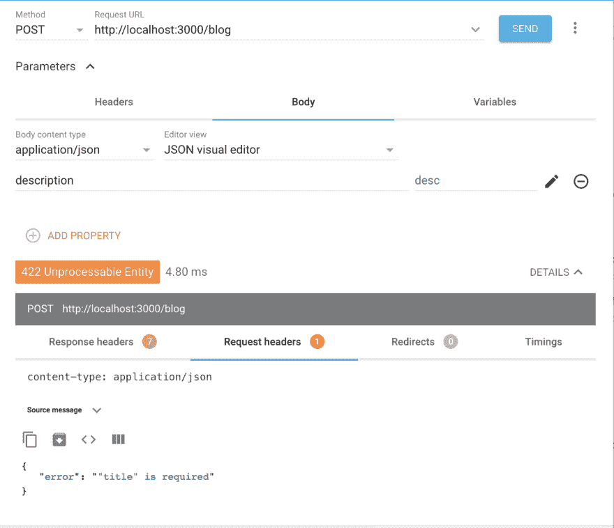
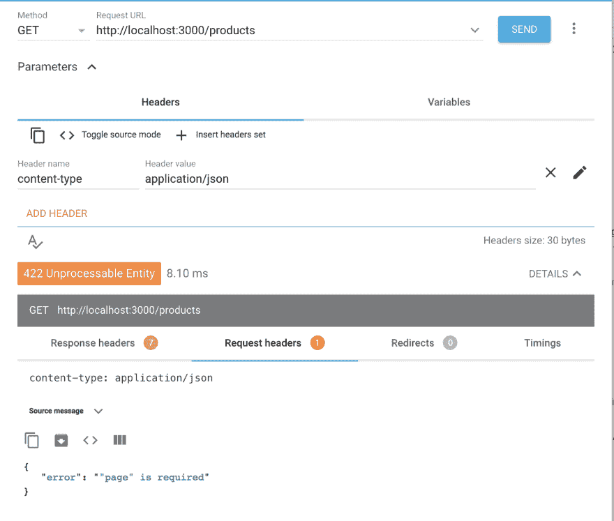
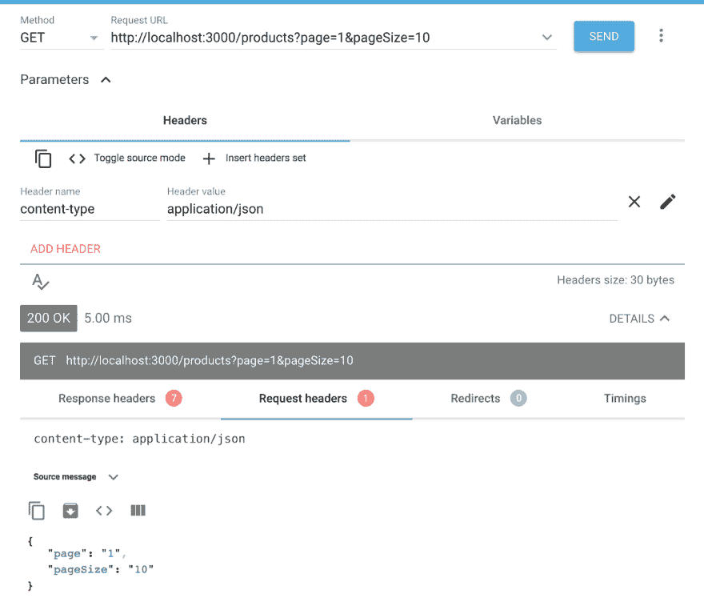
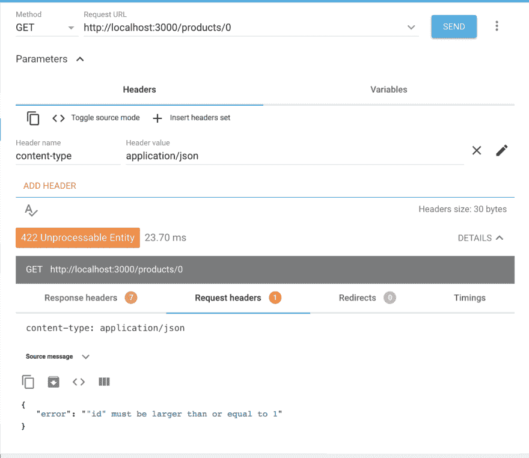

# Joi JS Joi—node . JS 和 Express 的出色代码验证

> 原文：<https://dev.to/itnext/joi-awesome-code-validation-for-node-js-and-express-35pk>

在 [Twitter](https://twitter.com/chris_noring) 上关注我，很乐意接受您对主题或改进的建议/Chris

> 数据验证是一个有趣的话题，我们倾向于编写看起来很可怕的代码，因为它包含了很多检查。在不同的情况下，我们需要执行这些检查，比如验证来自后端端点的响应，或者验证进入 REST API 的内容不会破坏我们的代码。我们将关注后者，如何验证我们的 API。

考虑下面的代码，当我们没有验证库的时候，我们可能需要写这些代码:

```
if (!data.parameterX) { 
  throw new Exception('parameterX missing') 
} 
try { 
  let value = parseInt(data.parameterX); 
} catch (err) { 
  throw new Exception('parameterX should be number'); 
} 
if(!/[a-z]/.test(data.parameterY)) { 
  throw new Exception('parameterY should be lower caps text') 
} 
```

Enter fullscreen mode Exit fullscreen mode

我想你会从上面的*代码中得到启发。我们倾向于对我们的参数进行大量测试，以确保它们是正确的和/或它们的值包含允许的值。*

作为开发人员，我们倾向于对这样的代码感到非常糟糕，所以我们要么开始为此编写一个库，要么求助于我们的老朋友 NPM，希望其他一些开发人员已经感受到了这种痛苦，并有太多的时间来做一个你可以使用的库。

有很多库可以帮你做到这一点。我的目的是描述一个叫 Joi 的特殊例子。

> [https://github.com/hapijs/joi](https://github.com/hapijs/joi)

在本文中，我们将一起经历以下旅程:

*   看一看 Joi 的特征
*   **参见**我们如何在请求管道的后端使用 Joi
*   通过在 Node.js 中为 Express 构建一个中间件来进一步改进 T1

## 介绍 Joi

安装 Joi 相当容易。我们只需要输入:

```
npm install joi 
```

Enter fullscreen mode Exit fullscreen mode

之后，我们就可以使用它了。让我们快速地看一下我们如何使用它。我们做的第一件事是导入它，然后我们设置一些规则，就像这样:

```
const Joi = require('joi'); 
const schema = Joi.object().keys({ 
  name: Joi.string().alphanum().min(3).max(30).required(),
  birthyear: Joi.number().integer().min(1970).max(2013), 
}); 
const dataToValidate = { 
  name 'chris', 
  birthyear: 1971 
} 
const result = Joi.validate(dataToValidate, schema); 
// result.error == null means valid 
```

Enter fullscreen mode Exit fullscreen mode

我们在上面看到的是我们在做以下事情:

*   **构造**一个 schema，我们对 Joi.object()的调用，
*   **验证**我们的数据，用`dataToValidate`和模式作为输入参数调用`Joi.validate()`

好了，现在我们理解了基本的动作。我们还能做什么？

Joi 支持所有类型的原语和正则表达式，并且可以嵌套到任何深度。让我们列出它支持的一些不同的构造:

*   **字符串**，这表示它需要是字符串类型，我们像这样使用它`Joi.string()`
*   **number** ，Joi.number()，还支持 min()和 max()等辅助操作，如 so `Joi.number().min(1).max(10)`
*   **required** ，我们可以借助 required 的方法来说一个属性是否是必需的，就像这样`Joi.string().required()`
*   **任何**，这意味着它可以是任何类型，通常，我们倾向于使用它的助手 allow()来指定它可以包含什么，就像这样，`Joi.any().allow('a')`
*   **可选**，严格来说这不是一个类型但有一个有趣的效果。如果指定例如 prop : `Joi.string().optional`。如果我们不提供道具，每个人都会很开心。但是，如果我们确实提供了它并使它成为一个整数，验证将会失败
*   **数组**，我们可以检查该属性是否是一个字符串数组，然后它会看起来像这样`Joi.array().items(Joi.string().valid('a', 'b')`
*   **regex** ，支持与 regex 的模式匹配，同样如此`Joi.string().regex(/^[a-zA-Z0-9]{3,30}$/)`

Joi 的整个 API 是巨大的。我建议看看是否有一个助手函数可以解决我上面没有展示的任何情况

Joi API

> [https://github.com/hapijs/joi/blob/v14.3.1/API.md](https://github.com/hapijs/joi/blob/v14.3.1/API.md)

## 嵌套类型

到目前为止，我们只展示了如何声明一个一级模式。我们这样做是通过调用以下代码:

```
Joi.object().keys({ }); 
```

Enter fullscreen mode Exit fullscreen mode

这表明我们的数据是一个对象。然后我们给我们的对象添加了一些属性，比如:

```
Joi.object().keys({ 
  name: Joi.string().alphanum().min(3).max(30).required(),
  birthyear: Joi.number().integer().min(1970).max(2013) 
}); 
```

Enter fullscreen mode Exit fullscreen mode

现在，嵌套结构实际上是相同的。让我们创建一个全新的模式，一个博客文章的模式，如下所示:

```
const blogPostSchema = Joi.object().keys({ 
  title: Joi.string().alphanum().min(3).max(30).required(),
  description: Joi.string(), 
  comments: Joi.array().items(Joi.object.keys({ 
    description: Joi.string(), 
    author: Joi.string().required(), 
    grade: Joi.number().min(1).max(5) 
  })) 
}); 
```

Enter fullscreen mode Exit fullscreen mode

请特别注意`comments`属性，它看起来与我们第一次进行的外部调用完全相同。筑巢就是这么简单。

## Node.js Express 和 Joi

像这样的库很棒，但是如果我们能以更无缝的方式使用它们，比如在请求管道中，不是更好吗？让我们先来看看在 Node.js:
中，我们将如何在 Express 应用程序中使用 Joi

```
const Joi = require('joi'); 
app.post('/blog', async (req, res, next) => { 
  const { body } = req; const 
  blogSchema = Joi.object().keys({ 
    title: Joi.string().required 
    description: Joi.string().required(), 
    authorId: Joi.number().required() 
  }); 
  const result = Joi.validate(body, blogShema); 
  const { value, error } = result; 
  const valid = error == null; 
  if (!valid) { 
    res.status(422).json({ 
      message: 'Invalid request', 
      data: body 
    }) 
  } else { 
    const createdPost = await api.createPost(data); 
    res.json({ message: 'Resource created', data: createdPost }) 
  } 
}); 
```

Enter fullscreen mode Exit fullscreen mode

以上作品。但是对于每条路线，我们必须:

1.  创建模式
2.  呼叫`validate()`

因为找不到更好的词，它缺乏优雅。我们想要看起来光滑的东西。

## 构建中间件

让我们看看我们是否能把它重建成一个中间件。Express 中的中间件只是我们在需要时可以放入请求管道的东西。在我们的例子中，我们希望尝试并验证我们的请求，并在早期确定是否值得继续或中止它。

所以我们来看一个中间件。只是一个函数对不对:

```
const handler = (req, res, next) = { // handle our request } 
const middleware = (req, res, next) => { // to be defined } 
app.post( '/blog', middleware, handler ) 
```

Enter fullscreen mode Exit fullscreen mode

如果我们能为我们的中间件提供一个模式，那就太好了，这样我们在中间件功能中所要做的就是这样:

```
(req, res, next) => { 
  const result = Joi.validate(schema, data) 
} 
```

Enter fullscreen mode Exit fullscreen mode

我们可以为所有模式创建一个具有工厂函数和模块的模块。先来看看我们工厂的功能模块:

```
const Joi = require('joi'); 
const middleware = (schema, property) => { 
  return (req, res, next) => { 
  const { error } = Joi.validate(req.body, schema); 
  const valid = error == null; 

  if (valid) { 
    next(); 
  } else { 
    const { details } = error; 
    const message = details.map(i => i.message).join(',');

    console.log("error", message); 
   res.status(422).json({ error: message }) } 
  } 
} 
module.exports = middleware; 
```

Enter fullscreen mode Exit fullscreen mode

此后，让我们为所有的模式创建一个模块，如下所示:

```
// schemas.js 
const Joi = require('joi') 
const schemas = { 
  blogPOST: Joi.object().keys({ 
    title: Joi.string().required 
    description: Joi.string().required() 
  }) 
  // define all the other schemas below 
}; 
module.exports = schemas; 
```

Enter fullscreen mode Exit fullscreen mode

好了，让我们回到我们的申请文件:

```
// app.js 
const express = require('express') 
const cors = require('cors'); 
const app = express() 
const port = 3000 
const schemas = require('./schemas'); 
const middleware = require('./middleware'); 
var bodyParser = require("body-parser"); 

app.use(cors()); 
app.use(bodyParser.json()); 
app.get('/', (req, res) => res.send('Hello World!')) 
app.post('/blog', middleware(schemas.blogPOST) , (req, res) => { 
  console.log('/update'); 
  res.json(req.body); 
}); 
 app.listen(port, () => console.log(`Example app listening on port ${port}!`)) 
```

Enter fullscreen mode Exit fullscreen mode

### 试探一下

有很多方法可以验证这一点。我们可以从浏览器控制台进行`fetch()`调用，或者使用 cURL 等等。我们选择使用名为`Advanced REST Client`的 chrome 插件。

让我们尝试向`/blog`发出 POST 请求。还记得我们关于这条路线的模式说标题和描述是强制性的，所以让我们试着打破它，让我们省略标题，看看会发生什么:

[](https://res.cloudinary.com/practicaldev/image/fetch/s--jRdMTtez--/c_limit%2Cf_auto%2Cfl_progressive%2Cq_auto%2Cw_880/https://miro.medium.com/max/1400/0%2Ai_8sHdkomgNkifcI.png)

啊哈，我们得到了一个`422`状态代码，消息标题是必需的，所以 Joi 做了它应该做的事情。为了安全起见，让我们重新添加标题:

[](https://res.cloudinary.com/practicaldev/image/fetch/s--Yy4BTl7Z--/c_limit%2Cf_auto%2Cfl_progressive%2Cq_auto%2Cw_880/https://miro.medium.com/max/1400/0%2ArACkcVkFdN-v6HBp.png)

好了，快乐的日子，又起作用了。

### 支持路由器和查询参数

好的，很好，我们可以处理 POST 请求中的正文，那么路由器参数和查询参数呢？我们希望用它们来验证什么:

*   **查询参数**，这里有意义的是检查例如像 page 和 pageSize 这样的参数是否存在并且是 number 类型。想象一下，我们做了一个疯狂的请求，而我们的数据库包含了几百万个产品，AOUCH:)
*   **路由器参数**，如果我们应该得到一个数字(例如，我们可以发送 GUIDs ),那么首先检查我们是否得到了一个数字是有意义的，并且可能检查我们是否发送了明显错误的东西，例如 0 之类的

### 添加查询参数支持

好的，我们知道 Express 中的查询参数，它们位于`request.query`下。所以这里我们能做的最简单的事情就是确保我们的`middleware.js`接受另一个参数，就像这样:

```
const middleware = (schema, property) => { } 
```

Enter fullscreen mode Exit fullscreen mode

因此，`middleware.js`的完整代码应该是这样的:

```
const Joi = require('joi'); 
const middleware = (schema, property) => { 
  return (req, res, next) => { 
    const { error } = Joi.validate(req[property], schema); 
    const valid = error == null; 
    if (valid) { next(); } 
    else { 
      const { details } = error; 
      const message = details.map(i => i.message).join(',')
      console.log("error", message); 
      res.status(422).json({ error: message }) 
    } 
  } 
} 
module.exports = middleware; 
```

Enter fullscreen mode Exit fullscreen mode

这意味着我们必须查看一下`app.js`并改变我们调用`middleware()`函数的方式。首先，我们的 POST 请求应该是这样的:

```
app.post(
  '/blog', 
  middleware(schemas.blogPOST, 'body') , 
  (req, res) => { 
  console.log('/update'); 
  res.json(req.body); 
}); 
```

Enter fullscreen mode Exit fullscreen mode

正如你所看到的，我们给我们的`middleware()`调用添加了另一个参数体。

现在让我们添加请求我们感兴趣的查询参数:

```
app.get(
  '/products', 
  middleware(schemas.blogLIST, 'query'), 
  (req, res) => { console.log('/products'); 
    const { page, pageSize } = req.query; 
    res.json(req.query); 
}); 
```

Enter fullscreen mode Exit fullscreen mode

正如你所看到的，我们要做的就是添加参数查询。最后，让我们看看我们的`schemas.js` :

```
// schemas.js 
const Joi = require('joi'); 
const schemas = { 
  blogPOST: Joi.object().keys({ 
    title: Joi.string().required(), 
    description: Joi.string().required(), 
    year: Joi.number() }), 
  blogLIST: { 
    page: Joi.number().required(), 
    pageSize: Joi.number().required() 
  } 
}; 
module.exports = schemas; 
```

Enter fullscreen mode Exit fullscreen mode

正如你在上面看到的，我们已经添加了`blogLIST`条目。

**测试完毕**

让我们回到高级 REST 客户端，看看如果我们尝试导航到`/products`而不添加查询参数会发生什么:

[](https://res.cloudinary.com/practicaldev/image/fetch/s--b7GwEwLT--/c_limit%2Cf_auto%2Cfl_progressive%2Cq_auto%2Cw_880/https://miro.medium.com/max/1400/0%2ARORElXdZ4WnkAEpD.png)

如你所见，Joi 介入并告诉我们`page`不见了。
让我们确保`page`和`pageSize`被添加到我们的网址，然后再试一次:

[](https://res.cloudinary.com/practicaldev/image/fetch/s--bea4NQcy--/c_limit%2Cf_auto%2Cfl_progressive%2Cq_auto%2Cw_880/https://miro.medium.com/max/1400/0%2AFB_CCIR3bg4pSxrT.png)

好了，大家又开心了。:)

### 添加路由器参数支持

就像查询参数一样，我们只需要指出我们在哪里找到我们的参数，用 Express 表示那些驻留在`req.params`下的参数。感谢我们已经用`middleware.js`完成的工作，我们只需要用我们的新路线条目更新我们的`app.js`，就像这样:

```
// app.js 
app.get(
  '/products/:id', 
  middleware(schemas.blogDETAIL, 'params'), 
  (req, res) =>  { 
    console.log("/products/:id"); 
    const { id } = req.params; 
    res.json(req.params); 
  }
) 
```

Enter fullscreen mode Exit fullscreen mode

此时，我们需要进入`schemas.js`并添加`blogDetail`条目，因此`schemas.js`现在应该看起来如下:

```
// schemas.js

const Joi = require('joi');

const schemas = { 
  blogPOST: Joi.object().keys({ 
    title: Joi.string().required(), 
    description: Joi.string().required(), 
    year: Joi.number() }), 
  blogLIST: { 
    page: Joi.number().required(), 
    pageSize: Joi.number().required() 
  }, 
  blogDETAIL: { 
   id: Joi.number().min(1).required() 
  } 
}; 
module.exports = schemas; 
```

Enter fullscreen mode Exit fullscreen mode

**尝试一下**

最后一步是尝试，所以让我们先测试导航到`/products/abc`。这应该会抛出一个错误，我们只接受大于 0 的数字:

[](https://res.cloudinary.com/practicaldev/image/fetch/s--Jjsez1Bg--/c_limit%2Cf_auto%2Cfl_progressive%2Cq_auto%2Cw_880/https://miro.medium.com/max/1400/0%2AXoibhNswi6kZjG7M.png)

好了，现在对于说明`/products/0`的 URL，我们的另一个要求是:

[](https://res.cloudinary.com/practicaldev/image/fetch/s--d48sf4lw--/c_limit%2Cf_auto%2Cfl_progressive%2Cq_auto%2Cw_880/https://miro.medium.com/max/1400/0%2ArFJVPbmkTks7IfPP.png)

同样，不出所料，这也失败了。

## 总结

我们已经介绍了验证库 Joi，并展示了一些基本特性以及如何使用它。最后，我们看了如何为 Express 创建一个中间件，并以一种智能的方式使用 Joi。

总而言之，我希望这是有教育意义的。

### 进一步阅读

*   Joi，正式文件[正式文件](https://github.com/hapijs/joi)
*   关于 Joi 验证的详尽博文，如果你需要更复杂的例子，看看这篇[博文](https://scotch.io/tutorials/node-api-schema-validation-with-joi)
*   [演示库](https://github.com/softchris/joi-example)