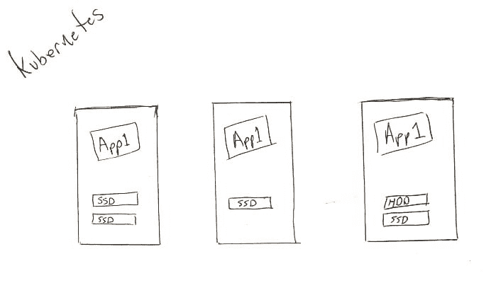
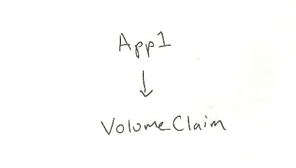
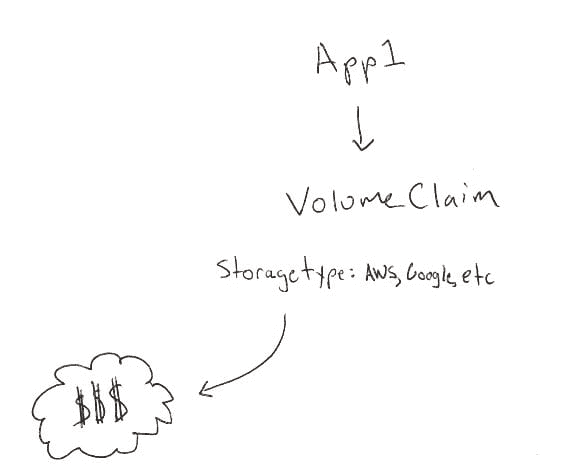
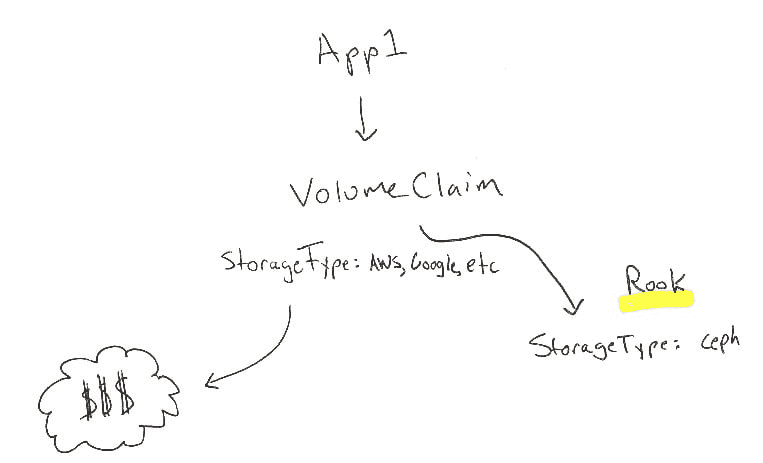
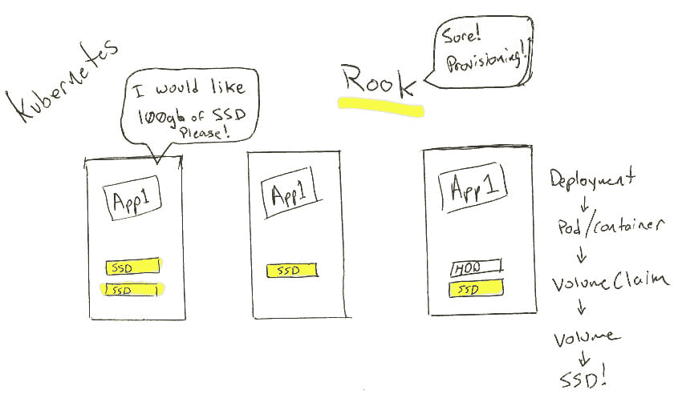

# 存储在库服务器上

> 原文：<https://dev.to/erulabs/storage-on-kubernetes-22ik>

Kubernetes 对于无状态应用程序来说非常棒。部署您的应用程序，将其扩展到数百个实例，您会很高兴。但是如何管理**存储**？我们如何确保数百个应用程序中的每一个都能获得可靠、快速、廉价的存储？

让我们以一个典型的 Kubernetes 集群为例，几个节点(Linux 服务器)为我们应用的几个副本提供动力:

[](https://res.cloudinary.com/practicaldev/image/fetch/s--BHB9E5l1--/c_limit%2Cf_auto%2Cfl_progressive%2Cq_auto%2Cw_880/https://kubesail.com/blog-images/blog-storage-rook-2.jpg)

注意我们可悲的，未使用的磁盘驱动器！Kubernetes 确实带来了很多成功，但是如果我们不管理庞大的 RAID 阵列，我们还能成为系统管理员吗？

### 持久卷索赔

在 Kubernetes 中，我们定义 **PersistentVolumeClaims** 向我们的系统请求存储。简而言之，一个应用程序“要求”一点存储，系统以一种可配置的方式做出响应:

[](https://res.cloudinary.com/practicaldev/image/fetch/s--eDZVdF9Y--/c_limit%2Cf_auto%2Cfl_progressive%2Cq_auto%2Cw_880/https://kubesail.com/blog-images/blog-storage-0.jpg)

不幸的是，大多数云提供商急于利用 Kubernetes 的简单性，通过附加云存储来“回复”您的存储请求(例如:亚马逊的 EBS)。

[](https://res.cloudinary.com/practicaldev/image/fetch/s--Z3jiqkom--/c_limit%2Cf_auto%2Cfl_progressive%2Cq_auto%2Cw_880/https://kubesail.com/blog-images/blog-storage-1.jpg)

对于消费者来说，这种策略有许多不利之处:

*   **性能&成本** : EBS Volumes(以及其他云提供商的同等产品)的性能取决于其大小——这意味着一个*更小的磁盘*与一个*更慢的磁盘*是一回事。
*   **特征**:云提供商通常提供硬盘、SDD 和“调配 IO”选项。这限制了系统管理员的存储系统设计——磁带备份在哪里？NVMe 怎么样？磁盘是如何连接到运行我的代码的服务器上的？
*   **便携性/锁定性** : EBS 就是 EBS，Google 持久盘就是 Google 持久盘。云供应商正在积极地试图将你锁定在他们的平台上——并且通常将我们所知道和喜爱的文件系统工具隐藏在特定于云的快照系统后面。

因此...那么我们需要的是一个**开源**存储编排系统，它可以在任何 Kubernetes 集群上运行，并且可以将成堆的驱动器转换为存储池，供我们的 pod 使用:

[](https://res.cloudinary.com/practicaldev/image/fetch/s---IpGlJEH--/c_limit%2Cf_auto%2Cfl_progressive%2Cq_auto%2Cw_880/https://kubesail.com/blog-images/blog-storage-2.jpg)

### 输入 Rook.io

什么是**车**？从网站上看，Rook 是“Kubernetes 的开源云原生存储”，具有“生产就绪文件、数据块和对象存储”。抛开营销不谈，Rook 是 AWS EBS 和 S3 的开源版本，您可以将其安装在自己的集群上。它也是 [KubeSail](https://kubesail.com) 的存储系统的后端，它是我们如何划分大规模 RAID 阵列来支持我们的用户应用程序的！

### Rook 和 Ceph

Rook 是一个位于集群中的系统，它响应存储请求，但它本身不是一个存储系统。虽然这让事情变得有点复杂，但它应该会让你感觉**良好**，因为虽然 Rook 相当新，但它使用的存储系统是久经沙场的，并且*远非 beta* 。

我们将使用 [**Ceph**](https://ceph.com/) ，这是[大约 15 年前的](https://en.wikipedia.org/wiki/Ceph_(software)#History)，由 Canonical、CERN、Cisco、Fujitsu、Intel、Red Hat 和 SanDisk 等公司使用和开发。它离 Kubernetes-hipster 非常远，尽管 Rook 项目看起来有多酷！

随着 **Rook** 的 1.0 版本，以及 **Ceph** 为世界上一些最重要的数据集提供动力，我想说是时候让我们变得自信并重新掌控我们的数据存储了！我将在 2020 年建立 RAID 阵列，没人能阻止我！*穆哈哈*

### 安装

我不会在这里关注初始安装，因为[车指南非常好](https://rook.io/docs/rook/v1.0/ceph-quickstart.html)。如果你想了解更多关于 Rook 项目的信息，我也向[推荐这个 KubeCon 视频](https://www.youtube.com/watch?v=pwVsFHy2EdE)。一旦你安装了 Rook，我们将创建一些组件:

*   一个 **CephCluster** ，它将节点及其磁盘映射到我们新的存储系统。
*   一个 **CephBlockPool** ，它定义了如何存储数据，包括我们想要多少副本。
*   一个 **StorageClass** ，它定义了一种使用 CephBlockPool 中的存储的方式。

让我们从**星团** :
开始

```
#?filename=ceph-cluster.yaml&mini=true&noApply=true
---
apiVersion: ceph.rook.io/v1
kind: CephCluster
metadata:
  name: rook-ceph
  namespace: rook-ceph
spec:
  mon:
    count: 3
    allowMultiplePerNode: false
  storage:
    useAllNodes: false
    useAllDevices: true
    location:
    config:
      osdsPerDevice: "1"
    directories:
      - path: /opt/rook
    nodes:
    - name: "my-storage-node-1"
    - name: "my-storage-node-2"
    - name: "my-storage-node-3" 
```

这里需要注意的最重要的事情是，**集群**基本上是一个映射，映射出哪些**节点**以及这些节点上的哪些驱动器或目录将用于存储数据。很多教程都会建议`useAllNodes: true`，我们强烈建议反对。相反，我们建议管理一个更小的“存储工作者”子集池——这允许您以后使用不同的系统类型(比如，非常慢的驱动器)，而不会意外地/不知不觉地将其添加到存储池中。我们假设`/opt/rook`是一个挂载点，但是 Rook 能够使用未格式化的磁盘和目录。

另一个需要注意的是，a `mon`是 Rook 的监控系统。我们强烈建议至少运行三个并确保`allowMultiplePerNode`为假。

现在我们的集群看起来像这样:

[](https://res.cloudinary.com/practicaldev/image/fetch/s--cFZasyoi--/c_limit%2Cf_auto%2Cfl_progressive%2Cq_auto%2Cw_880/https://kubesail.com/blog-images/blog-storage-rook-3.jpg)

顺便说一下，您可能想看看在`rook-ceph`名称空间中运行的 pod！您会发现您的 OSD(对象存储设备)单元，以及位于该名称空间中的监控和代理单元。让我们创建我们的 **CephBlockPool** 和一个使用它的**存储类**:

```
#?filename=ceph-blockpool.yaml&mini=true&noApply=true
---
apiVersion: ceph.rook.io/v1
kind: CephBlockPool
metadata:
  name: my-storage-pool
  namespace: rook-ceph
spec:
  failureDomain: osd
  replicated:
    size: 2
---
apiVersion: storage.k8s.io/v1
kind: StorageClass
metadata:
  name: my-storage
provisioner: rook.io/block
parameters:
  pool: my-storage-pool 
```

请注意，复制大小设置为 2，这意味着我们将拥有所有数据的 2 个副本。

我们将等待我们的 CephCluster 稳定下来——您可能想看看您创建的`CephCluster`对象:

```
➜ kubectl -n rook-ceph get cephcluster rook-ceph -o json | jq .status.ceph.health
"HEALTH_OK" 
```

现在，我们准备好请求存储了！

[](https://res.cloudinary.com/practicaldev/image/fetch/s--qI-sn-UW--/c_limit%2Cf_auto%2Cfl_progressive%2Cq_auto%2Cw_880/https://kubesail.com/blog-images/blog-storage-rook-4.jpg)

现在，我们可以用多种标准方式请求存储，从这一点来说，没有“特定于车”的代码或假设:

```
#?filename=ceph-pvc.yaml&mini=true&noApply=true
---
apiVersion: v1
kind: PersistentVolumeClaim
metadata:
  name: test-data
spec:
  accessModes:
    - ReadWriteOnce
  # Use our new ceph storage:
  storageClassName: my-storage
  resources:
    requests:
      storage: 1000Mi 
```

现在，Rook 将看到我们的**持续卷声明**，并为我们创建一个**持续卷**！我们来看看:

```
➜ kubectl get pv --watch
NAME     CAPACITY  ACCESS MODES  RECLAIM POLICY  STATUS  CLAIM              STORAGECLASS    AGE
pvc-...  1000Mi    RWO           Delete          Bound   default/test-data  my-storage      13m 
```

所以我们走吧！成功的，相当容易使用，Kubernetes-原生存储系统。我们可以自带磁盘，可以使用任何云提供商...自由！

[](https://res.cloudinary.com/practicaldev/image/fetch/s--TriitUNS--/c_limit%2Cf_auto%2Cfl_progressive%2Cq_auto%2Cw_880/https://kubesail.com/blog-images/blog-storage-rook-6.jpg)

### 结论:该不该用？

TLDR:是的。

但你真正应该问的问题是，我是不是在努力建造自 2005 年以来世界上最棒的壁橱数据中心？我是否在尝试学习企业级 DevOps 技能？如果答案是肯定的，我强烈推荐用 Rook 玩。

在 KubeSail，我们在内部使用 Rook，并提供一个`standard`存储类，它提供极快的 NVMe 存储-甚至在我们的*免费*层上！我们用极其庞大和繁忙的 Ceph 集群管理多个集群，到目前为止，在稳定性和性能方面都非常令人满意。虽然玩成堆的硬盘确实让我怀念过去的美好时光，但我们的平台允许你开箱即用，为你的应用程序设置一个坚如磐石的设置。

我们强烈倾向于避免供应商锁定的开源工具。您应该能够在您自己的集群上安装和配置我们在 KubeSail 的所有工具，我们将在一系列博客文章中继续介绍我们的堆栈。然而，如果你想要的只是连接到多台服务器上 Docker 容器的超级快速、超级便宜的存储，请查看我们在[KubeSail.com](https://kubesail.com)的托管平台！

如果你对这篇文章、Rook、Kubernetes 或者其他任何东西有任何问题，请在 Twitter 上给我们发消息！