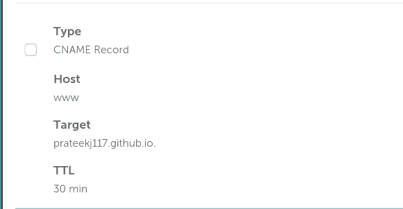

# 使用 Jekyll 和 Github Developer Pack 制作自己的作品集

> 原文：<https://dev.to/prateekj117/make-your-own-portfolio-using-jekyll-and-github-developer-pack-460f>

在这篇博客中，我们将使用 Github developer pack 和 Jekyll 创建一个组合。
那么，我们先来说说什么是 Github 开发者包，什么是 jekyll。

> ***注:*** 凡是使用花括号`{}`的地方，里面都有一个变量，实际值对应于变量名。

### 什么是 Github 开发者包？

[](https://res.cloudinary.com/practicaldev/image/fetch/s--3Bo8c8DW--/c_limit%2Cf_auto%2Cfl_progressive%2Cq_auto%2Cw_880/https://thepracticaldev.s3.amazonaws.com/i/icrnxnzlpjvqvhxa45qn.png)

是 Github 教育 旗下的一个项目，Github 为学生提供免费的工具和服务。
要申请 [Github Developer Pack](https://education.github.com/pack) ，你所要做的就是提交一份证明，证明你在申请这个项目的时候
是一名学生。并回答一个小问题:“**你打算如何使用 Github？**”。填写详细信息后，当您的申请被批准后，您将在五天内收到
a 邮件。

##### Github 开发者包中的一些重要内容:

*   AWS 教育的免费学分
*   Bootstrap Studio 的免费许可证
*   在 DigitalOcean 中，新用户可以获得 50 美元的平台积分(如果你打算学习 SSH 或 sys-admin 的话)
*   Github 上无限的私有存储库
*   免费订阅所有 Jetbrains IDEs(我因此生存下来。)
*   Microsoft Azure 提供 100 美元免费信用点数
*   带 SSL 证书的免费`.me`域名
*   Travis 针对私有构建的 CI

这样的例子不胜枚举。现在我们来谈谈哲基尔。

### 什么是哲基尔？

[](https://res.cloudinary.com/practicaldev/image/fetch/s--7lMFDuAQ--/c_limit%2Cf_auto%2Cfl_progressive%2Cq_auto%2Cw_880/https://thepracticaldev.s3.amazonaws.com/i/rt4naxdh80myyl6fi9bx.jpg)

Jekyll 是一个简单的、博客感知的、静态的个人、项目或组织网站生成器。
简单来说，你不需要编写 HTML、CSS 或 JS 来构建你的静态网站，只需要简单的 Markdown。你所需要做的就是遵循 [**文档**](https://jekyllrb.com/docs) 中给出的一些基本说明。但是不要现在就开始，我们会一步一步地经历所有的事情。我会努力让这个博客自给自足。

现在让我们列出制作作品集的步骤，然后一个接一个地检查这些步骤。

**制作网站的步骤:**

1.  选择一个主题
2.  派生主题，然后克隆它并在本地运行
3.  让它个人化并主持它
4.  获得一个`.me`域
5.  添加 CNAME
6.  进一步的改进

#### 1。选择一个主题:

对于那些挑剔的人来说，这将是最长的一步。我自己花了几天时间寻找主题，最终选定了这个主题。
[这里的](https://jekyllthemes.io/free)是哲基尔的免费主题列表。你也可以在 [Github](https://github.com/search?q=jekyll+themes) 上找到一些额外的。
还有一些[这里](https://github.com/search?q=portfolio+theme)。这些都是我报废的资源。万事如意。愿你找到你的主题。

#### 2。克隆主题并在本地运行

选择一个主题后，在 Github 上分叉，然后克隆它，让遥控器`origin`指向你的 Github 配置文件上的目录。
大多数 jekyll 主题的存储库都包含了在本地运行 jekyll 主题的文档。如果他们没有，你可以遵循以下步骤:
`cd`进入你的博客目录并运行以下命令:

```
foo@bar:~$  gem install jekyll bundler
foo@bar:~$  gem install github-pages
foo@bar:~$  bundle install
foo@bar:~$  bundle exec jekyll serve 
```

现在在你的浏览器中进入: [http://localhost:4000](http://localhost:4000) 然后 bam！！！这是你的网站的样子。

#### 3。让它个人化并主持它

现在，转到`_config.yml`并相应地填写字段。不要忘记将名为`baseurl`的字段编辑为`""`。它在
中用于传递你的 css 和图片。我遇到了一个错误，我的托管网站没有加载它的 css 和图像，而本地一切都很好。原来`baseurl`是罪魁祸首。

现在，使用
来推动这些变化

```
foo@bar:~$  git push origin master 
```

现在转到你的 Repo 的 settings 选项卡，将你的 Github Jekyll 主题 Repo 重命名为`{your_username}.github.io`，你会看到 Github 会将
你的网站托管到 Url `{your_username}.github.io`。

#### 4。获得一个`.me`域

转到 Github 开发者包页面，从那里打开 Namecheap，使用 Github 激活你的 Namecheap 账户，选择你选择的`.me`域
。选择域名后，免费购买(感谢 Github 开发者包)。

#### 5 个。给我 NAME

在您的域名仪表板上，然后进入`Advanced DNS`
并添加一个 CNAME 记录。大概是这样的:

[](https://res.cloudinary.com/practicaldev/image/fetch/s--AlRCKBHy--/c_limit%2Cf_auto%2Cfl_progressive%2Cq_auto%2Cw_880/https://thepracticaldev.s3.amazonaws.com/i/srwmcabtkl32sc22nkz2.png)

在 Target 中，用`{your_username}.github.io`代替`prateekj117.github.io`。
之后，在你的主题项目的根目录下，做一个名为`CNAME`的文件，在里面输入值`{your_domain_name}.me`。
提交更改，并使用
再次提交

```
foo@bar:~$  git push origin master 
```

之后，您的网站将在`{your_domain_name}.me`托管。恭喜你！！！

#### 6。进一步的改进

完成以上所有步骤后，现在你可以使用 [Disqus](https://disqus.com/) 添加额外的评论功能，如果还没有集成到你的主题中的话。
和下面的订阅按钮功能，它将使用 [Mailchimp](https://mailchimp.com/) 向您的博客订阅的电子邮件发送更新。
对于 Mailchimp 功能，您需要为您的博客添加一个 RSS 提要，您可以使用 [jekyll-feed](https://github.com/jekyll/jekyll-feed) 来添加。
您还应该将`gem 'jekyll-compose', group: [:jekyll_plugins]`添加到您的 Gemfile 并运行:

```
foo@bar:~$  bundle install 
```

[jekyll-compose](https://github.com/jekyll/jekyll-compose) 的用途是可以使用
命令直接添加博文

```
foo@bar:~$  bundle exec jekyll post "My New Post" 
```

举个例子，你也可以在这里看到这个网站的代码[。](https://github.com/prateekj117/prateekj117.github.io)

就目前而言，仅此而已。如果您遇到任何错误或遇到困难，请务必发表评论。订阅[博客](https://geekyboy.me)。接下来我将会发布一个关于
**如何为开源**做贡献的指南。

### 快乐编码！！！