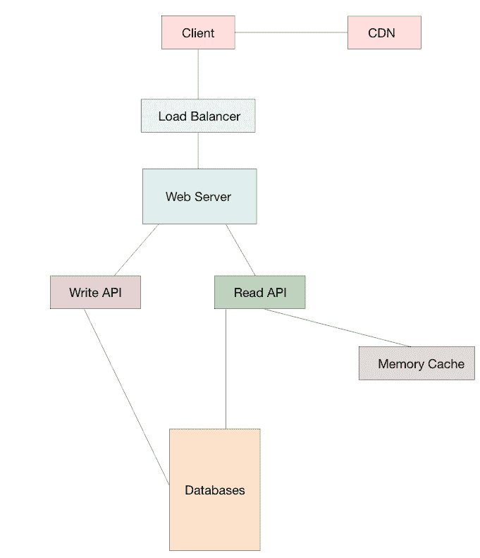
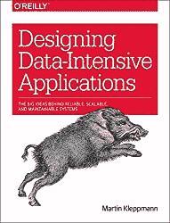

# 新工程师的系统设计面试入门

> 原文：<https://dev.to/jacobjzhang/a-systems-design-interview-primer-for-new-engineers-hde>

这个故事最初发表在 https://algodaily.com 的[网站上，我在那里为初学者开设了一门可视化技术面试课程，并为雄心勃勃的开发人员撰写思考文章。](https://algodaily.com/lessons/a-systems-design-primer-for-new-engineers)

当我第一次接触编程时，提升的最大障碍之一是我缺乏对软件系统及其工作原理的理解。在积压的工作中，总有一些有趣的、庞大的、棘手的任务需要我去处理——但是我没有足够的知识去思考我的项目部分如何能够或者应该与其他部分集成。

原来这是一个很常见的经历。大型软件公司[问新大学毕业生大多是算法问题](https://algodaily.com)的很大一部分原因是因为给不了他们系统设计问题！

本文旨在成为关注系统设计面试准备的初级读本，但也可用于作为一名工作开发人员更好地掌握系统设计(一项必需的技能)。

## 什么是软件中的系统设计？

当我谈到“系统设计”时，我指的是我们作为工程师对复杂应用程序的元素做出决策的过程。这些系统元素——比如数据模型和结构、整体架构、模块和组件以及这些组件的不同接口——必须仔细考虑，以确保速度、可靠性和稳定性。

当一个人开始他们的开发生涯时，很容易忽略这些高水平的技术决策。毕竟，你已经试图在你的头脑中掌握语法、模块、[和可能的面向对象编程的基础知识](https://www.amazon.com/gp/product/B000SEIBB8/ref=as_li_qf_asin_il_tl?ie=UTF8&tag=algodaily03-20&creative=9325&linkCode=as2&creativeASIN=B000SEIBB8&linkId=c2748560631d600dbb3f94be2d2bfabf)——更不用说必须学习如何审查他人编写的代码，如何为他人构建良好的代码，使用源代码控制等等。

不过，在你从事软件工程的第三到第五年，你会学到足够多的解决“小代码”问题的方法，为思考更大的图景提供基础。这也是您对系统的不同部分(应用程序、数据库、消息队列等)有足够经验的时候。)并对它们的利弊有足够的了解，开始做出好的取舍。

这些权衡在商业和企业软件中尤其重要(理解为:大多数工作)，它们对可靠性和良好的服务有一个(通常是合同上的)期望。企业不会乐意为经常停机或脆弱的服务付费。

此外，糟糕的系统设计会让软件团队中的其他人感到沮丧——设计得不好的系统会有难以追踪的错误，难以维护的代码库，以及增加新功能和特性的工作量。这也使得新工程师的入职更具挑战性，因为在应用程序的设置和学习过程中，可能会出现不必要的复杂性。

## 系统设计问题看起来像什么？

当你在面试中被问到系统设计问题时，很容易判断出来——大多数面试官会从对应用程序或服务的高层次概述开始。他们可能会问你对它有多熟悉，然后会让你设计它。

以下是一些问题示例:

1.  你将如何构建谷歌分析？
2.  选择一个你使用的 web 应用程序，并向我介绍它的活动部分。
3.  你会如何设计 insta gram/Yelp/Youtube/脸书？
4.  为什么你觉得 X 框架比 Y 框架更适合这个应用？
5.  假设我们想建立一个售票系统。我们如何处理 X，Y，Z..？
6.  如果您的 web 应用程序无法给出响应，您如何发现发生了什么，您打算如何解决这个问题？
7.  我们想设计一个服务来做 x。

除了测试你在技术概念、权衡、识别瓶颈和可维护性方面的知识，面试官还会看你理解和阐明需求的程度。

因此，为什么会出现像*“你将如何构建谷歌分析？”*比*更少出现“假设我们想要建立一个分析服务……”*面试官故意含糊其辞，希望听到这样的问题:

*   有哪些用例？
*   我们需要保存它多长时间？(识别数据存储)
*   我们将获得的度量尺度是多少？(我们的数据库策略是什么？)
*   需要有 web 客户端吗？(我们需要设计组件吗？)
*   用户交互应该是什么样的？(我们希望 MVC 在前端吗？)
*   指标应该是最新的吗？
*   我们要公开日志吗？(为了可维护性)

至于实际的“解决方案”，面试官通常会寻找系统所有活动部分的某种图表，如下所示:

你通常有 45 分钟到一个小时的时间在白板上得到一个可行的解决方案。

## 我如何变得更好？

提高系统设计知识的最明显的方法(也可以说是将概念内在化的唯一真正的方法)是使用各种解决方案在复杂的数据密集型应用程序上获得更多的开发经验。

随着您实现更多的设计，您将自然地看到什么在什么场景下有效，什么无效。在 NoSQL 的大肆宣传中，许多公司发现他们确实更喜欢关系数据库，并且在切换回关系数据库的成本上得到了惨痛的教训。

此外，某些主题延续到软件开发看似独立的方面(例如，编程中多线程并发的模式与多数据中心并发惊人地相似，ETL 过程中任务的执行和分解也类似地被分解和计时，就像富 UI 应用程序中的呈现组件一样)。

## 给自己造点东西

实际做构建东西的工作是至关重要的——在**做**的过程中，你会围绕软件设计的“为什么”有许多认识。因为有感情投入，所以当它是你自己的项目时，它是一个特别好的学习经历。

说白了，你需要感受一下你的站点被关闭的痛苦，才能明白为什么需要有一个负载均衡器。您需要在停机期间丢失部分数据，以了解冗余的重要性。您必须花费几个小时来研究多个服务和组件，以便在调试时完全理解为什么良好的日志记录如此重要。

唯一的要求是处理由多个移动部分组成的项目。向最终用户提供某种工具或服务任何 CRUD web 应用程序都是一个良好的开端。最大化系统学习的一些想法和技巧:

*   尝试使用像现代关系数据库一样的数据存储
*   确保使用带有 ORM(和不带 ORM)的现代 web 框架
*   尝试使用带有 REST API 的前端框架
*   使用作业队列进行某种后台处理
*   添加可扩展数据读取的缓存层
*   在您的应用程序中加入负载平衡器
*   构建您的应用程序所依赖的微服务(例如照片缩略图服务)

## 开源中的机遇

如果你不想从头开始，选择一些你感兴趣的软件，看看是否有类似功能的开源库。然后试着把它拆开，理解每个部分的作用，并为存储库和社区贡献一些新的东西。

Github 的搜索引擎是一个很好的起点。下面列出了一些值得借鉴的令人惊叹的开源项目。注意项目中的多样性——这对于深入了解您通常不会遇到的软件部分尤其重要。

*   [https://github.com/skulpt/skulpt](https://github.com/skulpt/skulpt)-Python 转 JS 编译器
*   [https://github.com/uber/ludwig](https://github.com/uber/ludwig)-无代码的 Tensorflow 工具箱
*   [https://github.com/freeCodeCamp/freeCodeCamp](https://github.com/freeCodeCamp/freeCodeCamp)-JS 的学习课程
*   https://github.com/firefox-devtools/debugger-火狐的调试器(用 React 写的)
*   [https://github.com/spring-projects/spring-boot](https://github.com/spring-projects/spring-boot)-创建独立的 Spring 应用程序
*   [https://github.com/elastic/elasticsearch](https://github.com/elastic/elasticsearch)-RESTful 搜索引擎

*注意:我正在[开源 AlgoDaily](https://algodaily.com) 的过程中，但是清理一年的意大利面条代码需要一段时间。:-)即将到来！*

然而，仅仅通过投入到复杂的项目中来学习往往是令人生畏的。此外，某些人喜欢在建造东西的同时学习理论。将这两种方法结合起来会加速你对这些概念的理解。

## 阅读白皮书

在我的一位同事告诉我阅读杰夫·迪恩和桑杰·格玛瓦特的《MapReduce:大型集群上的简化数据处理》之前，我从未考虑过这个问题。读了几段你会注意到，它出奇的平易近人。整篇论文是这样写的:

> 主服务器会定期 pings 每个工人。如果在一定时间内没有收到来自工作器的响应，则主设备将该工作器标记为失败。该工作线程完成的任何 map 任务都会被重置回其初始空闲状态，因此有资格在其他工作线程上进行调度。类似地，失败工作线程上正在进行的任何 map 任务或 reduce 任务也会被重置为空闲，并有资格进行重新调度。

像上面这样的段落尤其重要，因为正是这些具体的技术考虑证明了工程熟练程度。思考失败案例和场景是一个优秀开发人员的标志，找到优雅的解决方案也是如此。白皮书中充满了这些观点，并且通常包括你可以从中分出的多个引用。

要获得更多白皮书，[这里有一个合适的列表](http://blog.fogus.me/2011/09/08/10-technical-papers-every-programmer-should-read-at-least-twice/)供您参考。重点不是今天浏览一下这些文件就忘了它们。它们很难读，所以要花几周甚至几个月的时间来读。当你有机会的时候，或者如果你正在处理一个类似的问题，并且想了解其他人是如何解决的，那么根据需要重新审视它们。这就像是开发人员的力量训练。

## 研究设计文档

设计文档在软件工程团队中广泛用于交流设计决策。它们通常包括正在解决的问题的深入解释、解决方案的范围、实际的设计决策(包括数据模型、高级架构和示意图、使用的库等)。)，以及(最重要的)关于*为什么*做出决策的讨论。

寻找优秀设计文件的第一个地方是你现在的公司或大学。对于新工程师来说，这些都是宝贵的资源，尤其是在入职期间，尤其是在您将要维护的应用程序方面。我经常阅读我负责的系统的设计文档，以了解它是如何形成的，以及为什么它是以这种方式构建的。一个附带的好处是，如果我对这个架构有进一步的疑问，它还会指引我找到合适的人(作者)。

注:我曾试图阅读与我不直接相关的应用程序的公司设计文档，发现阅读时很难记住任何东西或保持动力。虽然理论上听起来不错，但阅读你真正感兴趣的系统的设计文档要有用得多，因为材料可能是枯燥的。

ASOS(开源应用程序的架构)的书在这方面是巨大的。从他们的页面:

建筑师在他们的训练中观察了数以千计的建筑，并研究了大师们对这些建筑的评论。相比之下，大多数软件开发人员只熟悉少数大型程序——通常是他们自己编写的程序——而从未研究过历史上的伟大程序。结果，他们重复彼此的错误，而不是建立在彼此的成功之上。

“我们的目标是改变这种状况。[在这两本书](https://www.amazon.com/gp/product/1257638017/ref=asliqfasiniltl?ie=UTF8&tag=algodaily03-20&creative=9325&linkCode=as2&creativeASIN=1257638017&linkId=a421fc916661765377dcff7a7021718c)中，四十几个开源应用程序的作者解释了他们的软件是如何构造的，以及为什么。每个计划的主要组成部分是什么？他们是如何互动的？而他们的建造者在发展过程中学到了什么？在回答这些问题时，这些书的作者提供了他们如何思考的独特见解。

如果你是一名初级开发人员，并且想了解你更有经验的同事是如何思考的，这些书是你的起点。如果你是一名中级或高级开发人员，想看看你的同行是如何解决困难的设计问题的，这些书也可以帮助你。”

我特别喜欢这本书的无畏章节。我使用 Audacity 十多年了，从来没有考虑过(非常简单的)UI 设计有多复杂。

注意，ASOS 的书在他们的网站上是 100%免费的，但是你也可以在他们的网站和亚马逊上购买纸质版本。

另一个阅读“设计文档”的好地方是高可扩展性博客。虽然不是正确意义上的设计文档，但这些现实生活中的架构分解对于在高层次上理解现代网络和云系统非常有用。

我发现这个博客是最容易接近的资源之一，特别是对于那些刚接触开发但任务是处理高流量系统的人来说。它还在任何时候展示了一系列非常有趣的推文。

## 惊人的资源进一步增强

我还将分享一些资源，这些资源是我刚开始时非常重视的。

首先，Github 上的这个[系统设计初级知识库非常适合在面试前进行审查。它基本上总结了面试官在系统设计面试中寻找的所有东西。如果你能触及几个主要概念，你就及格了。感谢多恩·马丁创造了这个！](https://github.com/donnemartin/system-design-primer)

[https://github.com/donnemartin/system-design-primer](https://github.com/donnemartin/system-design-primer)

其次，我最喜欢的计算机编程书籍是 Martin Kleppmann 的《设计数据密集型应用程序》。它对系统设计提供了一个渐进而深入的概述，从理解数据模型的方式/原因开始，逐步深入到批处理和分布式系统考虑事项。这是一本优秀的读物。通常的建议是[选择一个好的阅读节奏](https://algodaily.com/lessons/how-to-prepare-for-a-technical-interview)。

 

## 总之

就像技术中的所有事情一样，系统设计一开始可能会很棘手，但这只是因为缺乏经验。很多知识都是通过工作获得的——所以保持[在你的职业生涯中应用一个坚实的深度工作哲学](https://www.amazon.com/gp/product/1455586692/ref=as_li_qf_asin_il_tl?ie=UTF8&tag=algodaily03-20&creative=9325&linkCode=as2&creativeASIN=1455586692&linkId=9e559ba3b258696ef99644bf950eeedc),学习上面的资源，你将会为你遇到的任何系统设计面试做好充分的准备(并且成为一个更好的工程师)！

这个故事最初发表在 https://algodaily.com 的[网站上，我在那里开设了一门技术面试课程，并为雄心勃勃的开发人员撰写思考文章。](https://algodaily.com/lessons/a-systems-design-primer-for-new-engineers)