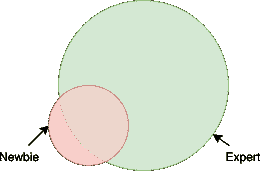
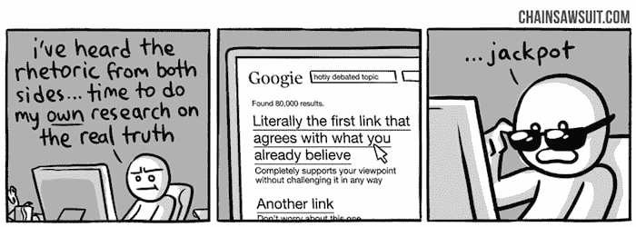

# 关于学习

> 原文：<https://dev.to/stereobooster/about-learning-1bf>

这是一些关于学习、教学和知识的想法和我的想法的集合。我想把这篇文章分成三个部分，但它们都是相互联系的，所以我想这将是一篇长文。好的一面是- **部分很小**，并且**不需要全部读取**或者按照给定的顺序读取**。**

## 从无到有的建筑

为了深入理解一些复杂的概念，分析(分解，分解成更小的部分)它是有用的，并且理解每个部分是如何工作的。这种方法的另一面是从零开始构建你想要理解的东西。

这个想法出现在 [SICP](https://stereobooster.com/posts/legendary-mit-6.001) 中，作者从 Lisp 中解释的最简单的编程概念开始，然后他们展示了如何构建 Lisp 本身(圆圈闭合)。

加里·伯恩哈特喜欢在他的[DAS“show”](https://www.destroyallsoftware.com/screencasts/catalog)中展示如何从零开始建造东西。[小阴谋家](https://mitpress.mit.edu/books/little-schemer-fourth-edition)和[小谚语者](http://the-little-prover.github.io/)一脉相承。

**主要想法是有一些小的孤立的例子，集中在本质上**。

例如，为了学习不同 PL 背后的基本思想，你可以尝试实现小的编程语言，如这里的。

### 但是...

如果给定主题严重依赖于其他主题，因此很难孤立呈现，该怎么办？

仍然有可能提供一个孤立的例子。这种方法的一个很好的例子可以在[教导不实现编译器或解释器的垃圾收集](https://cs.brown.edu/~sk/Publications/Papers/Published/cgkmf-teach-gc/paper.pdf)中找到:

> 鉴于内存安全语言的广泛使用，学生必须很好地理解垃圾收集...一种有效的方法是让他们实现垃圾收集器。不幸的是，一个完整的实现**依赖于编译器和运行时系统**的大量知识，而这是许多课程没有涵盖或无法承担的。
> 本文介绍了一种教学 GC 的指导性方法，学生们在一个简化的栈和堆上实现它。我们的方法**消除了巨大的课程依赖性，同时保留了 GC 算法的本质**。我们努力实现可测试性、可理解性和便于调试。我们的方法已经在几个机构成功地进行了几年的课堂测试。

另一个对位可以是，有些科目很难，不能简化成一个孤立的小东西，比如现代的浏览器就是一个很复杂的东西。为了让人们理解网络开发，我们应该让他们从头开始编写浏览器吗？

## “问题优先”的方法

我第一次看到这个想法是在一篇博客文章中，文章用一个基于游戏的例子解释了这个想法。想象一下:游戏开始了，你需要完成一个教程，你需要走出房间。你试图出去，但是门关着，所以教程指导你找到钥匙。在你找到它后，你回来并离开房间。

本教程的另一个变体可能是这样的，你有一个任务要离开房间，但你已经有了钥匙，所以你很快完成了教程。现在当你面对游戏中紧闭的大门时，你不知道该怎么办，因为你没有钥匙，也不知道去哪里拿。

当你在得到解决方案(钥匙)之前面对问题(关着的门)，你会更加欣赏解决方案——你记住它，你学习它。

例如，这种方法被用于[编程语言:应用和解释。](http://cs.brown.edu/courses/cs173/2012/book/book.pdf)

> 与其他一些教科书不同，这本书没有遵循自上而下的叙述方式。相反，它有一个对话流，回溯。我们通常会增量地构建程序，就像一对程序员一样。我们会包含错误，不是因为我不知道答案，而是因为这是你最好的学习方式。包含错误让你不可能被动地阅读:你必须与材料互动，因为你永远无法确定你所读内容的真实性。最后，你总能找到正确的答案。然而，这种非线性路径在短期内更令人沮丧(你经常会忍不住说，“告诉我答案，已经！”)，这使得这本书成为一个糟糕的参考指南(你不能随便打开一页就确定它说的是正确的)。然而，那种挫败感就是学习的感觉。我不知道绕过它的方法。

### 抽象概念

一些高层次的抽象概念可能非常有用，但是当他们以自上而下的方式教授时，就很难理解了，而且看起来像是一堆胡言乱语。

`<Insert joke about monad tutorials here>`

更好的做法是展示几个例子，说明如何展示不同的问题，事实上，它们背后有相同的思想，可以提取和重用。为了理解和评价一个抽象概念，你需要经历这种“啊哈”时刻。

## 一刀切

我们通过当前的经验(知识)来学习和消费信息。我们都有不同的背景，不同的先验经验(知识)。有些课程、教程可能对一类人有用，但对另一类人就不一定了。

从这个意义上来说，学校里的所有课程可能不是最好的主意，因为它适合一些人而不适合另一些人。而跟不上的人会觉得自己好像没有能力学东西。

所有人都有不同的学习速度，不同的睡眠/工作周期，不同的健康状况。例如，10%的人口患有诵读困难症。

肯·罗宾逊爵士在这段视频中解释了当前教育体系背后的原因。(它是在工业时期创造的，是按照工厂流程“模仿”出来的。)

## 实践 vs 理论知识

有些理论知识不是直接适用的，而是帮助你建立一个普遍的和更深层次的理解，例如停机问题或 lambda 演算不会帮助你写网站。

另一方面，实践知识会很快过时(理论知识也会过时，但这通常发生得比较慢)。例如，我在一家公司与 AS3 一起工作，然后裁员发生了，我意识到没有人再与 AS3 一起工作了(我很幸运，它不是我工作过的唯一一种语言，但是那些在简历中有 AS3 的 n 年现在已经没有用了)。

一个非常简单的关于不同类型知识寿命的图片:

```
frameworks and libraries < programming languages < data structure and algorithms < math 
```

从这个意义上说，包含许多快速变化的部分和错误的尖端技术对初学者来说是一件坏事。因为他们会学到很多很快就会过时的东西，而且感觉他们不会移动，有用的知识会很少。

### 学什么？

看情况吧。目的是甚麽？你有多少时间？你是学生，还是边工作边学习，还是在旅途中学习？

做决定时，所有这些问题都应该考虑进去。

## 建构主义

建构主义背后的主要思想是，每个人都在头脑中重新构建理解，例如，没有直接的知识转移，相反，你从外界获得信息(从书中，从对话中，从课堂上，从个人经历中，等等。)并以此为基础构建知识(从零开始)。

这个想法是由西蒙·派珀特在 60 年代提出的，这个想法已经从皮亚杰提出的建构主义(v 代替 n)的想法中发展出来。

基于这个想法，我们将如何优化学习？我们可以创造一个刺激实验的环境。一个具有清晰响应的环境，具有快速响应循环，这样试错周期会更快。老师的任务不是翻阅书本，而是让学生接触问题，这样他们就可以自己找出解决办法，回答问题，帮助学生整理，但他们会积累自己的经验。

Papert 想出了海龟作为编程学习环境。后来很多人基于这个想法，例如 Bret Victor 和他的非常快速响应循环的想法，以及带有热重载的就地控制和时间旅行，这进入了 Elm 和 Redux，Scratch 编程语言提出了可视化编程语言的概念。阅读我之前关于[教育编程语言](https://stereobooster.com/posts/educational-programming-languages/)的帖子来了解这个想法。

## 知识不是一个数字可以衡量的

有一个数字可以用来衡量智力——智商(我不是这种方法的粉丝，我认为这是一种过于简化的方法，但它适用于这个例子)。

但你不能用一个数字(不是标量值)来衡量知识。知识可以被认为是地图上的孤岛。有些人可能在知识上有一些重叠，但很难说人 A 比人 b 知道得多。你可以忍不住测量地图上交叉区域的面积，但这没有意义，因为比较的意义，例如，CS 知识和医学知识-如果 CS 教授知道更多的东西(CS 相关)，那么医学生就不会帮助他们挽救某人的生命。

### 后果

即使你是某个领域的专家，如果你的知识不够丰富，你仍然可以从新手那里学到一些东西:

[](https://res.cloudinary.com/practicaldev/image/fetch/s--PIYLktR7--/c_limit%2Cf_auto%2Cfl_progressive%2Cq_auto%2Cw_880/https://thepracticaldev.s3.amazonaws.com/i/bse0sk2q8xoc066qbje3.png)

一门学科的熟练程度并不能保证另一门学科的知识，甚至是基本的理解:

> bool is _ odd _ perfect _ number(int n){ return false；}
> 
> 我知道这里通常的反驳是“并发性”，但是他说“如果你真的想的话，你可以写所有的 300，000，000 个测试用例”，这是无可辩驳的
> 
> 另一个是“许多函数有无限的输入类”,但是他说“真正的程序员只写有限的状态机”,这是无可辩驳的
> 
> 所以这里有一个他还没有放弃的案例:模拟！要对一个输入进行单元测试，你需要知道输出，这是你编写模拟首先要找到的！
> 
> 另一个:影响真实世界的程序。你可以测试所有你想要的代码，但是你最终必须检查真实世界的效果，并且这是你需要的效果。那些是非常不同的测试！
> 
> — Hillel (@hillelogram) [June 4, 2019](https://twitter.com/hillelogram/status/1136000857496084480?ref_src=twsrc%5Etfw)

## 遗忘和推后效果

当你能把你以前的知识转移到一个新的领域时，经验可以帮助你学习。这种转移是在抽象过程的帮助下发生的(我们关注共性，通过忽略细节来“移除”细节)。抽象程度越高，它的应用就越广泛。

如果经验阻止学习新的东西，它可能是一个障碍，例如，如果新的想法与一些现有的想法相矛盾，那么学习新的想法将需要更多的时间，因为你需要忘记一些旧的想法(这就是所谓的[推后效应](https://educationblog.oup.com/theory-of-knowledge/facts-matter-after-all-rejecting-the-backfire-effect))。

推后效应的主要问题是它通过情绪起作用，所以当我们在这里反驳想法时的第一反应可能是愤怒，并因此产生破坏性的反应或拒绝继续听到/阅读新信息。

## 确认偏差

[](https://res.cloudinary.com/practicaldev/image/fetch/s--HKpDjr9C--/c_limit%2Cf_auto%2Cfl_progressive%2Cq_auto%2Cw_880/https://thepracticaldev.s3.amazonaws.com/i/rhr8wiix5o18pwngnz2n.png)

> 确认偏差，通过寻找或解释与现有信念一致的信息来处理信息的倾向。这种有偏见的决策方法很大程度上是无意的，并且经常导致忽略不一致的信息。
> 
> -- [英国](https://www.britannica.com/science/confirmation-bias)

我也喜欢“未知的已知”(未知的信仰，意识形态)这个术语。我从《奇怪的循环》2015 的加里·伯恩哈特的一次演讲中了解到这个想法。后来我发现 Slavoj ziek 在[2006 年关于 Donald Rumsfeld 的演讲中提出了同样的观点。](https://www.youtube.com/watch?v=ql80Klk4pSU)

## 假知识

我们早期学到的一些观点可能是错误的(错误的)或者后来被简化了。在某些时候，我们发现了矛盾，需要改变我们的信念。

例如，[他们教导重力取决于物体的质量，但是光子的质量为 0，然而它们受到重力的影响](https://www.youtube.com/watch?v=IM630Z8lho8)。

## 催款——克鲁格效应

> 邓宁-克鲁格效应的核心是，人们未能认识到自己的智力和社交缺陷，因为他们只是缺乏必要的专业知识来发现这些缺陷。因此，这种效应反映了一种双重诅咒:人们的赤字导致他们犯下许多错误，而这些赤字又阻止他们将自己的决定视为错误。因此，人们高估自己和自己才能的普遍趋势不一定是因为他们的自我，而是因为他们看不到的智力缺陷。我们都有这个问题，因为我们都有自己看不见的无能之处。
> 
> - [为什么无能的人认为自己很了不起-大卫·邓宁](https://ed.ted.com/lessons/why-incompetent-people-think-they-re-amazing-david-dunning)

## 避免断然思考

另一个潜在的陷阱如果你只学到问题的一面，只学到解决问题的一种方法，只学到一种观点。人们很容易陷入这种观点，并认为这是解决问题的唯一方法。

在罗伯特·萨波斯基的讲座中，讨论了一些不好的[分类思维的例子。](https://stereobooster.com/posts/categorical-thinking)

这个问题在软件开发中是众所周知的:比如只承认 FP 或者 OOP 的人，只承认类型或者测试的人。

为了避免这个问题，我们可以设计一个模型来展示问题解决方案的多种方法。例如:

> 整个课程的重点是在设计正确有效的算法时所需的分析。本课程旨在教授学生一个系统化的设计过程——从非正式规范的问题表述开始，通过令人信服的算法论证，分析算法的正确性和效率，最后通过逐步完善的过程得出程序。避免了编程语言偏见，程序以命令式和函数式两种风格开发。
> 
> - [CSL102:计算机科学导论](http://www.cse.iitd.ernet.in/~suban/CSL102/#Overview)

示例 2:

> Louv1.1x 和 Louv1.2x 一起在一个统一的框架中介绍了所有主要的编程概念、技术和范例。我们涵盖了三种主要的编程范例:函数式、面向对象和声明式数据流。
> 
> Louv1.2x 涵盖了数据抽象、状态和并发性。您将学习进行数据抽象的四种方法，并讨论对象和抽象数据类型之间的权衡。
> 
> - [计算机编程范例-基础知识](https://www.edx.org/course/paradigms-of-computer-programming-fundamentals)

### 批判性思维

解决这个问题的方法可以是批判性思维。

> 嗯，从根本上说，批判性思维是关于确保你有充分的理由来支持你的信念。
> 
> - [卡纳卡德米](https://www.khanacademy.org/partner-content/wi-phi/wiphi-critical-thinking/wiphi-fundamentals/v/intro-to-critical-thinking)

或者您可以阅读 SEP 了解更多详情:

> 批判性思维是一个被广泛接受的教育目标。它的定义是有争议的，但竞争的定义可以被理解为同一基本概念的不同概念:针对一个目标的仔细思考。
> 
> ——[斯坦福哲学百科全书](https://plato.stanford.edu/entries/critical-thinking/)

## 降低入口屏障

我在以前的帖子中提到过这个想法:

*   [开发人员是下一个蓝领工作](https://stereobooster.com/posts/developer-is-the-next-blue-collar-job/#ergonomics)
*   [评估编程语言的开发者体验](https://stereobooster.com/posts/evaluating-dx-of-a-programming-language/)
*   [教育编程语言](https://stereobooster.com/posts/educational-programming-languages/)

## 糟糕的老师

当老师需要一套特殊的技能。

你需要耐心，因为你能做得快，学习者就会做得慢——如果你为此生气，会使学习者泄气。

你需要善意来支持和安慰学习者，因为这很难处理，很容易失去希望。

你需要思想开放。一个新手可以发现一些你(还)不知道的东西。对此，一个合理的回答应该是:“我不知道，让我们一起找出答案”。不恰当的回答是:“不要问愚蠢的问题”，“这不重要”。

你需要谦虚。教学的目的是传递知识，而不是吹嘘自己有多聪明。尽可能少用术语(尽管你需要在某些时候介绍它，因为其他人会使用术语)。试着贴近学习者的水平，使用他们理解的例子。

当众学习。有些人会不愿意学习，因为他们觉得自己永远达不到老师的水平。我们没有人生来就拥有所有的知识和技能，我们都是学来的。定期提醒这一点会很好。

为了公平起见，我需要提到有不同的教学传统，例如，在东方武术中，你需要感谢师父允许你参观道场并观察他们在做什么(在 teach 开始注意到你之前需要相当长的时间)。

有糟糕的老师(或者不适合你的教学方法)。作为一名学习者，你不应该因为糟糕的老师而气馁——继续前进，找到更好的学习方法。

## 随时随地学习

当我们谈论教育时，我们经常想象小学生或学生，那些能把所有时间都奉献给学习的人。面对现实吧，很多人都需要在旅途中学习，例如:

*   新的框架出现了，现在几乎所有的工作岗位都把它列为一项要求
*   你想转换行业(例如，从新闻业到 IT 业)或行业分支(例如，从前端到后端)，但你没有时间或能力全职做这件事(因为钱很可能，你仍然需要工作)

在旅途中学习的人和在学术界学习的人的期望和体验是不同的。

最有可能的是，如果你在旅途中学习，你没有时间去浏览整个理论，而是你想尽快得到结果。学习者很可能会有一些压力:没有足够的时间(另一份工作)，没有足够的钱(购买学习材料)，心理压力(如果你是大三学生或正在实习，害怕失败)。

所有这些条件对学习来说都不太理想，然而这就是现在发生的和将来会发生的。

因此:

*   除非人们是有计划的，否则他们会根据炒作学到一些随机的东西
*   最终，他们会进入这个行业，并且会变得相当成功，然而没有“基础”会导致**冒名顶替综合症**
*   人们会学到免费的东西。这就是为什么开源正在传播，你不需要钱来学习开源的东西，你不需要支付认证，昂贵的课程，访问一些 Paas 等。
*   人们会感到困惑，需要帮助。他们会在维基百科、StackOverflow 或一些随机的博客帖子、论坛、在线社区(如 dev.to)或本地聚会上搜索。很多时候，通过这种方式找到的信息是不可信的——它可能会误导、过分简化事情，或者有错误的说法

我们如何为移动学习者设计学习体验:

*   除去意外的复杂性，没有人有时间从头编译你的东西或者运行 20 个命令来开始(这很可能是一个容易出错的过程)。让从一个命令开始变得容易，这将创建一个开箱即用的工作环境。可能会提供预编译的二进制文件，或者 Docker 图像，或者在线游乐场。
*   快速响应环路(再次)
*   除非需要，否则不要使用行话，解释术语(特别是如果这是一个模糊的术语)。使用一致的措辞
*   提供官方入门教程

对学习者来说什么是明智的？

识别炒作(见批判性思维)。我认为炒作是指倡导者只列出解决方案的积极方面，而没有消极方面。在这种情况下，倡导者要么不知道缺点，因为还没有用那么多去发现它，要么故意忽略它们。

不要对行话或分类判断印象深刻。很多时候，人们会在没有完全理解的情况下使用这些词。你不应该因此而有冒名顶替综合症的感觉。你可以随时问:“你能给我解释一下这个吗”，“你能给定义吗”，“你能解释一下为什么吗”。如果他们不能解释，那就意味着他们不知道。

> Hoenikker 博士曾经说过，任何不能向一个八岁的孩子解释他们在做什么的科学家都是骗子
> 
> 库尔特·冯内古特

区分科学知识和非科学知识。有时人们争论概念，好像它们是科学事实或定义，而事实并非如此。这里的典型迹象是，如果你问这个术语的定义，你得到的定义是“当我看到它时，我能认出它”，或者链接到维基百科，而不是一些公认的作者，如字典或科学著作

有时候维基百科的文章很好，有时候不好。比如演员模式就有很大的争议。演员模型的想法的作者卡尔·休伊特，公认的科学家，被维基百科骚扰和审查，因为他认为演员模型可以做的比图灵机多一点，维基百科编辑驳斥这是胡说八道。

> 长期以来，人们一直认为图灵机可以计算所有合理意义上的可计算函数。因此，它被认为是一个充分的可计算性模型。那么，对于那些讨论比图灵机计算能力更强的模型的论文，我们该如何理解呢？对于纯数学中更富想象力的领域来说，这种理论化可能很容易被视为无聊的猜测，在这些领域中，模型和抽象是为了它们自己而研究的，很少考虑任何现实世界的影响。
> 
> - [超计算:计算比图灵机多](https://arxiv.org/abs/math/0209332)

## 没有办法知道一切

人类的知识量每天都在增长。一个人不可能学会所有的东西。

因此，我们需要专业化——当人们把大部分时间用于学习一门学科时。这里的问题是，专业化变得越窄，就越容易失去对全局图景的看法(相关:分类思维)。

因为没有办法什么都学，所以有时候可以或者需要跳过一些科目或者推迟学习。这种想法与“从零开始构建”相矛盾，通过从零开始构建，你可以获得更好的理解，但它可能会发生，你没有时间学习那么深的一切。

我们需要接受这个无法解决的问题，而不是与教育中的漏洞作斗争，我们需要教如何快速学习，如何在旅途中学习，如何快速找到相关信息，我们需要教批判性思维，我们需要教如何[喊出公牛](https://callingbullshit.org/)，关于[认知偏见](https://busterbenson.com/biases/)，关于[逻辑谬误](https://yourlogicalfallacyis.com/)。

我们需要一个更好的媒介来传播和更新知识。超文本(HTML)、维基和网络已经朝着这个方向迈出了很好的一步，但是我们还可以做得更好。此外，它还应该针对消耗进行[优化。](https://andymatuschak.org/books/)

[知识要开放](https://okfn.org/about/vision-and-values/)。当前的学术出版不起作用，这导致了 SciHub 这样的服务的出现。我也不认为维基百科是这里的答案(见 [1](https://en.wikipedia.org/wiki/Reliability_of_Wikipedia) 、 [2](https://www.researchgate.net/publication/220175584_Wikipedia's_Neutral_Point_of_View_Settling_Conflict_through_Ambiguity) 、 [3](https://reagle.org/joseph/2005/06/neutrality.html) )。也许 [arxiv](https://arxiv.org/) 更好回答`¯\_(ツ)_/¯`。

## 超越计算机科学

我主要关注计算机科学和类似学科的教学方法和理念。但是在很多领域，这些想法是行不通的，例如品尝咖啡杯、弹钢琴、学习自然语言。

(给我自己)一个小小的提醒。

## 其他文章

更多文章供你考虑(有几篇我没看过，可能比较有趣):

*   [学习如何学习](https://www.coursera.org/learn/learning-how-to-learn)
*   如何在 1 小时内学会(但不是掌握)任何一门语言
*   [优秀钢琴演奏者的建议](http://www.calnewport.com/blog/2011/12/23/flow-is-the-opiate-of-the-medicore-advice-on-getting-better-from-an-accomplished-piano-player/)

> 照片由尼基塔·s 在 unsplash 上拍摄