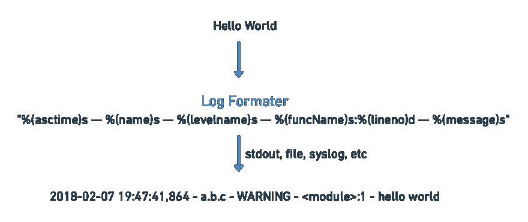
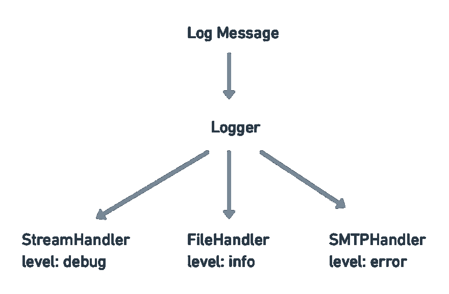

# Python 日志:深入教程

> 原文：<https://dev.to/simplelogin/python-logging-an-in-depth-tutorial-f15>

随着应用程序变得越来越复杂，拥有**良好的**日志会非常有用，不仅是在调试时，而且可以提供对应用程序问题/性能的洞察。伐木也是著名的[十二要素 app](https://12factor.net) 中的要素之一。

Python 标准库附带了一个[日志](https://docs.python.org/3/library/logging.html)模块，它提供了大多数基本的日志功能。通过正确设置，日志消息可以带来许多有用的信息，如何时何地触发日志以及日志上下文，如正在运行的进程/线程。

尽管有这些优势，日志模块经常被忽视，因为它需要一些时间来正确设置。在[https://docs.python.org/3/library/logging.html](https://docs.python.org/3/library/logging.html)的官方文档虽然完整，但没有给出最佳实践，也没有强调一些意外的记录。

这篇 Python 日志教程并不是关于日志模块的完整文档，而是一本入门指南，介绍一些日志概念以及一些需要注意的 T2 陷阱。帖子将以最佳实践结束。

请注意，文章中的所有代码片段都假设您已经导入了日志模块:

```
import logging 
```

Enter fullscreen mode Exit fullscreen mode

## Python 日志的概念

本节概述了日志模块中经常遇到的一些概念。

### 关卡

日志级别与给定日志的**重要性**相对应:`error`日志应该比`warn`日志更紧急，而`debug`日志应该只在调试应用程序时启用。

Python 中有六个日志级别；每个级别都与一个整数相关联，该整数表示日志严重性:`NOTSET=0, DEBUG=10, INFO=20, WARN=30, ERROR=40, CRITICAL=50.`

[](https://res.cloudinary.com/practicaldev/image/fetch/s--ZZjG89g_--/c_limit%2Cf_auto%2Cfl_progressive%2Cq_auto%2Cw_880/https://thepracticaldev.s3.amazonaws.com/i/v7n63g8undyvlpomzias.png)

### 格式化程序

日志`formatter`通过添加上下文信息来丰富日志消息。了解日志发送的时间、位置(Python 文件、行号、方法等)会很有用。)，以及线程和进程 id 等附加上下文(在调试多线程应用程序时非常有用)。

例如，当日志`hello world`通过这个日志格式化程序发送时:

```
"%(asctime)s — %(name)s — %(levelname)s — %(funcName)s:%(lineno)d — %(message)s" 
```

Enter fullscreen mode Exit fullscreen mode

它将成为

`2018-02-07 19:47:41,864 - a.b.c - WARNING - <module>:1 - hello world`

[](https://res.cloudinary.com/practicaldev/image/fetch/s--XUcc2EZn--/c_limit%2Cf_auto%2Cfl_progressive%2Cq_auto%2Cw_880/https://thepracticaldev.s3.amazonaws.com/i/r79k58z8bfd1gjaeeqrg.png)

### 处理程序

log `handler`是有效写/显示日志的组件:它可以通过`StreamHandler`在控制台显示日志，通过`FileHandler`写入文件，甚至通过`SMTPHandler`给你发邮件等。

每个日志处理程序都有两个重要的字段:

*   一种将上下文信息添加到日志中的格式化程序。

*   一个日志级别，过滤掉级别较低的日志。例如，INFO 级别的日志处理程序不会处理调试日志。

标准库提供了一些处理程序，对于常见的用例应该足够了:[https://docs . python . org/3/library/logging . handlers . html # module-logging . handlers](https://docs.python.org/3/library/logging.handlers.html#module-logging.handlers)。最常见的有`StreamHandler`和`FileHandler` :

```
console_handler = logging.StreamHandler()
file_handler = logging.FileHandler("filename") 
```

Enter fullscreen mode Exit fullscreen mode

### 记录器

Logger 是我们与之交互最多的对象，也是最复杂的概念。可以通过
获得新的记录器

```
toto_logger = logging.getLogger("toto") 
```

Enter fullscreen mode Exit fullscreen mode

记录器有三个主要字段:

*   `Propagate`:决定日志是否应该*传播*到日志记录器的父节点。默认情况下，其值为`True`。

*   `Level`:和处理程序级别一样，日志记录程序级别用于过滤掉**不太重要的**日志。除了与日志处理器不同的是，在**子**日志记录器中只检查**级别的**;一旦日志传播到其父级，将不会检查级别。这是相当不直观的行为。

*   `Handlers`:日志到达记录器时将被发送到的处理程序列表。这允许灵活的日志处理—例如，您可以有一个记录所有调试日志的文件日志处理程序和一个仅用于关键日志的电子邮件日志处理程序。在这点上，日志记录器-处理程序的关系类似于发布者-消费者的关系:一旦日志通过了日志记录器级别的检查，它将被广播给所有的处理程序。

[](https://res.cloudinary.com/practicaldev/image/fetch/s--iSCrpq3i--/c_limit%2Cf_auto%2Cfl_progressive%2Cq_auto%2Cw_880/https://thepracticaldev.s3.amazonaws.com/i/gdqab4np63gd1wezrlk9.png)

记录器在名称上是**唯一的**，这意味着如果已经创建了一个名为`toto`的记录器，那么对`logging.getLogger("toto")`的后续调用将返回相同的对象:

```
assert id(logging.getLogger("toto")) == id(logging.getLogger("toto")) 
```

Enter fullscreen mode Exit fullscreen mode

正如您可能已经猜到的，记录器有一个**层次结构**。层次结构的顶部是`root`记录器，可以通过`logging.root`访问。当在`logging`模块上直接调用一个方法时，例如`logging.debug()`，该记录器被调用。默认情况下，根日志级别为`WARN`，因此每一个级别较低的日志，例如`logging.info("info")`，都将被忽略。

根日志记录器的另一个特点是，它的默认处理程序将在第一次记录级别高于 WARN 的日志时创建。通过像`logging.debug()`这样的方法直接或间接使用 root logger 通常是不推荐的**。**

 **默认情况下，当创建一个新的记录器时，它的父记录器将被设置为根记录器:

```
lab = logging.getLogger("a.b")
assert lab.parent == logging.root # lab's parent is indeed the root logger 
```

Enter fullscreen mode Exit fullscreen mode

然而，记录器使用**点符号**，这意味着名为`a.b`的记录器将是记录器`a`的子记录器。然而，这只有在记录器`a`已经被创建的情况下才成立，否则`ab`的父级仍然是`root`记录器。

```
la = logging.getLogger("a")
assert lab.parent == la # lab's parent is now la instead of root 
```

Enter fullscreen mode Exit fullscreen mode

当日志记录器根据级别检查决定日志是否应该通过时(例如，如果日志级别低于日志记录器级别，日志将被忽略)，它使用其**有效级别**，而不是实际级别，即`logger.level`。如果级别是**而不是** `NOTSET`，则有效级别与记录器级别相同，即从调试到临界的所有值；然而，如果记录器级别是`NOTSET`，那么有效级别将是具有非 NOTSET 级别的第一个祖先级别。

默认情况下，新的记录器具有`NOTSET`级别，由于根记录器具有`WARN`级别，记录器的有效级别将是 WARN。因此，即使一个新的日志记录器附加了一些处理程序，这些处理程序也不会被调用，除非日志级别超过 WARN:

```
toto_logger = logging.getLogger("toto")
assert toto_logger.level == logging.NOTSET # new logger has NOTSET level assert toto_logger.getEffectiveLevel() == logging.WARN # and its effective level is the root logger level, i.e. WARN 
# attach a console handler to toto_logger console_handler = logging.StreamHandler()
toto_logger.addHandler(console_handler)
toto_logger.debug("debug") # nothing is displayed as the log level DEBUG is smaller than toto effective level toto_logger.setLevel(logging.DEBUG)
toto_logger.debug("debug message") # now you should see "debug message" on screen 
```

Enter fullscreen mode Exit fullscreen mode

默认情况下，`logger`级别将用于决定日志是否通过:如果日志级别低于日志级别，日志将被忽略。

## Python 日志记录最佳实践

日志模块确实非常方便，但是它包含一些奇怪的东西，即使对于最好的 Python 开发人员来说，也会造成长时间的头痛。以下是我认为使用本模块的最佳实践:

*   配置根日志记录器，但不要在代码中使用它，例如，不要调用像`logging.info()`这样的函数，它在后台调用根日志记录器。如果您想从使用过的库中捕捉错误消息，配置根记录器是很有用的。

*   要使用日志记录，请确保使用`logging.getLogger(logger name)`创建一个新的记录器。我通常使用`__name__`作为单个模块的日志名称或整个 app/lib 的静态名称，但只要一致，任何东西都可以使用。为了添加更多的处理程序，我通常有一个返回 logger 的方法(你可以在[https://gist . github . com/nguyenkims/e 92 df 0 f 8 BD 49973 f 0 c 94 BDF 36 ed 7 FD 0](https://gist.github.com/nguyenkims/e92df0f8bd49973f0c94bddf36ed7fd0)上找到要点)。

```
import logging
import sys
from logging.handlers import TimedRotatingFileHandler
FORMATTER = logging.Formatter("%(asctime)s — %(name)s — %(levelname)s — %(message)s")
LOG_FILE = "my_app.log"

def get_console_handler():
   console_handler = logging.StreamHandler(sys.stdout)
   console_handler.setFormatter(FORMATTER)
   return console_handler

def get_file_handler():
   file_handler = TimedRotatingFileHandler(LOG_FILE, when='midnight')
   file_handler.setFormatter(FORMATTER)
   return file_handler

def get_logger(logger_name):
   logger = logging.getLogger(logger_name)
   logger.setLevel(logging.DEBUG) # better to have too much log than not enough
   logger.addHandler(get_console_handler())
   logger.addHandler(get_file_handler())
   # with this pattern, it's rarely necessary to propagate the error up to parent
   logger.propagate = False
   return logger 
```

Enter fullscreen mode Exit fullscreen mode

之后你可以创建一个新的记录器并使用它:

```
my_logger = get_logger("my module name")
my_logger.debug("a debug message") 
```

Enter fullscreen mode Exit fullscreen mode

*   使用`RotatingFileHandler`类，例如本例中使用的`TimedRotatingFileHandler`而不是`FileHandler`，因为当文件达到大小限制时，它会自动为您旋转文件，或者每天都这样做。

*   使用像哨兵，空气制动，射线枪等工具。，为您自动捕获错误日志。这在 web 应用程序的上下文中特别有用，因为在 web 应用程序中，日志可能非常冗长，错误日志很容易丢失。使用这些工具的另一个优点是，您可以获得错误中变量值的详细信息，这样您就可以知道是哪个 URL 触发了错误，涉及到哪个用户，等等。

当建立一个新项目时，确保日志工作正常应该是首先要做的事情之一，因为它可以在将来节省无数的调试时间。**