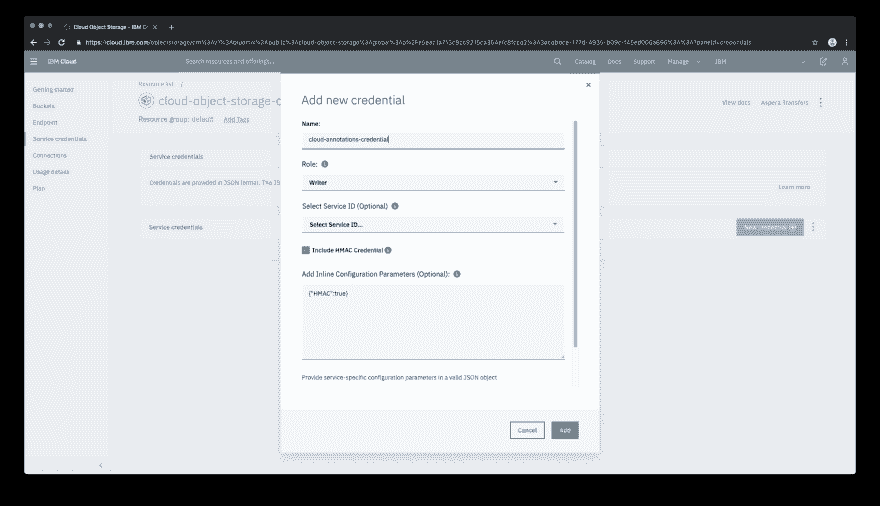
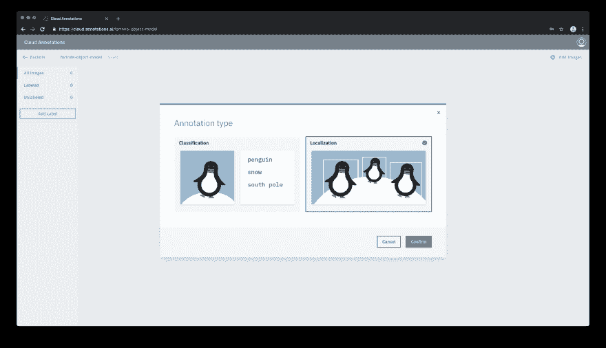
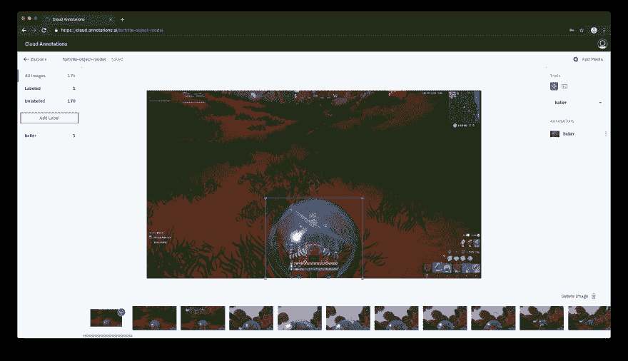

# 如何建立堡垒之夜物体检测模型

> 原文：<https://dev.to/ibmdeveloper/how-to-build-a-fortnite-object-detection-model-4ia6>

在[之前的帖子](https://dev.to/couch/using-video-games-to-improve-machine-learning-2lk0)中，我谈到了视频游戏如何被用作构建通用机器学习模型的资源。今天，我想通过使用沃森机器学习服务来建立一个物体检测模型，以识别和跟踪堡垒之夜的物体。让我们直接跳进来吧！

# 资源

我们将使用 IBM Cloud 上提供的一些不同的服务，所以首先您需要[创建一个新帐户，或者登录](https://ibm.biz/cloud-annotations-sign-up)您现有的帐户。

我们将使用的服务有:

*   云对象存储:存储我们的数据和模型
*   沃森机器学习:训练我们模型的环境
*   云注释:快速标记我们的训练数据

你还需要有一个堡垒之夜游戏的视频，你可以用作训练和测试数据(我已经提供了一个，[这里](https://github.com/samuelcouch/fortnite-obj-detect-tutorial/tree/master/training-data)，但越多越好)。

## 云对象存储

一旦您登录到 IBM Cloud，只需点击**“创建资源”**并搜索`"object storage"`，为您的实例命名，我选择了`"couch-fortnite-object-storage"`并选择了 **Lite** 计划(Lite 计划是免费的，允许高达 25GB 的存储)。一旦创建了服务，我们需要创建凭证，这样我们就可以使用我们的对象存储来存储我们的测试数据和模型文件。点击**新建凭证**，确保**角色**设置为 ***作者*** ，并勾选 ***包含 HMAC 凭证*** 选项。

创建完成后，单击**查看凭证**，您将看到凭证的 JSON 输出，我们需要一些元素:

*   `apikey`
*   `cos_hmac_keys`**–>**`access_key_id`和`secret_access_key`
*   `resource_instance_id`

您可以在第二个选项卡中打开它，或者将 JSON 保存在一个文本文件中，稍后使用。

## 沃森机器学习

我们需要使用的最后一个服务是沃森机器学习——按照上面相同的步骤，搜索`"watson machine learning"`，给它一个名称，然后选择 **lite** 计划。我们还需要为此服务创建凭证。点击**新建凭证**，再次确认选择 ***编剧*** 作为角色。单击**查看凭证**，再次记下我们稍后将需要的一些元素:

*   `instance_id`
*   `password`
*   `url`
*   `username`

# 准备数据

这里的目标将是训练一个模型，既可以识别和跟踪堡垒之夜游戏视频中的对象。我们将使用一个叫做云注释的工具来简化这个过程。导航到[cloud . annotations . ai](https://cloud.annotations.ai/)——我们将使用我们的**对象存储**凭证登录。输入您的`resource_instance_id`和`apikey`，选择**美国**作为地区。

登录后，我们需要做的第一件事是点击**创建 bucket** 并给它命名。接下来，选择 ***定位***——这将允许我们通过绘制边界框来标记照片中的对象。

接下来，点击**添加媒体**并选择您的堡垒之夜视频(视频文件将被分割成单独的帧)。现在，点击**添加标签**，姑且将其命名为 ***球员*** ，这样我们就可以给视频中的球员(堡垒之夜车辆)加标签了。

现在我们可以浏览我们的图像，在我们看到的每个球周围画出方框。

您可以标记任意多或任意少的图像。只有带有标签的图像才会在训练中使用。

> 作为关于机器学习的一般说明，特别是堡垒之夜，你应该使用训练数据，这些数据包含了你预期在测试中使用的所有环境和你的模式的一般使用；。我具体指的是在堡垒之夜，你会遇到许多不同的环境(城市景观、树木、雪、熔岩等等。)，并且您应该尝试在您的训练数据中包含至少几个不同的环境，以构建可能的最佳模型。

# 训练

我们将使用 CLI 工具与我们标记的训练图像进行交互，并训练/下载我们的模型。CLI 需要节点 10.13.0 或更高版本。

## 安装

`npm install -g cloud-annotations`

安装后，您将可以在终端中访问命令`cacli`。

## 训练我们的模型

我建议创建一个新目录，我们可以在那里运行我们的训练操作，并最终下载我们的模型(我创建了一个名为`fortnite-obj-detection`的目录)。从该目录运行命令`cacli train`，第一次运行该命令时，它会提示您输入您的**沃森机器学习**和**对象存储**实例的凭证，这允许该工具访问训练数据，然后训练我们的模型。

`cacli`还将询问训练参数，使用`k80` gpu 是我们将使用的，并且包括在沃森机器学习的 lite 计划中。步骤，我建议使用`20 * [number of training images]`作为一般的经验法则。

> 一旦运行，将创建一个配置文件，以便将来您可以简单地用新数据重新训练模型，而无需提供服务凭证。

一旦所有的参数都填写完毕，我们就可以开始训练了！CLI 工具应自动启动培训作业并加入队列，它将为您提供一个`model_id`，我们将需要它来监控和下载模型。一旦作业开始，CLI 将询问您是否想要监视它，但是如果您关闭终端或者想要在其他地方监视，您也可以运行`cacli progress [model_id]`。

## 下载模型

一旦工作完成，我们就可以使用这个模型了，但是首先我们需要下载它！只需运行`cacli download [model_id]`，它将从我们的对象存储桶中检索训练好的模型，并将其下载到本地。该工具将下载模型的 3 个版本，准备在各种环境中部署。我们将使用 **model_web** 版本，准备在 tensorflow.js 应用程序中使用。

## 使用模型

一个[独立的 react 应用程序已经](https://github.com/cloud-annotations/standalone-video-react)可供您克隆和使用！一旦你克隆了存储库，只需复制 **model_web** 目录(整个目录)，并把它放在 react 应用程序的 **public** 目录中。最后给**公众**加个视频，叫 ***video.mov*** 。最后，运行 app！如果一切顺利，视频将播放并在它识别的对象周围显示边界框。

希望这是您构建自己的对象检测模型的一个很好的起点！就像我之前说的，我认为视频游戏为开发通用机器学习模型创造了一个很好的环境。