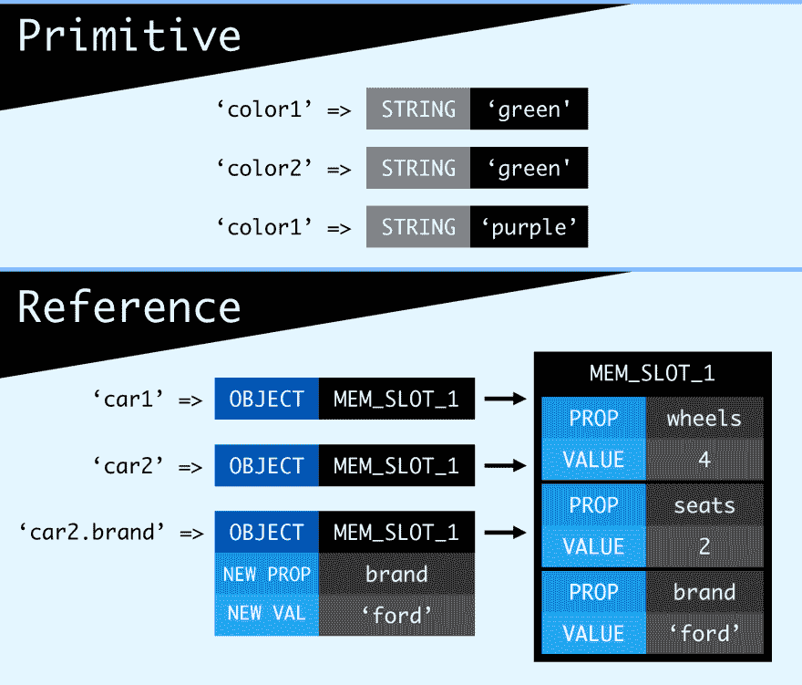

# JavaScript 面试准备:原始类型与引用类型

> 原文：<https://dev.to/mostlyfocusedmike/javascript-interview-prep-primitive-vs-reference-types-3o4f>

[*原文*](https://itnext.io/javascript-interview-prep-primitive-vs-reference-types-62eef165bec8)
在一次 JavaScript 面试中，他们可能会问你是否理解*原语*和*引用*数据类型的区别。幸运的是，这个主题是计算机科学中为数不多的几个名字可以解释一切的主题之一。数据类型存储信息有两种方式:作为内存中的一个槽，或者作为对内存中某个位置的一个槽的引用。你能猜出哪个是哪个吗？

# 首先是原始类型

原始数据类型有:数字、字符串、布尔、未定义和空值(还有符号[和符号](https://www.keithcirkel.co.uk/metaprogramming-in-es6-symbols/)，所以检查一下这些)。基本上，如果它存储一个简单的数据，它就被简单地存储了。当你用这种类型设置一个变量时，这个变量就是那个精确的值，仅此而已。如果你改变了这个值，这个变量就会变成一个新值。

# 下一步:引用类型

这意味着两个引用类型是对象和数组(技术上是一个，因为[数组是对象](https://stackoverflow.com/questions/5048371/are-javascript-arrays-primitives-strings-objects))。创建对象时，该值不会直接赋给变量。相反，设置的是对该值的*引用*。变量所知道的只是对象的位置，而不是对象本身。

# 用琐事比喻解释

假设你需要提醒自己去洗碗。如果你要原始地储存它，你会拿一张纸，写下“洗碗”但是如果你的室友已经做过了呢？现在你的任务是倒垃圾。因为它是原始储存的，你只要拿起那张纸，擦掉“洗碗”并写下“倒垃圾”

为了通过参考来保存你的杂务，你的室友会保留一份所有杂务的清单。当你需要知道还剩下什么或者划掉一个的时候，你问他们，他们就会访问这个列表。你自己没有名单，你只是知道去哪里找。隐喻说够了，让我们看一些代码。

# 复制一个值的代码才是它的价值所在

当复制或传递值时，这些都会真正发挥作用。看看这段复制原始值的代码:

```
let color1 = 'green';
let color2 = color1;
color1 = 'purple';
console.log(color1);
// 'purple'
console.log(color2);
// 'green' 
```

Enter fullscreen mode Exit fullscreen mode

`color1`被赋予字符串值`'green'`，这意味着变量`color1`本质上与字符串`'green'`相同。当我们用`color1`给`color2`赋值时，就好像我们真的给它赋值了一个字符串值。所以当我们重新分配`color1`的值时，它对`color2`完全没有影响。这两种价值观永远只是储蓄字符串，它们之间没有持久的债券。引用类型不是这种情况。看:

```
let car1 = {
  wheels: 4,
  seats: 2,
};
let car2 = car1;
car1.brand = 'ford';
console.log(car1.brand);
// 'ford'
console.log(car2.brand);
// 'ford' 
```

Enter fullscreen mode Exit fullscreen mode

哼。我们从未给`car2`分配品牌资产，但它有一个。尽管情况看起来与我们的原始示例相同，但行为是相反的。那是因为`car1`从未被赋予对象的*值*，只有*引用*给它。所以如果你改变`car1`，那将改变`car2`正在查看的内存中的同一个点:

[](https://res.cloudinary.com/practicaldev/image/fetch/s--aOJBLm38--/c_limit%2Cf_auto%2Cfl_progressive%2Cq_auto%2Cw_880/https://thepracticaldev.s3.amazonaws.com/i/ii3oru3a17pfzvzdcw48.png)

# 解决参考问题

通过添加品牌属性，我们永久性地改变了原始对象。这被称为*突变*，当我们不小心超过预期目标时，这并不好。为了解决这个问题，我们只需要创建一个新对象的新引用。这样，每个变量都将指向自己的对象，不会有任何重叠。最常见的方法是使用 Object.assign 或 spread 运算符。为了简洁起见，让我们使用一个扩展:

```
let car1 = {
  wheels: 4,
  seats: 2,
};
let car2 = {...car1};
car1.brand = 'ford';
console.log(car1.brand);
// 'ford'
console.log(car2.brand);
// undefined 
```

Enter fullscreen mode Exit fullscreen mode

# 最后一件事

对象是可变的，意味着它们可以改变(除非你[冻结它](https://developer.mozilla.org/en-US/docs/Web/JavaScript/Reference/Global_Objects/Object/freeze))。然而，原始类型是不可变的。看，你实际上不能把数字`1`突变成`2`，你只是替换这个值。意思是我们没有改变我们的`'green'`字符串，我们只是直接用一个新的字符串`'purple'`替换它。这是一个偷偷摸摸的小技术问题，但现在你知道了！祝你面试顺利，一如既往，

大家编码快乐，

迈克

*像这样？我有[更多文章](https://medium.com/@mikecronin92)T3】*