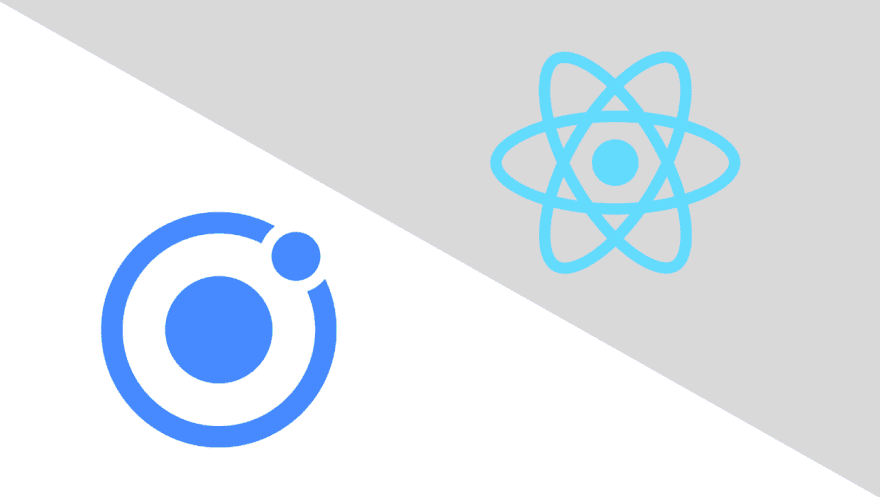

# React Native vs. Ionic:哪个适合你？

> 原文：<https://dev.to/bnevilleoneill/react-native-vs-ionic-which-one-is-right-for-you-2dib>

移动开发不再仅仅意味着使用 Swift 的原生 iOS 开发或使用 Java 的原生 Android 开发。我们正处于混合、跨平台和渐进式网络应用的时代。

在本文中，我将比较两个流行的移动框架，React Native 和 Ionic。我们将首先了解它们的相似之处，并探究它们的不同之处。这个指南可以帮助你决定哪个框架适合你。

## 反应原生基础知识

[React Native](https://facebook.github.io/react-native/) 是一个跨平台的解决方案，可以在 iOS 和 Android 上本地构建移动应用。它是使用 React 用 JavaScript 编写的。早在 2015 年，脸书就在[开源了](https://facebook.github.io/react-native/blog/2015/03/26/react-native-bringing-modern-web-techniques-to-mobile) [，并从那时起获得了巨大的人气。](https://facebook.github.io/react-native/blog/2015/03/26/react-native-bringing-modern-web-techniques-to-mobile)

*React Native 用于使用 JavaScript 构建原生移动应用，在 iOS 和 Android 上都可以使用 React。*

## 离子基础知识

[Ionic](https://ionicframework.com/) 是一款构建移动应用的混合解决方案。它允许您使用 JavaScript、HTML 和 CSS 等标准 web 技术来构建高质量的跨平台应用程序。Ionic Framework 发布了一本免费电子书，解释了[混合应用程序与原生应用程序](https://ionicframework.com/books/hybrid-vs-native)之间的差异。

这个想法是，你只需编写一次代码，这些代码就可以跨平台部署在 iOS、Android、Web 和桌面上。所有平台共享相同的代码库 **。**

## 它们怎么相似？

如果你刚开始学习 React Native 和 Ionic，根据上面的描述，它们听起来可能非常相似。

Ionic 允许你使用传统的网络技术，比如 JavaScript/CSS/HTML，来构建移动、桌面和网络应用。类似地，React Native 允许您使用 JavaScript 和流行的 JavaScript 框架 React 构建原生移动应用程序。

这意味着使用 Ionic 或 React Native 不需要了解原生 iOS 或 Android 开发。

## 它们有什么不同？

现在让我们了解一下这些框架有什么不同。

## 1。原生与混合

### 反应土著就是土著

React Native 用于构建真正的原生跨平台应用。**原生应用**是用特定编程语言构建的软件应用，用于特定的设备平台，可以是 iOS，也可以是 Android。

原生 iOS 应用用 Swift 或 Objective-C 编写，原生 Android 应用用 Java 编写。使用 React Native，底层小部件都是本地组件，为用户提供无缝体验。它使用 JavaScript 和 React 构建，但组件都是 iOS 和 Android 的原生组件。React Native 的美妙之处在于，它可以在 iOS 和 Android 上用单一代码库构建原生应用。

这真的令人印象深刻，因为你是用 Javascript 编码的，并且呈现平台本地的组件。这是使用 React Native 构建的应用程序比使用 Web 视图的框架拥有更好的用户体验的原因之一。

### 离子型是混合型

Ionic 是一款混合应用。它使用 HTML、CSS 和 JavaScript 来构建可以在 web、桌面和移动设备上使用的应用程序。混合应用本质上使用所谓的 Web 视图来构建移动应用。

Ionic 应用程序使用[网络技术](https://ionicframework.com/docs/faq/glossary#web-standards)构建，并使用网络视图呈现。Ionic 应用程序使用 web 技术构建，并使用 web 视图呈现，这是一个全屏和全功能的 Web 浏览器。

这里的想法是跨多个平台重用代码。因此，混合应用程序将无法获得开箱即用的移动设备的原生功能。相机、GPS、联系人等原生功能。Ionic 使用 Cordova 插件将本机功能集成到您的应用程序中。Ionic 通过浏览器呈现图形元素，需要几个步骤才能在屏幕上显示组件。这可能会对大型应用程序的性能造成影响。

但是当你使用像 Ionic 这样的混合技术构建网络应用程序时，很容易将它们转换成渐进式网络应用程序，就像其他任何移动应用程序一样可以下载。

### 胜者:React Native

如果你的产品只是一个移动应用，需要在 iOS 和 Android 上跨平台工作，并且需要看起来和感觉上像一个原生应用，你应该选择 React Native。如果你正在寻找一个优雅的用户界面，以移动应用的形式匹配你的网站，你可以考虑 Ionic。

## 2。技术栈

### 反应原生

React Native 是使用流行的框架 React 用 JavaScript 编写的。UI 片段是用 [JSX](https://reactjs.org/docs/introducing-jsx.html) 编写的，而不是 HTML。JSX 看起来像任何其他模板语言，但具有 JavaScript 的所有功能。React Native 使用 React 的原因是，这两个框架都是由脸书开发和开源的，他们选择 React 来构建 React Native 是有道理的。

### 离子型

你可以使用 Angular，Vue，甚至 React 来构建 Ionic 应用。与 React Native 相比，Ionic 的技术体系更加灵活。有了最新发布的 Ionic 4，你可以在任何 web 开发框架中使用 Ionic。

### 获胜者:爱奥尼亚

直到去年，React Native 一直被认为是这一类别的赢家，因为 Ionic 应用程序仅使用 Angular 构建。但随着最近对 Ionic 的更新，它为构建 Ionic 应用程序提供了巨大的灵活性。任何网络开发者，在任何现代网络框架下，都可以开发 Ionic 应用。这对 Ionic 来说是一个巨大的好处，使其成为这一类别的赢家。

## 3。流行

在开始学习 React Native 或 Ionic 之前，让我们看看哪一个更受欢迎。

为了更深入地了解他们的受欢迎因素，我们来看看 2018 年 JavaScript 调查的[状态。它发布了过去三年 React Native 和 Ionic 在开发者中受欢迎程度的数据。](https://2018.stateofjs.com/mobile-and-desktop/overview/)

从下面的调查结果中，我们可以推断，与 Ionic 相比，React Native 作为移动框架肯定更受欢迎。

### 胜者:React Native

React Native 更受欢迎是因为它能够使用 JavaScript 和 React 构建真正的“原生”应用程序。使用 WebViews 的混合应用程序的概念是好的，但它没有接近原生应用程序的外观和感觉。Ionic 是一款混合应用，缺乏真正原生应用的外观和感觉。然而，React 原生应用程序是原生的，而且令人惊叹的是，这些组件都是 iOS 和 Android 原生的。最终用户将无法区分本机应用和 React 本机应用。这是影响本地人受欢迎程度的最重要因素。

## 4。学习曲线

### 反应原生

如果你是 React 开发者，那么学习 React Native 是极其容易的。概念是一样的，你用 React 编码。唯一的区别是，React 使用 web 组件，如`
`、`
`，而 React Native 使用的组件是原生 iOS 和 Android 组件的包装，如`<View>`。一个 React 开发者成为 React 原生开发者应该不需要很长时间。

话虽如此，不知道反应的新手怎么办？学习 React Native 意味着，你要学习 JavaScript 和 React。你还需要开始像移动开发者一样思考，因为你要开发移动应用，而不是网络应用。对于没有 React 知识的人来说，学习曲线可能会很陡。

### 离子型

我们已经看到 Ionic 的技术堆栈非常灵活。您将使用 JavaScript、CSS 和 HTML 以及您选择的 web 框架。它可以是 Angular、React、Knockout、Vue 或任何其他现代 web 框架。这意味着采用 Ionic 框架的开发者会选择他们已经熟悉的框架来开发应用。因此，这里的学习曲线不像 React Native 那么多。

有了 Ionic，你实际上是在构建网络应用，而这些应用可以变成移动应用。与 React Native 的本地方法相比，这种混合方法是不同的。这一点开发者更容易把握。

### 获胜者:爱奥尼亚

与 React Native 相比，Ionic 的学习曲线较短。这是因为 Ionic 允许你选择一个你喜欢的框架。它可以是 Angular、React、Vue 甚至是普通的 JavaScript。而使用 React Native，您必须在 React 中编码，并且没有技术堆栈的灵活性。对于非 React 开发人员，React Native 的学习曲线更长。

## 5。表演

如果你真的想要最好的性能，你最好的办法是在 iOS 和 Android 上分别编写本地应用程序。这是因为本机编码在您编码时直接提供了对本机功能的访问。没有抽象层，与原生 iOS 和 Android 模块的直接交互增强了性能。无论是自然反应还是离子反应都无法与自然反应相媲美。尽管如此，还是让我们看看哪个更好。

### 反应原生

React Native 比 Ionic 更接近于本机性能。React Native 本质上是使用 JavaScript 构建原生应用。它具有本机应用程序的外观和感觉，并使用本机应用程序使用的相同构件。唯一的区别是它是跨平台的，并且使用 JavaScript 来包装这些原生构建块。React Native 为您的移动应用程序提供了出色的性能和响应能力。

### 离子型

另一方面，Ionic 是一种混合方法。它不构建本地应用程序，您可能会遇到性能问题。有很多对本机代码的回调，这可能会导致延迟。Ionic 还需要 Cordova 插件，以防您需要访问本机功能。尽管 Ionic 是构建优雅 UI 和加快开发速度的绝佳解决方案，但与 React Native 等框架相比，它确实存在一些性能问题。

### 胜者:React Native

React Native 提供了比 Ionic 更好的性能。Ionic 中的附加层，涉及 Cordova 插件，增加了速度，因为它建立的是 WebView 而不是原生应用程序。另一方面，React Native 包装了本机组件，因此提供了更好的性能。

## 6。开发者社区

在为您的团队评估一项技术时，探索该技术的社区参与是一个好主意。

让我们来看看 React Native 和 Ionic 在开发者社区和开源贡献方面的比较。

GitHub 统计数据很好地表明了这两个框架的社区参与度。React Native 拥有约 78k 颗恒星，超过 1900 名贡献者参与了该框架。这表明它在社区中非常受欢迎。

另一方面，Ionic 有大约 38k 颗恒星，只有大约 330 个贡献者。与 React Native 相比，这还不到贡献者的五分之一。

## 胜者:React Native

与 Ionic 相比，React Native 拥有一个更活跃、参与度更高的开发者社区。这可能是因为它确实构建了本地移动应用程序，而不是 web 应用程序。以及它使用 React 来构建它们的事实。

## 总结

### 反应土著的优劣

*   用 Javascript 写的([一种非常流行的语言](https://insights.stackoverflow.com/survey/2019#technology))
*   使用 React，健壮的 web 框架
*   在 iOS 和 Android 上构建跨平台的原生应用
*   提供出色的[开发者体验](https://www.oreilly.com/library/view/learning-react-native/9781491929049/ch01.html)
*   [伟大的社区参与](https://facebook.github.io/react-native/help)

### 反应土著的弊

*   如果你正在尝试构建一个非常依赖动画的应用，比如游戏应用，那么 React Native 并不合适
*   开发人员在开始使用 React Native 之前必须学习 React

### 离子的利弊

*   用 JavaScript 编写，支持大多数现代框架，如 React、Angular 和 Vue
*   开发人员可以灵活选择框架
*   在 iOS 和 Android 上构建跨平台混合应用

### 离子的弊

*   性能不如[跨平台原生应用或原生应用](https://www.simform.com/react-native-vs-ionic/)
*   必须使用科尔多瓦插件，使用本地 API 和模块
*   构建一个 Web 视图，这不会转化为本机应用程序的外观和感觉

## 结论

那么谁赢了？在这篇帖子里， **React Native 是赢家**。当然，永远不存在“正确的”框架。如果您计划构建跨平台应用程序，请确保评估您的用例以及开发人员的偏好，以决定选择哪个框架。

React Native 和 Ionic 都有各自的优缺点，需要仔细评估才能为您的开发选择其中之一。

在下面发表你的评论，让我们知道你的决定和原因。

* * *

## Plug: [LogRocket](https://logrocket.com/signup/) ，一款适用于网络应用的 DVR

[log rocket](https://logrocket.com/signup/)是一个前端日志工具，让你重放问题，就像它们发生在你自己的浏览器中一样。LogRocket 不需要猜测错误发生的原因，也不需要向用户询问截图和日志转储，而是让您重放会话以快速了解哪里出错了。它可以与任何应用程序完美配合，不管是什么框架，并且有插件可以记录来自 Redux、Vuex 和@ngrx/store 的额外上下文。

除了记录 Redux 动作和状态，LogRocket 还记录控制台日志、JavaScript 错误、stacktraces、带有头+体的网络请求/响应、浏览器元数据、自定义日志。它还使用 DOM 来记录页面上的 HTML 和 CSS，甚至为最复杂的单页面应用程序重新创建像素级完美视频。

[免费试用](https://logrocket.com/signup/)。

* * *

反应本地与离子:哪一个适合你？最早出现在 [LogRocket 博客](https://blog.logrocket.com)上。