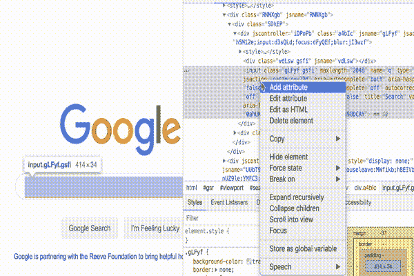

# 带有 chrome devtools 的 XPath 定位器

> 原文：<https://dev.to/tonetheman/xpath-locators-with-chrome-devtools-4fb5>

XPath 是 Selenium 定位器的选择之一，但是手工编写 XPath 也比它应该的要困难。

你完全可以让 Chrome devtools 来帮你做！

在屏幕右侧找到元素
并选择 inspect
你不应该在 Chrome 开发工具中，html 元素应该高亮显示。
再次右键单击浅蓝色突出显示的 html 元素
选择复制，然后复制 XPath

这是谷歌首页的输入框(附 gif 示例！)

```
//*[@id="tsf"]/div[2]/div/div[1]/div/div[1]/input 
```

<svg width="20px" height="20px" viewBox="0 0 24 24" class="highlight-action crayons-icon highlight-action--fullscreen-on"><title>Enter fullscreen mode</title></svg> <svg width="20px" height="20px" viewBox="0 0 24 24" class="highlight-action crayons-icon highlight-action--fullscreen-off"><title>Exit fullscreen mode</title></svg>

[](https://res.cloudinary.com/practicaldev/image/fetch/s--f3GI8Xwk--/c_limit%2Cf_auto%2Cfl_progressive%2Cq_66%2Cw_880/https://thepracticaldev.s3.amazonaws.com/i/cv9yhr3hyhkdofksmcey.gif)

XPath 不是 Selenium 中定位器的首选，我通常更喜欢 ID 和 Name。

XPath 依赖于 DOM 的结构。如果结构改变，XPath 也会改变，测试将会失败。

因此，如果你打算使用 XPath，你要知道当你的 web 开发人员对你的网站进行修改时，你必须监控你的测试。