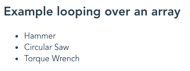
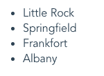
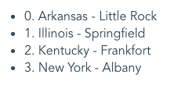

# Vue 简介:遍历数据列表

> 原文：<https://dev.to/ratracegrad/intro-to-vue-looping-over-lists-of-data-3ko9>

几乎在每一个应用程序中，你都会发现你需要循环遍历数据并在网页上显示出来。一个很好的例子是从后端获取数据，可能过滤结果并显示给用户。这些数据可能是购物车中的产品、服务或商品列表。在这一课中，我将向你展示如何使用 Vue 的 **v-for** 指令循环遍历列表。所以让我们开始吧。

## v-for

Vue 包含一个名为 **v-for** 的内置指令。这个指令允许你对数据进行循环，不管数据是存储在一个数组中，一个对象中，还是一个对象数组中。

## 循环遍历一个数组

对于我们的第一个例子，我们将遍历一个数组中的所有条目，并生成一个条目的无序列表。下面是一个 **v-for** 循环的基本格式:

```
<ul>
    <li v-for="item in items">{{ item }}</li>
</ul> 
```

下面是我们的项目数组中的数据:

```
data: {
  return {
     items: ['Hammer', 'Circular Saw', 'Torque Wrench']
  };
} 
```

当这段代码运行时，它会创建一个无序列表，显示所有 3 个项目。它看起来会像这样。

[](https://res.cloudinary.com/practicaldev/image/fetch/s--IJGLUn1_--/c_limit%2Cf_auto%2Cfl_progressive%2Cq_auto%2Cw_880/https://res.cloudinary.com/ratracegrad/image/upload/v1563735969/Screen_Shot_2019-07-21_at_3.05.40_PM_tlbywg.png)

## 添加一个键

Vue 建议您为列表中的每个项目添加一个键。如果数组中的值有变化，那么 Vue 将使用这个键来知道要在 DOM 中更新哪个项目。您可以指定您自己的密钥，该密钥必须是唯一的，或者您可以使用 Vue 自动创建的$index。该键是当前项的索引的可选第二个参数。让我们更新循环数组的例子，以包含这个索引。

```
<ul>
    <li v-for="(item, $index) in items" :key="$index">{{ $index }} - {{ item }}</li>
</ul> 
```

## 在一个对象上循环

你也可以使用 **v-for** 来循环一个对象。当你在一个对象上循环时，对象的键值就是循环中返回的值。这是一个列出各州及其首府的对象。我们将遍历这个对象。

```
capitals: {
      Arkansas: 'Little Rock',
      Illinois: 'Springfield',
      Kentucky: 'Frankfort',
      'New York': 'Albany'
} 
```

下面是循环这个大写字母对象并显示大写字母列表的代码:

```
<ul>
    <li v-for="value in capitals">{{ value }}</li>
</ul> 
```

这是输出:

[](https://res.cloudinary.com/practicaldev/image/fetch/s--GnkbUOb3--/c_limit%2Cf_auto%2Cfl_progressive%2Cq_auto%2Cw_880/https://res.cloudinary.com/ratracegrad/image/upload/v1563741888/Screen_Shot_2019-07-21_at_4.41.37_PM_jizqy6.png)

## 循环一个取物键

您可以将可选的第二个参数传递给对象的 v-for 指令。此参数将拥有对象的键。因为一个对象中的所有键必须是唯一的，所以我们可以在我们的 **v-for** 循环中使用这个值作为 **:key** 值。

```
<ul>
    <li v-for="(value, key) in capitals" :key="key">{{ key }} - {{ value }}</li>
</ul> 
```

这是输出:

[](https://res.cloudinary.com/practicaldev/image/fetch/s--OutKyAO4--/c_limit%2Cf_auto%2Cfl_progressive%2Cq_auto%2Cw_880/https://res.cloudinary.com/ratracegrad/image/upload/v1563741910/Screen_Shot_2019-07-21_at_4.41.50_PM_k3zkv0.png)

## 循环遍历一个对象——获取键和索引

您可以将可选的第三个参数传递给对象的 v-for 指令。这个参数将是索引。

```
<ul>
    <li v-for="(value, key, index) in capitals" :key="key">{{ index }}. {{ key }} - {{ value }}</li>
</ul> 
```

这是输出:

[](https://res.cloudinary.com/practicaldev/image/fetch/s--DZt5R-oy--/c_limit%2Cf_auto%2Cfl_progressive%2Cq_auto%2Cw_880/https://res.cloudinary.com/ratracegrad/image/upload/v1563742510/Screen_Shot_2019-07-21_at_4.54.58_PM_ar2gu8.png)

## 获取代码

如果您想了解本文中提供的所有示例，我已经为您创建了一个代码沙箱。[点击此处获取代码](https://codesandbox.io/s/introtovue-loopingoverlists-6k9wo)。

## 结论

这是对 Vue 中数据循环过程的简短介绍。我展示了循环数组和对象的例子。[在 Twitter 上关注我](https://twitter.com/ratracegrad)