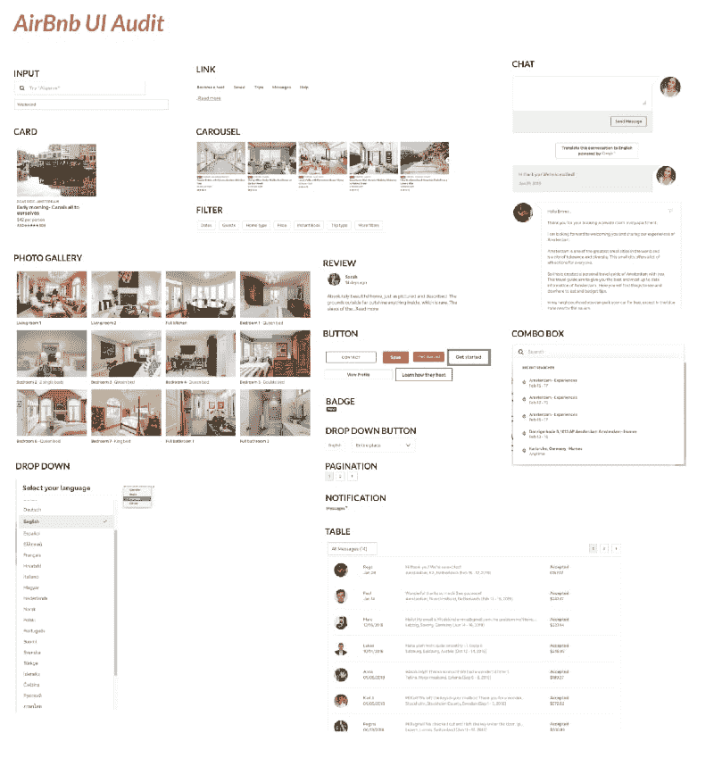
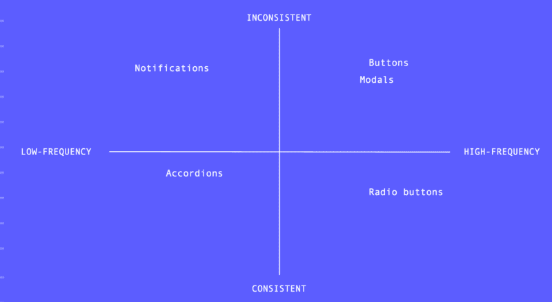
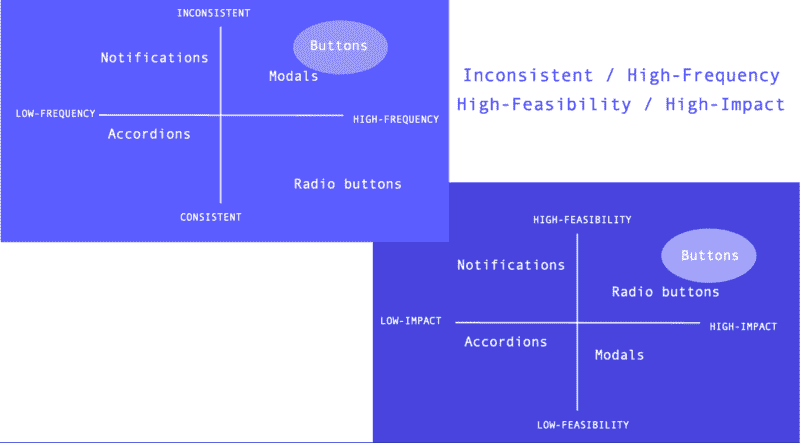

# 设计系统(第二部分:设计语言)

> 原文：<https://dev.to/emmabostian/design-systems-part-ii-design-language-217k>

在第一部分中，我们看了一下设计系统的基础。如果你还没有读过，我建议你[去看看](https://dev.to/emmawedekind/design-systems-part-i-foundations-45hd)！

在这篇文章中，我们将深入研究设计系统的基础:设计语言。

"设计语言是设计的共享词汇."

*   国际商用机器公司

# 什么是设计语言？

设计语言是一套标准，指导品牌下一套产品的创造。我喜欢把设计语言想象成一个品牌或产品的个性以及相应的视觉设计资产。

设计语言由三个方面组成:

*   指导方针
*   元素
*   成分

在一种设计语言或 UI 套件中，你可能看不到元素和组件之间的区别。我在这里做了区分，以说明一些组件是由其他组件(元素)组成的。我喜欢称这些为复合成分。

## 指导方针

指南是描述如何利用你的设计语言来构建产品的原则。它包括以下内容:

*   易接近
*   品牌
*   排印
*   颜色
*   格子
*   移动
*   核标准情报中心

## 元素

元素是可用于构建更复杂组件的基本元素。元素的一些示例包括:

*   小跟班
*   下拉菜单
*   输入字段
*   单选按钮

## 组件

组件比元素更复杂，实际上可以构建为许多元素的组合。组件的一些示例包括:

*   模型
*   工具提示
*   航行
*   页码

# 我如何构建设计语言？

如果你正在从头开始构建一种设计语言，你很幸运；从空白画布开始要容易得多！但事实是，大多数公司都在试图建立一种与现有产品相一致的设计语言。

在维护一套产品的同时，构建设计语言的一般流程如下:

*   进行用户界面审计
*   建立组件优先级
*   巩固你的品牌身份
*   建立指导方针
*   构建 UI 工具包

让我们更深入地研究一下每一个问题。

## UI 审计

UI 审核是应用程序所有区域中所有状态下所有元素的可视化清单。例如，按钮有多少种不同的变化？它们的悬停状态在整个产品中是否不同？

您可以简单地截取每个组件的屏幕截图，并将其添加到 Sketch 中的艺术板上。如果我们为 Airbnb 做一个 UI 审计，它可能看起来像这样:

## 建立优先级

一旦您进行了 UI 审计，您就可以开始对组件进行优先级排序。我们可以通过在一致性/频率和可行性/影响图表上绘制每个组件来做到这一点。

*一致性/频率*图表基于组件在整个 UI 中的一致性程度和在整个产品中的使用频率来绘制组件。

正如我们在上面的 Airbnb UI 审计中看到的，按钮非常不一致，但它们在整个产品中被大量使用。相比之下，手风琴用得不多(可能在一两个地方)，因此通常是一致的。

*可行性/影响*图表根据组件设计/开发的可行性以及对整体产品凝聚力的影响程度来绘制组件。

回到 Airbnb 按钮，与手风琴(有很多移动部件)相比，它们很容易设计和开发，并且对产品一致性的影响会更大。

一旦产品中的所有组件都绘制在这两个图表上，我们就可以开始创建一个优先化的 backlog。

我们希望*关注落在两个图表右上象限的组件*:不一致且经常使用的组件，但是设计/开发非常可行，并且会产生很大影响。这些将产生最大的投资回报。

根据我们的 Airbnb 结果，从按钮组件开始将是一个好主意。

一旦解决了两个右上象限中的组件，您的团队就可以决定继续进行的最佳方式。

您可能希望转移到可行的、具有高影响力的、经常在整个 UI 中使用的组件，但是可能比其他组件更一致。

## 巩固您的品牌身份

在你建立设计语言之前，你需要对你的品牌有一个强烈的感觉。你希望你的用户在使用你的产品时有什么样的感受？这些情绪需要被打包进你的系统。

为了建立强大的品牌形象，你可能需要问自己以下几个问题:

*   在使用我们的产品时，我们希望用户体验到什么样的情感(即信任、冒险)？
*   我们的使命是什么？
*   我们为什么要这样做？

## 建立指导方针

一旦你建立了你的品牌身份，你就可以开始定义你的设计语言指南。以下是您想要定义的准则示例:

*   **可访问性**:您的系统必须符合什么级别的 W3C 标准？我们如何将这种合规性融入我们的系统(即颜色对比、字体大小)？
*   **品牌**:你的品牌身份是什么？这是您在上一步中定义的。
*   **字体设计**:我们应该用什么字体来强化我们的品牌形象？
*   颜色:什么颜色最能唤起我们希望用户感受到的情感？例如，蓝色表示值得信赖。
*   **动作**:我们如何利用产品中的动画和动作来传达我们的品牌？
*   **插图**:我们可以在产品的什么地方使用插图来传达我们的品牌？什么样的插画风格符合我们的身份？
*   **内容**:什么样的语气/角色最能体现我们的品牌身份？
*   **图标**:什么风格的图标最适合我们的品牌？
*   **间距**:为了创建一个一致的 UI，我们想要采用什么样的间距范例(比如填充、边距)？

## 构建 UI 工具包

最后，我们准备开始构建 UI 工具包。这只是一个视觉设计/原型资产的工具包，体现了你的设计语言。

该套件将允许设计师在其高保真设计中利用您的系统。Sketch 是创建 UI 工具包的流行工具。

为你的工具包创建一个强大的、有组织的层次结构是很重要的。您可能希望分离不同的组件类型(即通知、表单元素等。)分成不同的页面。或者，您可能希望利用符号来确保一致性。

在设计你的工具包之前，一定要和你的团队建立一个“工作合同”,以确保当涉及到工具包的组织和工作流程时，你们都在同一页上。

* * *

我希望第一部分是设计语言的良好入门。第三部分将介绍组件库。请随时让我知道你对下面设计系统的想法。

所有图片均由 [unDraw](https://undraw.co/illustrations?source=post_page---------------------------) 提供。