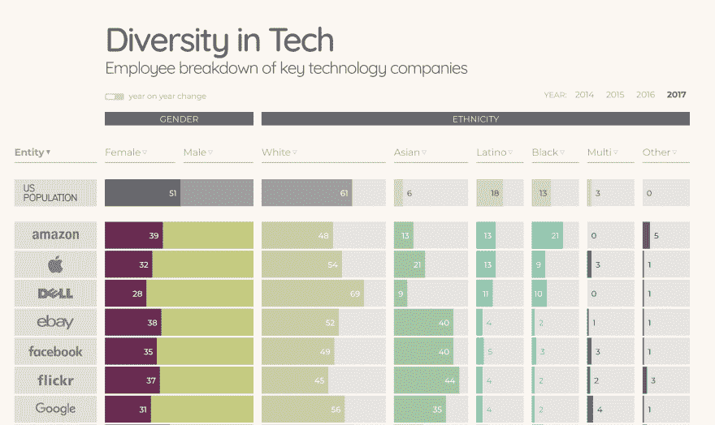
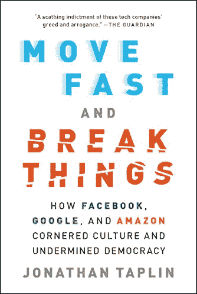

# 科技行业是如何阻碍多重激情的人的

> 原文：<https://dev.to/nprimak/how-the-tech-industry-discourages-multi-passionate-folks-1de2>

这是一篇最初发表在我的博客上的文章。看原帖[这里](https://www.multimedia-minds.com/2019/07/24/how-the-tech-industry-discourages-multi-passionate-folks/#.XToBHpx7lhH)。

几周前我写了一篇帖子，讲述了我后悔专攻前端开发框架，因为我无意中陷入了使用过时技术的困境。我意识到我可能在那篇文章中无意中暗示的是，科技行业因此更喜欢多激情的人。我想纠正这个暗示，因为它是极其不正确的，事实上我认为它是相反的。

<figure> 

<figcaption>我不确定我采访过的任何一家公司是否编造了一份关于我的报告，但我也不确定他们是否也没有。</figcaption>

</figure>

技术面试，尤其是对开发人员来说，是非常累人的。进行一两次编码测试并不罕见，有时会有多个开发人员现场观看您的编码，并在他们进行编码时做笔记。我被分配了认知评估、性格测试、多项选择题、定时考试，以及介于两者之间的一切。最糟糕的是，几乎所有这些测试都是为了评估你的左脑——你在算法思维、逻辑谜题或理解特定编程语言的深度方面有多好。我不确定我面试过的任何一家公司创造了一份关于我的报告，但我也不确定他们没有。

对于像我这样在用户体验、网页设计和前端开发方面拥有多种技能的人来说，这是一个真正的挫折。当我在寻找工作时，我经常发现那些将这种技能组合列为“需要”的公司也是非常小的公司，它们基本上只想有一个不介意“在压力下工作”的开发人员(侧栏:如果一份工作问你在压力下有多舒服，你可能应该逃避)。然后，那些特别需要“前端开发人员”的工作根本不会关心我对 Photoshop 的了解，或者我有一个展示我的游戏开发的在线作品集，或者我对技术之外的事情有兴趣。

当然，如果我认为我是唯一一个经历这种挫折的人，我就不会写这些了。在这个行业中有很多守门人，你可以在这里阅读[，在这里](https://jaxenter.com/diversity-tech-interview-wadella-148846.html)阅读[，在这里](https://www.theguardian.com/technology/2017/mar/14/tech-women-code-workshops-developer-jobs)阅读[。没有对编码表达足够的热情或者没有跟上最新的框架很容易让你丢掉工作。因此，科技行业的人经常感到压力，不得不放弃自己的爱好和其他兴趣，将办公室内外的时间都花在了解潮流、研究新工具和做副业上，以保持新鲜感。](https://dev.to/ambroselittle/technical-interviewing-is-broken-but-we-can-fix-it-4964)

<figure>

<figcaption>The gatekeeping is real. Probably from StackOverflow.</figcaption>

</figure>

对于大多数充满激情的人来说，这是一个巨大的转变，他们倾向于厌倦每天做同样的事情。当然，当他们第一次发现自己对编码感兴趣时，他们可能会在几个月甚至一两年内变得非常着迷。但最终这种强烈的兴趣逐渐消失，被其他东西取代。艾米莉·瓦普尼克在她精彩的 TED 演讲中讨论了这一现象，我强烈推荐她。

对于一个因为排斥人和想法而受到如此多批评的行业来说，继续鼓励开发人员专注于越来越多的特定工具似乎是违反直觉的，而可以说，行业目前最需要的是重视用户体验和客户福祉、隐私和长期幸福的人。这意味着员工能够设身处地为客户着想。雇用有不同经历和广泛兴趣的人肯定会有帮助，而雇用一心一意迷恋技术的人会产生相反的效果，助长所有问题都可以用更多技术解决的错觉。主要科技公司的多样性统计。小球员往往有更惊人的数据。

<figure>

<figcaption>Stats on diversity in major tech companies. Smaller players tend to have far more alarming stats.</figcaption>

</figure>

有些人可能会由此推断，我想取消所有的编码测试，让技术领域的招聘对所有人免费。不。我并不提倡一种极端的方法，但是我认为目前的行业在要求员工生活、呼吸和吃代码方面走得太远了，这不利于协作和开放的员工队伍。当然，这也与有毒的工作文化这个更大的问题有关，这是另一个棘手的问题，我不会在这篇文章中讨论。

技术行业的招聘被打破了，专注于开发人员的技术技能不仅会使人失去人性，还会让充满激情的人觉得他们需要符合特定的模式。我相信这也是为什么这么多公司不投资优秀的 UX 研究人员和设计师的原因，因为这些技能组合连接着不同的行业，需要一种更加多元热情的方法。他们根本看不到任何非纯代码、不遵循“快速行动、打破常规”这一座右铭的东西的价值。那句格言已经过时了。

<figure>

<figcaption>That motto has NOT aged well.</figcaption>

</figure>

我开这个博客的部分原因是为了有一个出口来谈论我所有的兴趣。能够写大量的主题，而不是试图强迫自己进入一个很小的领域，让我在几周或一个月后感到厌倦，这是令人难以置信的回报。科技行业正在发生变化，尽管没有我希望的那么快，但我希望这篇文章能够传达给那些能够传播这样一个信息的人，那就是充满激情的人应该被拥抱而不是疏远。

如果你喜欢这篇文章，可以考虑在 Twitter 上关注我 [@nadyaprimak](https://www.twitter.com/nprimak) 或者如果你需要更多进入科技行业的技巧，你可以现在就阅读我的书[平装本或 Kindle 版本的《踏入 T4》。](https://www.amazon.com/Foot-Door-Getting-Industry-Programmer-ebook/dp/B0813XNFNF)

帖子[科技行业如何阻碍多重激情的人](https://www.nadyaprimak.com/blog/creativity/creativity-jobs-in-tech-industry-multipassionate-folks/)最先出现在 www.nadyaprimak.com/blog[的](https://www.nadyaprimak.com)上。