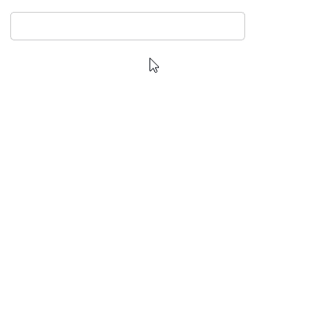

# 使用 JQuery/Javascript 创建自己的多日期选择器

> 原文：<https://dev.to/praneetnadkar/create-your-own-multi-date-picker-using-jquery-javascript-50f6>

我知道这是 Vue、Angular、React 等的时代，但仍然有应用程序运行在旧的 JQuery 和 javascript 代码上。最近我有一个任务，从 JQuery 创建或使用一个多日期选择器。我碰到了 JQuery UI 的 multidatepicker，它相当不错。但是我在定制它的时候遇到了很多问题和挑战。然后我想到为什么不创造一个我想要的。

我不是前端或脚本专家，但我仍然认为这值得一试。

虽然我想把它转换成一个插件，但这是我为 multidatepicker 做的纯 html 和 jquery 代码。以下是我的尝试:

### 使用 bootstrap 创建一个 HTML 框架

我已经使用 bootstrap 为我将动态构建的日历创建了一个 HTML 框架。

```
<input type="text" id="selectedValues" class="date-values" readonly/>
        <div id="parent" class="container" style="display:none;">
            <div class="row header-row">
                <div class="col-xs previous">
                    <a href="#" id="previous" onclick="previous()">
                        <i class="fa fa-arrow-left" aria-hidden="true"></i>
                    </a>
                </div>
                <div class="card-header month-selected col-sm" id="monthAndYear">
                </div>
                <div class="col-sm">
                    <select class="form-control col-xs-6" name="month" id="month" onchange="change()"></select>
                </div>
                <div class="col-sm">
                    <select class="form-control col-xs-6" name="year" id="year" onchange="change()"></select>
                </div>
                <div class="col-xs next">
                    <a href="#" id="next" onclick="next()">
                        <i class="fa fa-arrow-right" aria-hidden="true"></i>
                    </a>
                </div>
            </div>
            <table id="calendar">
                <thead>
                    <tr>
                        <th>S</th>
                        <th>M</th>
                        <th>T</th>
                        <th>W</th>
                        <th>T</th>
                        <th>F</th>
                        <th>S</th>
                    </tr>
                </thead>
                <tbody id="calendarBody"></tbody>
            </table>
        </div> 
```

<svg width="20px" height="20px" viewBox="0 0 24 24" class="highlight-action crayons-icon highlight-action--fullscreen-on"><title>Enter fullscreen mode</title></svg> <svg width="20px" height="20px" viewBox="0 0 24 24" class="highlight-action crayons-icon highlight-action--fullscreen-off"><title>Exit fullscreen mode</title></svg>

我已经在 html 中添加了 Bootstrap、Font-awesome(用于上一个和下一个箭头)和 JQuery。

我已经添加了一些风格。css 文件可以从[这里](https://github.com/praneetnadkar/multidatepicker/blob/master/multidatepicker/styles.css)访问

现在脚本的关键是根据日期生成日期。以下是我的尝试:

### 脚本加载日历

```
function loadControl(month, year) {

    addMonths(month);
    addYears(year);

    let firstDay = (new Date(year, month)).getDay();

     // body of the calendar
    var tbl = document.querySelector("#calendarBody");
    // clearing all previous cells
    tbl.innerHTML = "";

    var monthAndYear = document.getElementById("monthAndYear");
    // filing data about month and in the page via DOM.
    monthAndYear.innerHTML = months[month] + " " + year;

    selectYear.value = year;
    selectMonth.value = month;

    // creating the date cells here
    let date = 1;

    selectedDates.push((month + 1).toString() + '/' + date.toString() + '/' + year.toString());

    // there will be maximum 6 rows for any month
    for (let rowIterator = 0; rowIterator < 6; rowIterator++) {

        // creates a new table row and adds it to the table body
        let row = document.createElement("tr");

        //creating individual cells, filing them up with data.
        for (let cellIterated = 0; cellIterated < 7 && date <= daysInMonth(month, year); cellIterated++) {

            // create a table data cell
            cell = document.createElement("td");
            let textNode = "";

            // check if this is the valid date for the month
            if (rowIterator !== 0 || cellIterated >= firstDay) {
                cell.id = (month + 1).toString() + '/' + date.toString() + '/' + year.toString();
                cell.class = "clickable";
                textNode = date;

                // this means that highlightToday is set to true and the date being iterated it todays date,
                // in such a scenario we will give it a background color
                if (highlightToday
                    && date === today.getDate() && year === today.getFullYear() && month === today.getMonth()) {
                    cell.classList.add("today-color");
                }

                // set the previous dates to be selected
                // if the selectedDates array has the dates, it means they were selected earlier. 
                // add the background to it.
                if (selectedDates.indexOf((month + 1).toString() + '/' + date.toString() + '/' + year.toString()) >= 0) {
                    cell.classList.add(highlightClass);
                }

                date++;
            }

            cellText = document.createTextNode(textNode);
            cell.appendChild(cellText);
            row.appendChild(cell);
        }

        tbl.appendChild(row); // appending each row into calendar body.
    }

    // this adds the button panel at the bottom of the calendar
    addButtonPanel(tbl);

    // function when the date cells are clicked
    $("#calendarBody tr td").click(function (e) {
        var id = $(this).attr('id');
        // check the if cell clicked has a date
        // those with an id, have the date
        if (typeof id !== typeof undefined) {
            var classes = $(this).attr('class');
            if (typeof classes === typeof undefined || !classes.includes(highlightClass)) {
                var selectedDate = new Date(id);
                selectedDates.push((selectedDate.getMonth() + 1).toString() + '/' + selectedDate.getDate().toString() + '/' + selectedDate.getFullYear());
            }
            else {
                var index = selectedDates.indexOf(id);
                if (index > -1) {
                    selectedDates.splice(index, 1);
                }
            }

            $(this).toggleClass(highlightClass);
        }

        // sort the selected dates array based on the latest date first
        var sortedArray = selectedDates.sort((a, b) => {
            return new Date(a) - new Date(b);
        });

        // update the selectedValues text input
        document.getElementById('selectedValues').value = datesToString(sortedArray);
    });

    var $search = $('#selectedValues');
    var $dropBox = $('#parent');

    $search.on('blur', function (event) {
        //$dropBox.hide();
    }).on('focus', function () {
        $dropBox.show();
    });
} 
```

<svg width="20px" height="20px" viewBox="0 0 24 24" class="highlight-action crayons-icon highlight-action--fullscreen-on"><title>Enter fullscreen mode</title></svg> <svg width="20px" height="20px" viewBox="0 0 24 24" class="highlight-action crayons-icon highlight-action--fullscreen-off"><title>Exit fullscreen mode</title></svg>

我在日期面板的底部添加了一个按钮面板。它有两个按钮，重置和完成。

此外，要设置加载时预先选择的日期，请将您的日期添加到 selectedDates 数组中。

控件看起来是这样的:
[](https://res.cloudinary.com/practicaldev/image/fetch/s--zjzVWDwN--/c_limit%2Cf_auto%2Cfl_progressive%2Cq_66%2Cw_880/https://thepracticaldev.s3.amazonaws.com/i/23kg7q9st8eozbnb1bwp.gif)

我一直在努力改进我的代码，因为我不是 JS 或前端专家。

你可以从[这里](https://github.com/praneetnadkar/multidatepicker)下载整个工作样本

创建自己的控件并使用简单的 HTML 和 JQuery/Javascript 代码来使用它们是非常容易的。