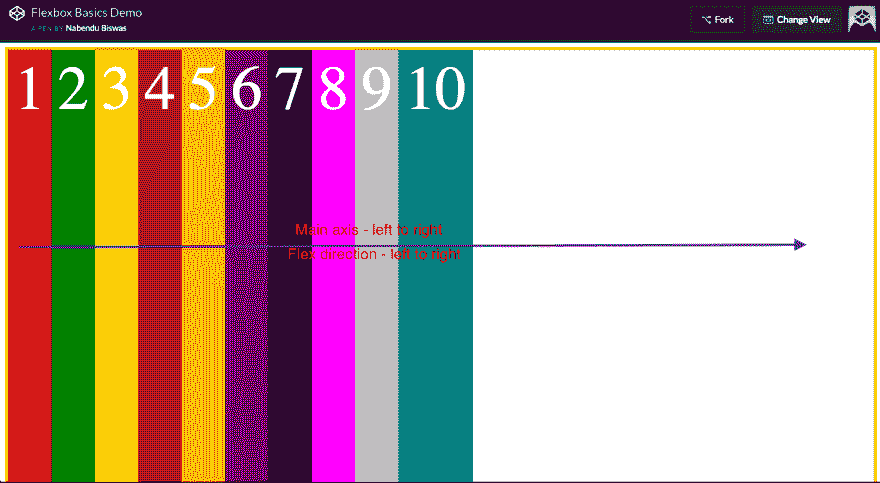
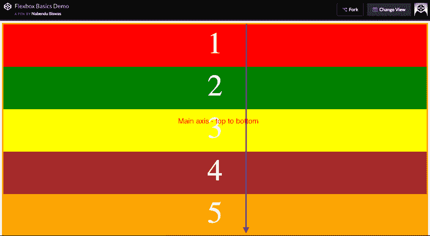
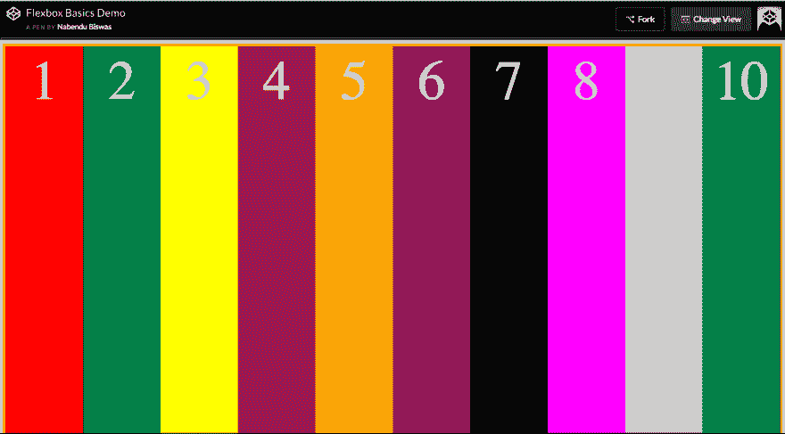
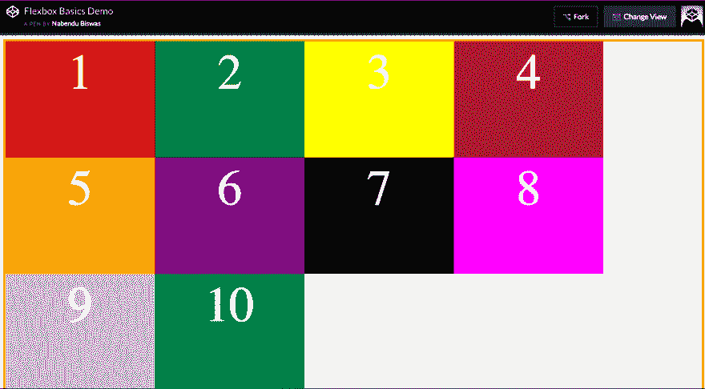
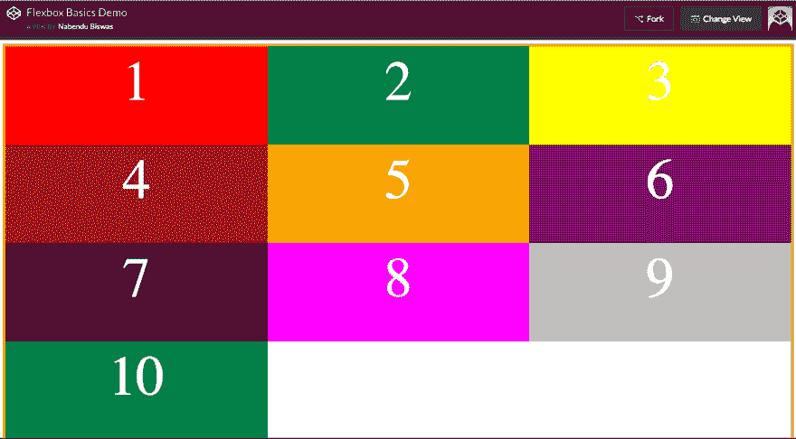
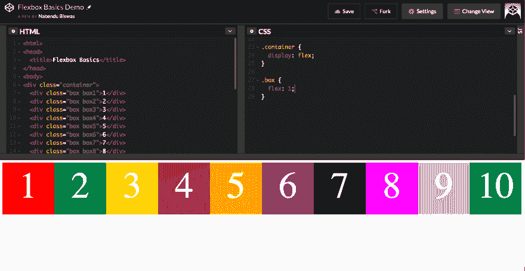
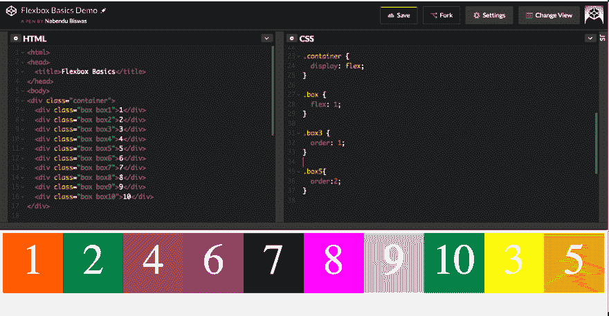

# Flexbox 基础知识— 1

> 原文：<https://dev.to/nabendu82/basics-of-flexbox-1-4dnk>

我开发网站已经有一段时间了。首先使用 Javascript，然后 React。我总是忽略 CSS，因为浮动很奇怪，没有响应。所以，走捷径，开始在 Bootstrap 中设计这些很酷的布局，并专注于 JS 部分的编程。但是现在又开始对 CSS 感兴趣了。我又在学习 CSS 了，现在用的是 flexbox，很快会学习 CSS grid。

我曾经认为 Flexbox 只是一个展示品，但是在 Wes Bos 和 Scott Tolinski 的精彩播客中我听说了很多

了解 Flexbox 的最佳资源是这篇关于 CSS 技巧的文章。此外，如果你想学习设计一个完整的网页布局，请点击[这里](https://css-tricks.com/designing-a-product-page-layout-with-flexbox/)

然后还有来自[韦斯·博斯](https://flexbox.io/)的这个很棒的**免费**教程

我正在 [codepen](https://codepen.io/nabendu82/pen/mLRxLR) 中创建这个。让我们首先创建我们的 html 结构。

```
<html>
<head>
 <title>Flexbox Basics</title>
</head>
<body>
<div class=”container”>
 <div class=”box box1">1</div>
 <div class=”box box2">2</div>
 <div class=”box box3">3</div>
 <div class=”box box4">4</div>
 <div class=”box box5">5</div>
 <div class=”box box6">6</div>
 <div class=”box box7">7</div>
 <div class=”box box8">8</div>
 <div class=”box box9">9</div>
 <div class=”box box10">10</div>
</div>
</body>
</html> 
```

然后是 CSS

```
* {
 box-sizing: border-box;
}
.box{
 color: white;
 font-size: 100px;
 text-align: center;
 padding: 10px;
}
.box1 {background: red;}
.box2 {background: green;}
.box3 {background: yellow;}
.box4 {background: brown;}
.box5 {background: orange;}
.box6 {background: purple;}
.box7 {background: black;}
.box8 {background: magenta;}
.box9 {background: silver;}
.box10 {background: teal;} 
```

添加后，您会看到，这是输出。

[ ](https://res.cloudinary.com/practicaldev/image/fetch/s--ws8VUV9G--/c_limit%2Cf_auto%2Cfl_progressive%2Cq_auto%2Cw_880/https://cdn-images-1.medium.com/max/2836/1%2Ah4EUTkAh--FueNdtt8_-lg.png) *输出*

现在，让我们的容器成为一个 flex，并且显示一个边界来理解它的作用。

```
.container {
 display: flex;
 border: 5px solid goldenrod
} 
```

现在，它基本上做的是在一行中对齐所有内容。

[ ](https://res.cloudinary.com/practicaldev/image/fetch/s--35VYG_NS--/c_limit%2Cf_auto%2Cfl_progressive%2Cq_auto%2Cw_880/https://cdn-images-1.medium.com/max/2850/1%2AIjXZqlZJrhiqVHPQxavZ9A.png) *显示:伸缩*

还有一个内嵌的 flex，它的宽度只有元素的宽度。

```
.container {
 display: inline-flex;
 border: 5px solid goldenrod
} 
```

[ ](https://res.cloudinary.com/practicaldev/image/fetch/s--fpEAj3aO--/c_limit%2Cf_auto%2Cfl_progressive%2Cq_auto%2Cw_880/https://cdn-images-1.medium.com/max/2848/1%2AcEmmEJGbiG2xNxVRmpRLfw.png) *显示:直列式伸缩*

**伸缩方向**
现在，我们将学习伸缩方向，但首先让我们的伸缩项目的高度为 100%。

```
.container {
 display: flex;
 border: 5px solid goldenrod;
 height: 100vh;
} 
```

它将显示如下输出。

[](https://res.cloudinary.com/practicaldev/image/fetch/s--cWn5Befq--/c_limit%2Cf_auto%2Cfl_progressive%2Cq_auto%2Cw_880/https://cdn-images-1.medium.com/max/2840/1%2ANOeM8s7UB1PWZOKcbPllpg.png)T3】身高:100vh

现在弯曲方向是主轴流动的方向。这是默认行。

```
.container {
 display: flex;
 border: 5px solid goldenrod;
 height: 100vh;
 flex-direction: row;
} 
```

它的输出和上面一样，但是注意主轴是从左到右-

[ ](https://res.cloudinary.com/practicaldev/image/fetch/s--bt-EAhnI--/c_limit%2Cf_auto%2Cfl_progressive%2Cq_auto%2Cw_880/https://cdn-images-1.medium.com/max/2840/1%2ArtfeFW3EBpv3_lIDzbUhnQ.png) *主轴从左到右*

现在让我们做弯曲方向:列。

```
.container {
 display: flex;
 border: 5px solid goldenrod;
 height: 100vh;
 flex-direction: column;
} 
```

检查输出，所有项目从上到下堆叠，因为主轴现在是从上到下。

[ ](https://res.cloudinary.com/practicaldev/image/fetch/s--tAK8sDL9--/c_limit%2Cf_auto%2Cfl_progressive%2Cq_auto%2Cw_880/https://cdn-images-1.medium.com/max/2838/1%2Az0W0W53K8bgbilKh7horDQ.png) *主轴现在是上下。*

现在，还有两个属性，我们很少在生产站点中使用，但它们确实存在。分别是
**-行-反转** -主轴从右向左会变成 ****-列-反转**-主轴从下往上会变成**。****

 ******柔性包装**
现在我们将了解柔性包装的特性。我们将使用下面的。

```
.container {
 display: flex;
 border: 5px solid goldenrod;
 height: 100vh;
}
.box {
 width: 300px
} 
```

它将显示如下。flex 正在做的是，首先计算宽度，即 300px x 10 = 3000px。但是通过显示不是 3000px 宽。在 1280 px 左右。

因此，flexbox 在 10 行之间分配空间。

[ ](https://res.cloudinary.com/practicaldev/image/fetch/s--tQUzRi-f--/c_limit%2Cf_auto%2Cfl_progressive%2Cq_auto%2Cw_880/https://cdn-images-1.medium.com/max/2832/1%2Azq87AHQHTjgBpblZhB8HyA.png) *分配空间*

现在，我们不想这样。并希望我们的 flex 项目为 300 像素宽。我们通过在父容器上设置 **flex-wrap: wrap** 来实现。

```
.container {
 display: flex;
 border: 5px solid goldenrod;
 height: 100vh;
 flex-wrap: wrap
}
.box {
 width: 300px
} 
```

它将使每个项目的宽度为 300 px，如果在这一行找不到任何空间，则将其换行到下一行。

[ ](https://res.cloudinary.com/practicaldev/image/fetch/s--Bt7Cmkgh--/c_limit%2Cf_auto%2Cfl_progressive%2Cq_auto%2Cw_880/https://cdn-images-1.medium.com/max/2830/1%2AXwk9ZllA61Qw2FzBYLMk-w.png) *柔性缠绕:缠绕*

我们也可以将 3 个项目的宽度设为 33.333%，以很好地填充一行(33.333 x 3 = 99.999)

```
.container {
 display: flex;
 border: 5px solid goldenrod;
 height: 100vh;
 flex-wrap: wrap
}
.box {
 width: 33.3333%
} 
```

它将显示如下。

[ ](https://res.cloudinary.com/practicaldev/image/fetch/s--L14o6sci--/c_limit%2Cf_auto%2Cfl_progressive%2Cq_auto%2Cw_880/https://cdn-images-1.medium.com/max/2832/1%2AwPN8b_-DG0d-BWK2axp6Tg.png) *宽度:33.3333%*

下面是一个很酷的技巧，给这些盒子之间的空白。我们必须这样做，因为利润不是箱式模型的一部分。

```
.container {
 display: flex;
 border: 5px solid goldenrod;
 height: 100vh;
 flex-wrap: wrap
}
.box {
 width: calc(33.3333% — 20px);
 margin: 10px;
} 
```

这会产生。

[ ](https://res.cloudinary.com/practicaldev/image/fetch/s--FnUwwsxS--/c_limit%2Cf_auto%2Cfl_progressive%2Cq_auto%2Cw_880/https://cdn-images-1.medium.com/max/2826/1%2AoHSxGNxbFDzaFbyev1Bx3Q.png) *宽度:calc(33.3333%—20px)；*

借助 border 也可以实现同样的效果。由于 border 是盒子模型的一部分，我们不需要 calc 减去任何东西。

[ ](https://res.cloudinary.com/practicaldev/image/fetch/s--0C1895Yh--/c_limit%2Cf_auto%2Cfl_progressive%2Cq_auto%2Cw_880/https://cdn-images-1.medium.com/max/2838/1%2Ap9UH7q0rmjwQqkb_0Tf6Zw.png) *空间利用边界*

**Flexbox 排序**
是一种移动 flex 项目排序的方式。

对于这个演示，我们将在 flex-item 中使用 **flex: 1** 。稍后我们将了解更多这方面的内容。基本上占满了整行。

[](https://res.cloudinary.com/practicaldev/image/fetch/s--S7_3kdDj--/c_limit%2Cf_auto%2Cfl_progressive%2Cq_auto%2Cw_880/https://cdn-images-1.medium.com/max/2844/1%2AcKavXy-m_PdQtHap1tf7aw.png)T3】flex:1

order 属性将项目按照流程的顺序放置，如前所述。如下图所示，第 3 项和第 5 项位于末尾，因为我们已经分别将它们的顺序设置为 1 和 2。默认情况下，项目 1 至 10 将成为订单 0。

[ ](https://res.cloudinary.com/practicaldev/image/fetch/s--z9KEcFcn--/c_limit%2Cf_auto%2Cfl_progressive%2Cq_auto%2Cw_880/https://cdn-images-1.medium.com/max/2850/1%2Awc1LF0O2AzTTl1Kv2g-YFQ.png) *顺序:1*****