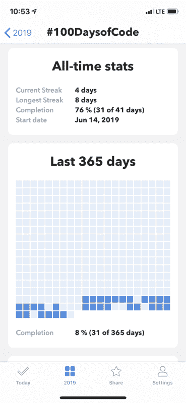

# 打破“可怕的墙”,度过#100DaysofCode 的前 30 天！

> 原文：<https://dev.to/tatianacodes/breaking-the-wall-of-awful-to-get-through-the-first-30-days-of-100daysofcode-5a2g>

# 选择性辉煌

22 岁时，被告知不，我不懒，我在学术上的选择性才华并不意味着我只是“没有得到”某些科目，相反，我患有多动症就像得到了一副新眼镜。我终于能看见了。当然，我以前可以看到，但现在一切都是清晰的 4k。

当然，在一个“不相信”多动症或其他心理健康问题的文化中长大，意味着这个诊断是苦乐参半的。我从来不是那种在学校或杂货店里无法驯服的极度野性的孩子。当你想到患有多动症的孩子时，你不会想到这种类型的孩子。但是我经常健忘，有支出问题，并且在凌晨 2 点感觉到去维基百科兔子洞的极端冲动，因为我刚刚在那个时刻*有*去了解水力压裂技术的出现。当我还在纠结我的诊断，以及它是如何不知不觉地影响了我的成长和经历时，我意识到它也给了我解决下一个努力的工具:**编码**。

我因为每隔一周就有新的激情而臭名昭著。我最近发现这种行为在多动症患者中很普遍。每一个新的爱好都是你新的激情，每一条新的令人兴奋的职业道路对你来说都是“它”。每一个新的努力都是为了结束所有其他的努力，直到我们厌倦了它，或者对缺乏立竿见影的效果感到沮丧，或者它变得太困难。冲洗并重复。(这叫爱好跳跃。)

# 潜入编码...又

这可能是我第三次或第四次尝试编码。每次我都从 Codecademy 和免费代码营等资源开始。对于初学者来说，它们是很好的资源——但对于像我这样学习方式不同、思维方式不同于大多数人的神经发散型人来说，可能就不是了。许多多动症患者需要结构来茁壮成长，但同时如果结构变得过于霸道，他们就会拒绝相同的结构。

这种对某种结构的需要，但不是太多，把我带到了 Udemy。作为一个在技术领域(IT 项目管理和创业社交媒体管理)有一些经验的完全初学者，实际上编码是一个如此广泛的话题，有如此多不同的子部分，它可能会变得令人不知所措。考虑到多动症，这也导致从来没有真正开始做任何事情。在实际执行之前，我们倾向于过度研究和考虑 1400 万种可能性。有了亲自挑选课程的真人教授的课程，我可以自己决定进度并遵循特定的路径。然而，这并没有阻止我渴望尝试 Javascript，哦，等等，Python，哦，不，Swift，等等，让我再买 10 门我 3 个月后才开始的课程！或者让我们尝试每一个可能的 CSS 框架！

对于患有注意力缺陷多动症的人来说，我们经常会被发现想做任何事情，这导致我们从来没有做过任何事情。但是，一旦我们最终坚持某事，我们就有了另一个需要突破的障碍——糟糕之墙。

# 可怕的城墙

这篇毫无必要的长篇文章的重点是，对于患有 ADHD 的人来说，我们需要找到我们的最佳位置来越过可怕的墙。糟糕之墙是人们(无论是否患有多动症)发现在某些任务上难以前进的原因。当然，遛狗需要大约 5 分钟。但是，这是一个痛苦的过程，要你自己爬起来，和狗争吵，带着狗绕着街区转，然后爬上楼梯回到你的公寓。我们可以把它推迟到小狗哀嚎到心碎的时候。比，哦，实际上付出努力要容易得多。你可以看到为什么编码，以及真正学习和创造东西所花费的时间和精力，这堵墙可能很难跨越。说“我明天写代码”是非常容易的。我明天会完成我的课程。”但这扼杀并摧毁了我可能取得的任何进展。

# 我是如何对抗可怕的城墙的？

对我来说，责任是关键。我目前使用 iOS 版的应用程序[Super habitat](https://www.superhabit.co/)来追踪我的#100DaysOfCode“习惯”。看到一点 Github 风格的 streak 视图对我来说非常有趣——看到这种动力是我前进的动力。

我还下载了 [Flora](https://flora.appfinca.com/) ，这是一个番茄风格的应用程序，你可以用你在应用程序中花费的所有时间来创建一个花园。每次我在定时器运行时使用手机后杀死一棵树，我都觉得自己是一个可怕的人，所以你可以说这是一个很好的动力，让我在试图编码或学习新概念时远离我的手机。

我也开始在社交媒体上公开要求自己承担责任。在我关于激进主义和流行文化的推文中，我不断地在推文中讲述我的编码之旅。每当我达到一个里程碑，我都会在 LinkedIn 上发布消息。我的 Instagram 故事和个人资料上有一个编码亮点。见鬼，连脸书都知道。如果我突然离开我的旅程，知道有成千上万的眼睛在看着我会有所帮助——为什么要面对在社交媒体上连续几天努力做的事情失败的公共耻辱？哦，太恐怖了。想想我会失去的喜欢。/s。

# 这很好，但是你实际的编码之旅呢？这就是我读这篇文章的原因。

自从 2019 年 6 月 14 日第一天加入 Dev.to 以来，我已经在草稿中写了几周了。周一，我开始了 30 天的#100DaysofCode。在那段时间里，我重新学习了 HTML 和 CSS(我年轻时花了很多时间在 Neopets 和 Gaia Online 上“编码”我的个人资料)，我正在钻研 Javascript。我想我已经找到了一个 Javascript 爱好者——对于我来说，从人文和社会科学背景转向解决需要数学的问题是令人麻木的困难，但我的 [ADHD 超聚焦](https://www.webmd.com/add-adhd/hyperfocus-flow)迫使我尽可能以最好的方式继续尝试，直到我找到解决方案。你们这些经验丰富的程序员称之为“流”。我昨晚在尝试将 dev.to 重新创建为 HTML/CSS 练习时发现了这个流。在我成为一名 web 开发人员的旅程中，没有比这更好的感觉了。

总之，我想我终于在编码中找到了“它”。30 天是我在一个爱好上坚持的最长的时间，不是被迫坚持的(我在看你，钢琴和舞蹈)。我的旅程可能会比神经正常的人更难一些——我可能需要比 NT 人多 5 或 6 次地回顾基本概念，然后才能坚持下来(即使这样，也可能坚持不下来)，我可能需要一遍又一遍地重新观看教程，我可能会错过非常明显的结尾()/{ }/[]/；由于我臭名昭著的速度和粗心大意，一两个小时，但这是寻找解决方案，让我继续前进。

另外，对 r/ADHD_Programmers 大声喊出来，因为它是一个社区，其他 ADHD 大脑可以聚集在一起，并就行动太快以至于赶不上自己的共同经历进行联系。

为接下来的 69 天代码干杯！