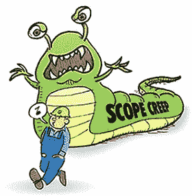

# 什么导致范围蔓延以及如何避免它

> 原文：<https://dev.to/actitime/what-causes-scope-creep-and-how-to-avoid-it-2nm9>

现在已经是网店计划上线日期的三个月之后了。不过，客户不会责怪任何人:他们真的很喜欢最初的概念最终变成的样子，并期待着…

哦，等等。我们刚才是说最终吗？但在昨天的会议上，客户代表听项目经理讲述新的建议将如何扩大范围、增加预算和推迟交付日期，并兴奋地坚持再给新的闪亮移动应用程序三个月时间和数十亿美元。该项目似乎不再是可预测的，更不容易管理。

谁也不知道什么时候能最终交付。范围蔓延庆祝其辉煌的胜利。

## 为什么会发生范围蔓延

作为一个复杂的问题，范围蔓延是各种决策的结果，也是缺乏决策的结果。其中大部分与规划阶段有关，但不是全部。因此，为了更好地了解敌人，让我们仔细看看是什么导致了范围蔓延。

### 项目范围定义不够清晰

模糊定义的最终产品的预期结果和特性为特性蔓延打开了大门——产品中新特性的不断扩展。它们不一定是关键的或重要的；大多数情况下不是。它的负面影响不仅限于项目交付的延迟:功能蔓延最不利的影响是过度复杂的设计，过多的功能，结果是没有人真正想使用的产品。

### 改变了客户的优先事项或需求

这种情况经常发生:客户改变主意，想要以同样的价格获得更多，在项目过程中做出与项目相关的决定，或者看到竞争对手的产品并意识到他们想要类似的东西。这导致了对项目团队的新请求，需求的变化，以及上面提到的特性蔓延。同样，适应新的需求和交付新的特性需要时间——大量且不可预测的时间。

### 对利益相关者及其需求的识别不佳

在项目开始时，利益相关者没有被明确识别，他们的利益没有被考虑或平衡，这种情况并不少见。尤其是像[柏林勃兰登堡机场](https://en.wikipedia.org/wiki/Berlin_Brandenburg_Airport)这样的大型项目，这里有太多的利益相关者，而且并不是所有的利益相关者都对项目的尽早交付感兴趣。

### 对什么是必要的和合理的最初分析很差

客户在项目过程中要求的并不总是不必要的花里胡哨。有时，对新特性请求的分析表明，该特性对最终产品至关重要。这可以在项目开始之前，在规划阶段就确定下来——但这在事后比在现实中更容易做到。

### 无力说不

众所周知，客户永远是对的，这是范围蔓延的另一个原因。一个不能对客户说不的项目经理或缺乏这样做的权力的项目经理不能阻止项目的扩展，时间、劳动力和成本不受控制地增长。此外，不够警惕和允许新的特性被添加到范围中会导致模糊的边界和不清楚的需求。

## 如何避免范围蔓延

无论您的项目计划得多么彻底，范围蔓延总是潜伏在周围。不给它留有余地是这里的关键:对项目范围的仔细控制应该在项目的实际工作开始之前开始。这里有一个范围控制步骤的清单，它不会让范围蔓延侵占你的项目。

### 确定所有利益相关者并理解他们的目标

在开始项目工作之前做:提前确定所有相关方的愿景、兴趣和要求是项目规划阶段的必要步骤。它降低了项目工作中范围变更的风险，并有助于避免由于利益不明而导致的冲突。[多沟通](/project-management/successful-communication)了解每个人的愿景和期望，根据需求对项目目标的重要性确定需求的优先级。

### 明确定义项目范围

规划阶段的另一个不可或缺的步骤，需要密切关注细节。在这里，重要的是不仅要定义项目范围包括什么，还要列出不包括什么。这将误解的风险降至最低，并减少了新请求、建议和要求的数量。一个清晰的范围计划还可以防止[镀金](https://en.wikipedia.org/wiki/Gold_plating_(project_management))——一个开发不必要增强的资源消耗过程。

### 提前计划好变化的空间

悲哀却真实:不是所有的风险都可以预见和防范，修改是不可避免的。这就是为什么变更控制和管理程序应该被清楚地定义和记录，并且需要为可能的修改提供空间。确保您的变更管理过程专注于项目目标，并仔细记录做出项目范围修改决策所需的步骤。

### 尽早采取行动

在早期阶段识别并解决可能的范围蔓延。需要听取、记录来自客户或发起人的新建议、更新的需求或团队对时间估计变更的反馈，并与相关方沟通以供考虑。你越早做出改变的决定，它对项目过程和结果的有害影响就越小。

### 知道什么时候说不

实现所有建议的特性和功能很有诱惑力，但是对于项目交付时间、预算和产品本身来说很少是好的。对不合理的耗时和昂贵的功能和部分工作说不，对于按时交付高质量的产品是至关重要的。确保你有说不的理由:在开发和质量保证上花费太多时间，膨胀的预算(可能不仅包括劳动力成本，还包括后勤、法律等。费用)，或者过于复杂的产品设计。

## 如果已经发生了该怎么办

当你已经注意到一个项目的范围在扩大时，该如何处理这个项目？第一个明显的步骤是减缓或停止扩张。然而，要使之成为可能，您需要收回对项目范围和过程的控制。怎么会？

### 理解新要求和建议的重要性

新的功能建议可能只是镀金——或者完全合理的改进。建立一个考虑它们对最终结果的重要性的过程。如果你发现它们对产品的功能很重要，符合需求并且需要被实现，准备对项目范围进行必要的变更。

### 确定根本原因

确定范围蔓延开始的原因对于重新获得对它的控制很有帮助。根据它，最初的对策可以是弥补确定项目边界的差距，平衡涉众的利益，重新确定特性的优先次序，或者其他最小化或停止范围蔓延过程的事情。

### 分析范围蔓延的影响

在开始时，并不总是清楚膨胀的范围将如何影响交付日期、项目预算和劳动力投入。分析已经花费的时间和预算，预测未来的费用，并准备一份包含最终项目成本精确数字的报告。这将有助于该进程的所有参与者了解问题的规模和可能的后果。这些数据还可以用于重建流程，并使其适应必要的更改。

### 与利益相关方一起找到解决方案

准备您关于如何停止或防止范围蔓延的建议，并与项目风险承担者交流，试图找到适合每个人的解决方案。

## 摘要

在大多数情况下，项目经理是负责范围蔓延的人，也是能够防止范围蔓延的人。采取必要的措施在一开始就识别其征兆并将其后果最小化是项目管理工作的一个重要部分。定义良好并记录在案的过程在这里是关键:确定工作的优先级，检查新建议如何与项目目标保持一致，以及有效地管理变更只有在为项目管理过程的每个步骤定义了清晰的过程的情况下才是可能的。