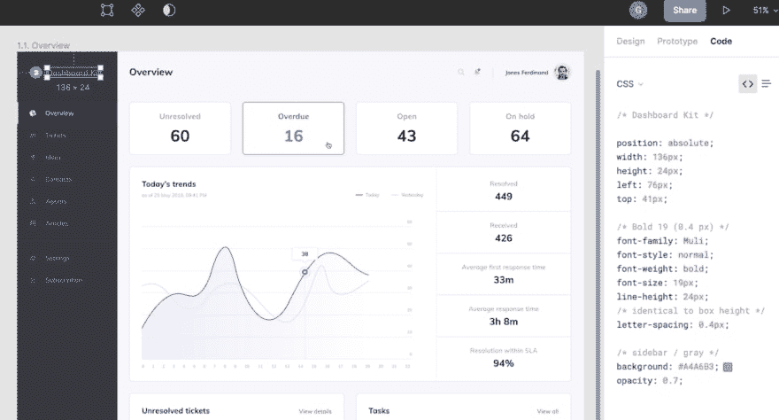
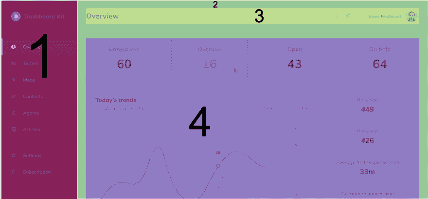
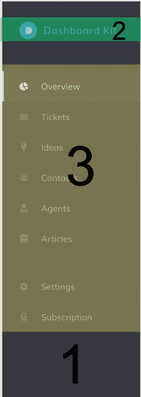

# 基于带有 ReactJS 的设计，从头开始构建 UI

> 原文：<https://dev.to/llorentegerman/building-a-ui-from-scratch-based-on-a-design-with-reactjs-3l1e>

这是`Building a UI from scratch`系列的第一篇文章:

*   第 1 部分:[基于 ReactJS](https://dev.to/llorentegerman/building-a-ui-from-scratch-based-on-a-design-with-reactjs-3l1e) 的设计，从头开始构建 UI。
*   第 2 部分:[从头开始构建 UI，响应式侧边栏和标题](https://dev.to/llorentegerman/building-a-ui-from-scratch-responsive-sidebar-and-header-443g)。
*   第 3 部分:[从头开始构建 UI，响应内容](https://dev.to/llorentegerman/building-a-ui-from-scratch-responsive-content-6b9)。

在这篇文章中，我们将建立一个遵循设计的 UI。我们将使用`Figma`来可视化设计，但也可以使用任何其他工具，让您从元素中提取 CSS 代码，如`invisionapp`、`zeplin`等。

*用[西班牙语](https://github.com/llorentegerman/react-admin-dashboard/blob/master/README.es.md)读这篇文章*

**现场演示**:【https://llorentegerman.github.io/react-admin-dashboard/ T2】

**储存库**:【https://github.com/llorentegerman/react-admin-dashboard】T2

### 上传设计至 Figma

我不会进入关于工具的细节，我们只需要一个设计。

1.  在[https://www.figma.com](https://www.figma.com)创建一个账户(免费)。
2.  我从[https://www.figmafreebies.com](https://www.figmafreebies.com)中随机选择了一个 *Figma 文件*(免费)。选择的文件是: [Figma 管理仪表板 UI 套件](https://www.figmafreebies.com/download/figma-admin-dashboard-ui-kit/)。我用的是网页版的 Figma，所以，你要点击`DOWNLOAD FREEBIES`按钮，设计就会添加到你的账户里。
3.  您可以双击每个元素，并在右栏的`code`选项卡中查看与之相关的 css 代码。

[](https://res.cloudinary.com/practicaldev/image/fetch/s--caOJkuZ5--/c_limit%2Cf_auto%2Cfl_progressive%2Cq_auto%2Cw_880/https://i.postimg.cc/76vy3ckT/screenshot3.png)

### 创建应用程序

对于这一步，我们将使用[创建反应应用](https://facebook.github.io/create-react-app/) :

```
npx create-react-app react-admin-dashboard 
```

我们将使用[阿芙罗狄蒂](https://www.npmjs.com/package/aphrodite)设计款式，使用[简单柔性盒](https://www.npmjs.com/package/simple-flexbox)设计版面。

`yarn add aphrodite simple-flexbox`或`npm install aphrodite simple-flexbox`

### 文件夹结构:

对于这种情况，我们可以保持一个简单的结构:

```
/src
    /assets
    /components
    App.js 
```

## 开始吧

我们已经准备好开始了，首先我们需要确定设计的主要模块。我决定把它分成 4 个主要部分，如下:

```
1- Sidebar
2- Main Block
    3- Header
    4- Content 
```

如图所示，区块 3 和区块 4 位于区块 2 内。

[](https://res.cloudinary.com/practicaldev/image/fetch/s--Ohsznsw3--/c_limit%2Cf_auto%2Cfl_progressive%2Cq_auto%2Cw_880/https://i.postimg.cc/bNxzNq1S/screenshot1.png)

### 侧栏

我们可以把侧边栏分成两部分，`Logo`块和`MenuItem`列表。
我们为此需要 3 个组件:

```
1- SidebarComponent
    2- LogoComponent
    3- MenuItemComponent (list) 
```

[](https://res.cloudinary.com/practicaldev/image/fetch/s--ZdE9JZf---/c_limit%2Cf_auto%2Cfl_progressive%2Cq_auto%2Cw_880/https://i.postimg.cc/qvppNWGb/screenshot2.png)

**我们将开始定义徽标和菜单项**

#### LogoComponent.js

首先，我们需要下载徽标(双击徽标，转到`Design`选项卡，然后单击下面的导出按钮)。我以`svg`格式下载了它，并将其作为 React 组件导入，要复制它[请点击此处](https://github.com/llorentegerman/react-admin-dashboard/blob/v1-0-0/src/assets/icon-logo.js)。

`LogoComponent.js`是一个纵横居中的`Row`，有`Logo`和`title`。