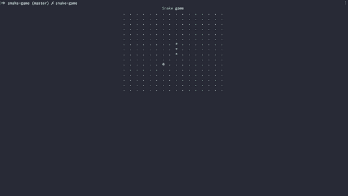

# 使用 React 的命令行应用-贪吃蛇游戏教程

> 原文：<https://dev.to/satansdeer/command-line-applications-using-react-snake-game-tutorial-g4p>

在本教程中，我们将学习如何使用 React 和 Javascript 构建一个 CLI 程序。我们将使用墨水库构建一个经典的贪吃蛇游戏。

React 最强大的特性之一是它支持不同的渲染器。这意味着您不会受到浏览器和 DOM 的限制。

最著名的例子是反应式，但也有其他技术。React 在游戏开发中被积极地用于构建 UI(战地 V UI，《我的世界》发射器，等等)

当我看到 [Ink](https://github.com/vadimdemedes/ink) - react 渲染器输出到控制台时，我的想法被震惊了！

## 新建墨迹 App

让我们从引导控制台应用程序开始。

为您的项目创建新目录。打开目录并运行`create-ink-app` :

```
mkdir snake-game
cd snake-game
npx create-ink-app 
```

Enter fullscreen mode Exit fullscreen mode

(可选)我更喜欢使用空格来缩进——所以我打开`.editorconfig`并将`indent_style`切换到`space`

## 显示游戏场

Ink 提供了一组要显示的组件。我们将使用`Text`和`Box`。`Box`有点类似于 HTML 中的`div`。

定义字段大小:

```
const FIELD_SIZE = 16
const FIELD_ROW = [...new Array(FIELD_SIZE).keys()] 
```

Enter fullscreen mode Exit fullscreen mode

然后我们创建一个数组，用来生成游戏区域的单元格。

将`App`组件的返回值改为:

```
<Box flexDirection="column" alignItems="center">
<Text>
  <Color green>Snake</Color> game
</Text>
<Box flexDirection="column">
  {FIELD_ROW.map(y => (
    <Box key={y}>
      {FIELD_ROW.map(x => (
        <Box key={x}> . </Box>
      ))}
    </Box>
  ))}
</Box>
</Box> 
```

Enter fullscreen mode Exit fullscreen mode

默认情况下，`Box`组件有`display: flex`。而且你还可以指定其他`flex`属性作为自己的道具。

你可以运行游戏来看看它会呈现什么:

```
snake-game 
```

Enter fullscreen mode Exit fullscreen mode

您应该看到这个:

[](///static/1b0b169e1bf26405ca00818cb9c1c116/47961/snake-game-0.png)

## 添加食物和蛇

是时候给我们的游戏添加物品了。

定义`foodItem`保持食物的当前位置。将此添加到全局范围:

```
let foodItem = {
x: Math.floor(Math.random() * FIELD_SIZE),
y: Math.floor(Math.random() * FIELD_SIZE),
} 
```

Enter fullscreen mode Exit fullscreen mode

将`snakeSegments`定义为`App`组件中的`useState`钩子，以保持我们的蛇形位置。这将是一系列的蛇的身体部分。

```
const [snakeSegments, setSnakeSegments] = useState([
{ x: 8, y: 8 },
{ x: 8, y: 7 },
{ x: 8, y: 6 },
]) 
```

Enter fullscreen mode Exit fullscreen mode

用以下内容定义`getItem`函数:

```
const getItem = (x, y, snakeSegments) => {
if (foodItem.x === x && foodItem.y === y) {
  return <Color red></Color>
}

for (const segment of snakeSegments) {
  if (segment.x === x && segment.y === y) {
    return <Color green>■</Color>
  }
}
} 
```

Enter fullscreen mode Exit fullscreen mode

现在更新我们的`App`的返回值，用`getItem`代替渲染点。

```
<Box flexDirection="column" alignItems="center">
<Text>
  <Color green>Snake</Color> game
</Text>
{intersectsWithItself ? (
  <EndScreen size={FIELD_SIZE} />
) : (
  <Box flexDirection="column">
    {FIELD_ROW.map(y => (
      <Box key={y}>
        {FIELD_ROW.map(x => (
          <Box key={x}> {getItem(x, y, snakeSegments) || "."} </Box>
        ))}
      </Box>
    ))}
  </Box>
)}
</Box> 
```

Enter fullscreen mode Exit fullscreen mode

现在，如果在特定的点上有食物或蛇的部分，我们就渲染它而不是点。

这次运行游戏后，您应该会看到:

[](///static/edb3256388b99da245f11e00faf4f8bf/8e724/snake-game-1.png)

## 使蛇移动

现在我们需要添加一个游戏计时器，每 50 毫秒更新一次游戏状态，这样我们就可以移动我们的蛇了。

在 React 中使用计时器并不是那么简单，丹·阿布拉莫夫有一篇关于这个的文章。我们将从中使用`useInterval` hook 实现。

创建包含以下内容的文件`useInterval.js`:

```
"use strict"
const { useEffect, useRef } = require("react")

module.exports = function useInterval(callback, delay) {
const savedCallback = useRef()

useEffect(() => {
  savedCallback.current = callback
}, [callback])

// Set up the interval.
useEffect(() => {
  function tick() {
    savedCallback.current()
  }
  if (delay !== null) {
    let id = setInterval(tick, delay)
    return () => clearInterval(id)
  }
}, [delay])
} 
```

Enter fullscreen mode Exit fullscreen mode

创建`DIRECION`常量来保存我们的蛇可以走的方向:

```
const DIRECTION = {
RIGHT: { x: 1, y: 0 },
LEFT: { x: -1, y: 0 },
TOP: { x: 0, y: -1 },
BOTTOM: { x: 0, y: 1 }
}; 
```

Enter fullscreen mode Exit fullscreen mode

在我们的`App`组件:
中使用`useState`钩子创建新的变量`direction`

```
const [direction, setDirection] = useState(DIRECTION.LEFT) 
```

Enter fullscreen mode Exit fullscreen mode

创建新的函数，名为`newSnakePosition`

```
function newSnakePosition(segments, direction) {
const [head] = segments
return segments.map(segment => ({
  x: limitByField(segment.x + direction.x),
  y: limitByField(segment.y + direction.y),
}))
} 
```

Enter fullscreen mode Exit fullscreen mode

`newSnakePosition`使用`limitByField`函数处理我们的蛇的非机载位置。实现此功能:

```
const limitByField = x => {
if (x >= FIELD_SIZE) {
  return 0
}
if (x < 0) {
  return FIELD_SIZE - 1
}
return x
} 
```

Enter fullscreen mode Exit fullscreen mode

现在我们可以使用`setInterval`来调用`setSnakeSegments`,在我们的`App`组件:
中使用`newSnakePosition`

```
useInterval(() => {
setSnakeSegments(segments => newSnakePosition(segments, direction))
}, 50) 
```

Enter fullscreen mode Exit fullscreen mode

此时，你的游戏应该是这样的:

[](https://res.cloudinary.com/practicaldev/image/fetch/s--jRfxG4WW--/c_limit%2Cf_auto%2Cfl_progressive%2Cq_66%2Cw_880/https://maksimivanov.com/snake-game-2-4697a69f79372a428c8eb32831d82254.gif)

## 使蛇正常移动

现在这条蛇正横着移动。我们需要更新`newSnakePosition`函数来修复它。

更新`newSnakePosition`函数的内容以匹配以下内容:

```
function newSnakePosition(segments, direction) {
const [head] = segments
const newHead = {
  x: limitByField(head.x + direction.x),
  y: limitByField(head.y + direction.y),
}
return [newHead, ...segments.slice(0, -1)]
} 
```

Enter fullscreen mode Exit fullscreen mode

## 实现进食和生长

是时候实行吃长了。为此，我们需要检测蛇头与食物的碰撞。

执行`collidesWithFood`功能:

```
function collidesWithFood(head, foodItem) {
return foodItem.x === head.x && foodItem.y === head.y
} 
```

Enter fullscreen mode Exit fullscreen mode

这里我们检查蛇的`foodItem`和`head`是否有相同的位置。

现在在`newSnakePosition`函数中使用它:

```
function newSnakePosition(segments, direction) {
const [head] = segments
const newHead = {
  x: limitByField(head.x + direction.x),
  y: limitByField(head.y + direction.y),
}
if (collidesWithFood(newHead, foodItem)) {
  foodItem = {
    x: Math.floor(Math.random() * FIELD_SIZE),
    y: Math.floor(Math.random() * FIELD_SIZE),
  }
  return [newHead, ...segments]
} else {
  return [newHead, ...segments.slice(0, -1)]
}
} 
```

Enter fullscreen mode Exit fullscreen mode

在这里，我们总是回到`newHead`的位置，然后如果我们撞上了食物，我们会把食物传送到一个新的位置。

## 添加游戏结束

此时，游戏应该可以玩了。但是不可能松开。让我们解决这个问题。

在`App`组件:
中使用`useInterval`之前添加这段代码

```
const [head, ...tail] = snakeSegments
const intersectsWithItself = tail.some(
segment => segment.x === head.x && segment.y === head.y
) 
```

Enter fullscreen mode Exit fullscreen mode

当蛇咬自己时，我们需要停止游戏。在`useInterval`调用中添加这个三元运算符。

```
useInterval(
() => {
  setSnakeSegments(segments => newSnakePosition(segments, direction))
},
intersectsWithItself ? null : 50
) 
```

Enter fullscreen mode Exit fullscreen mode

当 snake 与自身相交时，它会通过将超时设置为`null`来禁用间隔。

现在添加结束屏幕。创建包含以下内容的新文件`EndScreen.js`:

```
"use strict"

const React = require("react")
const { Color, Box } = require("ink")

module.exports = ({ size }) => (
<Box
  flexDirection="column"
  height={size}
  width={size}
  alignItems="center"
  justifyContent="center"
>
  <Color red>You died</Color>
</Box>
) 
```

Enter fullscreen mode Exit fullscreen mode

使用`importJsx`导入`ui.js` :
中的`EndScreen`

```
const EndScreen = importJsx("./EndScreen") 
```

Enter fullscreen mode Exit fullscreen mode

更新`App`组件的返回值以匹配这个:

```
<Box flexDirection="column" alignItems="center">
<Text>
  <Color green>Snake</Color> game
</Text>
{intersectsWithItself ? (
  <EndScreen size={FIELD_SIZE} />
) : (
  <Box flexDirection="column">
    {FIELD_ROW.map(y => (
      <Box key={y}>
        {FIELD_ROW.map(x => (
          <Box key={x}> {getItem(x, y, snakeSegments) || "."} </Box>
        ))}
      </Box>
    ))}
  </Box>
)}
</Box> 
```

Enter fullscreen mode Exit fullscreen mode

这是一个基于 CLI 反应的贪吃蛇游戏！

[](///static/3915d0d233a14576cf653183dbc2aff4/0f696/snake-final.png)

## 结论

尽管 Ink 并不打算制作游戏——正如你所看到的，这也是完全可能的。

我喜欢现在创建任何复杂程度的 cli 应用程序是如此容易，耶！

这是一个包含所有代码的[回购。如有任何问题，请在](https://github.com/satansdeer/snake-game)[电报](https://t.me/satansdeer)中通知我。