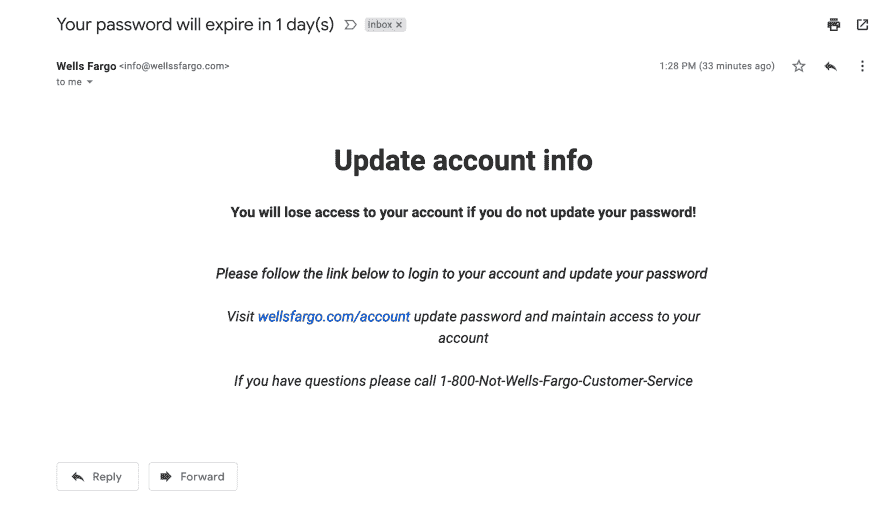
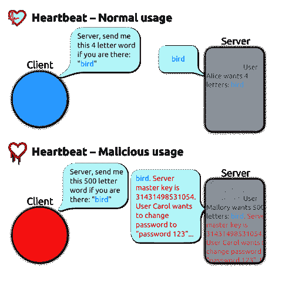

# 黑客 101

> 原文：<https://dev.to/spencerlindemuth/hacking-101-122c>

# 做黑客实际上意味着什么？

#### 下面是一个黑暗网络黑客的行动片段:

[](https://i.giphy.com/media/bv4U1HR7W2XQc/giphy.gif)

黑客显然是找到正确的滑雪面罩和巧妙使用你的香蕉手的精确结合。2017 年 Equifax 数据泄露事件背后的人通过使用一种称为多端口利用的技术穿透了防火墙，他们巧妙地使用了一整只 *buschel* 香蕉来一次攻击多个端口。

玩笑归玩笑，仅 Equifax 泄露了超过*1 . 45 亿*美国人的姓名、社会安全号码、地址、出生日期和驾照号码的事件，就是通过利用 [Apache Struts](https://en.wikipedia.org/wiki/Apache_Struts_2) 中的一个缺陷、Equifax 糟糕的加密技术和不足的漏洞检测机制实施的。那么这就是**黑客**是什么？找到**系统**中的**缺陷**，并且**利用**高级**编程技术利用**缺陷？当然可以！虽然这些都是我们在电视上听到的关于黑客的流行词，但也可能是其他太多的东西！这确实可以归结为一个古老的问题...在你的朋友们使用洗手间的时候向他们发布 facebook feed？

[](https://res.cloudinary.com/practicaldev/image/fetch/s--296Ns5DZ--/c_limit%2Cf_auto%2Cfl_progressive%2Cq_auto%2Cw_880/http://images.junkee.com/wp-content/uploads/2014/07/hack.jpg)

黑客行为被定义为:“未经授权获取系统或计算机中的数据”。

根据定义，这意味着在你朋友的账户上发帖*是*黑客行为！哇！那说明我们都是黑客！因此，有了这些关于我们自己的新知识，从世界上最大的信用报告机构之一窃取一些数据应该是很容易的*！我们只需等待系统管理员起床使用洗手间！虽然这听起来有些滑稽和牵强，但它让我们想到了最不为人知的**黑客**技术:*

 *## 社会工程

社会工程是:使用欺骗手段操纵个人泄露机密或个人信息，这些信息可能被用于欺诈目的。这听起来很模糊，所以让我们把它分解成几个例子。

#### 网络钓鱼:

网络钓鱼是利用欺骗性网站和电子邮件，从人们那里获取个人信息，从而获得对其账户的未授权访问。

[](https://res.cloudinary.com/practicaldev/image/fetch/s--9VlEXSvy--/c_limit%2Cf_auto%2Cfl_progressive%2Cq_auto%2Cw_880/https://imgur.com/axJNvDp.jpg)

如果我们更深入地研究这封电子邮件，我们会对什么是网络钓鱼有所了解。首先，我们注意到我们收到这封邮件的地址是*靠近*wellsfargo.com，但在那里偷偷加了一个额外的“s ”,试图让收件人看都不看一眼。接下来我们有一个带有*文本*:“wells Fargo . com/account”的嵌入式超链接，但是如果你将鼠标悬停在该链接上，你会看到它实际上链接到“[http://www . some-sketchy-site-that-looking-like-wells-Fargo . com](http://www.some-sketchy-site-that-looks-like-wells-fargo.com)”。一个优秀的网络钓鱼者会将您发送到一个看起来与目标网站登录页面一模一样的网站，然后在您在输入字段中键入您的凭据后，以纯文本形式记录它们，并告诉用户登录出错，以从用户那里获得*甚至更多的*密码变体，或者重定向到实际的目标网站，并为成功窃取信息而击掌庆祝。接下来，我们看到一个客户服务热线的电话号码。如果我们在安全问题上*明智的话*我们会打电话给客户服务热线，以确保这封邮件是合法的！于是我们拿起座机，拨打屏幕上的号码，电话那头传来一个非常好听的声音，他几乎*太*渴望让我们验证一些账户信息，然后告诉我们这个链接确实是合法的！现在你感觉更安全了！现在你已经给了**黑客**足够的信息来进入你的银行...可能还有你所有的社交媒体账户...你的电子邮件呢...*还有你的工作邮箱...*你的工作电脑呢...现在这是一场全面的企业攻击。

#### 前门社会工程:

前门社会工程是欺骗 RFID 标签，跟踪人们通过门，上电梯或伪装成其他人非法进入系统。有一句名言，

*   “如果你有一个写字板和一件安全背心，你可以走进任何地方”

同样的事情也适用于 it 人员、系统管理员、门卫以及任何在公司办公室工作的人。一个系着白色纽扣、打着领带的人，可以走进一家公司的办公室说，“这层楼有人开了一张 I.T .票吗？”有人举手，然后冒名顶替者评论道，“如果你想去喝杯咖啡，这可能需要几分钟。”现在这个冒名顶替者在无人监管的情况下在一个工作站上工作，将用户数据和电子邮件复制到一个闪存盘上。这听起来有些牵强，但却是一种令人惊讶的常见“黑客”手段。ey 2017 年全球信息安全调查发现，74%的网络攻击来源是粗心或没有意识到的员工。这是对一个系统的利用，但不是读取 1 和 0 并通过以太网通信的系统。这是对人及其中枢神经系统的剥削。人们不顾一切地取悦、帮助和避免后果，而*黑客*每天都在利用这一点，因为这比在互联网上过滤数百万行代码来找到漏洞要容易得多。

## 网络攻击

不要害怕！这不是那种我用黑客之类的话题引诱你，然后告诉你事情并不像你想象的那样，从而让你陷入困境的文章。每天仍有大量的网络攻击发生。这是更传统意义上的*黑客攻击*。这是一个人在一个废弃的仓库里，周围是服务器，在空中悬挂的网格中有 9 个显示器，在电影中看到的 bash 终端中键入。从这个意义上来说，当分解成更小的部分时，黑客攻击是非常简单和直接的，尽管技术并非如此。通俗地说，这个意义上的黑客就是在某些代码中找到错误，并利用它在远程机器上获得对数据的未授权访问或执行代码。这也是一个模糊的描述，我们来分解一下。

#### 远程代码执行

远程代码执行是每个黑客的梦想。黑客找到了一种向机器发送代码的方法，机器运行代码，返回信息，或者为更大的利用打开大门。一个很好的例子是 2015 年的 Android [Stagefright](https://en.wikipedia.org/wiki/Stagefright_(bug)) 媒体服务器漏洞，或者 2014 年的 [Shellshock](https://en.wikipedia.org/wiki/Shellshock_(software_bug)) hack，它被描述为“当命令连接到存储在环境变量值中的函数定义的末尾时，导致 Bash 无意中执行命令。”技术上的解释是，当 Bash 打开一个新实例时，它会在一个称为环境变量的表中读取一系列预定义函数，并在不验证它们是否合法创建的情况下执行它们。这在许多不同的载体中被利用，例如开放 SSH 和通过 DHCP 请求，黑客可以将专门的权限提升函数附加到对服务器的请求上，服务器将打开 bash 来执行初始命令，而不验证附加的代码，并随意运行所有命令。

#### 代码注入

代码注入是对计算机缺陷的利用，该缺陷是由处理无效数据引起的，并且是远程代码执行和系统操作的一部分。这是脚本小子落入的类别，并且在最常见的攻击列表中名列前茅。代码注入画布 SQL 注入，脚本和数据包欺骗。这是一种利用糟糕的代码和缺乏输入验证的黑客行为。一个例子是 2012 年的 [Heartbleed](https://en.wikipedia.org/wiki/Heartbleed) 攻击，最终用*只用了一行代码*就打好了补丁！Heartbleed 攻击是对用于加密全球网络流量的开放 SSL 协议的一种利用。为了验证 SSL 连接是否仍然打开，web 浏览器会向浏览器发送一个“心跳”数据包，然后浏览器会以原始数据包的大小和消息做出响应，但服务器不会验证它发送回的数据包是否与原始数据包的大小相同，而是呈现内存溢出数据。简单的解释:

[](https://res.cloudinary.com/practicaldev/image/fetch/s--Q8_eult_--/c_limit%2Cf_auto%2Cfl_progressive%2Cq_auto%2Cw_880/https://upload.wikimedia.org/wikipedia/commons/thumb/1/11/Simplified_Heartbleed_explanation.svg/480px-Simplified_Heartbleed_explanation.svg.png)

这一漏洞是由这一行代码(好奇的话可以是 56 个字符)修复的:

```
if (1 + 2 + payload + 16 > s->s3->rrec.length) return 0; 
```

这一行即使对于初学者来说也不难阅读和理解，但是漏洞的影响半径将永远是未知的。

这给我们带来了斯潘塞关于避免因“粗心大意和没有意识”而被黑客攻击或解雇的最佳建议:

### 1:

当你离开电脑时，一定要锁好电脑！这似乎是显而易见的，但比它应该更常见！很简单。

###### PC 上的  (⊞ Win + L)，或者 mac 上的(⌘命令+ ^控制+ Q)。

当你摄入咖啡因时，不要摄入数据！

### 2:

这可能是一个难以接受的现实..但是**没有**...那个尼日利亚王子不想和你分享他的财富。生活中听起来好得不真实的事情几乎总是如此。尤其是当他们通过电子邮件交流的时候！没有人会给你发电子邮件，告诉你刚刚赢了多少钱，或者告诉你你幸运地被选中参加了一次 2 人游，费用全免。看出版清算所！他们至少会体面地拿着一张巨大的支票出现在你的门前！银行和其他机构**也不通过电子邮件传递私人账户信息。如果有人篡改您的帐户，他们可能会向您发送信息更新验证，以提醒您，但他们不会要求对您的个人信息进行任何更改，也不会通过电子邮件进行帐户验证来避免这种情况。如果有疑问，可以通过谷歌上的号码给你的银行*打电话，或者如果你还在 AOL 上，可以通过黄页*上的号码*打电话。***

### 3:

使用密码管理器！有很多不同价位的产品可供选择。(同样，你会得到你所付出的。你可能认为这不重要，但是你会从沃尔玛买你的车还是你的处方药 7-11 品牌？不要小看你的安全！)
Google 现在他们的程序里内置了密码管理器，iCloud 有 Keychain，知名的第三管理器有 [Keeper](https://keepersecurity.com/) 、 [LastPass](https://www.lastpass.com/hp) 、 [DashLane](https://www.dashlane.com/) 。它们可以帮助你为每个帐户生成长而独特的密码，同时由于自动填充，永远不会忘记或再次键入密码，还可以保护你免受暴力攻击，或像 hunter12 这样简单明了的弱密码技术(尽管我看到的都是* * * * * * * * *)。即使是超级计算机也很难猜测:

**ldjdksjjdlrkjkjklj KL:hjt 4io 4 wr 8eu wrewpt 8 o 43 tu * u $ # *或$ o # I $ j # _ e(r # $ % * uejdgskfjsdgfkjhfguyt * u(ru #)$ iu #(ru 30 tujsdklgjdkgjfkgjejeir # ur 5q 9 oru)**

(我会首先猜测 Passw0rd，但该字符串会是我的第二个猜测)

### 3:

第三个很烂。这不是一个真正的提示，但可能是一些让你头脑中的齿轮转动的东西，以帮助处理不可避免的现实。有时候你就是无法避免攻击。Equifax 泄密事件中暴露的身份对于实际受到影响的人来说是不可避免的。Equifax 收集您的信息时，会征得您的出生同意，或者在您 18 岁时注册低限额/高息信用卡，这样您就可以在梅西百货享受九五折优惠，并且在您父母不知道的情况下购买香烟。这里的提示是当你的信息*被*泄露时**做好准备**。冻结你的账户，防止犯罪分子以你的名义开立信用额度。更改您的密码。为您的所有帐户启用两步验证。即使像 Snapchat、Instagram 和 iCloud 这样的账户也仍然与其他账户绑定，可以为重要账户提供验证，或者向公众泄露你不想泄露的信息。

外面是一个可怕的、被黑客攻击的世界...不要被抓到你在 Reddit 上的淘气照片，或者联邦调查局在劳工部检查你的工作电脑，因为你的电脑让黑客获得了敏感的能源部核数据。*