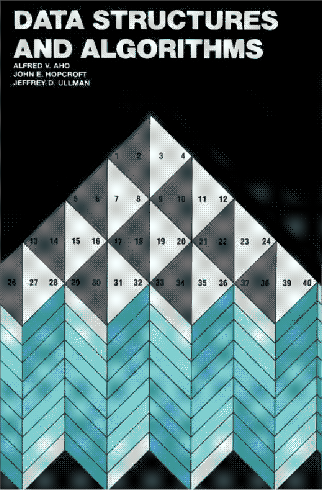
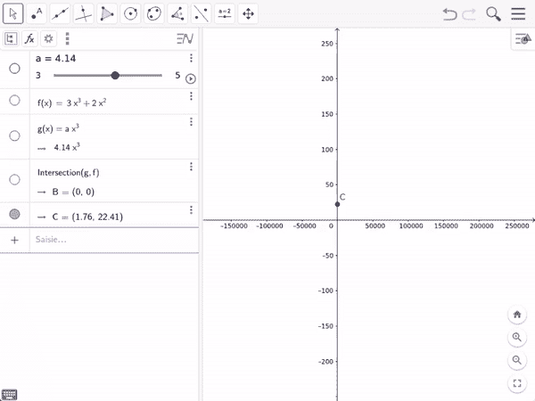

# “大哦”:我的推理对吗？

> 原文：<https://dev.to/tanguyandreani/is-my-reasoning-right-1h3f>

为糟糕的注释道歉。还有，我不是母语人士。

我开始读这本书:

我目前正在读第一章，是关于时间复杂度/渐近符号的。

所以我被告知，对于一个运行时间由函数𝑇(𝑛=3𝑛+2n 描述的算法，我们有 O(𝑛的最坏情况复杂度。好吧。

有人告诉我，我可以很容易证明 T(n) ≤ 5𝑛。好吧。(我对自己的高中数学技能很有信心。)

基本上我最后都是 T(𝑛) ≤ **3.0...01** 𝑛对𝑛倾向于+∞。𝑐.的不同价值观

3𝑛 +什么的可能会比 3𝑛小，这听起来可能有点傻，但我是用*极限*发现这一点的。

我的推理是，在处理了不等式 T(n) ≤ 𝑥𝑛之后，我们可以得出以下结论:

3 + 𝑛-2 ≤ 𝑥

现在𝑛只是一个正整数常数。所以让它是 1；最小输入。我们最终得到𝑥 = 5。书提供的价值。

但是假设𝑛变得越来越大。并最终趋于+∞。因为𝑛 -2 会趋向于 0，我们有𝑥趋向于 3。

所以 T(𝑛) ≤ 𝑥𝑛，𝑥是一个从上限值趋向于 3 的实数，但不是精确的 3。事实上，它不能与 3 一起工作。

### [GeoGebra 中的](#in-geogebra)

如果看不到视频，点击[这里](https://i.imgur.com/g4dfaq8.mp4)。

c 是𝑥𝑛比 T(𝑛).大的点

### 我的问题

首先，我的推理正确吗？在处理算法复杂性时，我能使用这种推理吗？从数学上来说，我很有信心它“成立”,但它在这里适用吗？

我知道这并不重要，因为我们最终得到的是同一个 O()，但还是很好奇。

谢谢你。