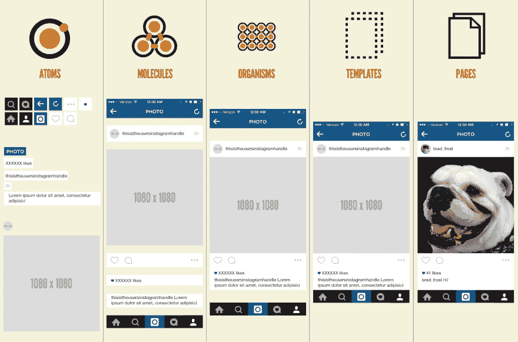
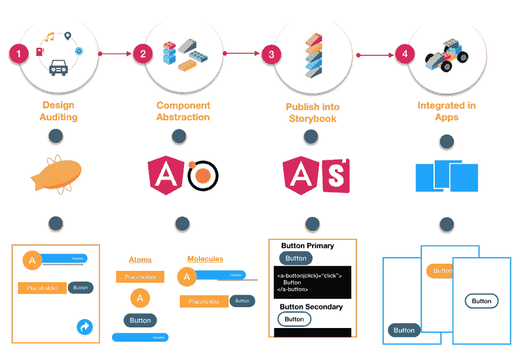
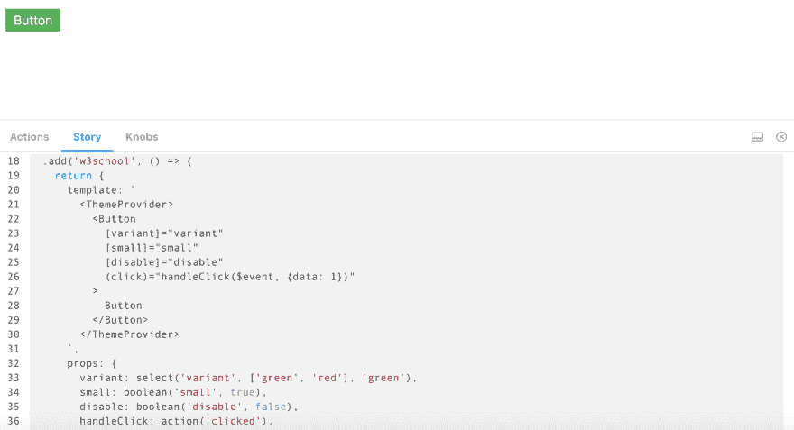
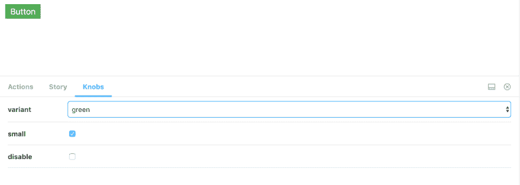

# 风格指南驱动的开发

> 原文：<https://dev.to/aziziyazit/style-guide-driven-development-using-angular-storybook-560b>

> "我们不是在设计页面，我们是在设计组件系统."
> ~斯蒂芬·海伊

## 风格引导驱动开发(SGDD)

SGDD 是关于从用户界面(UI)开发的最早阶段将静态风格指南转换成动态风格指南。动态风格指南也称为生活风格指南。

### 静态风格指南(SSG)

静态样式指南是一个文件，记录了排版、颜色/调色板、字体等等。它们还包含像间距信息(边距和填充)这样的细节。如今，设计师们更喜欢使用像 Zeplin 这样对草图友好的工具。

### 生活方式指南(LSG)

生活方式指南反映了最新版本的实施设计，并包括展示互动和行为的演示。LSG 的例子是极其流行的[自举](https://getbootstrap.com/)

[](https://res.cloudinary.com/practicaldev/image/fetch/s--q1613PM4--/c_limit%2Cf_auto%2Cfl_progressive%2Cq_auto%2Cw_880/https://blog.getbootstrap.com/assets/img/2017/v4-beta2-theming-docs.png)

放置在左面板和右面板中的所有组件都包含组件的视图，组件下面是开发人员要使用的代码。

> 一个设计系统不仅仅是一个包含一些文档的资源库，它还是你如何在团队和学科之间合作和交流的方式。“cssday”上的一棵树

在我们讨论 SGDD 的开发生命周期之前，让我们讨论一下组件开发中使用的方法。有很多，我个人的选择是原子设计。

> 原子设计是一个心智模型，它允许你同时创建 UI 设计系统的部分和整体
> 
> 这种方法使用化学作为类比，分析系统不同部分之间的关系以及它们如何相互关联。阿德里亚娜·德拉夸德拉(比托维)

[](https://res.cloudinary.com/practicaldev/image/fetch/s--gS9UUYfZ--/c_limit%2Cf_auto%2Cfl_progressive%2Cq_auto%2Cw_880/http://bradfrost.com/wp-content/uploads/2013/06/atomic-design.png)

#### 原子

原子是物质的基本组成部分。应用于 web 界面，原子是我们的 HTML 标签，如表单标签、输入或按钮。

#### 分子

分子是结合在一起的原子团，是化合物的最小基本单位。

#### 生物体

有机体是连接在一起形成相对复杂、独特界面的分子群。

#### 模板

模板主要是由组织组合在一起形成页面。

#### 页面

页面是模板的特定实例。

[](https://res.cloudinary.com/practicaldev/image/fetch/s--Md98f9Hi--/c_limit%2Cf_auto%2Cfl_progressive%2Cq_auto%2Cw_880/https://thepracticaldev.s3.amazonaws.com/i/lzmaeya557vyyx86yu18.png)

### SGDD 用原子设计

[](https://res.cloudinary.com/practicaldev/image/fetch/s--5MK72Hdf--/c_limit%2Cf_auto%2Cfl_progressive%2Cq_auto%2Cw_880/https://dev-to-uploads.s3.amazonaws.com/uploads/articles/ss9hi898riv1qzmhfg0i.png)

#### 1。设计审计

这时，设计师收集了所有的需求，创造了 SSG。在这个阶段，LSG 是创作设计的参考。设计师会参考 LSG，并考虑重用或扩展原子组件或创建新的原子组件。

#### 2。组件抽象

一旦设计准备好实现，设计人员和开发人员就可以使用风格指南来讨论新特性应该如何分解成独立的组件。这是像重组分子和引入新的成分变异这样的活动发生的地方。

#### 3。发布到生活方式指南

这是组件开发开始的过程。考虑到 SGDD，开发就是在 LSG 创建组件并编制文档。最终，LSG 变成了一个框架和一个游乐场。

*   它是一个框架，因为它提供了定义元素外观和行为的规则。
*   这是一个游乐场，实现者或应用程序开发人员可以进行交互，并直接看到组件的行为。

#### 4。综合

Application developer(库实现者)通过参考 LSG 代码示例和实现指南来使用原子和分子组件，以提供模板和页面。它的“即插即用”游戏。

> 你听说过即插即用。这就是插，拔，玩。用起来这么简单，简直不可思议。~史蒂夫·乔布斯

### LSG 与故事书

[Storybook](https://storybook.js.org/) 是 Angular、React、Vue 最流行的 UI 组件开发工具。它帮助你在一个隔离的环境中开发和设计你的应用之外的 UI 组件。
本文使用 Angular 作为 UI 组件的开发工具。

[](https://res.cloudinary.com/practicaldev/image/fetch/s--33L-2mR5--/c_limit%2Cf_auto%2Cfl_progressive%2Cq_auto%2Cw_880/https://thepracticaldev.s3.amazonaws.com/i/efemkpkdfdp9h9zrz72c.png)

故事书的基本特征是动作、故事和旋钮

#### 动作

跟踪组件的任何交互，如“单击”、“鼠标悬停”、“双击”等等。

[](https://res.cloudinary.com/practicaldev/image/fetch/s--S4yoY1YM--/c_limit%2Cf_auto%2Cfl_progressive%2Cq_auto%2Cw_880/https://thepracticaldev.s3.amazonaws.com/i/6dv5yfvlyzkjw0ei707r.png)

#### 故事

开发者可以复制的实现代码。

[](https://res.cloudinary.com/practicaldev/image/fetch/s--AxWHwGWn--/c_limit%2Cf_auto%2Cfl_progressive%2Cq_auto%2Cw_880/https://thepracticaldev.s3.amazonaws.com/i/w2rdf7bcbgfvdltgbfdk.png)

#### 旋钮

旋钮允许我们动态编辑组件输入。

[](https://res.cloudinary.com/practicaldev/image/fetch/s--ZB0BdK99--/c_limit%2Cf_auto%2Cfl_progressive%2Cq_auto%2Cw_880/https://thepracticaldev.s3.amazonaws.com/i/4fc0em1mxz9nasq1fiy1.png)

> Storybook 是一个强大的前端 workshop 环境工具，允许团队设计、构建和组织 UI 组件(甚至全屏！)而不会被商业逻辑和管道绊倒~布拉德·弗罗斯特
> 
> Storybook 允许我们在设计系统中轻松地包含技术文档，从而使组件开发更加简化！~托里·戴维斯

#### 设置故事书

建议使用[官方指南](https://storybook.js.org/docs/guides/guide-angular/)。如果一切顺利，创建角度故事书的命令只有一行:

```
npx -p @storybook/cli sb init --type angular 
```

Enter fullscreen mode Exit fullscreen mode

## 总结

弥合开发人员和设计人员之间差距的一个方法是将 SGDD 引入我们的工作流程。将 SGDD 与原子设计相结合有助于加速创建模块化设计的过程。将生活方式指南作为单一的真实文档可以增加开发时间和团队交流。