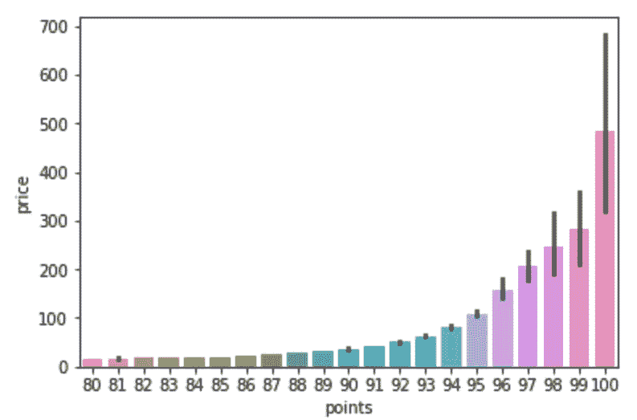
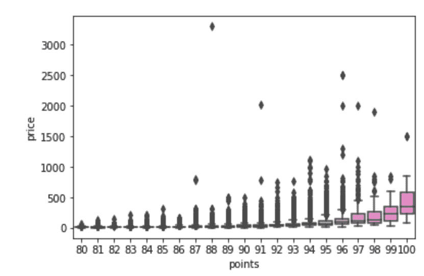
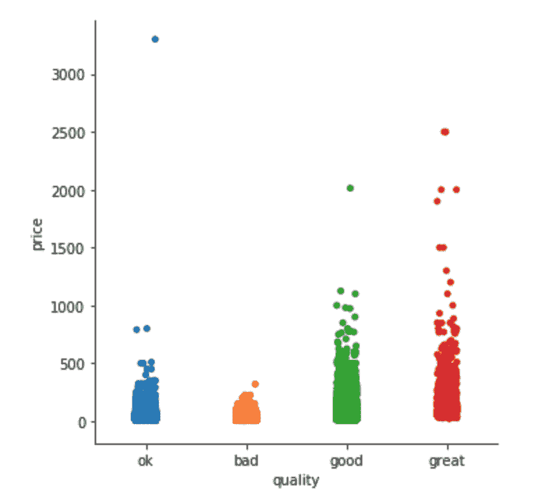
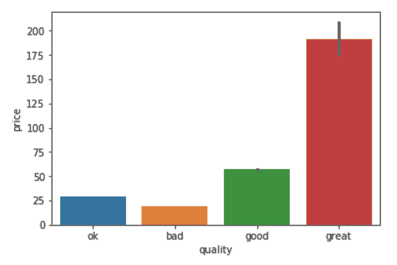
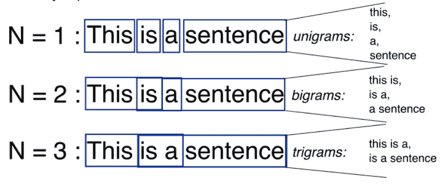
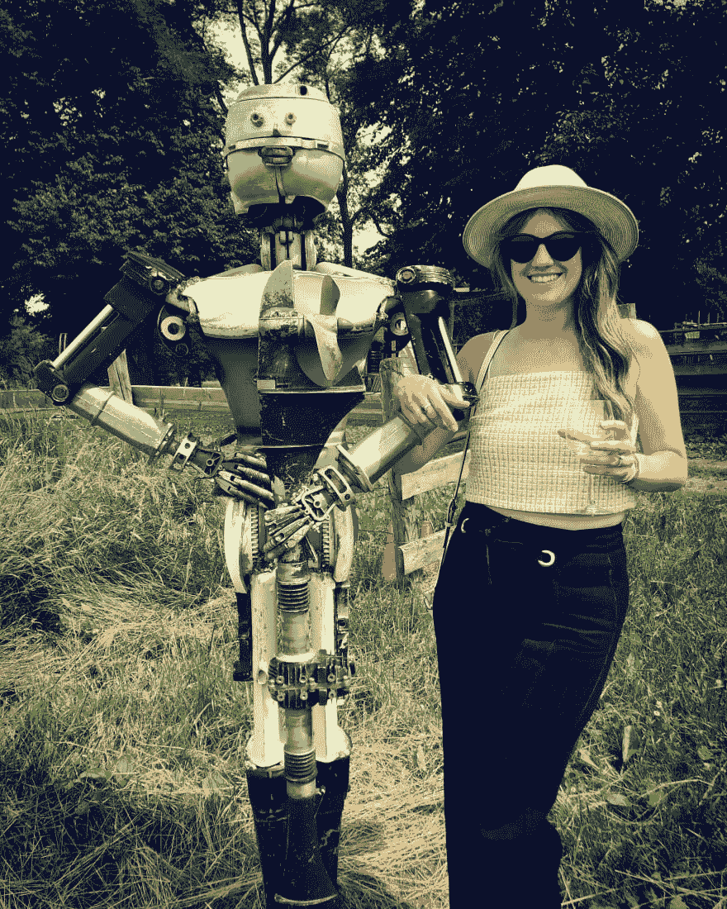

# 🤖拿上你的酒。是时候揭开 ML 和 NLP 的神秘面纱了🍷

> 原文：<https://dev.to/azure/grab-your-wine-it-s-time-to-demystify-ml-and-nlp-47f7>

[](https://res.cloudinary.com/practicaldev/image/fetch/s--9GZ-EKO_--/c_limit%2Cf_auto%2Cfl_progressive%2Cq_auto%2Cw_880/https://raw.githubusercontent.com/cassieview/intro-nlp-wine-reviews/master/imgs/wordcloud.PNG)

在本教程中，你将学习如何使用 ML 从文本描述中预测葡萄酒的价格、点数和品种。

我们将使用库 [SciKit Learn](https://scikit-learn.org/stable/) 处理葡萄酒描述文本，以创建一个词袋逻辑回归多分类模型。如果这没有意义，那么你来对地方了！如果有意义，继续读下去，因为酒。

## 配置您的 ML 开发环境

### 有两种选择:云端或者本地。

Azure 云设置-使用 Azure 机器学习工作区和集成的云笔记本虚拟机。Workspace 为您提供了许多功能，我强烈推荐您使用它。

1.  如果你还没有的话，创建一个免费的 Azure 账户。
2.  遵循[创建工作空间](https://docs.microsoft.com/en-us/azure/machine-learning/service/quickstart-run-cloud-notebook?WT.mc_id=ca-0000-cassieb)教程中的“创建笔记本虚拟机”步骤
3.  从笔记本电脑虚拟机导航中单击“Jupyter Lab”
4.  然后在终端中运行下面的命令，从 GitHub 克隆笔记本。

[](https://res.cloudinary.com/practicaldev/image/fetch/s--KLHpuub8--/c_limit%2Cf_auto%2Cfl_progressive%2Cq_auto%2Cw_880/https://raw.githubusercontent.com/cassieview/intro-nlp-wine-reviews/master/imgs/launchnotebook.png)T3】

```
#CTRL+SHIFT+V to paste
curl https://raw.githubusercontent.com/cassieview/intro-nlp-wine-reviews/master/winereview-nlp.ipynb --output winereview-nlp.ipynb 
```

Enter fullscreen mode Exit fullscreen mode

本地设置

*   [下载 Jupyter](https://jupyter.org/) 笔记本
*   [下载蟒蛇](https://www.anaconda.com/distribution/)
*   运行木星笔记本

一旦您设置了上述环境配置之一，就该开始构建了！

## 导入包和数据

如果你得到一个错误“没有命名的模块”，用命令`!pip install wordcloud`安装它。用错误消息中的模块名称替换`wordcloud`。

```
#This package need to be installed first !pip install wordcloud 
```

Enter fullscreen mode Exit fullscreen mode

```
import pandas as pd
import numpy as np
import matplotlib.pyplot as plt
import seaborn as sns
import math
from sklearn.model_selection import train_test_split
from sklearn.metrics import precision_recall_curve
from sklearn.linear_model import LogisticRegression
from sklearn.feature_extraction.text import CountVectorizer
from joblib import dump, load 
```

Enter fullscreen mode Exit fullscreen mode

我们需要数据！我用了在 Kaggle 上找到的数据集。Kaggle 是一个由数据科学家组成的在线社区。从 github repo 或 kaggle 下载数据集。

*   [来自回购的葡萄酒数据集](https://github.com/cassieview/intro-nlp-wine-reviews/blob/master/dataset)
*   [Kaggle 数据集](https://www.kaggle.com/zynicide/wine-reviews) 

将数据导入为[熊猫](https://pandas.pydata.org/pandas-docs/stable/)数据帧

```
#File path to the csv file csv_file = "https://raw.githubusercontent.com/cassieview/intro-nlp-wine-reviews/master/dataset/winemag-review.csv"

# Read csv file into dataframe df = pd.read_csv(csv_file)

# Print first 5 rows in the dataframe df.head() 
```

Enter fullscreen mode Exit fullscreen mode

[](https://res.cloudinary.com/practicaldev/image/fetch/s--83jq6kPH--/c_limit%2Cf_auto%2Cfl_progressive%2Cq_auto%2Cw_880/https://raw.githubusercontent.com/cassieview/intro-nlp-wine-reviews/master/imgs/dfhead.PNG)

## 将数据可视化

一旦我们有了数据，就该分析它，并做一些[功能选择和工程](https://docs.microsoft.com/en-us/azure/machine-learning/team-data-science-process/create-features?WT.mc_id=ca-0000-cassieb)。我们将使用 [Seaborn](https://seaborn.pydata.org/) 来可视化我们的数据。这将让我们看到不同数据点之间是否有很强的相关性，并帮助我们回答有关我们数据的问题。由于我们最初的问题是根据`description`预测`price`、`points`或`variety`，我们已经知道我们的特征将是`description`，我们的标签将是`price`、`points`或`variety`。特征是我们用来进行预测的数据，标注是我们正在预测的内容。每个标签将是一个单独的模型，所以如果您选择建立所有三个预测模型，将有三个模型。

为了好玩，我们来问一些关于数据的问题，并通过用 Seaborn 将其图形化来回答。

价格和积分有关联吗？

```
sns.barplot(x = 'points', y = 'price', data = df) 
```

Enter fullscreen mode Exit fullscreen mode

[](https://res.cloudinary.com/practicaldev/image/fetch/s--dPljfICX--/c_limit%2Cf_auto%2Cfl_progressive%2Cq_auto%2Cw_880/https://raw.githubusercontent.com/cassieview/intro-nlp-wine-reviews/master/imgs/priceandpoints.PNG)T3】

```
sns.boxplot(x = 'points', y = 'price', data = df) 
```

Enter fullscreen mode Exit fullscreen mode

[](https://res.cloudinary.com/practicaldev/image/fetch/s--PY6RGhcU--/c_limit%2Cf_auto%2Cfl_progressive%2Cq_auto%2Cw_880/https://raw.githubusercontent.com/cassieview/intro-nlp-wine-reviews/master/imgs/priceandpoints2.PNG)

一个酒评家的评分会比其他人高吗？

```
sns.catplot(x = 'points', y = 'taster_name', data = df) 
```

Enter fullscreen mode Exit fullscreen mode

[](https://res.cloudinary.com/practicaldev/image/fetch/s--0tPUV-Hz--/c_limit%2Cf_auto%2Cfl_progressive%2Cq_auto%2Cw_880/https://raw.githubusercontent.com/cassieview/intro-nlp-wine-reviews/master/imgs/tasterpoints.PNG)

让我们来看看`description`文本
的文字云

```
from wordcloud import WordCloud, STOPWORDS
import matplotlib.pyplot as plt
text = df.description.values
wordcloud = WordCloud(
    width = 3000,
    height = 2000,
    background_color = 'black',
    stopwords = STOPWORDS).generate(str(text))
fig = plt.figure(
    figsize = (40, 30),
    facecolor = 'k',
    edgecolor = 'k')
plt.imshow(wordcloud, interpolation = 'bilinear')
plt.axis('off')
plt.tight_layout(pad=0)
plt.show() 
```

Enter fullscreen mode Exit fullscreen mode

[](https://res.cloudinary.com/practicaldev/image/fetch/s--9GZ-EKO_--/c_limit%2Cf_auto%2Cfl_progressive%2Cq_auto%2Cw_880/https://raw.githubusercontent.com/cassieview/intro-nlp-wine-reviews/master/imgs/wordcloud.PNG) 
<small>我喜欢把这个词云想象成品尝葡萄酒时使用的描述性词汇的备忘单，让自己听起来像个葡萄酒专家😃</small>

通过绘制这些数据，你还能提出和回答哪些问题？
[T3】](https://res.cloudinary.com/practicaldev/image/fetch/s--83jq6kPH--/c_limit%2Cf_auto%2Cfl_progressive%2Cq_auto%2Cw_880/https://raw.githubusercontent.com/cassieview/intro-nlp-wine-reviews/master/imgs/dfhead.PNG)

## 为标签创建计算列

这将是葡萄酒评论家对葡萄酒的价格点或葡萄品种的多分类。现在我们的点数和价格是数字特征。这需要更新为文本要素类别，为此，我们将创建两个函数来根据 points 和 price 列中的值生成计算列，以用作我们的标签。

创建`quality`列，将分值分为差、好、好和优秀。下面是一个基于点值返回字符串`quality`的函数。

```
def getQuality(points):
    if(points <= 85):
        return 'bad'
    elif(points<=90 ):
        return 'ok'
    elif(points<=95):
        return 'good'
    elif(points<=100):
        return 'great'
    else:
        return 'If this gets hit, we did something wrong!' 
```

Enter fullscreen mode Exit fullscreen mode

接下来将该函数应用于数据帧的 points 列，并添加一个名为`quality`的新列。

```
df['quality'] = df['points'].apply(getQuality) 
```

Enter fullscreen mode Exit fullscreen mode

像我们上面所做的那样，根据 price 列可视化新列。

```
sns.catplot(x = 'quality', y = 'price', data = df) 
```

Enter fullscreen mode Exit fullscreen mode

[](https://res.cloudinary.com/practicaldev/image/fetch/s--UJBzciBr--/c_limit%2Cf_auto%2Cfl_progressive%2Cq_auto%2Cw_880/https://raw.githubusercontent.com/cassieview/intro-nlp-wine-reviews/master/imgs/pricequality.PNG)T3】

```
sns.barplot(x = 'quality', y = 'price', data = df) 
```

Enter fullscreen mode Exit fullscreen mode

[](https://res.cloudinary.com/practicaldev/image/fetch/s--QVwqUmb8--/c_limit%2Cf_auto%2Cfl_progressive%2Cq_auto%2Cw_880/https://raw.githubusercontent.com/cassieview/intro-nlp-wine-reviews/master/imgs/pricequality2.PNG)

对于有 NaN 的列，从`1-30`、`31-50`、`51-100`、`Above 100`、`0`的价格列创建价格范围列。下面是一个基于价格值返回字符串 priceRange 的函数。

```
def getPriceRange(price):
    if(price <= 30):
        return '1-30'
    elif(price<=50):
        return '31-50'
    elif(price<=100): 
        return '51-100'
    elif(math.isnan(price)):
        return '0'
    else:
        return 'Above 100' 
```

Enter fullscreen mode Exit fullscreen mode

将该函数应用于数据帧的点列，并添加一个名为`priceRange`的新列。

```
df['priceRange'] = df['price'].apply(getPriceRange) 
```

Enter fullscreen mode Exit fullscreen mode

打印每个指定价格范围的总数，查看标签是如何分布的

```
df.groupby(df['priceRange']).size()
Output: priceRange
        0             8996
        1-30         73455
        31-50        27746
        51-100       16408
        Above 100     3366
        dtype: int64 
```

Enter fullscreen mode Exit fullscreen mode

我们现在有了预测质量、价格范围和葡萄品种的模型标签。

## 使用库 SciKit 处理描述文本学习使用[计数矢量器](https://scikit-learn.org/stable/modules/generated/sklearn.feature_extraction.text.CountVectorizer.html)功能创建单词包。

文档很好地解释了 CountVectorizer。我建议通读它们，以全面了解正在发生的事情，但是我将在这里回顾一些基础知识。

在高层次上，CountVectorizer 获取描述的文本，删除停用词(如“the”、“a”、“an”、“in”)，创建单词的标记化，然后创建表示描述的数字向量。文本描述现在用数字表示，只有我们关心的单词，可以由计算机处理来训练模型。记住计算机理解数字，单词可以用数字来表示，这样计算机就能“理解”了。

这是单词变成数字的一个例子。我们将通过数据集中的一个例子更详细地讨论这一点。

[](https://res.cloudinary.com/practicaldev/image/fetch/s--qveZ_g7d--/c_limit%2Cf_auto%2Cfl_progressive%2Cq_auto%2Cw_880/https://raw.githubusercontent.com/cassieview/intro-nlp-wine-reviews/master/imgs/vectorchart.PNG)

在我们进入 CountVectorizer 代码和功能之前。我想列出一些术语，并指出 CountVectorizer *并不*为您做引理化或词干化。

*   停用词:停用词可以是在特定语言中有意义的词。例如，在英语中，诸如“a”、“and”、“is”和“the”之类的词被排除在全文索引之外，因为已知它们对搜索没有用处。停用词也可以是没有语言意义的标记。
*   [N-Gram](https://docs.microsoft.com/en-us/dotnet/machine-learning/resources/glossary#n-gram?WT.mc_id=ca-0000-cassieb) :文本数据的特征提取方案:任意 N 个单词的序列变成一个特征值。
    T3T5】

*   [词汇化](https://docs.microsoft.com/en-us/azure/machine-learning/studio-module-reference/preprocess-text#module-overview?WT.mc_id=ca-0000-cassieb):将多个相关单词转换成一个规范形式(“fruity”、“fruitiness”和“fruits”都将变成“fruit”)

*   词干化:类似于词汇化，但更具侵略性，会使单词变得支离破碎。

### 我们来看看如何使用 CountVectorizer。

这些都是可以在 CountVectorizer 中设置的属性。它们中的许多都是默认的，或者如果设置的话会覆盖 CountVectorizer 的其他部分。我们将保留大部分默认设置，然后尝试更改其中一些设置，以获得更好的模型结果。

```
CountVectorizer( 
  input='content', encoding='utf-8', decode_error='strict', 
  strip_accents=None, lowercase=True, preprocessor=None, tokenizer=None, 
  stop_words=None, token_pattern='(?u)\b\w\w+\b', ngram_range=(1, 1), 
  analyzer='word', max_df=1.0, min_df=1, max_features=None, 
  vocabulary=None, binary=False, dtype=<class 'numpy.int64'>
) 
```

Enter fullscreen mode Exit fullscreen mode

创建从`description`特征中获取矢量和向量的函数。

有不同的 CountVectorizer 配置被注释掉，这样我们就可以使用不同的配置，看看它如何改变我们的结果。此外，这将帮助我们查看一个描述，并找出 CountVectorizer 中实际发生的情况。

```
def get_vector_feature_matrix(description):
    vectorizer = CountVectorizer(lowercase=True, stop_words="english", max_features=5)
    #vectorizer = CountVectorizer(lowercase=True, stop_words="english")
    #vectorizer = CountVectorizer(lowercase=True, stop_words="english",ngram_range=(1, 2), max_features=20) 
    #vectorizer = CountVectorizer(lowercase=True, stop_words="english", tokenizer=stemming_tokenizer) 
    vector = vectorizer.fit_transform(np.array(description))
    return vector, vectorizer 
```

Enter fullscreen mode Exit fullscreen mode

对于第一次运行，我们将有下面的配置。这就是说，我们希望将文本转换为小写，删除英语停用词，我们只需要 5 个单词作为特征标记。

```
vectorizer = CountVectorizer(lowercase=True, stop_words="english", max_features=5) 
```

Enter fullscreen mode Exit fullscreen mode

```
#Optional: remove any rows with NaN values. 
#df = df.dropna() 
```

Enter fullscreen mode Exit fullscreen mode

接下来，让我们调用我们的函数，并从数据帧传入描述列。

这将返回`vector`和`vectorizer`。`vectorizer`是我们应用于我们的文本以创建我们文本的数字`vector`表示，以便机器学习模型可以学习。

```
vector, vectorizer = get_vector_feature_matrix(df['description']) 
```

Enter fullscreen mode Exit fullscreen mode

如果我们打印矢量器，我们可以看到它的当前默认参数。

```
print(vectorizer)
Output: CountVectorizer(analyzer='word', binary=False, decode_error='strict',
        dtype=<class 'numpy.int64'>, encoding='utf-8', input='content',
        lowercase=True, max_df=1.0, max_features=5, min_df=1,
        ngram_range=(1, 1), preprocessor=None, stop_words='english',
        strip_accents=None, token_pattern='(?u)\\b\\w\\w+\\b',
        tokenizer=None, vocabulary=None) 
```

Enter fullscreen mode Exit fullscreen mode

检查我们的变量和数据，了解这里发生了什么。

```
print(vectorizer.get_feature_names())
Output: ['aromas', 'flavors', 'fruit', 'palate', 'wine'] 
```

Enter fullscreen mode Exit fullscreen mode

这里我们得到了矢量器的特性。因为我们告诉 CountVectorizer 有一个`max_feature = 5`,它将构建一个词汇表，该词汇表只考虑在整个语料库中按词频排序的顶级特征词。这意味着我们的`description`向量将*只有*包含这些单词，当它们被标记时，所有其他的单词将被忽略。

打印出我们的第一个`description`和第一个`vector`来看看这是怎么表示的。

```
print(vector.toarray()[0])
Output: [1 0 1 1 0] 
```

Enter fullscreen mode Exit fullscreen mode

```
df['description'].iloc[0]
Output: "_Aromas_ include tropical _fruit_, broom, brimstone and dried herb. The _palate_ isn't overly expressive, offering unripened apple, citrus and dried sage alongside brisk acidity." 
```

Enter fullscreen mode Exit fullscreen mode

向量数组(`[1 0 1 1 0]`)，表示语料库中第一个描述中的矢量化特征(`['aromas', 'flavors', 'fruit', 'palate', 'wine']`)。1 表示在矢量化要素的顺序中存在，0 表示不存在。

使用不同的向量索引和描述。你会注意到没有词汇化，所以像`fruity`和`fruits`这样的词被忽略了，因为只有`fruit`被包含在向量中，我们没有对描述进行词汇化以将它们转换成它们的词根。

## 训练模型

更新函数，以便使用第二个矢量器配置。

```
def get_vector_feature_matrix(description):
    #vectorizer = CountVectorizer(lowercase=True, stop_words="english", max_features=5)
    vectorizer = CountVectorizer(lowercase=True, stop_words="english", max_features=1000)
    #vectorizer = CountVectorizer(lowercase=True, stop_words="english",ngram_range=(1, 2), max_features=1000)
    #vectorizer = CountVectorizer(lowercase=True, stop_words="english", tokenizer=stemming_tokenizer) 
    vector = vectorizer.fit_transform(np.array(description))
    return vector, vectorizer 
```

Enter fullscreen mode Exit fullscreen mode

并调用函数来更新矢量器

```
vector, vectorizer = get_vector_feature_matrix(df['description']) 
```

Enter fullscreen mode Exit fullscreen mode

现在创建我们的特征矩阵。如果这里出现内存错误，请减少 CountVectorizer 中的 max_features。

```
features = vector.todense() 
```

Enter fullscreen mode Exit fullscreen mode

我们有三种不同型号的三种不同标签。接下来让我们分配标签变量，首先使用`quality`标签。

```
label = df['quality'] 
#label = df['priceRange']
#label = df['variety'] 
```

Enter fullscreen mode Exit fullscreen mode

我们已经创建了特征和标签变量。接下来我们需要拆分数据来训练和测试。

我们将 80%用于培训，20%用于测试。这将允许我们从训练中获得准确性估计，以查看模型的执行情况。

```
X, y = features, label
X_train, X_test, y_train, y_test = train_test_split(X, y, test_size=0.2) 
```

Enter fullscreen mode Exit fullscreen mode

使用[逻辑回归](https://scikit-learn.org/stable/modules/generated/sklearn.linear_model.LogisticRegression.html)算法训练模型并打印精确度。

```
lr = LogisticRegression(multi_class='ovr',solver='lbfgs')
model = lr.fit(X_train, y_train)

accuracy = model.score(X_test, y_test)
print ("Accuracy is {}".format(accuracy))
Output: "Accuracy is 0.7404885554914407" 
```

Enter fullscreen mode Exit fullscreen mode

这是一个不错的精度，但我相信它可以得到改善！在本教程中，我们称之为“足够好”,这是一个你曾经构建的每个模型都需要做出的决定！

## 测试模型

当你选择一个候选模型时，它应该总是在看不见的数据上被测试。如果一个模型对它的数据过度拟合，那么它在自己的数据上会表现很好，而在新数据上表现很差。这就是为什么对看不见的数据进行测试非常重要。

我从葡萄酒杂志网站上找到了这篇评论。这是一个 95 分和 60 美元一瓶的葡萄酒评论。

```
test = "This comes from the producer's coolest estate near the town of Freestone. White pepper jumps from the glass alongside accents of lavender, rose and spice. Compelling in every way, it offers juicy raspberry fruit that's focused, pure and undeniably delicious."

x = vectorizer.transform(np.array([test]))
proba = model.predict_proba(x)
classes = model.classes_
resultdf = pd.DataFrame(data=proba, columns=classes)
resultdf 
```

Enter fullscreen mode Exit fullscreen mode

[](https://res.cloudinary.com/practicaldev/image/fetch/s--VxyH15cw--/c_limit%2Cf_auto%2Cfl_progressive%2Cq_auto%2Cw_880/https://raw.githubusercontent.com/cassieview/intro-nlp-wine-reviews/master/imgs/testresult.PNG)

# 这是正确的预测！🎉

查看结果的另一种方式是转置、排序，然后打印头，产生前 5 个预测的列表。

```
topPrediction = resultdf.T.sort_values(by=[0], ascending = [False])
topPrediction.head() 
```

Enter fullscreen mode Exit fullscreen mode

## 其他事情要尝试

1.  更改标签并再次运行价格桶预测或葡萄品种。
2.  尝试使用不同的算法，看看是否可以得到更好的结果
3.  向描述文本中添加附加要素以提高准确性。价格和积分之间有很强的相关性。也许加上这些会提高准确率？
4.  使用 [NLTK](https://www.nltk.org/) 为文本添加词汇化以提高分数
5.  尝试在不同的数据集上进行文本分类。

数据科学是一个反复试验的过程。我确信有办法改进这个模型和准确性。到处玩玩看能不能得到更好的结果！

## 其他有用的链接

[机器学习算法备忘单](https://docs.microsoft.com/en-us/azure/machine-learning/studio/algorithm-choice#the-machine-learning-algorithm-cheat-sheet?WT.mc_id=ca-0000-cassieb)

【Azure 机器学习工作室如何选择算法

[完整的 GitHub 回购](https://github.com/cassieview/intro-nlp-wine-reviews)

<center>CHEERS! 🥂</center>

[](https://res.cloudinary.com/practicaldev/image/fetch/s--9DudeEPX--/c_limit%2Cf_auto%2Cfl_progressive%2Cq_auto%2Cw_880/https://thepracticaldev.s3.amazonaws.com/i/5uzwtn3ltbn9jxi4nfj5.jpg)

<center>🍷🤖💚Drinking wine and hanging out with bots. 🍷🤖💚</center>