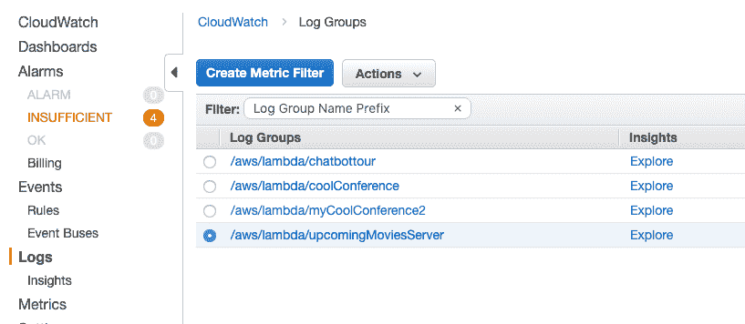
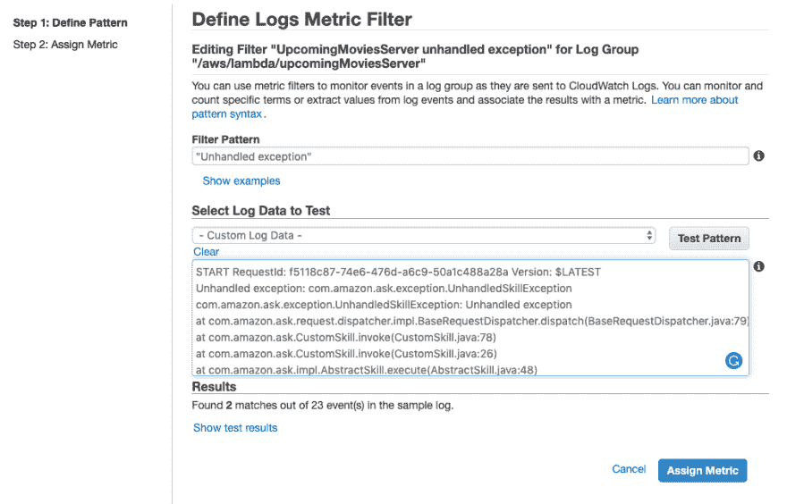
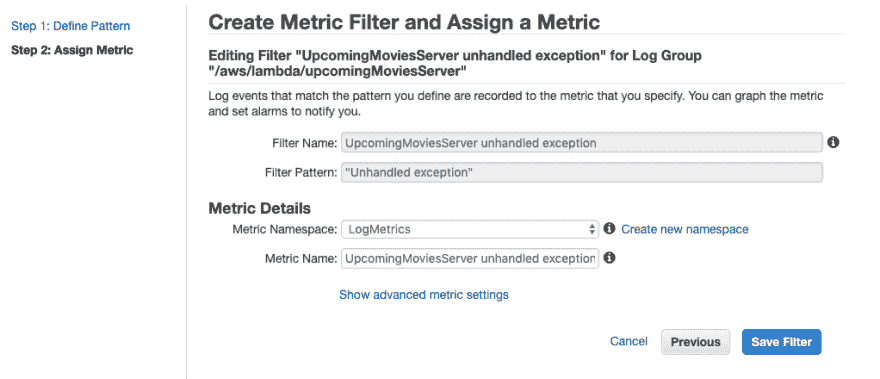
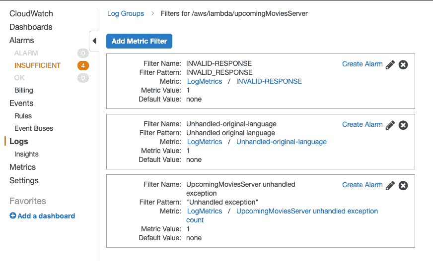
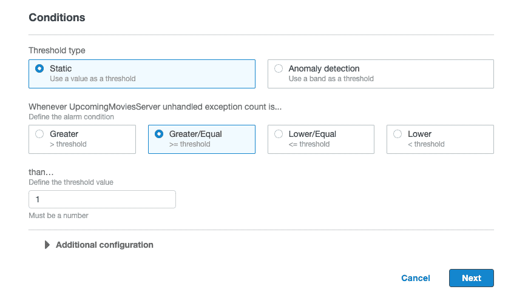
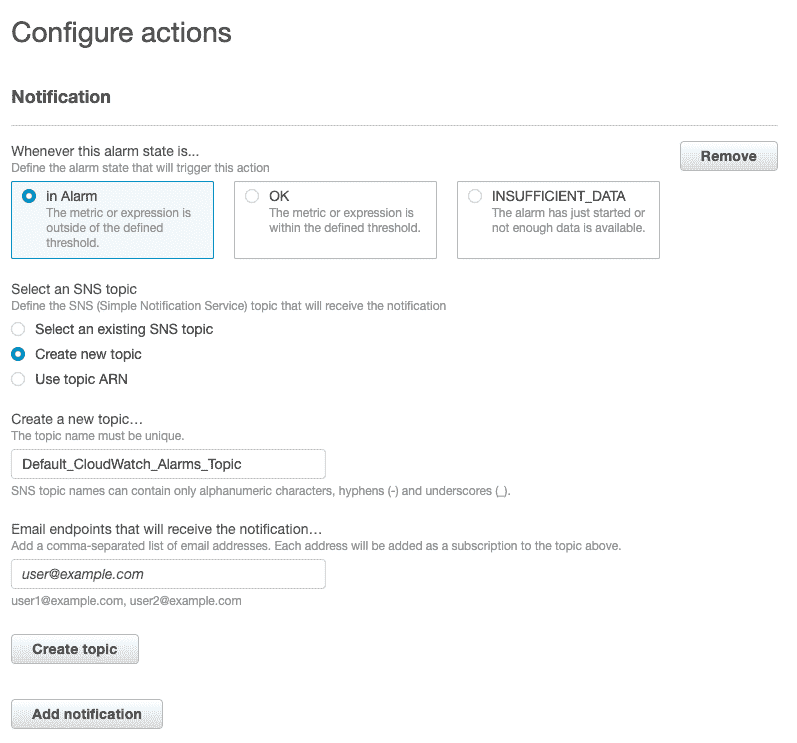
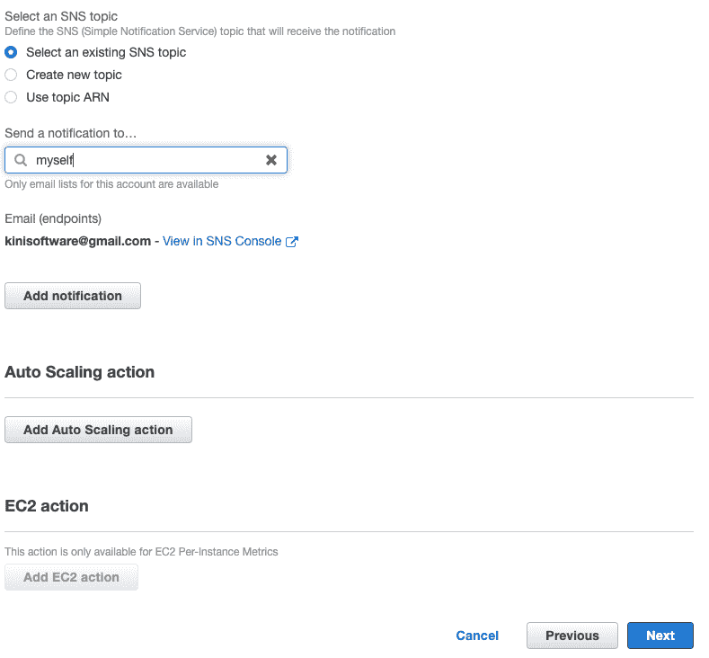
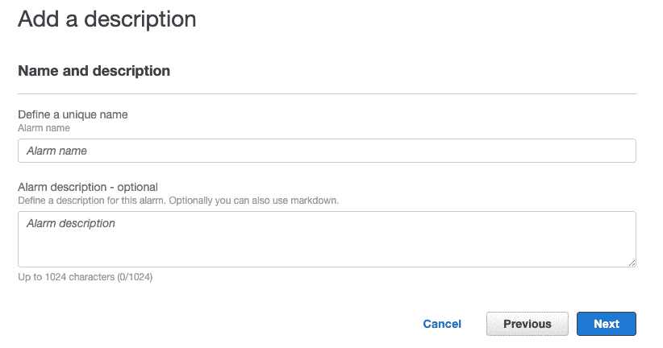
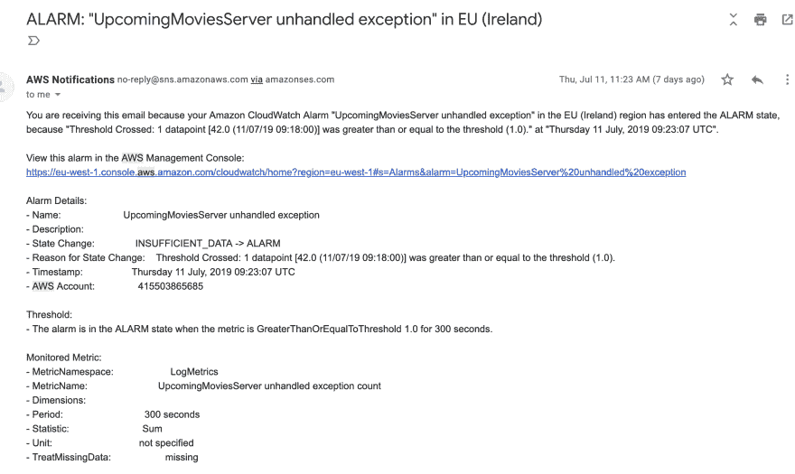

# Alexa 技能监控:为我们技能的漏洞创建警报

> [https://dev . to/kini/Alexa-skills-monitoring-create-of-alarms-to-El-lambda-de-our-skill-27 P8](https://dev.to/kini/alexa-skills-monitoring-creacion-de-alarmas-para-el-lambda-de-nuestra-skill-27p8)监控-报警-to-El-lambda-de-our-skill-27 P8

在之前的[帖子](https://kinisoftware.com/alexa-skills-monitoring-logs/)中，我讲述了如何在我们技能的舔痕上记录日志，无论是通过我们决定拿出的消息，还是由于执行过程中发生的错误。第一个例子是我们为提取请求和响应而创建的“[”拦截器。关于错误，我们看到异常也出现在 CloudWatch 上。](https://developer.amazon.com/docs/custom-skills/speech-synthesis-markup-language-ssml-reference.html)

使用这些消息，我们将能够使用 AWS 工具创建警报，从而生成通知，例如，如果发生错误或我们测量到的任何问题。

## 创建有关日志消息的度量

作为警报的基础，我们将有发生在我们羔羊身上的事件指标。这些度量是在日志组级别创建的，对于技能，通常每个 lambda 有一个组。

从 CloudWatch 的初始控制台，我们可以访问用户的所有日志组。

「建立测量结果」按钮尚未启用，但我们必须选取一个日志群组，才能启用它。

我们有两个步骤:

*   定义用于检测感兴趣事件的过滤器。这是通过创建与消息匹配的图案来完成的。例如，在图像中，我们可以看到我创建的用于检测属于“`Unhandled exception`”并导致技能错误的事件的过滤器。我们可以通过复制从日志中提取的消息来测试我们的模式，看看它是否能找到结果。我们也可以从图片中看到。

*   一旦我们有了模式，我们就给它分配一个度量。在第二步中，我们只需命名上一个过滤器，选择度量的名称空间(我为日志中的度量创建了一个名称空间)，然后为度量本身命名。

我们创建的每个度量都可以从显示所有日志组的第一个屏幕中访问。这里有一个叫做「滤镜」的栏，接下来我们来看下一张图片:

这里你可以看到我创建的三个过滤器(从上面开始):

*   一个是 Alexa 做的 lambda 无效的回答。文本回复用标记语言([【SSM】](https://developer.amazon.com/docs/custom-skills/speech-synthesis-markup-language-ssml-reference.html)作了标注，如果格式不当，我们将通过在我们的应答拦截器中指出来得到回复。
*   一个是我放在 lambda 的留言。[CIN](https://www.amazon.es/Kinisoftware-Estrenos-de-cine/dp/B07MKCLZ62)的登场人物的技巧，询问 a[API](https://developers.themoviedb.org/3)的信息，每个登场人物的反应模型都有`original_language`的字段。如果 Alexa 不在西班牙语的话我就用这个字段来标记电影的标题。我可能会遇到 Alexa 不知道的语言或者我还没把它加到我的拨号里。我已经做了一个完整的记录，我可以采取适当的行动。
*   最后一个是我们刚刚创建的过滤器，它可以让我们了解到一些不知道如何处理 lambda 的异常情况。

在我拥有的三个中，至少与 SSM 相关的和例外主题对我来说是任何技能的基础。

## 创建度量警报

一旦我们有了上述过滤器，就很容易产生警报。如果我们查看上次捕获，AWS 已经为我们提供了一个链接，以便根据该过滤器创建警报。

创建警报有几个阶段:

*   我们首先要具体说明那个警报“跳”的度量和条件。为此，我们必须设置度量名称(如果来自过滤器列表链接，则自动填充)、操作(总和、平均值、最大值等)和时段。这里的生活不必太复杂，我们只要 5 分钟就能拿到钱。

*   就条件而言，和以前一样，我们也不要搞得太复杂。以把报警条件定为`threshold`的值大于或等于 1，我们已经有了。这可以解释为我们希望当我们的过滤器检测到一个案例并得到满足时，警报就会跳闸。

*   下一步是配置触发警报时要执行的操作。就我们而言，我们希望在警报状态下发送邮件。为此，我们将使用 AWS 的“”SNS。如果这是我们第一次来这里，我们必须创建一个主题。我用我的个人邮件地址创建了一个我用在所有警报上的。

*   下一步我们要给警报命名和描述。请注意，我们放在那里的东西将是我们收到的邮件的一部分。我们建议您输入信息，以便至少知道，如果我们有多个警报，则跳过哪个警报。在您自己的电子邮件中，我们将有一个指向 CloudWatch 控制板的链接。

*   在最后一步中，我们将总结整个过程，并着手确认警报的创建。

创建警报后，我们可以从 CloudWatch 控制台的“警报”部分访问该警报。

您可以在此查看已创建的警报列表、它们的当前状态、条件等。同样，我们也可以在此处使用与前面类似的过程来创建警报，但第一步是选择要在其上运行警报的度量。

一旦出现我们准备好的任何情形，我们将收到一封电子邮件，从中可以访问日志控制台。此邮件通知我们警报和相关度量，以及它的值和事件发生的时间。

* * *

在过去的两个岗位上，我已经告诉你们如何为我们的技能建立一个简单、基本的监控和警报系统。这样我们就不会盲目面对错误或意外的行为。无论如何，请记住偶尔查看日志，因为可能会出现我们尚未控制的情况，并可能涉及新警报。