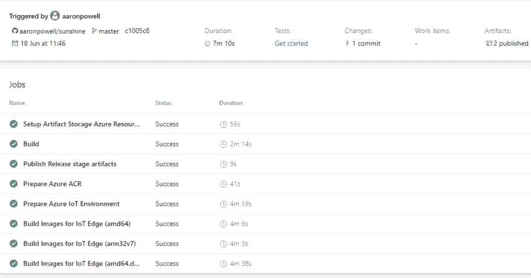
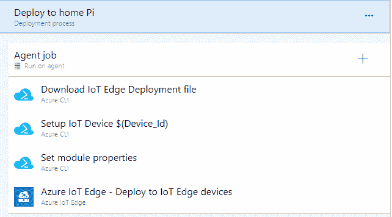
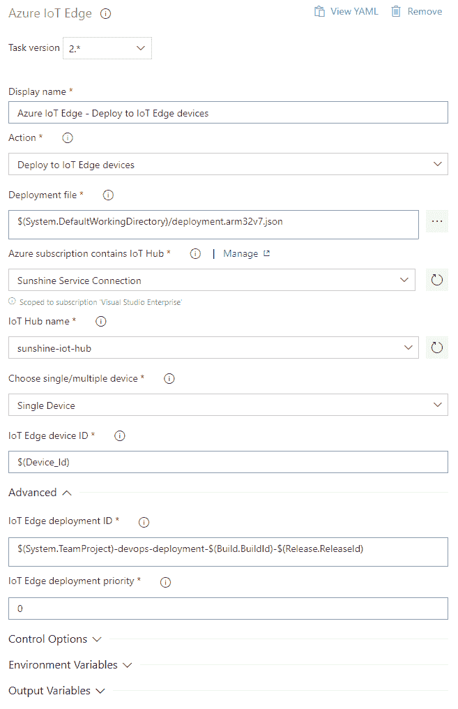
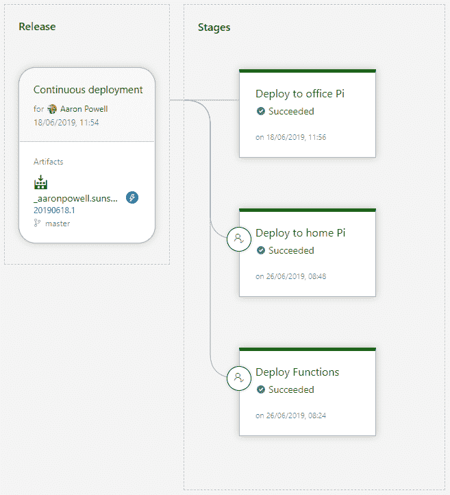

# 自主开发的物联网自动化开发平台🤖

> 原文：<https://dev.to/azure/home-grown-iot-automated-devops-3nba>

看了一下[一些部署物联网应用的工具](https://dev.to/azure/home-grown-iot-simple-devops-11n9)之后，这里还缺少一块拼图，*自动化*。毕竟，我的目标之一是能够毫不费力地将更新部署到我的项目中，我想要做一个`git push`的想法，然后它就部署了。

这让我们看到了这篇文章，看看我们如何使用物联网边缘和 Azure 管道来自动部署物联网项目。

在我们开始之前，值得注意的是，物联网边缘团队[已经在微软文档上就如何做这件事提供了指导](https://docs.microsoft.com/en-us/azure/iot-edge/how-to-devops-project?WT.mc_id=devto-blog-aapowell)，但它将为您生成一个样本项目，这意味着您需要将您的项目改造到其中。**那**是我们将在这篇文章中涉及的，所以我建议你先浏览一下文档。

## 定义我们的流程

开始时，我们应该看看构建和部署项目的过程。我将把它分成明确定义的构建和发布阶段，使用 YAML Azure Pipelines 组件来构建，然后使用基于 GUI 的发布来部署到 Pi。我走这条路的主要原因是，**在撰写**时，在//Build 宣布的 YAML 发布预览版[不支持批准，这是我想要的(我将在这篇文章的后面解释为什么)。](https://devblogs.microsoft.com/devops/whats-new-with-azure-pipelines/?WT.mc_id=devto-blog-aapowell)

### 建造阶段

在构建阶段，我们的管道将负责编译应用程序，生成物联网边缘部署模板，并创建 Docker 映像供物联网边缘使用。

我还决定让这个阶段负责准备一些 Azure 基础设施，我需要使用[资源管理器模板](https://docs.microsoft.com/en-us/azure/azure-resource-manager/resource-group-authoring-templates?WT.mc_id=devto-blog-aapowell)。这里的目标是能够使用管道从零开始 100%地供应一切，因此，亲爱的读者，你可以确切地看到正在使用什么。

### 释放阶段

发布阶段将由成功的构建阶段完成触发，并负责创建物联网边缘部署和部署我的 Azure 功能来处理数据。

为此，我为 Pi 和 Azure 函数创建了单独的“环境”,因为我可能只部署一个而不部署另一个，并且并行运行它们。

## 越造越大

让我们来看看构建准备发布的应用程序需要什么。由于我使用的是 [YAML 模式](https://docs.microsoft.com/en-us/azure/devops/pipelines/yaml-schema?view=azure-devops&tabs=schema&WT.mc_id=devto-blog-aapowell)，我将从所需的触发器和变量开始:

```
trigger:
- master

pr: none

variables:
  azureSubscription: 'Sunshine  Service  Connection'
  azureResourceNamePrefix: sunshine
  buildConfiguration: 'Release'
  azureResourceLocation: 'Australia  East'

jobs: 
```

<svg width="20px" height="20px" viewBox="0 0 24 24" class="highlight-action crayons-icon highlight-action--fullscreen-on"><title>Enter fullscreen mode</title></svg> <svg width="20px" height="20px" viewBox="0 0 24 24" class="highlight-action crayons-icon highlight-action--fullscreen-off"><title>Exit fullscreen mode</title></svg>

我只关心`master`分支，所以我只触发该分支本身的代码，并且我关闭了拉请求构建，因为我不想自动构建和发布 PR(嘿，这是*我的*房子！😝).我们需要几个变量，主要与我们将生成的 Azure 资源相关，所以让我们定义它们，而不是在这里放上魔法字符串。

## 使用作业优化构建

当谈到在 Azure Pipelines 中运行构建时，考虑如何有效地做到这一点很重要。通常我们会创建一个构建定义，它是一系列被执行的连续任务，我们编译、打包、准备环境等等。但是这并不总是我们构建的最有效的方法。毕竟，我们希望尽快从我们的构建中得到结果。

为此，我们可以在 Azure 管道中使用[作业](https://docs.microsoft.com/en-us/azure/devops/pipelines/process/phases?view=azure-devops&tabs=yaml&WT.mc_id=devto-blog-aapowell)。作业是完成我们管道的一部分要采取的步骤的集合，关于作业的真正好的事情是你可以并行运行它们([取决于你的许可](https://docs.microsoft.com/en-us/azure/devops/pipelines/licensing/concurrent-jobs?view=azure-devops&WT.mc_id=devto-blog-aapowell)，我已经公开了我的管道，这意味着我得到了 10 个并行作业)，并且通过一个生成大量 Docker 图像的管道，能够并行执行它们是一个很大的时间节省！

此外，对于不同的作业，您可以指定不同的代理池，因此您可以在 Linux 上运行一些管道，在 Windows 上运行一些管道。您甚至可以定义作业之间的依赖关系，这样您就不会在创建注册中心之前尝试将 Docker 映像推送到容器注册中心。

记住所有这些，是时候开始创建我们的管道了。

### 构建应用程序

在我们的管道中，我们需要做的最简单的事情是什么？编译我们的。NET 代码，所以我们从那里开始:

```
- job: Build
  pool:
      vmImage: "Ubuntu-16.04"
  steps:
      - script: dotnet build --configuration $(buildConfiguration)
        displayName: "dotnet  build  $(buildConfiguration)"

      - task: DotNetCoreCLI@2
        inputs:
            command: "publish"
            arguments: "--configuration  $(BuildConfiguration)"
            publishWebProjects: false
            zipAfterPublish: false
        displayName: dotnet publish

      - task: ArchiveFiles@2
        inputs:
            rootFolderOrFile: "$(Build.SourcesDirectory)/src/Sunshine.Downloader/bin/$(BuildConfiguration)/netcoreapp2.2/publish"
            includeRootFolder: false
            archiveFile: "$(Build.ArtifactStagingDirectory)/Sunshine.Downloader-$(Build.BuildId).zip"
        displayName: Archive Downloader

      - task: ArchiveFiles@2
        inputs:
            rootFolderOrFile: "$(Build.SourcesDirectory)/src/Sunshine.Functions/bin/$(BuildConfiguration)/netcoreapp2.1/publish"
            includeRootFolder: false
            archiveFile: "$(Build.ArtifactStagingDirectory)/Sunshine.Functions-$(Build.BuildId).zip"
        displayName: Archive Functions

      - task: ArchiveFiles@2
        inputs:
            rootFolderOrFile: "$(Build.SourcesDirectory)/src/Sunshine.MockApi/bin/$(BuildConfiguration)/netcoreapp2.2/publish"
            includeRootFolder: false
            archiveFile: "$(Build.ArtifactStagingDirectory)/Sunshine.MockApi-$(Build.BuildId).zip"
        displayName: Archive MockApi

      - task: PublishBuildArtifacts@1
        displayName: "Publish  Artifact"
        continueOnError: true
        inputs:
            artifactName: Apps 
```

<svg width="20px" height="20px" viewBox="0 0 24 24" class="highlight-action crayons-icon highlight-action--fullscreen-on"><title>Enter fullscreen mode</title></svg> <svg width="20px" height="20px" viewBox="0 0 24 24" class="highlight-action crayons-icon highlight-action--fullscreen-off"><title>Exit fullscreen mode</title></svg>

这份工作是你的标准。NET 核心管道模板，我们使用我们在变量中定义的配置运行`dotnet build`(默认为`Release`)，然后执行`dotnet publish`来生成可部署的包，然后将每个项目压缩为管道的工件。我将所有项目作为工件发布的原因是，即使物联网组件将被 Dockerised，如果我想的话，我可以在将来下载和检查这个包。

创建我们的物联网边缘部署包。

### 构建物联网边缘部署包

为了创建物联网边缘部署包，我们需要做三件事，创建 Docker 映像，将其推送到容器注册表，并创建我们的部署模板(我们在上一篇文章中查看了[)。](https://dev.to/azure/home-grown-iot-simple-devops-11n9)

#### 创建容器注册表

但是这意味着我们需要一个容器注册中心。我将使用[Azure Container Registry(ACR)](https://azure.microsoft.com/en-us/services/container-registry/?WT.mc_id=devto-blog-aapowell),因为从安全角度来看，它可以轻松地集成到我的管道和物联网中心，但您可以使用任何您想要的注册表。因为我在使用 ACR，所以我需要它的存在。您可以通过点击门户网站来实现这一点，但我希望这是我的 git repo 的脚本和一部分，以便我可以在需要时重建，为此，我们将使用资源管理器模板:

```
{  "resources":  [  {  "type":  "Microsoft.ContainerRegistry/registries",  "sku":  {  "name":  "[parameters('registrySku')]"  },  "name":  "[variables('registryName')]",  "apiVersion":  "2017-10-01",  "location":  "[parameters('location')]",  "properties":  {  "adminUserEnabled":  false  }  }  ],  "parameters":  {  "name":  {  "type":  "string",  "metadata":  {  "description":  "Short name for the resources within this stack"  }  },  "location":  {  "type":  "string"  },  "registrySku":  {  "defaultValue":  "Standard",  "type":  "string",  "metadata":  {  "description":  "The SKU of the container registry."  }  }  },  "variables":  {  "registryName":  "[concat(parameters('name'), 'cr')]"  },  "outputs":  {  "acrUrl":  {  "type":  "string",  "value":  "[concat(variables('registryName'), '.azurecr.io')]"  },  "acrName":  {  "type":  "string",  "value":  "[variables('registryName')]"  },  "subscriptionId":  {  "type":  "string",  "value":  "[subscription().id]"  }  },  "$schema":  "http://schema.management.azure.com/schemas/2014-04-01-preview/deploymentTemplate.json#",  "contentVersion":  "1.0.0.0"  } 
```

<svg width="20px" height="20px" viewBox="0 0 24 24" class="highlight-action crayons-icon highlight-action--fullscreen-on"><title>Enter fullscreen mode</title></svg> <svg width="20px" height="20px" viewBox="0 0 24 24" class="highlight-action crayons-icon highlight-action--fullscreen-off"><title>Exit fullscreen mode</title></svg>

我们可以通过这个任务从管道中运行它:

```
- job: PrepareAzureACR
  displayName: Prepare Azure ACR
  pool:
      vmImage: "Ubuntu-16.04"
  steps:
      - task: AzureResourceGroupDeployment@2
        displayName: "Azure  Deployment:Create  ACR"
        inputs:
            azureSubscription: "$(azureSubscription)"
            resourceGroupName: "$(azureResourceNamePrefix)-shared"
            location: "$(azureResourceLocation)"
            templateLocation: Linked artifact
            csmFile: "$(Build.SourcesDirectory)/.build/acr.json"
            overrideParameters: '-name  $(azureResourceNamePrefix)  -registrySku  "Basic"  -location  "$(azureResourceLocation)"'
            deploymentOutputs: ResourceGroupDeploymentOutputs 
```

<svg width="20px" height="20px" viewBox="0 0 24 24" class="highlight-action crayons-icon highlight-action--fullscreen-on"><title>Enter fullscreen mode</title></svg> <svg width="20px" height="20px" viewBox="0 0 24 24" class="highlight-action crayons-icon highlight-action--fullscreen-off"><title>Exit fullscreen mode</title></svg>

注意，这里我使用了之前为参数`-name`和`-location`定义的变量。这有助于我保持资源命名的一致性。我还将它放入一个名为`$(azureResourceNamePrefix)-shared`的资源组，因为如果我想在生产和非生产场景中都使用这些图像(如果我不只是在建造我的房子，我会这样做)。任务中需要注意的最后一点是`templateLocation`被设置为`Linked artifact`，这告诉任务文件存在于磁盘上`csmFile`中定义的位置，而不是从 URL 中提取。这让我困惑了一段时间，所以请记住，如果您想将您的资源管理器模板保留在源代码控制中并在克隆中使用该版本，请将`templateLocation`设置为`Linked artifact`并设置一个`csmFile`路径。

在创建物联网边缘部署模板时，我需要一些关于刚刚创建的注册表的信息，我需要注册表的名称及其 URL。为了得到这些，我从模板中创建了一些输出变量:

```
...  "outputs":  {  "acrUrl":  {  "type":  "string",  "value":  "[concat(variables('registryName'), '.azurecr.io')]"  },  "acrName":  {  "type":  "string",  "value":  "[variables('registryName')]"  },  "subscriptionId":  {  "type":  "string",  "value":  "[subscription().id]"  }  },  ... 
```

<svg width="20px" height="20px" viewBox="0 0 24 24" class="highlight-action crayons-icon highlight-action--fullscreen-on"><title>Enter fullscreen mode</title></svg> <svg width="20px" height="20px" viewBox="0 0 24 24" class="highlight-action crayons-icon highlight-action--fullscreen-off"><title>Exit fullscreen mode</title></svg>

但是我们如何使用它们呢？最初，任务会将它们作为一个 JSON 字符串转储到一个变量中，使用`deploymentOutputs: ResourceGroupDeploymentOutputs`定义，但是现在我们需要解包并设置我们将在其他任务中使用的变量。我用一个 PowerShell 脚本来做这件事:

```
param  (  [Parameter(Mandatory=$true)]  [string]  $ResourceManagerOutput  )  $json  =  ConvertFrom-Json  $ResourceManagerOutput  Write-Host  "##vso[task.setvariable variable=CONTAINER_REGISTRY_SERVER;isOutput=true]$($json.acrUrl.value)"  Write-Host  "##vso[task.setvariable variable=CONTAINER_REGISTRY_SERVER_NAME;isOutput=true]$($json.acrName.value)"  Write-Host  "##vso[task.setvariable variable=SUBSCRIPTION_ID;isOutput=true]$($json.subscriptionID.value)" 
```

<svg width="20px" height="20px" viewBox="0 0 24 24" class="highlight-action crayons-icon highlight-action--fullscreen-on"><title>Enter fullscreen mode</title></svg> <svg width="20px" height="20px" viewBox="0 0 24 24" class="highlight-action crayons-icon highlight-action--fullscreen-off"><title>Exit fullscreen mode</title></svg>

执行任务:

```
- task: PowerShell@2
    displayName: Convert ARM output to environment variables
    name: armVar
    inputs:
        targetType: filePath
        filePath: '$(Build.SourcesDirectory)/.build/Set-BuildResourceManagerOutput.ps1'
        arguments: -ResourceManagerOutput '$(ResourceGroupDeploymentOutputs)' 
```

<svg width="20px" height="20px" viewBox="0 0 24 24" class="highlight-action crayons-icon highlight-action--fullscreen-on"><title>Enter fullscreen mode</title></svg> <svg width="20px" height="20px" viewBox="0 0 24 24" class="highlight-action crayons-icon highlight-action--fullscreen-off"><title>Exit fullscreen mode</title></svg>

现在在其他任务中，我可以将`CONTAINER_REGISTRY_SERVER`作为一个变量来访问。

#### 准备物联网边缘部署

我想创建三个 Docker 映像，一个是将部署到 Raspberry Pi 的 ARM32 映像，另一个是用于本地测试的 x64 映像，还有一个是带有调试器组件的 x64 映像。这就是我们对作业的使用非常有益的地方，根据我的测试，每个作业至少需要 7 分钟来运行，因此并行运行它们可以大大减少我们的构建时间。

为了生成三个图像，我需要执行相同的任务集三次，因此为了简化这个过程，我们可以使用[步骤模板](https://docs.microsoft.com/en-us/azure/devops/pipelines/process/templates?view=azure-devops&WT.mc_id=devto-blog-aapowell)(附带说明，这是我遇到问题[的地方，我在这里描述了](https://dev.to/azure/azure-pipeline-yaml-templates-and-parameters-448j)模板和参数)。

```
parameters:
    name: ""
    ARTIFACT_STORAGE_NAME: ""
    CONTAINER_REGISTRY_SERVER: ""
    SUBSCRIPTION_ID: ""
    CONTAINER_REGISTRY_SERVER_NAME: ""
    defaultPlatform: ""
    azureResourceNamePrefix: ""
    azureSubscription: "" 
```

<svg width="20px" height="20px" viewBox="0 0 24 24" class="highlight-action crayons-icon highlight-action--fullscreen-on"><title>Enter fullscreen mode</title></svg> <svg width="20px" height="20px" viewBox="0 0 24 24" class="highlight-action crayons-icon highlight-action--fullscreen-off"><title>Exit fullscreen mode</title></svg>

对于模板中的任务，我们需要一些信息，所以我们将从定义一组参数开始。接下来，我们来定义作业:

```
jobs:
- job: ${{ parameters.name }}
  displayName: Build Images for IoT Edge (${{ parameters.defaultPlatform }})
  dependsOn:
    - PrepareArtifactStorage
    - PrepareAzureACR
    - Build
  pool:
    vmImage: 'Ubuntu-16.04'
  variables:
    CONTAINER_REGISTRY_SERVER: ${{ parameters.CONTAINER_REGISTRY_SERVER }}
    SUBSCRIPTION_ID: ${{ parameters.SUBSCRIPTION_ID }}
    CONTAINER_REGISTRY_SERVER_NAME: ${{ parameters.CONTAINER_REGISTRY_SERVER_NAME }}
    ARTIFACT_STORAGE_NAME: ${{ parameters.ARTIFACT_STORAGE_NAME }}
  steps: 
```

<svg width="20px" height="20px" viewBox="0 0 24 24" class="highlight-action crayons-icon highlight-action--fullscreen-on"><title>Enter fullscreen mode</title></svg> <svg width="20px" height="20px" viewBox="0 0 24 24" class="highlight-action crayons-icon highlight-action--fullscreen-off"><title>Exit fullscreen mode</title></svg>

要访问模板参数，您需要使用`${{ parameters.<parameter name> }}`。我在`name`参数中为模板提供一个惟一的名称，然后使用架构(AMD64、ARM32 等)创建一个显示名称。).

接下来，作业定义了几个依赖项，即我们在上面看到的`Build`和`PrepareAzureACR`作业，稍后我会谈到`PrepareArtifactStorage`。最后，这将池设置为一个 Linux VM，并将一些参数转换为作业中的环境变量。

让我们开始看任务:

```
- task: DownloadBuildArtifacts@0
  displayName: "Download  Build  Artifacts"
  inputs:
      artifactName: Apps
      downloadPath: $(System.DefaultWorkingDirectory)

- task: ExtractFiles@1
  displayName: Unpack Build Artifact
  inputs:
      destinationFolder: "$(Build.SourcesDirectory)/src/Sunshine.Downloader/bin/$(BuildConfiguration)/netcoreapp2.2/publish"
      archiveFilePatterns: $(System.DefaultWorkingDirectory)/Apps/Sunshine.Downloader-$(Build.BuildId).zip 
```

<svg width="20px" height="20px" viewBox="0 0 24 24" class="highlight-action crayons-icon highlight-action--fullscreen-on"><title>Enter fullscreen mode</title></svg> <svg width="20px" height="20px" viewBox="0 0 24 24" class="highlight-action crayons-icon highlight-action--fullscreen-off"><title>Exit fullscreen mode</title></svg>

因为此处运行的作业与最初构建我们的。NET 应用程序，我们需要得到文件，谢天谢地，我们把它们作为一个工件发布了，所以只需要下载并解压到正确的位置。我将它解包回到发布最初发生的地方，因为作业最初确实做了一个`git clone`(我需要它来获得物联网边缘的`module.json`和`deployment.template.json`)我还不如假装我在使用正常的结构。

代码？✔.部署 JSON？✔.是时候使用物联网边缘工具来创建一些部署文件了。谢天谢地，Azure Pipelines 有一个[物联网边缘任务](https://docs.microsoft.com/en-us/azure/devops/pipelines/tasks/build/azure-iot-edge?view=azure-devops&WT.mc_id=devto-blog-aapowell)，这将做得很好。

```
- task: AzureIoTEdge@2
  displayName: Azure IoT Edge - Build module images (${{ parameters.defaultPlatform }})
  inputs:
      templateFilePath: "$(Build.SourcesDirectory)/.build/deployment.template.json"
      defaultPlatform: ${{ parameters.defaultPlatform }}

- task: AzureIoTEdge@2
  displayName: Azure IoT Edge - Push module images (${{ parameters.defaultPlatform }})
  inputs:
      action: "Push  module  images"
      templateFilePath: "$(Build.SourcesDirectory)/.build/deployment.template.json"
      azureSubscriptionEndpoint: ${{ parameters.azureSubscription }}
      azureContainerRegistry: '{"loginServer":"$(CONTAINER_REGISTRY_SERVER)",  "id"  :  "$(SUBSCRIPTION_ID)/resourceGroups/${{  parameters.azureResourceNamePrefix  }}-shared/providers/Microsoft.ContainerRegistry/registries/$(CONTAINER_REGISTRY_SERVER_NAME)"}'
      defaultPlatform: ${{ parameters.defaultPlatform }} 
```

<svg width="20px" height="20px" viewBox="0 0 24 24" class="highlight-action crayons-icon highlight-action--fullscreen-on"><title>Enter fullscreen mode</title></svg> <svg width="20px" height="20px" viewBox="0 0 24 24" class="highlight-action crayons-icon highlight-action--fullscreen-off"><title>Exit fullscreen mode</title></svg>

第一个任务将使用`deployment.template.json`文件为我们指定的平台构建 Docker 映像。正如我在上一篇文章中提到的，如果你需要设置`CONTAINER_REGISTRY_USERNAME`、`CONTAINER_REGISTRY_PASSWORD`和`CONTAINER_REGISTRY_SERVER`环境变量，那么它们可以被替换到模板中。我们从传入的参数中得到`CONTAINER_REGISTRY_SERVER`(作为变量解包)，但是其他两个呢？它们是由 Azure 和 Azure 管道之间的集成提供的，所以你不需要显式设置它们。

一旦构建了映像，我们就在任务上执行`Push module images`命令，这将把映像推送到我们的容器注册表中。因为我正在使用 ACR，所以我需要提供一个 JSON 对象，它包含 ACR 的 URL 和它的`id`。`id`有点棘手，您需要生成完整的资源标识符，这意味着您需要将每个片段连接在一起，从而导致这个`$(SUBSCRIPTION_ID)/resourceGroups/${{ parameters.azureResourceNamePrefix }}-shared/providers/Microsoft.ContainerRegistry/registries/$(CONTAINER_REGISTRY_SERVER_NAME)`成为`<some guid>/resourceGroups/sunshine-shared/providers/Microsoft.ContainerRegistry/registries/sunshinecr`。

最后，我们需要发布我们的`deployment.platform.json`文件，发布阶段将执行该文件来将一个发布部署到一个设备上，但是这里有些事情需要小心。当生成部署时，容器注册中心信息被替换为与注册中心对话所需的凭证。这样，当部署被拉到设备上时，就能够登录到您的注册表中。但是这样做有一个缺点，您将凭证存储在一个需要附加到构建中的文件中。在文档中生成的标准模板[将把它作为构建工件附加进来，就像我们编译的应用程序一样，这在大多数情况下都能很好地工作。但是这样做有一个缺点，任何能够访问您的构建工件的人都将能够访问您的容器注册凭证，这可能是您不希望看到的。当我意识到，因为我的管道是公共的，**每个人**都可以访问我的容器注册凭证时，我有点吃惊！然后我很快删除了那个 ACR，因为凭证现在已经泄露了！🤦‍♂️](https://docs.microsoft.com/en-us/azure/iot-edge/how-to-devops-project?WT.mc_id=devto-blog-aapowell)

#### 安全部署

我们希望保护部署，这样我们的构建服务器就不会成为基础设施的媒介，这意味着我们不能将部署文件作为构建工件附加。

这就是这个作业的另一个依赖项`PrepareArtifactStorage`的作用。我没有将部署文件作为工件推送到 Azure 存储帐户:

```
- job: PrepareArtifactStorage
  displayName: Setup Artifact Storage Azure Resources
  pool:
      vmImage: "Ubuntu-16.04"
  steps:
      - task: AzureResourceGroupDeployment@2
        displayName: "Azure  Deployment:  Artifact  Storage"
        inputs:
            azureSubscription: "$(azureSubscription)"
            resourceGroupName: "$(azureResourceNamePrefix)-shared"
            location: "$(azureResourceLocation)"
            templateLocation: Linked artifact
            csmFile: "$(Build.SourcesDirectory)/.build/artifact-storage.json"
            overrideParameters: '-name  $(azureResourceNamePrefix)  -location  "$(azureResourceLocation)"'
            deploymentOutputs: ResourceGroupDeploymentOutputs

      - task: PowerShell@2
        displayName: Convert ARM output to environment variables
        name: artifactVars
        inputs:
            targetType: filePath
            filePath: "$(Build.SourcesDirectory)/.build/Set-ArtifactStorageResourceManagerOutput.ps1"
            arguments: -ResourceManagerOutput '$(ResourceGroupDeploymentOutputs)' 
```

<svg width="20px" height="20px" viewBox="0 0 24 24" class="highlight-action crayons-icon highlight-action--fullscreen-on"><title>Enter fullscreen mode</title></svg> <svg width="20px" height="20px" viewBox="0 0 24 24" class="highlight-action crayons-icon highlight-action--fullscreen-off"><title>Exit fullscreen mode</title></svg>

这使用了一个资源管理器模板，该模板仅创建存储帐户:

```
{  "resources":  [  {  "apiVersion":  "2015-06-15",  "type":  "Microsoft.Storage/storageAccounts",  "name":  "[variables('artifactStorageName')]",  "location":  "[parameters('location')]",  "properties":  {  "accountType":  "Standard_LRS"  }  }  ],  "parameters":  {  "name":  {  "type":  "string",  "metadata":  {  "description":  "Name prefix for the resources to be created"  }  },  "location":  {  "type":  "string",  "metadata":  {  "description":  "Azure Region for each resource to be created in"  }  }  },  "variables":  {  "artifactStorageName":  "[replace(concat(parameters('name'), 'artifacts'), '-', '')]"  },  "outputs":  {  "artifactStorageName":  {  "type":  "string",  "value":  "[variables('artifactStorageName')]"  }  },  "$schema":  "http://schema.management.azure.com/schemas/2014-04-01-preview/deploymentTemplate.json#",  "contentVersion":  "1.0.0.0"  } 
```

<svg width="20px" height="20px" viewBox="0 0 24 24" class="highlight-action crayons-icon highlight-action--fullscreen-on"><title>Enter fullscreen mode</title></svg> <svg width="20px" height="20px" viewBox="0 0 24 24" class="highlight-action crayons-icon highlight-action--fullscreen-off"><title>Exit fullscreen mode</title></svg>

和一个 PowerShell 脚本将输出转换成变量:

```
param  (  [Parameter(Mandatory=$true)]  [string]  $ResourceManagerOutput  )  $json  =  ConvertFrom-Json  $ResourceManagerOutput  Write-Host  "##vso[task.setvariable variable=ARTIFACT_STORAGE_NAME;isOutput=true]$($json.artifactStorageName.value)" 
```

<svg width="20px" height="20px" viewBox="0 0 24 24" class="highlight-action crayons-icon highlight-action--fullscreen-on"><title>Enter fullscreen mode</title></svg> <svg width="20px" height="20px" viewBox="0 0 24 24" class="highlight-action crayons-icon highlight-action--fullscreen-off"><title>Exit fullscreen mode</title></svg>

#### 将工件推入库

现在，我们可以通过使用存储帐户作为工件的目的地来完成我们的物联网工作:

```
- task: AzureCLI@1
  displayName: Upload deployment artifact
  inputs:
      azureSubscription: ${{ parameters.azureSubscription }}
      scriptLocation: inlineScript
      arguments: $(ARTIFACT_STORAGE_NAME) $(Build.ArtifactStagingDirectory) ${{ parameters.defaultPlatform }} $(Build.BuildId)
      inlineScript: |
          account_name=$1
          key=$(az storage account keys list --account-name $account_name | jq '.[0].value')
          exists=$(az storage container exists --account-name $account_name --name artifacts --account-key $key | jq '.exists')
          if ["$exists" == false]; then
                  az storage container create --name artifacts --account-name $account_name --account-key $key
          fi
          az storage blob upload --container-name artifacts --file $2/deployment.$3.json --name $4/deployment.$3.json --account-name $account_name --account-key $key 
```

<svg width="20px" height="20px" viewBox="0 0 24 24" class="highlight-action crayons-icon highlight-action--fullscreen-on"><title>Enter fullscreen mode</title></svg> <svg width="20px" height="20px" viewBox="0 0 24 24" class="highlight-action crayons-icon highlight-action--fullscreen-off"><title>Exit fullscreen mode</title></svg>

我使用的是 [Azure CLI](https://docs.microsoft.com/en-us/cli/azure/?view=azure-cli-latest&WT.mc_id=devto-blog-aapowell) 而不是 [AzCopy](https://docs.microsoft.com/en-us/azure/storage/common/storage-use-azcopy-v10?WT.mc_id=devto-blog-aapowell) ，因为我运行的是 Linux 代理。它执行一个脚本，该脚本将从存储帐户获取帐户密钥(这样我就可以写入它)，检查是否有一个容器(脚本一切，不要假设！)然后将文件上传到存储容器中前缀为`Build.BuildId`的文件夹中，这样我就知道在发布阶段使用哪个工件。

#### 使用模板

我为物联网作业定义的模板在一个名为`template.iot-edge.yml`的单独文件中，我们需要从我们的主`azure-pipelines.yml`文件:
中执行它

```
- template: .build/template.iot-edge.yml
  parameters:
      name: BuildImages_arm32v7
      CONTAINER_REGISTRY_SERVER: $[dependencies.PrepareAzureACR.outputs['armVar.CONTAINER_REGISTRY_SERVER']]
      SUBSCRIPTION_ID: $[dependencies.PrepareAzureACR.outputs['armVar.SUBSCRIPTION_ID']]
      CONTAINER_REGISTRY_SERVER_NAME: $[dependencies.PrepareAzureACR.outputs['armVar.CONTAINER_REGISTRY_SERVER_NAME']]
      ARTIFACT_STORAGE_NAME: $[dependencies.PrepareArtifactStorage.outputs['artifactVars.ARTIFACT_STORAGE_NAME']]
      defaultPlatform: arm32v7
      azureResourceNamePrefix: $(azureResourceNamePrefix)
      azureSubscription: $(azureSubscription) 
```

<svg width="20px" height="20px" viewBox="0 0 24 24" class="highlight-action crayons-icon highlight-action--fullscreen-on"><title>Enter fullscreen mode</title></svg> <svg width="20px" height="20px" viewBox="0 0 24 24" class="highlight-action crayons-icon highlight-action--fullscreen-off"><title>Exit fullscreen mode</title></svg>

我们依赖于一些其他作业的输出，并访问我们使用的那些`$[dependencies.JobName.outputs['taskName.VARIABLE_NAME']]`，然后它们被传入模板以供使用(记住将它们赋给模板变量，否则它们[不会解包](https://dev.to/azure/azure-pipeline-yaml-templates-and-parameters-448j))。

### 创造我们的蔚蓝环境

在构建阶段只剩下一件事要做，准备我们需要的 Azure 环境。同样，我们将使用资源管理器模板来完成这项工作，但我不会将它嵌入到博文中，因为它超过了 400 行，相反，您可以在这里找到它。

使用模板创建物联网集线器资源时，您可以像这样提供路由:

```
...  "routing":  {  "endpoints":  {  "serviceBusQueues":  [],  "serviceBusTopics":  [],  "eventHubs":  [{  "connectionString":  "[listKeys(resourceId('Microsoft.EventHub/namespaces/eventhubs/authorizationRules', variables('EventHubsName'), 'live-list', variables('IotHubName')), '2017-04-01').primaryConnectionString]",  "name":  "sunshine-live-list-eh",  "subscriptionId":  "[subscription().subscriptionId]",  "resourceGroup":  "[resourceGroup().name]"  },  ...  ],  "storageContainers":  []  },  "routes":  [{  "name":  "live-list",  "source":  "DeviceMessages",  "condition":  "__messageType='liveList'",  "endpointNames":  [  "sunshine-live-list-eh"  ],  "isEnabled":  true  },  ... 
```

<svg width="20px" height="20px" viewBox="0 0 24 24" class="highlight-action crayons-icon highlight-action--fullscreen-on"><title>Enter fullscreen mode</title></svg> <svg width="20px" height="20px" viewBox="0 0 24 24" class="highlight-action crayons-icon highlight-action--fullscreen-off"><title>Exit fullscreen mode</title></svg>

我们甚至可以使用 [`listKeys`](https://docs.microsoft.com/en-us/rest/api/eventhub/namespaces/listkeys?WT.mc_id=devto-blog-aapowell) 函数结合 [`resourceId`](https://docs.microsoft.com/en-us/azure/azure-resource-manager/resource-group-template-functions-resource?WT.mc_id=devto-blog-aapowell#resourceid) 来构建事件中心授权规则的连接字符串。使用`resourceId`时需要注意的是，当你将片段连接在一起时，除了资源类型之外，你不需要`/`分隔符*，这在你创建像`"name": "[concat(variables('EventHubsName'), '/live-list/', variables('IotHubName'))]"`这样的资源名称时会有点混乱，因为包含`/`**。***

为该模板创建了一个新作业:

```
- job: PrepareAzureIoTEnvrionment
  displayName: Prepare Azure IoT Environment
  pool:
      vmImage: "Ubuntu-16.04"
  variables:
      resourceGroupName: sunshine-prod
  steps:
      - task: AzureResourceGroupDeployment@2
        displayName: "Azure  Deployment:Create  Or  Update  Resource  Group  action  on  sunshine-prod"
        inputs:
            azureSubscription: "$(azureSubscription)"
            resourceGroupName: "$(azureResourceNamePrefix)-prod"
            location: "$(azureResourceLocation)"
            templateLocation: Linked artifact
            csmFile: "$(System.DefaultWorkingDirectory)/.build/azure-environment.json"
            overrideParameters: '-name  $(azureResourceNamePrefix)  -location  "$(azureResourceLocation)"'
            deploymentOutputs: ResourceGroupDeploymentOutputs 
```

<svg width="20px" height="20px" viewBox="0 0 24 24" class="highlight-action crayons-icon highlight-action--fullscreen-on"><title>Enter fullscreen mode</title></svg> <svg width="20px" height="20px" viewBox="0 0 24 24" class="highlight-action crayons-icon highlight-action--fullscreen-off"><title>Exit fullscreen mode</title></svg>

现在你可能想知道“为什么在 Azure 中创建*生产*环境的步骤是在构建阶段完成的，而不是在发布阶段？”这是一个非常合理的问题，毕竟，如果我*有多个环境，为什么我不把 Azure 设置作为发布的一部分呢？*

嗯，我采用这种方法的主要原因是我想避免将资源管理器模板从构建阶段推到发布阶段。因为构建阶段做`git clone`而发布阶段不做，所以我不得不将模板作为工件附加。此外，我想在两个阶段都使用一些变量，但你不能在构建和发布之间共享变量，这仍然会给环境设置带来问题，我需要 Azure 功能和物联网中心资源的名称。

为了获得这些，我将资源管理器部署的输出写到一个文件中，该文件作为工件附加:

```
- task: PowerShell@2
  displayName: Publish ARM outputs for asset
  inputs:
      targetType: filePath
      filePath: "$(Build.SourcesDirectory)/.build/Set-ReleaseResourceManagerOutput.ps1"
      arguments: -ResourceManagerOutput '$(ResourceGroupDeploymentOutputs)'
- task: PublishBuildArtifacts@1
  displayName: "Publish  Artifact"
  continueOnError: true
  inputs:
      artifactName: arm 
```

<svg width="20px" height="20px" viewBox="0 0 24 24" class="highlight-action crayons-icon highlight-action--fullscreen-on"><title>Enter fullscreen mode</title></svg> <svg width="20px" height="20px" viewBox="0 0 24 24" class="highlight-action crayons-icon highlight-action--fullscreen-off"><title>Exit fullscreen mode</title></svg>

使用这个 PowerShell 脚本:

```
param  (  [Parameter(Mandatory=$true)]  [string]  $ResourceManagerOutput  )  Set-Content  -Path  $env:BUILD_ARTIFACTSTAGINGDIRECTORY/release-output.json  -Value  $ResourceManagerOutput 
```

<svg width="20px" height="20px" viewBox="0 0 24 24" class="highlight-action crayons-icon highlight-action--fullscreen-on"><title>Enter fullscreen mode</title></svg> <svg width="20px" height="20px" viewBox="0 0 24 24" class="highlight-action crayons-icon highlight-action--fullscreen-off"><title>Exit fullscreen mode</title></svg>

**🎉构建阶段已完成！**你可以在 GitHub 中找到完整的 Azure Pipeline YAML 文件[。](https://github.com/aaronpowell/sunshine/blob/1a8a2ba6921915bcc82ac0be477330d5e5b4ea95/azure-pipelines.yml)

[](https://res.cloudinary.com/practicaldev/image/fetch/s--_AljqcUq--/c_limit%2Cf_auto%2Cfl_progressive%2Cq_auto%2Cw_880/https://www.aaron-powell.cimg/home-grown-iot/08-001.png)

## 部署发布

这是我们将使用 Azure Pipelines UI 创建的发布流程的设计:

[](https://res.cloudinary.com/practicaldev/image/fetch/s--VB_1WY_6--/c_limit%2Cf_auto%2Cfl_progressive%2Cq_auto%2Cw_880/https://www.aaron-powell.cimg/home-grown-iot/08-002.png)

左边是将可用于发布的工件，它链接到我们刚刚创建的构建管道，并且它被设置为在构建成功完成时自动运行。

我已经定义了三个阶段，代表我将运行的任务组。我喜欢把阶段想象成环境，所以我有一个用于我的 Raspberry Pi 的环境和一个用于我的 Azure 功能的环境(我确实有第二个 Raspberry Pi 环境，但那是我在办公室里的测试设备，我只是用来测试 IoT Edge，通常它甚至没有打开)。

### 圆周率阶段

让我们看一下部署到 Raspberry Pi 的阶段，或者说，任何由物联网边缘支持的物联网设备:

[](https://res.cloudinary.com/practicaldev/image/fetch/s--qU7gI9d6--/c_limit%2Cf_auto%2Cfl_progressive%2Cq_auto%2Cw_880/https://www.aaron-powell.cimg/home-grown-iot/08-003.png)

第一项任务是获取我们的部署模板。因为我使用 Azure 存储帐户来存储它，所以我使用 Azure CLI 来下载文件，但是如果您将它用作构建输出中的工件，您可能会跳过这一步(因为工件是自动下载的)。

下载部署后，是时候与 Azure IoT Hub 交流了！

#### 配置设备

继续我们的方法，假设不存在任何东西，我们将运行一个任务来检查物联网集线器中的[设备身份，如果它不存在，则创建它。](https://docs.microsoft.com/en-us/azure/iot-hub/iot-hub-devguide-identity-registry?WT.mc_id=devto-blog-aapowell) 

```
#! /bin/sh

IoTHubName=$(cat $SYSTEM_DEFAULTWORKINGDIRECTORY/_aaronpowell.sunshine/arm/release-output.json | jq '.iotHubName.value' | sed s/\"// | sed s/\"//)

# install iot hub extension
az extension add --name azure-cli-iot-ext

# check if device exists
# note: redirect to /dev/null so the keys aren't printed to logs, and we don't need the output anyway
az iot hub device-identity show \
--device-id $DEVICE_ID \
--hub-name $IoTHubName >> /dev/null

if [$? -ne 0]; then az iot hub device-identity create --hub-name $IoTHubName --device-id $DEVICE_ID --edge-enabled
    TMP_OUTPUT="$(az iot hub device-identity show-connection-string --device-id $DEVICE_ID --hub-name $IoTHubName)"
    RE="\"cs\":\s?\"(.*)\""
    if [[$TMP_OUTPUT =~ $RE]]; then CS_OUTPUT=${BASH_REMATCH[1]};
    fi echo "##vso[task.setvariable variable=CS_OUTPUT]${CS_OUTPUT}"
fi 
```

<svg width="20px" height="20px" viewBox="0 0 24 24" class="highlight-action crayons-icon highlight-action--fullscreen-on"><title>Enter fullscreen mode</title></svg> <svg width="20px" height="20px" viewBox="0 0 24 24" class="highlight-action crayons-icon highlight-action--fullscreen-off"><title>Exit fullscreen mode</title></svg>

*有点黑我的 shell 脚本技术没那么厉害！*🤣

我们将需要在构建阶段使用资源管理器创建的物联网中心的名称，我们可以使用 [`jq`](https://stedolan.github.io/jq/) 获取该名称。之后安装[物联网集线器 CLI 扩展](https://docs.microsoft.com/en-us/cli/azure/ext/azure-cli-iot-ext/?view=azure-cli-latest&WT.mc_id=devto-blog-aapowell)，因为我们需要的命令不在包装盒内。

我们感兴趣的命令是 [`az iot hub device-identity show`](https://docs.microsoft.com/en-us/cli/azure/ext/azure-cli-iot-ext/iot/hub/device-identity?view=azure-cli-latest&WT.mc_id=devto-blog-aapowell#ext-azure-cli-iot-ext-az-iot-hub-device-identity-show) ，它将获取设备标识信息*或*，如果设备不存在，则返回一个非零退出代码。由于该命令的默认设置是写入标准输出，并且输出包含设备密钥，我们将把它重定向到`/dev/null`,因为我实际上不需要输出，我只需要退出代码。如果你**需要输出，我会把它赋给一个变量。**

如果设备不存在(非零退出代码，用`if [$? -ne 0]`测试)可以使用 [`az iot hub device-identity create`](https://docs.microsoft.com/en-us/cli/azure/ext/azure-cli-iot-ext/iot/hub/device-identity?view=azure-cli-latest&WT.mc_id=devto-blog-aapowell#ext-azure-cli-iot-ext-az-iot-hub-device-identity-create) 。一定要通过`--edge-enabled`，这样设备才能和 IoT Edge 连接！

如果可以检索到连接字符串，脚本将做的最后一件事是导出连接字符串(不是 100%确定需要这样做，它只是在模板中！).

#### 准备模块 Twin

在我关于[数据下载器](https://dev.to/aaronpowell/home-grown-iot-data-downloader-56nc)的帖子中，我提到我将使用[模块双胞胎](https://docs.microsoft.com/en-us/azure/iot-hub/iot-hub-devguide-module-twins?WT.mc_id=devto-blog-aapowell)来获取我的太阳能逆变器 API 的凭证，而不是嵌入它们。

为了将它们放入模块 twin 中，我们将再次使用 Azure CLI:

```
#! /bin/sh

az extension add --name azure-cli-iot-ex

IoTHubName=$(cat $SYSTEM_DEFAULTWORKINGDIRECTORY/_aaronpowell.sunshine/arm/release-output.json | jq '.iotHubName.value' | sed s/\"//g)

az iot hub module-twin update \
--device-id $DEVICE_ID \
--hub-name $IoTHubName \
--module-id SunshineDownloader \
--set properties.desired="{ \"inverter\": { \"username\": \"$SUNSHINEUSER\", \"password\": \"$SUNSHINEPWD\", \"url\": \"$SUNSHINEURL\" } }" >> /dev/null 
```

<svg width="20px" height="20px" viewBox="0 0 24 24" class="highlight-action crayons-icon highlight-action--fullscreen-on"><title>Enter fullscreen mode</title></svg> <svg width="20px" height="20px" viewBox="0 0 24 24" class="highlight-action crayons-icon highlight-action--fullscreen-off"><title>Exit fullscreen mode</title></svg>

使用 [`az iot hub module-twin update`](https://docs.microsoft.com/en-us/cli/azure/ext/azure-cli-iot-ext/iot/hub/module-twin?view=azure-cli-latest&WT.mc_id=devto-blog-aapowell#ext-azure-cli-iot-ext-az-iot-hub-module-twin-update) 命令我们可以设置 twin 的`properties.desired`部分(这正好是我放它们的地方，但是你可以在 twin 属性中创建你自己的节点)。像上一个任务一样，输出被重定向到`/dev/null`，这样返回的更新后的孪生定义就不会写入我们的日志文件。毕竟，如果我们的秘密被扔进木头里，它们就不是秘密了！

#### 该部署了

**最后**是时候将我们的部署发送到物联网边缘了！我们将再次使用[物联网边缘任务](https://docs.microsoft.com/en-us/azure/devops/pipelines/tasks/build/azure-iot-edge?view=azure-devops&WT.mc_id=devto-blog-aapowell)，但这次的动作将是`Deploy to IoT Edge devices`:

[](https://res.cloudinary.com/practicaldev/image/fetch/s--rXAEpGfR--/c_limit%2Cf_auto%2Cfl_progressive%2Cq_auto%2Cw_880/https://www.aaron-powell.cimg/home-grown-iot/08-004.png)

我们指定将要执行的部署模板(从存储中获得的模板)，这将是一个**单设备**部署(如果您要部署到一个设备群，那么您需要更改该模板，并指定某种方法来找到目标设备组)。在引擎盖下，该任务将使用正确的命令执行`iotedgedev`工具，并将导致我们部署到物联网边缘，并最终部署到我们的设备！🎉

### 部署功能

随着我们为物联网设备定义的阶段，是时候使用 Azure 功能了。事实证明，Azure Pipelines 非常擅长做这种部署，我们可以使用来完成一个[任务，我们需要做的就是为它提供包含函数的 ZIP 文件(来自我们的工件)。](https://docs.microsoft.com/en-us/azure/devops/pipelines/tasks/deploy/azure-rm-web-app-deployment?view=azure-devops&WT.mc_id=devto-blog-aapowell)

不需要提供资源管理器模板中设置的连接字符串[！](https://github.com/aaronpowell/sunshine/blob/1a8a2ba6921915bcc82ac0be477330d5e5b4ea95/.build/azure-environment.json#L7-L22)

**🎉发布阶段完成！**

[](https://res.cloudinary.com/practicaldev/image/fetch/s--7okGyzbo--/c_limit%2Cf_auto%2Cfl_progressive%2Cq_auto%2Cw_880/https://www.aaron-powell.cimg/home-grown-iot/08-005.png)

## 结论

唷，那是一个很长的帖子，但是我们已经覆盖了很多！我们的部署是端到端的，从触发构建的`git push`到创建 Azure 环境、编译我们的应用程序到构建 Docker 映像、在 IoT Hub 中设置设备并最终部署到这些设备。

我已经公开了我使用的 Azure 管道，所以你可以看看它做了什么，你会在这里找到[构建阶段](https://dev.azure.com/aaronpowell/Sunshine/_build?definitionId=25&_a=summary)和[发布阶段](https://dev.azure.com/aaronpowell/Sunshine/_release?definitionId=1&view=mine&_a=releases)。

正如我在开始时所说的，我鼓励你阅读一下 [Microsoft Docs](https://docs.microsoft.com/en-us/azure/iot-edge/how-to-devops-project?WT.mc_id=devto-blog-aapowell) 上的信息，对这个过程有一个大致的了解，然后用这篇文章来补充一切是如何工作的。

离婚快乐！