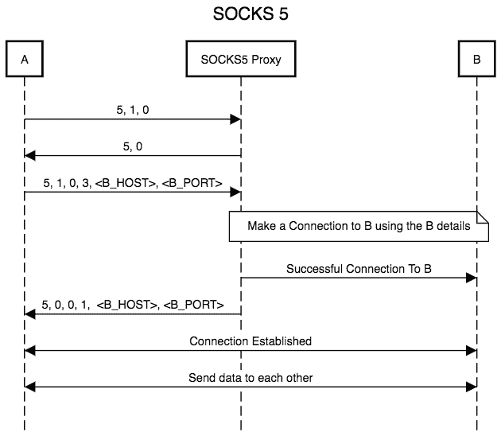

# 足球 5

> 原文：<https://dev.to/nimit95/socks-5-a-proxy-protocol-5hcd>

### SOCKS 5 —一种代理协议

在阅读本文之前，强烈建议您熟悉基本的代理概念。要复习代理概念并了解如何在 node 中制作一个简单的 HTTP/HTTPS 代理，请阅读 [this](https://dev.to/nimit95/a-simple-http-https-proxy-in-node-js-18ce-temp-slug-8079253) 。

> SOCKS 5 基本上是一个通用代理协议的**框架。**

我所说的通用代理协议是指，对于每个应用层协议，比如 HTTP、HTTPS(有争议)、FTP 等等，你需要设置不同的代理服务器。例如，对于 HTTP，你会有像 squid 这样的东西，对于 HTTPS 浏览器代理，等等。现在，SOCKS 5 代理为这些协议提供了一个通用框架，以透明和安全地遍历数据。

*SOCKS* 的另一个用途是作为一个**规避工具**，允许流量绕过互联网过滤访问被阻止的内容，例如，被政府、工作场所、学校和特定国家的网络服务阻止的内容

SOCKS 5 额外提供了**认证**，因此只有授权用户才可以访问服务器。

### 现实应用

1.  大多数情况下，所有 torrent 客户端都可以选择配置 SOCKS 5 代理来绕过防火墙(如果有的话)。
2.  它比 VPN 快，所以在许多速度很重要的地方，它被用在 VPN 上。
3.  洋葱代理软件向它的客户提供了一个 SOCKS 接口。

### 基本工作

A 希望通过互联网与 B 通信，但是两者之间有一个[防火墙](https://en.wikipedia.org/wiki/Firewall_(computing))，所以 A 不能直接连接到 B。因此，A 连接到 SOCKS 5 代理，通知它连接到 B。代理代表 A 建立到 B 的连接，并发回确认。现在，A 可以向 b 发送他想发送的任何内容。有关 SOCKS 5 协议的技术细节的更多信息，请参见下一节。

SOCKS5 协议在 [RFC 1928](https://tools.ietf.org/html/rfc1928) 中定义。下面是图表中协议的简要介绍。有关详细的协议特性，请参考 [RFC 1928](https://tools.ietf.org/html/rfc1928)

<figure> 

<figcaption>袜子 5 握手【注:5、1、0 为实际字节(0x05、0x01、0x 00)】</figcaption>

</figure>

**握手**

a(客户端)向 SOCKS5 代理发送初始化数据包( **0x05、0x01、0x00** )。第一个数据包的分类如下

1.  **首字节** **0x05** 是 SOCKS 的版本，这里是 SOCKS 5。这对于所有的短袜 5 包来说仍然是常见的。在下一节中不会提到这个字节。
2.  **第二个字节 0x01** 用于验证目的。确切地说，是客户端支持的身份验证方法的数量。这里 0x01 表示支持一种方法。
3.  **第三字节 0x00** 用于认证方法。有认证方法，可变长度，每个方法支持 1 个字节。支持的身份验证方法编号如下:

> 0x00:无验证
> 
> 0x01: GSSAPI
> 
> 0x02:用户名/密码
> 
> 0x 03–0x7F:IANA 分配的方法
> 
> 0x 80–0x Fe:保留供私人使用的方法

SOCKS 代理发送回 A( **0x05，0x00** )。:-

1.  **第二字节 0x00** 是代理选择的认证方法。在这种情况下，这是客户端提供的唯一方法，因此这是。随后的认证是依赖于方法的。用户名和密码验证(方法 0x02)在 [RFC 1929](https://tools.ietf.org/html/rfc1929) 中有描述。这里，不需要进一步进行任何认证相关的步骤。如果协商的方法包括用于完整性检查和/或机密性目的的封装，则进一步的请求**必须**被封装在方法相关的封装中。

a(客户端)发送请求包( **0x05，0x01，0x00，0x03，< B_HOST 【T3，< B_PORT >** )。一旦依赖于方法的子协商完成，客户端就将请求细节发送给 SOCKS 代理

1.  **第二字节 0x01** 用于命令代码。它是一个字节

> 0x01:建立 TCP/IP 流连接
> 
> 0x02:建立 TCP/IP 端口绑定
> 
> 0x03:关联一个 UDP 端口

1.  **第三个字节 0x00** 是一个保留字节。它的**必须是 0x00 和 1 个字节。**

2.  **第四个字节 0x03** 是所需主机的地址类型，1 个字节。选项如下。

> 0x01: IPv4 地址，后跟 4 个字节的 IP
> 
> 0x03:域名，1 字节的名称长度，后跟主机名
> 
> 0x04: IPv6 地址，后跟 16 字节 IP

1.  最后一个字节是端口号，按照[网络字节顺序](https://en.wikipedia.org/wiki/Network_byte_order)，2 个字节

SOCKS 代理发回请求包( **0x05，0x00，0x00，0x01，< B_HOST >，< B_PORT >** )。这是客户对代理的请求的状态:-

1.  **第二个字节 0x00** 是状态字段。它是一个字节。意味着请求被批准了。
2.  **第三个字节 0x00** 是一个保留字节。它的**必须是 0x00 和 1 个字节。**
3.  **第四个字节 0x01** 是所需主机的地址类型，1 个字节。在 CONNECT 的情况下，后面是所需主机的绑定 IP 地址，为客户端提供 DNS 解析的详细信息。
4.  最后一个字节是端口号，按照[网络字节顺序](https://en.wikipedia.org/wiki/Network_byte_order)，2 个字节

在此之后，连接发生，所有来自客户端 A 的数据被传输到客户端 B，反之亦然。这样，SOCKS 代理就像一个通用框架代理一样工作，并利用其安全特性处理大多数协议。

有一个很棒的节点库可以处理 socks 服务器的所有细节。它将传入的 SOCKS5 流转换为其各自的协议流。

[https://www.npmjs.com/package/socks5-stream](https://www.npmjs.com/package/socks5-stream)