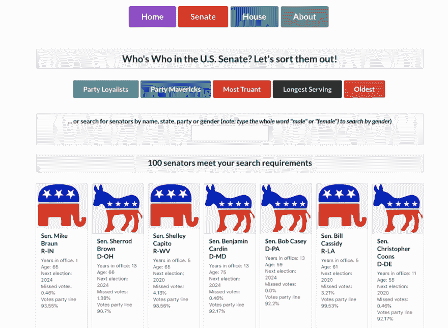
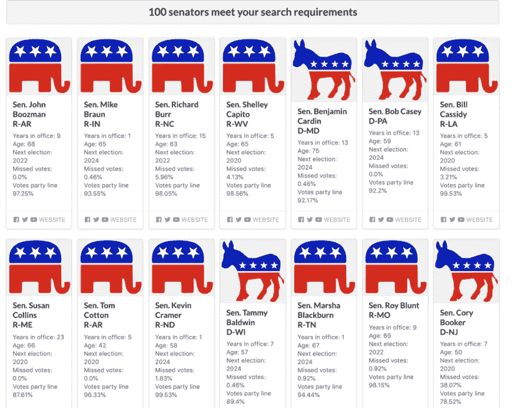
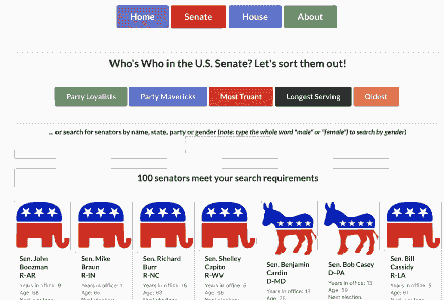
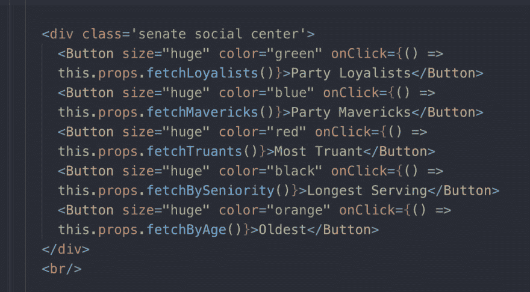

# Rails API 项目第 3 部分:使用 React & Redux 添加前端

> 原文：<https://dev.to/joanrig/rails-api-project-part-3-adding-a-front-end-with-react-redux-2i43>

以及如何调用我们在后端创建的自定义排序方法。

[](https://res.cloudinary.com/practicaldev/image/fetch/s--9gsWNH17--/c_limit%2Cf_auto%2Cfl_progressive%2Cq_auto%2Cw_880/https://cdn-images-1.medium.com/max/1024/1%2AOvnN9oKxsVwO9HohamyhDQ.png)

在[上一篇文章](https://dev.to/joanrig/rails-api-project-part-2-the-art-of-seeding-2dej-temp-slug-9969270)中，我们介绍了如何设置我们的名人堂 Rails API。现在我们需要一个前端，在那里我们以有趣的方式显示所有这些令人惊叹的数据。

我用 React 和 Redux 构建了我的前端。

### 什么是反应？

[](https://res.cloudinary.com/practicaldev/image/fetch/s--EDJWT85Q--/c_limit%2Cf_auto%2Cfl_progressive%2Cq_auto%2Cw_880/https://cdn-images-1.medium.com/max/200/1%2AkcTJ5BkjLWRM2IIb3Uye9A.jpeg) 

<figcaption>反应过来标志</figcaption>

这是一个由脸书创建的 Javascript 库。我们用它来创建模块化的用户界面，我们在页面上展示的每样东西都是一个组件。每个组件都有自己的代码，这使得团队很容易处理代码。然后，根据您想要呈现的视图，您可以选择显示哪些组件。

在我的应用程序中，我有一个 SenateContainer 组件，它有一个名为 SenatorsList 的子组件。而 SenatorsList 有自己的子组件 SenatorCard。当我完成我的项目时，SenatorCard 将有自己的组件，如社交媒体链接等。

然后，当我构建我的参议院页面时，我只需将这些构建块加载到一个文件中。看看这篇文章顶部的图片。它包括许多组件:一个包含 NavBar 组件(屏幕顶部的四个大按钮)的主页组件；参议员列表组件，包括排序按钮、搜索栏和参议员卡。

组件可以有状态和方法，它们可以传递给它们的子组件。React 有将这些东西(props，properties 的缩写)向下传递给子组件的方法，但是当您的组件有包含组件的组件时，这可能会变得很麻烦。

### 回车:Redux

Redux 是一个管理状态的工具。例如，列表组件的状态是列表中当前有哪些项目。使用 Redux，工作流程是这样的:

你有一个有初始状态的物体。假设你有一个没有项目的待办事项列表。所以 List 的初始状态是一个空数组:[]。

您的用户点击一个按钮来添加待办事项。

当他们提交新项目时，列表组件从位于单独文件中的动作列表中调用一个动作。

一个**缩减器**根据动作为组件设置一个新的状态。因此，如果动作是添加一个待办事项，reducer 使用一个 spread 操作符来创建当前状态的副本(基本规则:永远不要修改状态，只需创建一个副本并修改该副本)并添加 newToDo。

```
function ListReducer(state = [], action) {
 switch(action.type) {
 case 'ADD\_TODO':
 // adds todo`
 return { ...state, newTodo } 
```

现在，列表的状态已经在商店中更新。如果这让你困惑，你并不孤单！这里有一个优秀的超短入门叫做[“像我五岁一样解释 Redux。”](https://dev.to/hemanth/explain-redux-like-im-five)

### 那么关于那个 API 调用…

要设置我们的应用程序来更新来自 API 的数据，我们需要为保存数据的组件设置一个初始状态。让我们关注我们的 SenatorsList 组件，我用一个空的参议员数组的初始状态来设置它。

[](https://res.cloudinary.com/practicaldev/image/fetch/s--Hvfv3kt6--/c_limit%2Cf_auto%2Cfl_progressive%2Cq_auto%2Cw_880/https://cdn-images-1.medium.com/max/1024/1%2A8xYVVHAgA73tP0Fv6AXP2w.png)

我的观点是这样的:

[](https://res.cloudinary.com/practicaldev/image/fetch/s--NSRRPwdn--/c_limit%2Cf_auto%2Cfl_progressive%2Cq_auto%2Cw_880/https://cdn-images-1.medium.com/max/1024/1%2A-5sD598isd9f-CJuZSCdWA.png) 

<figcaption>注意:没有参议员列出</figcaption>

当我的用户点击红色的“参议院”按钮时，我希望页面加载所有 100 名参议员(我使用 React ui semantic 将其格式化为抽认卡)。

我在按钮上设置了一个事件监听器，这样当它被单击时，它将从我的 Actions/senate 文件中调用一个操作:

[](https://res.cloudinary.com/practicaldev/image/fetch/s--1tp0z3P_--/c_limit%2Cf_auto%2Cfl_progressive%2Cq_auto%2Cw_880/https://cdn-images-1.medium.com/max/1024/1%2AAB4-KDiNNbcRDg5CJXRdoQ.png)

动作 fetchSenate()使用[fetch 方法](https://developer.mozilla.org/en-US/docs/Web/API/Fetch_API/Using_Fetch)调用我们之前设置的 API 将响应放在 JSON 中，然后告诉 Reducer，嘿，Reducer 先生，请继续发送类型为“SET_SENATE”的动作，并将我刚才存储在变量“SENATE”中的数据输入给它。

[](https://res.cloudinary.com/practicaldev/image/fetch/s--59PKiGQh--/c_limit%2Cf_auto%2Cfl_progressive%2Cq_auto%2Cw_880/https://cdn-images-1.medium.com/max/1024/1%2Aq1bjppIs7S1WG__3e4Wrzw.png)

然后 reducer 用 100 名参议员的数组更新应用程序的 state.senate！这个更新的状态存在于我们的存储中。

### 回到牧场……

与此同时，参议员名单不知道发生了什么。它发出了一个参议员的请求，100 名参议员回来了，但他们回到了商店。为了让 SenatorsList 访问它自己的状态，我们必须将它连接到 store。我们使用 Redux 内置的“连接”工具来完成这项工作:

在我们参议员列表组件的底部:

[](https://res.cloudinary.com/practicaldev/image/fetch/s--t1M0JL-q--/c_limit%2Cf_auto%2Cfl_progressive%2Cq_auto%2Cw_880/https://cdn-images-1.medium.com/max/1024/1%2A6reVr0sqWur3puDbpp9ruw.png)

如果没有 Redux，这里通常会有一行:export default SenatorsList。但是我们在这里添加了更多信息——在导出 SenatorsList 之前，我们将它连接到 store，我们希望它获取自己的状态和动作(位于 actions/senate.js 文件中的状态和动作)。

导出行是这样开始的:

```
export default SenatorsList connect()(SenatorsList) 
```

Connect 有两个参数。第一个是 mapStateToProps，它让组件(一旦它连接到商店)调用其状态作为道具(为属性拍摄)。下面是 mapStateToProps 的样子:

```
const mapStateToProps = state =\> ({senate: state.senate}) 
```

上面的代码说——去商店，获取我的州(state.senate ),从现在开始，让我以 this.props.senate 的名称访问我的州。

但是参议员列表想要的不仅仅是它的状态。它还想访问存储中改变其状态的操作。回到我们的连接:

[](https://res.cloudinary.com/practicaldev/image/fetch/s--t1M0JL-q--/c_limit%2Cf_auto%2Cfl_progressive%2Cq_auto%2Cw_880/https://cdn-images-1.medium.com/max/1024/1%2A6reVr0sqWur3puDbpp9ruw.png)

connect 采用的第二个参数是 mapDispatchToProps。您可以[写出完整的方法](https://react-redux.js.org/using-react-redux/connect-mapdispatch)或者添加一个动作列表，用花括号括起来，用逗号分隔。上面写着:当你在商店的时候，抓住这些动作，把它们也映射到道具上，这样我就可以调用这个了。props.fetchSenate，等等。

[](https://res.cloudinary.com/practicaldev/image/fetch/s--zEP3zRPr--/c_limit%2Cf_auto%2Cfl_progressive%2Cq_auto%2Cw_880/https://cdn-images-1.medium.com/max/1024/1%2AB75ZHwlbnRygChj68H60HQ.png)

把 connect，mapStateTo Props 和 mapDispatch to props 看作是你卑微的组件去商店获得超能力的一种方式！

既然 SenatorsList 知道了自己所在的州，它就使用每个参议员的信息来呈现一张 SenatorCard，然后将它们显示在一个网格中。

[](https://res.cloudinary.com/practicaldev/image/fetch/s--Ah1wWZtV--/c_limit%2Cf_auto%2Cfl_progressive%2Cq_auto%2Cw_880/https://cdn-images-1.medium.com/max/1024/1%2AT34ycbNNTRf04BeBX_MsIw.png)

### 让我们把我们的超能力传递给其他的按钮。

[](https://res.cloudinary.com/practicaldev/image/fetch/s--GXnz1SFW--/c_limit%2Cf_auto%2Cfl_progressive%2Cq_auto%2Cw_880/https://cdn-images-1.medium.com/max/1024/1%2AvFacc_DqdV1Qf6xqAmgoOg.png)

我的参议院视图包括五个排序按钮。每一个都与我们在 Rails API 中定义的自定义排序方法相关联，并与一个搜索词相关联，我们可以将这个搜索词提供给我们的 API 以获取排序后的参议员列表。

这些按钮看起来很像参议院按钮，但它们的工作方式有点不同。

参议院按钮不会直接触发获取操作。相反，它将查看器路由到 Senate route，该路由安装 SenateContainer 组件，该组件安装 SenatorsList 组件，…该组件在加载时自动触发 fetch 操作。换句话说，当你点击参议院时，我希望你自动看到所有 100 名参议员。

现在您正在查看所有 100 名参议员，您可以选择单击其中一个排序按钮来重新排序参议员。我不想安装其他组件，而是希望这些按钮可以重新洗牌。所以我想让每个按钮直接调用它对应的动作。

为此，我必须赋予每个按钮调用该操作的权力。我们可以让每个按钮成为它自己的组件，并让它去商店获取它的动作，但是有一种更简单的方法。我们可以把超能力从参议员名单传给它的孩子，每个按钮！下面是它们的样子:

[](https://res.cloudinary.com/practicaldev/image/fetch/s--0jEDSGXN--/c_limit%2Cf_auto%2Cfl_progressive%2Cq_auto%2Cw_880/https://cdn-images-1.medium.com/max/1024/1%2Aak5uRow6CI8ogZcK_HrxDA.png) 

<figcaption>在 SenatorsList</figcaption>

里面返回方法

因为这些按钮是在 SenatorsList 组件内部呈现的，所以它们是 SenatorsList 的子级，SenatorsList 可以为每个按钮提供执行其任务所需的权力。让我们看看，“忠诚者”按钮将需要访问这个。props.fetchLoyalist，“小牛”将需要这个。props.fetchMavericks，等等。

现在，当每个按钮被点击时，它将触发动作(存储在 actions/senate.js 中)，这又将告诉 reducer 触发它的哪个动作…然后 reducer 更新存储。由于 SenatorsList 现在可以作为 props 访问它的州，它会自动更新以显示它的新州:一个 100 名参议员的列表，按(无论我们单击哪个按钮！)

这是效忠派的样子:

[](https://res.cloudinary.com/practicaldev/image/fetch/s--hVWB3T6F--/c_limit%2Cf_auto%2Cfl_progressive%2Cq_auto%2Cw_880/https://cdn-images-1.medium.com/max/1024/1%2AYijF_q0nm7BgM_I1CCEf6A.png)

如果你已经读到这里，我希望这能帮助你理解 React 和 Redux。

这里是这个项目的回购的链接:[前端](https://github.com/joanrig/congress_front_end)&[后端 Rails API](https://github.com/joanrig/congress_api) 。