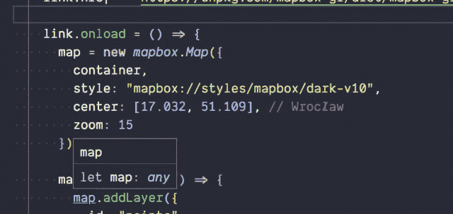

# 苗条的副业

> 原文：<https://dev.to/krzysztofzuraw/side-project-with-svelte-3675>

我最近在 [HN](https://www.thefutureoftheweb.com/blog/svelte-is-the-most-beautiful-framework-ive-ever-seen) 上发现了一篇关于这个 JavaScript
世界里的新酷小孩- [苗条](https://svelte.dev/)的文章。
当我通读这篇博文时，我决定用这个框架玩一点自己的游戏。在这篇简短的博文中，我将写下我在这个兼职项目中的发现。

在阅读本材料之前，您不需要任何先验知识，但是了解 TypeScript 或 JavaScript 将会有所帮助。

## 想法

我的想法是构建一个简单的应用程序，它将获取 [GeoJSON](https://geojson.org/) 并在地图上显示
点。

**是的，我知道**它可以在纯 JavaScript 和任何其他框架中完成，但我决定用 Svelte 来完成。

我希望它是一个快速的项目，所以我直接进入代码(我做了一些 60 年代的苗条教程)。

我的一个主要额外条件是我想用打字稿来做。

我找到了一些脚手架模板。我安装的。一切看起来都很好。

我开始在`App.svelte`
中编写我的应用程序的一些基本逻辑(这是框架期望的文件格式)。

## 支持打字稿

然而过了一段时间，我发现我的类型不见了！。我可以声明新的变量——它有合适的类型。然而，当我试图使用它时，我的类型不见了！

[](https://res.cloudinary.com/practicaldev/image/fetch/s--I6dvoWR---/c_limit%2Cf_auto%2Cfl_progressive%2Cq_auto%2Cw_880/https://i.ibb.co/gzvZHMQ/types.png)

普通`.ts`文件中的相同代码工作正常。

这可能与以下事实有关:`.svelte`文件最多可由 3 部分组成:

```
<script></script> // this is where all JavaScript logic is kept
<style></style> // css styles per component
<div></div> // pure html with some handlers and block logic from framework 
```

摘要:类型脚本支持-否

## 语法

让我们进入下一部分——语法。我真的很好奇为什么人们想要远离 JSX，这是 DOM 操纵吗？
而不是拥有:

```
<div>{showComponent && <Component />}</div> 
```

您已经:

```
{#if showComponent}
  <Component />
{/if} 
```

我个人觉得编写定制模板而不是 JavaScript 代码很奇怪。

### 易于发展

[Svelte](https://svelte.dev/tutorial/basics) 教程在解释框架的基本概念方面真的很不错。
它甚至有一个[部分](https://svelte.dev/tutorial/context-api)，在那里你可以找到我试图完成的
的例子——在地图上渲染点。

我也很喜欢设置的简易性——你只需要运行一个命令来搭建文件夹，然后你就可以开始开发了！

### 什么我没试过

我的[应用](https://wroclaw-guide.noaaln.now.sh/)不需要苗条的主要力量——反应。至少在这个发展阶段。因此，我不能说它与其他框架相比如何。

### 总结&TL；速度三角形定位法(dead reckoning)

我尝试在我的[宠物项目](https://wroclaw-guide.noaaln.now.sh/)中使用瘦框架。这是一次有趣的旅行。

#### 我喜欢

*   开发经验
*   辅导的
*   生产中的捆尺寸

#### 我不喜欢什么

*   类型脚本支持
*   句法

你试过苗条吗？你对此有什么看法？