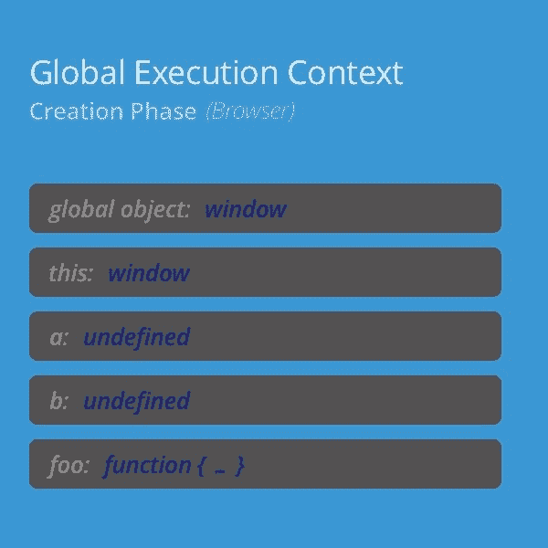
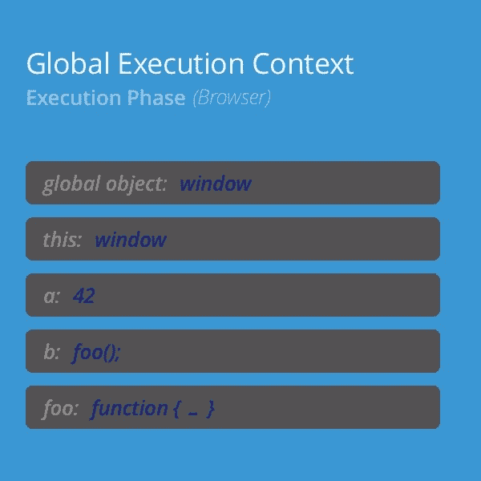
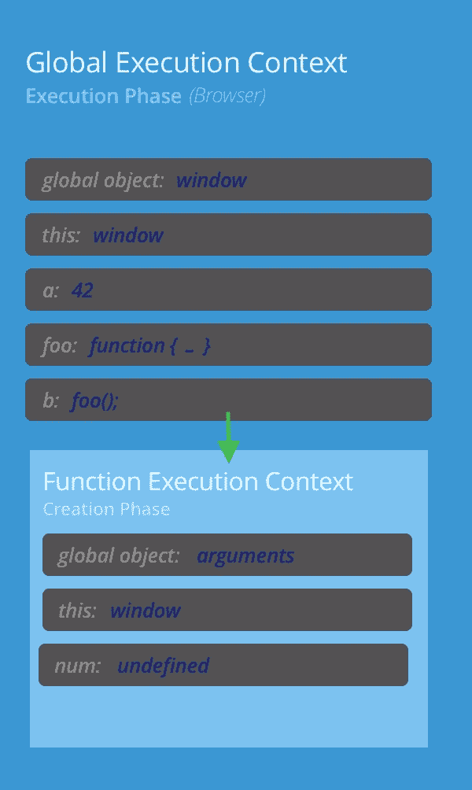
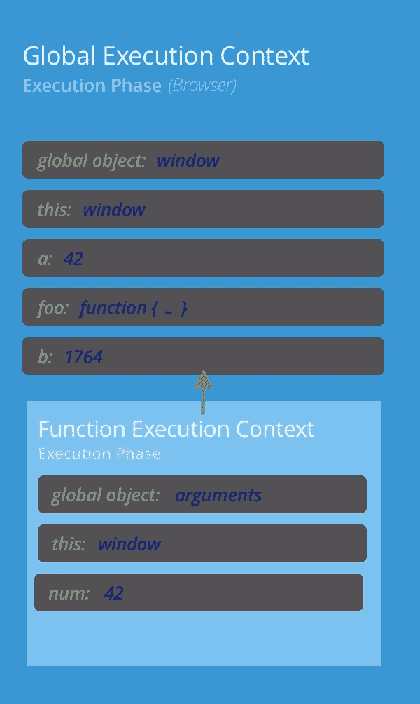
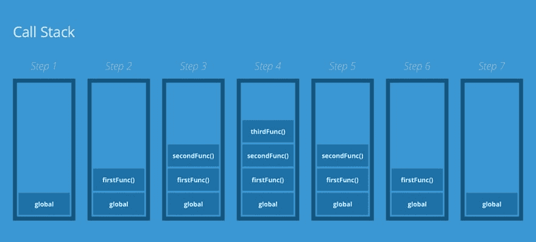
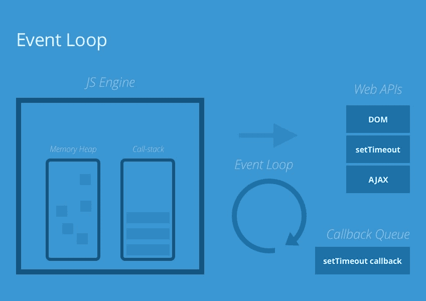

# JavaScript 执行上下文、调用堆栈和事件循环

> 原文：<https://dev.to/thebabscraig/the-javascript-execution-context-call-stack-event-loop-1if1>

#### 这将是一个漫长的过程——拿起☕️，开始吃吧...

你是否曾经看过一段 JS 代码，并且知道执行这段代码的结果会是什么，但是在你的内心深处，你知道你不知道结果是如何产生的。或者你可能已经看过一些异步代码，比如点击处理程序或者 AJAX 调用，并且想知道*回调函数到底是怎么知道什么时候触发的？*

JavaScript 无处不在。在浏览器中，在桌面上，在移动应用程序中，在我们身边的日常事物中。阿特伍德定律似乎一天比一天更加应验——“任何可以用 JavaScript 编写的应用程序，最终都会用 JavaScript 编写。”

JavaScript 的影响力越来越广，每天使用它的开发人员越来越多，这已经不是什么新闻了，然而，对 JavaScript 的深入了解往往很难获得。这是因为 JS 是这样一种语言，在这种语言中，你只需要知道足够的知识就可以应付过去，而不必费心去深入研究。

这篇文章是关于通过理解我们的 JS 代码是如何执行的来加深我们对 JS 的了解。这些规则由执行上下文、调用堆栈和事件循环的交互控制。这三个概念的相互作用使得我们的代码得以执行。为了理解更高级的东西，比如作用域和闭包，很好地理解这些基本概念是至关重要的。我们直接进去吧。

每当您编写并运行 JavaScript 时，您都依赖于一个引擎来为您执行代码。该引擎可能会因您所处的环境而异，甚至会因同一环境的不同实现而异。例如，Chrome 浏览器和 Firefox 浏览器使用不同的引擎(前者使用 V8，后者使用 SpiderMonkey)。

引擎是获取并执行代码的工具。它遵循一系列步骤——第一步是创建一个全局执行上下文。这个全局执行上下文通常是一个匿名函数，作为运行您编写的所有代码的空间。

### 执行上下文

```
var a = 42;

function foo(num) {
  return num * num;
}

var b = foo(a); 
```

Enter fullscreen mode Exit fullscreen mode

让我们看一段相当简单的代码。在这个例子中，我们给变量`a`赋一个数值，我们声明一个函数`foo`，然后我们调用`foo`传入`a`作为参数，然后将该函数的返回值存储在`b`中。如果我问你这段代码的结果是什么，我肯定你会毫不犹豫地理解并得到正确答案。然而，如果我问*JavaScript 是如何得到答案的，你可能无法给出一个直接的答案。让我们一起来看看这个问题的答案。*

在上面的代码中，引擎要做的第一件事是创建一个执行上下文。引擎遵循精确的步骤，并且有两个阶段。创造阶段和执行阶段。

代码第一次运行时，会创建一个`Global Execution Context`。在这个**创造阶段**，引擎将做几件事:

*   创建一个全局对象。例如，这个对象在浏览器中称为`window`,在节点中称为`global`。
*   创建一个指向上面创建的对象的`this`对象绑定。
*   设置内存堆来存储变量和函数引用
*   将函数声明存储在上面的内存堆中，并将每个变量存储在上下文中，并将`undefined`赋值。

[](https://res.cloudinary.com/practicaldev/image/fetch/s--g1bUPUbU--/c_limit%2Cf_auto%2Cfl_progressive%2Cq_auto%2Cw_880/https://res.cloudinary.com/media-resource/image/upload/v1563576999/babscraig.com/global-execution-creation-context_qkqzh5.jpg)

在我们的例子中，在创建阶段，引擎将存储变量`a`和`b`以及函数声明`foo`。它最初也会将`undefined`赋给两个变量。

在这个阶段完成后，引擎移动到**执行阶段**。在执行阶段，代码是逐行运行的。在这个阶段，变量被赋值，函数被调用。

[](https://res.cloudinary.com/practicaldev/image/fetch/s--h-jsDmzA--/c_limit%2Cf_auto%2Cfl_progressive%2Cq_auto%2Cw_880/https://res.cloudinary.com/media-resource/image/upload/v1563577069/babscraig.com/Global_Execution_Context_Execution_le1riu.jpg)

如果你的代码中没有函数调用，故事到此结束。然而，对于您调用的每个函数，引擎都会创建一个新的`Function Execution Context`。这个上下文与上面的相同，但是这次不是创建一个全局对象，而是创建一个包含所有传递给函数的参数的引用的**参数**对象。

[](https://res.cloudinary.com/practicaldev/image/fetch/s--_JP9SFo_--/c_limit%2Cf_auto%2Cfl_progressive%2Cq_auto%2Cw_880/https://res.cloudinary.com/media-resource/image/upload/v1563577117/babscraig.com/Function_Execution_Context_Creation_tq6mn5.jpg)

回到我们上面的例子，在执行阶段，引擎将首先到达变量声明`a`，并给它赋值`42`。然后它会移动到我们给`b`赋值的那一行。看到这一行进行了一个函数调用，它将创建一个新的`Function Execution Context`并重复上面的步骤(这次创建了一个 arguments 对象)。

[](https://res.cloudinary.com/practicaldev/image/fetch/s--oq0aOOBs--/c_limit%2Cf_auto%2Cfl_progressive%2Cq_auto%2Cw_880/https://res.cloudinary.com/media-resource/image/upload/v1563577143/babscraig.com/Function_Execution_Context_Execution_kx44ld.jpg)

但是它如何跟踪所有这些执行上下文呢？尤其是在有多个嵌套函数调用或条件的场景下？它如何知道哪个是活动的，或者哪个已经被完全执行了？

这很好地向我们介绍了我们的下一个概念——调用栈。

### 调用栈

调用栈是一种数据结构，用于跟踪和管理一段 JS 代码中的函数执行。它的工作是存储代码执行过程中创建的所有执行上下文，并记录我们实际上所在的执行上下文以及那些仍留在堆栈中的执行上下文。当您调用一个函数时，引擎会将该函数推到堆栈顶部，然后创建一个执行上下文。从上面对执行上下文的研究中，我们知道这个上下文要么是全局上下文，要么是函数执行上下文。

当每个函数运行时，调用栈将它弹出，并移动到下一个函数，直到它为空并且所有函数都已运行。这个顺序被称为**后进先出** - **后进先出**。

当一个函数被调用时，一个堆栈框架被创建。这是内存中存储参数和变量的位置(还记得我们上面谈到的内存堆吗？).当函数返回(隐式或显式)时，内存被清空，然后整个上下文被弹出调用堆栈。

当执行上下文完成执行时，它们会一个接一个地弹出堆栈，每个执行上下文都会创建一个堆栈帧，当我们抛出一个错误时，我们会得到所谓的**堆栈跟踪**，这听起来就像是跟踪所有执行上下文，从错误发生点一直到我们经过的所有上下文。

也有可能通过拥有比堆栈设计所能容纳的更多的帧来破坏调用堆栈。这可能发生在没有某种退出条件的情况下递归调用函数时，或者我确信我们都在某个时间点做过——当一个无限 for 循环运行时。

看看这段代码:

```
function thirdFunc() {
  console.log("Greetings from thirdFunc()");
}

function secondFunc() {
  thirdFunc();
  console.log("Greetings from secondFunc()");
}

function firstFunc() {
  secondFunc();
  console.log("Greetings from firstFunc()");
}

firstFunc();

// Greetings from thirdFunc()
// Greetings from secondFunc()
// Greetings from firstFunc() 
```

Enter fullscreen mode Exit fullscreen mode

同样，*我们如何得到我们所得到的结果？*

当我们运行这段代码时，引擎做的第一件事是调用调用堆栈，并在调用堆栈上放置一个`main()`或`global()`函数。这是执行 JS 代码的主线程。我们在上一节中描述的执行上下文将首先进入创建阶段，然后将调用执行阶段。当引擎在这个阶段调用`firstFunc()`时，调用栈将被再次引用，并且`firstFunc()`的函数执行上下文将被推送到`main()`之上的调用栈中(下面的步骤 2)。

[](https://res.cloudinary.com/practicaldev/image/fetch/s--xZgcLYD4--/c_limit%2Cf_auto%2Cfl_progressive%2Cq_auto%2Cw_880/https://res.cloudinary.com/media-resource/image/upload/v1563577182/babscraig.com/call_stack_u2vvsi.jpg)

现在引擎将开始执行`firstFunc()`,因为它位于调用堆栈的顶部。它将依次创建一个本地执行上下文和本地内存分配，以便在这个新的上下文中存储变量、参数和函数声明。(范围的概念与此相关)。

`firstFunc()`的第一行调用`secondFunc()`。此时，引擎将再次引用调用堆栈，并将`secondFunc()`放在堆栈的顶部，再次重复这个过程。在`secondFunc()`中，第一行再次引用了另一个名为`thirdFunc()`的函数，这个过程又重复了一次。

现在在`thirdFunc()`中，我们不进行任何函数调用，而是简单地 console.log 字符串*"来自 thirdFunc()"* 。它被执行，然后因为函数中没有更多的指令，它隐式地返回。此时，调用栈弹出`thirdFunc()`(上面的步骤 4 ),现在`secondFunc()`位于栈顶。引擎将从我们停止的地方继续运行，并 console.log 字符串*“来自 secondFunc()”的问候*。同样，由于该函数中没有更多指令，函数将返回，调用堆栈将弹出`secondFunc()`，将我们带回`firstFunc()`的执行上下文，在这里我们继续并注销字符串*“来自 firstFunc()”的问候*。执行完该代码后，`firstFunc()`被弹出，控制返回到主执行上下文，该上下文没有进一步的指令要执行，将依次弹出。一旦我们的堆栈为空，程序将停止运行。

调用栈的性质反映了这样一个事实，即 JavaScript 本质上是单线程的，一次只能运行一个执行上下文。这意味着当一个函数被执行时，引擎不能同时运行另一个上下文。这也意味着，每当一个函数被推到调用堆栈上时，它就变成活动的执行上下文，并从调用它的任何函数那里取走控制流，直到它*显式地(用`return`语句)或隐式地(当所有指令都已执行时)返回*。

现在，如果故事到此结束，那么 JavaScript 除了在最普通的应用程序中不会有太大的用处，在有大量并发事件(用户输入、资源请求、API 调用)的 web 应用程序中更是如此。每个事件都会阻塞另一个事件，直到它完成运行。这意味着当一个函数被调用时——可能是一个向服务器请求图像的函数——在图像被加载之前，页面上不会发生任何事情。如果您在图像加载之前单击了一个链接，那么直到图像加载之后才会处理该事件。

那么，我们如何实现异步 JavaScript，让多件事情同时发生呢？进入事件循环。

### 事件循环

正如我们在上面看到的，JavaScript 引擎实际上一次只能做一件事。它从我们代码的顶部开始，一路向下，根据需要创建新的执行上下文，并将它们推入和弹出调用堆栈。

如果您有一个需要很长时间执行的阻塞函数，那么在该函数位于调用堆栈顶部期间，浏览器不能做任何事情。不能发生新的执行上下文或代码执行。这意味着即使像滚动和按钮点击事件这样的用户输入也不起作用。

相反，当我们有一个可能需要很长时间才能完成的函数时，我们通常会提供一个回调函数。该函数封装了我们希望在阻塞动作(例如网络调用)解决后运行的代码。这允许我们将控制返回给 JS 引擎，并将剩余的执行推迟到调用栈被清除之后。这就是 JavaScript 中异步的概念。

让我们把以前的代码调整成需要这个新概念的东西:

```
function thirdFunc() {
  setTimeout(function() {
    console.log("Greetings from thirdFunc()");
  }, 5000);
}

function secondFunc() {
  thirdFunc();
  console.log("Greetings from secondFunc()");
}

function firstFunc() {
  secondFunc();
  console.log("Greetings from firstFunc()");
}

firstFunc();

// Greetings from secondFunc()
// Greetings from firstFunc()
// approx. 5 seconds later...
// Greetings from thirdFunc() 
```

Enter fullscreen mode Exit fullscreen mode

在上面的代码中，执行像前面的例子一样开始。然而，当引擎到达第三个函数时，它不是立即将消息记录到控制台，而是调用由浏览器环境提供给我们的 API`setTimeout()`。这个函数接受一个“回调”函数，这个函数存储在一个我们还没有讨论过的结构中，这个结构叫做回调队列。然后`thirdFunc()`将完成它的执行，将控制权依次交还给`secondFunc()`和`firstFunc()`。最后，在*至少* 5 秒后(下面会有更多相关信息)，来自`thirdFunc()`的信息会被记录到控制台。

[](https://res.cloudinary.com/practicaldev/image/fetch/s--Ap7phZxK--/c_limit%2Cf_auto%2Cfl_progressive%2Cq_auto%2Cw_880/https://res.cloudinary.com/media-resource/image/upload/v1563577216/babscraig.com/event_loop_mirspd.jpg)

在 JavaScript 中，我们实现代码异步执行的机制是通过环境 API(节点和浏览器都提供某些向我们公开底层特性的 API)、回调队列和事件循环。

并发性(或者说它的假象)是通过这些额外的机制实现的。

正如我们所说，调用堆栈用于跟踪当前正在执行的函数上下文，回调队列跟踪任何需要在以后运行的执行上下文。例如传递给 setTimeout 函数或节点异步任务的回调。当我们的代码被调用时，事件循环定期检查调用栈是否为空。一旦调用栈已经运行了我们代码中的所有执行上下文，事件循环就获取第一个进入回调队列的函数，并将其放在调用栈中执行。然后再次重复该过程，不断检查调用栈和回调队列，一旦调用栈为空，就将函数从回调队列传递到调用栈。

还记得我们说过 setTimeout 回调将从调用 setTimeout 开始“至少”运行 5 秒吗？这是因为当超时完成时，setTimeout 不只是将其代码插入到调用堆栈中，它必须将其传递给回调队列，然后等待事件循环在调用堆栈为空时将其放入调用堆栈*。*只要调用堆栈中还有项目，setTimeout 回调就不会运行。下面我们来详细了解一下这个。

我们的代码像上面一样运行，直到我们到达`thirdFunction`。此时，setTimeout 被调用，从调用堆栈中取出并开始倒计时。我们的代码继续到`secondFunc`和`firstFunc`并依次记录它们的消息。与此同时，setTimeout 几乎立即完成了倒计时——在 0 秒内——但是它没有办法将回调直接放到调用堆栈上。相反，当它完成倒计时时，它将回调传递给回调队列。事件循环一直在检查调用栈，但是在此期间`secondFunc`和`firstFunc`依次占用了调用栈的空间。直到这两个函数完成执行，调用栈被清空，事件循环才获取我们传递给`setTimeout`的回调函数，并将其放在调用栈中执行。

这就是为什么有时您会发现用`0`调用 setTimeout 的模式是一种延迟执行传递给它的回调中的代码的方式。我们只想确保所有其他同步代码在`setTimeout`回调中的代码之前运行。

同样重要的是要注意，“回调”是由另一个函数调用的函数，但是我们上面讨论的回调，比如传递给`setTimeout`的回调是“异步回调”。区别在于，异步回调被传递到回调队列，等待(由事件循环)放置到调用堆栈上，以便以后执行。

至此，我们已经介绍了 JavaScript 代码执行的主要概念以及 JavaScript 引擎如何处理异步代码。我们已经看到，JS 引擎是单线程的，只能同步执行代码。我们还看到了在不阻塞执行线程的情况下实现异步代码的机制。我们也更好地理解了函数执行的顺序和围绕这个过程的规则。

这些概念可能很难理解，但是值得花时间真正掌握它们，因为它们是深入了解 JavaScript 的基础。不仅仅是`var a = 2`语法，而是当 JavaScript 采用该语法并运行它时*到底发生了什么*的整体视图。这些概念也为更好地理解范围和闭包等其他概念提供了基础。像这样的主题需要更多的资源，请随意阅读以下内容:

*   事件循环到底是什么？—菲利普·罗伯茨
*   [了解 JavaScript 执行— Codesmith](https://www.youtube.com/playlist?list=PLWrQZnG8l0E4kd1T_nyuVoxQUaYEWFgcD)
*   JavaScript 中执行上下文、提升、作用域和闭包的终极指南——泰勒·麦金尼斯