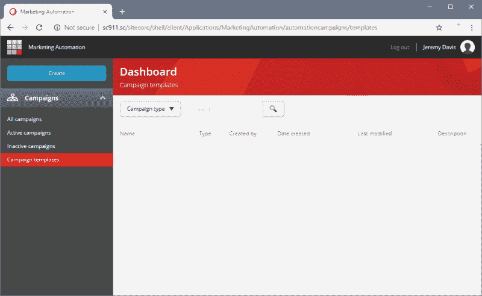
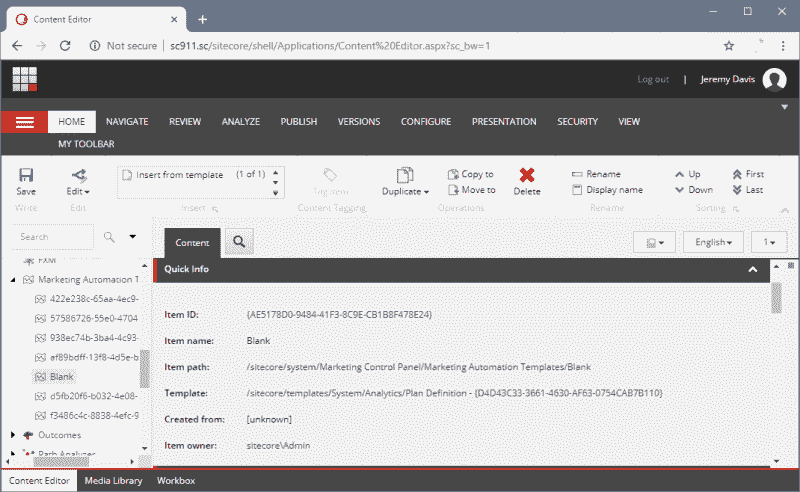
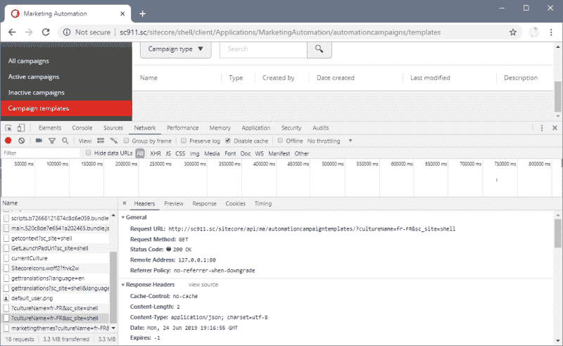
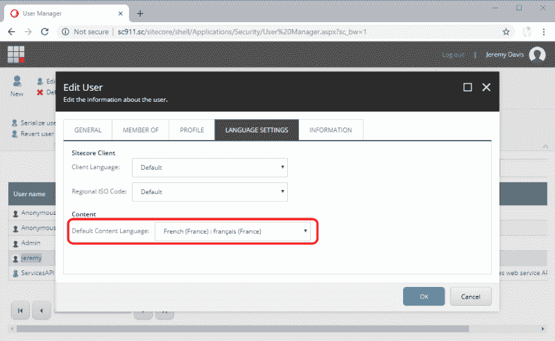
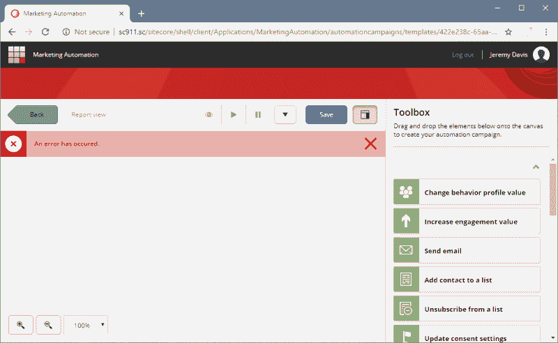

# 另一个营销自动化问题

> 原文：<https://dev.to/jermdavis/another-marketing-automation-gotcha-56a5>

继[我最近的一篇关于我如何因为把营销自动化连接字符串弄错而把自己的生活搞得一团糟的帖子](https://dev.to/jermdavis/shooting-myself-in-the-foot-with-marketing-automation-31o3-temp-slug-3025341)之后，我又碰到了马的另一个有趣的问题——这次是关于内容语言……

## 这个问题

查看新部署的 Sitecore 实例，我的编辑帐户在营销自动化仪表板中看不到任何活动模板:

[](https://jermdavis.files.wordpress.com/2019/06/empty-ma-dashboard.png)

这是不对的，因为我可以看到内容编辑器中的模板项:

[](https://jermdavis.files.wordpress.com/2019/06/ma-templates.png)

做了一些调查后，我注意到 dasboard 页面正在进行一个 web 服务调用，我可以通过浏览器开发工具来检查这个调用:

[](https://jermdavis.files.wordpress.com/2019/06/ma-fetchapi-2.png)

该请求传入了一个 querystring 值:"`cultureName=fr-FR`"，该调用的结果是一个没有数据的有效 json 响应:

```
[] 
```

<svg width="20px" height="20px" viewBox="0 0 24 24" class="highlight-action crayons-icon highlight-action--fullscreen-on"><title>Enter fullscreen mode</title></svg> <svg width="20px" height="20px" viewBox="0 0 24 24" class="highlight-action crayons-icon highlight-action--fullscreen-off"><title>Exit fullscreen mode</title></svg>

但是，如果我将该 url 更改为使用“en”作为其语言，数据会发生变化:

```
[  {  "id":  "938ec74b-3ba4-4c93-9152-015655088998",  "alias":  "938ec74b-3ba4-4c93-9152-015655088998",  "name":  "Cart Abandonment",  "children":  null,  "startDate":  "0001-01-01T00:00:00Z",  "endDate":  "0001-01-01T00:00:00Z",  "createdBy":  "sitecore\\Admin",  "createdDate":  "2018-08-17T12:26:31Z",  "cultureName":  "en",  "customValues":  {},  "description":  "When a customer fails to complete an order, an automated marketing email message  is sent to the recipient. The intention is to re-engage the recipient and to encourage them to complete the order. Appropriate timings differ depending on the sales cycle of the product. In our example we show three email messages over three days. To discourage misuse of promotional codes in this campaign, brands may want to set a limit to the number of times a recipient can re-enter this campaign.",  "isActive":  false,  "state":  "Inactive",  "lastModifiedBy":  null,  "lastModifiedDate":  "2018-10-05T06:54:16Z",  "version":  1,  "classifications":  {},  "currentEnrollments":  0,  "marketingThemeId":  "85506484-7854-4b14-ab0c-dfc61ca65cc0",  "maxEnrollmentsCount":  null  },  --  snip  --  {  "id":  "ae5178d0-9484-41f3-8c9e-cb1b8f478e24",  "alias":  "Blank",  "name":  "Blank",  "children":  null,  "startDate":  "0001-01-01T00:00:00Z",  "endDate":  "0001-01-01T00:00:00Z",  "createdBy":  "sitecore\\Admin",  "createdDate":  "2018-04-03T04:07:59Z",  "cultureName":  "en",  "customValues":  {},  "description":  "",  "isActive":  false,  "state":  "Inactive",  "lastModifiedBy":  null,  "lastModifiedDate":  "2018-04-03T04:09:06Z",  "version":  1,  "classifications":  {},  "currentEnrollments":  0,  "marketingThemeId":  "00000000-0000-0000-0000-000000000000",  "maxEnrollmentsCount":  null  }  ] 
```

<svg width="20px" height="20px" viewBox="0 0 24 24" class="highlight-action crayons-icon highlight-action--fullscreen-on"><title>Enter fullscreen mode</title></svg> <svg width="20px" height="20px" viewBox="0 0 24 24" class="highlight-action crayons-icon highlight-action--fullscreen-off"><title>Exit fullscreen mode</title></svg>

所以这个问题与语言有关…

## 解决问题

想到这一点，我试着查看用户的设置:

[](https://jermdavis.files.wordpress.com/2019/06/user-language.png)

我意识到这些有问题的用户被设置了特定的默认内容语言来匹配客户的项目需求。如果我将用户改回“默认”或“en ”,那么营销自动化仪表板又开始正常工作了——这将符合通过更改上面的 url 所看到的行为。

一位同事建议将营销自动化模板项目翻译成客户要求的语言可能是一个很好的解决方法，所以我尝试了这种方法。您翻译的上面模板文件夹中的任何项目都会出现在模板视图中。因此，您可以使用“从模板创建”选项来尝试创建新的营销自动化流程。但不幸的是，当编辑器加载时，您仍然会得到一个错误:

[](https://jermdavis.files.wordpress.com/2019/06/brokentemplate.png)

在日志中，您会得到:

```
 728 20:37:07 ERROR [Sitecore Services]: HTTP GET
URL http://sc911.sc/sitecore/api/ma/automationcampaigntemplates/422e238c-65aa-4ec9-8f98-d563cdee6c72?cultureName=fr-FR&sc_site=shell

Exception System.Resources.MissingManifestResourceException: Could not find any resources appropriate for the specified culture or the neutral culture.  Make sure "Sitecore.Xdb.MarketingAutomation.Locators.Xmgmt.Resources.resources" was correctly embedded or linked into assembly "Sitecore.Xdb.MarketingAutomation.Locators.Xmgmt" at compile time, or that all the satellite assemblies required are loadable and fully signed.
   at System.Resources.ManifestBasedResourceGroveler.HandleResourceStreamMissing(String fileName)
   at System.Resources.ManifestBasedResourceGroveler.GrovelForResourceSet(CultureInfo culture, Dictionary`2 localResourceSets, Boolean tryParents, Boolean createIfNotExists, StackCrawlMark& stackMark)
   at System.Resources.ResourceManager.InternalGetResourceSet(CultureInfo requestedCulture, Boolean createIfNotExists, Boolean tryParents, StackCrawlMark& stackMark)
   at System.Resources.ResourceManager.InternalGetResourceSet(CultureInfo culture, Boolean createIfNotExists, Boolean tryParents)
   at System.Resources.ResourceManager.GetString(String name, CultureInfo culture)
   at Sitecore.Xdb.MarketingAutomation.Locators.Xmgmt.AutomationPlans.ItemActivityDescriptorLocator.ToActivityDescriptor(ActivityTypeItem activityTypeItem, CultureInfo culture)
   at Sitecore.Xdb.MarketingAutomation.Locators.Xmgmt.AutomationPlans.ItemActivityDescriptorLocator.GetDescriptor(Guid id, CultureInfo culture)
   at Sitecore.Marketing.Automation.Extensions.AutomationActivityDefinitionViewModelExtensions.ToViewModel(IAutomationActivityDefinition automationActivityDefinition, IActivityDescriptorLocator activityDescriptorLocator, CultureInfo culture, IActivityConverterFactory`1 activityConverterFactory, BaseLog logger)
   at Sitecore.Marketing.Automation.Extensions.AutomationPlanDefinitionViewModelExtensions.<>c__DisplayClass0_0.<ToViewModel>b__2(IAutomationActivityDefinition x)
   at System.Linq.Enumerable.WhereSelectEnumerableIterator`2.MoveNext()
   at System.Linq.Enumerable.SingleOrDefault[TSource](IEnumerable`1 source, Func`2 predicate)
   at Sitecore.Marketing.Automation.Extensions.AutomationPlanDefinitionViewModelExtensions.ToViewModel(IAutomationPlanDefinition automationPlanDefinition, IActivityDescriptorLocator activityDescriptorLocator, CultureInfo culture, IActivityConverterFactory`1 activityConverterFactory, BaseLog logger)
   at Sitecore.Marketing.Automation.Data.AutomationCampaignTemplateRepository.GetById(Guid id, String cultureName)
   at Sitecore.Marketing.Automation.Client.Controllers.AutomationCampaignTemplatesController.<GetById>d__3.MoveNext()
--- End of stack trace from previous location where exception was thrown ---
   at System.Runtime.ExceptionServices.ExceptionDispatchInfo.Throw()
   at System.Runtime.CompilerServices.TaskAwaiter.HandleNonSuccessAndDebuggerNotification(Task task)
   at System.Threading.Tasks.TaskHelpersExtensions.<CastToObject>d__1`1.MoveNext() 
```

<svg width="20px" height="20px" viewBox="0 0 24 24" class="highlight-action crayons-icon highlight-action--fullscreen-on"><title>Enter fullscreen mode</title></svg> <svg width="20px" height="20px" viewBox="0 0 24 24" class="highlight-action crayons-icon highlight-action--fullscreen-off"><title>Exit fullscreen mode</title></svg>

这听起来像是有一个二进制文件没有法语语言的资源文件数据，因此它不会工作。

然而，如果我将用户切换回他们的默认语言“en ”,那么这确实有效……所以看起来想要修改自动化流程的用户需要确保他们在工作时有一个默认的内容语言设置“en”……