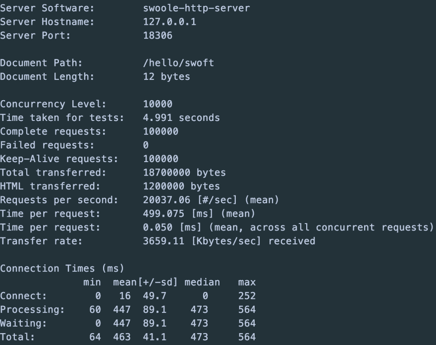
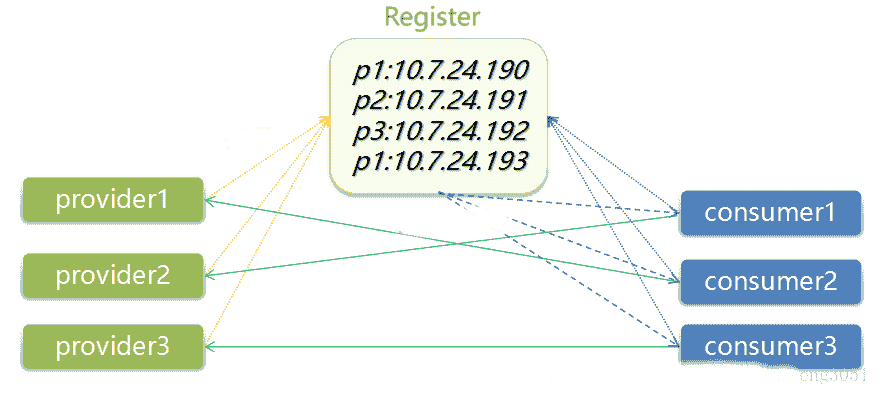
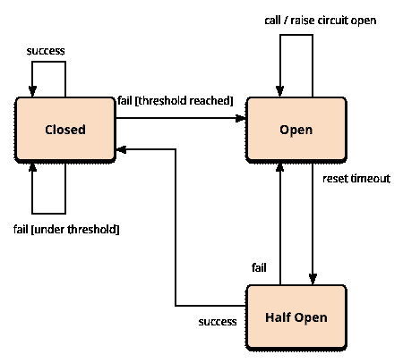

# 如何用 PHP 实现微服务？

> 原文：<https://dev.to/stelin/how-to-use-php-to-implement-microservices-4kjm>

[](https://res.cloudinary.com/practicaldev/image/fetch/s--dyFiiNXE--/c_limit%2Cf_auto%2Cfl_progressive%2Cq_auto%2Cw_880/https://raw.githubusercontent.com/swoft-cloud/blog/master/image/mico.jpg)

# 如何用 PHP 实现微服务？

### 为什么说服务治理？

随着互联网浏览的日益普及，随着应用规模的不断扩大，传统的 MVC 单一架构已经变得越来越臃肿，越来越难以维护。

我们必须采取措施对应用进行拆分，也就是根据业务特点将原来的应用拆分成多个应用。例如，大型电子商务系统可能包括用户系统、商品系统、订单系统、评估系统等。，我们可以将它们分成单独的应用程序。多应用架构的特点是应用独立，互不调用。

多个应用虽然解决了应用臃肿的问题，但是应用之间是相互独立的，一些常用的服务或代码无法重用。

### 单应用解决方案

对于一个大型的互联网系统来说，通常会有多个应用，应用之间往往有共同的服务，应用之间存在调用关系。此外，大型互联网系统还面临其他挑战，比如如何应对快速增长的用户，如何管理 R&D 团队快速迭代产品开发，如何保持产品升级更加稳定等等。

因此，为了使服务得到很好的重用，模块更容易扩展和维护。我们希望服务与应用程序分离。服务不再是应用程序，而是作为独立的服务来维护。应用程序本身不再是臃肿的模块堆栈，而是模块化的服务组件。

## 服务

### 特性

那么使用“服务”的特点是什么呢？

*   按业务划分为服务的应用程序
*   单个服务可以独立部署
*   服务可以由多个应用程序共享
*   服务之间的通信
*   该系统在架构上更加清晰
*   核心模块是稳定的，并以服务组件为单位进行升级，避免了频繁发布的风险
*   易于开发和管理
*   个人团队维护，分工明确，责任明确
*   服务重用、代码重用
*   非常容易扩展

### 服务的挑战

系统服务化后，依赖关系复杂，服务与服务之间的交互次数增加。在`fpm`的开发模式中，因为常驻内存无法带给我们，所以每一个请求都必须从零开始。开始加载到退出进程，增加了很多无用的开销，数据库连接无法重用也无法保护，因为`fpm`是基于进程的`fpm`进程数也决定了并发数，这也是 Fpm 开发简单给我们带来的问题。那么为什么现在互联网平台`Java`更受欢迎，`.NET`和`PHP`在这方面就不行了。`PHP non-memory resident`就不用说了。此外，还有许多其他问题需要解决。

*   越来越多的服务，复杂的配置管理
*   复杂的服务依赖关系
*   服务之间的负载平衡
*   服务扩展
*   服务监控
*   服务降级
*   服务认证
*   在线和离线服务
*   服务文档......

常驻记忆给我们带来的好处可想而知。

*   **只启动帧初始化**如果常驻内存我们只在启动时初始化内存中的内存，集中精力处理请求

*   **连接复用**，有些工程师不能具体理解，如果不需要连接到池，那么对一个请求做一个连接怎么样？这将导致过多的后端资源连接。对于一些基本服务，如 Redis、数据库，连接是一种昂贵的消耗。

那么有好的方案吗？答案是肯定的，而且很多人都在用这个框架，它就是- `Swoft`。`Swoft`是一个具有`Service Governance`特性的 [RPC](https://en.swoft.org/docs/2.x/zh-CN/rpc-server/index.html) 框架。`Swoft`是第一个 PHP 常驻内存协程全栈框架，基于核心概念`Spring Boot`约定大于配置

`Swoft`提供了一种更优雅的方式来使用`RPC`服务，如`Dubbo`，`Swoft`的性能与类似的`Golang`的性能非常好，下面是我的`PC`与`Swoft`的性能对比。正在发生。

[](https://res.cloudinary.com/practicaldev/image/fetch/s--CVsRfkyh--/c_limit%2Cf_auto%2Cfl_progressive%2Cq_auto%2Cw_880/https://raw.githubusercontent.com/swoft-cloud/blog/master/image/abTesting.png)

`ab`压力测试的处理速度非常惊人，在`i78 generation` CPU、`16GB`内存、`100000`百万请求只使用`5s`时间在`fpm`开发模式下基本上是不可能实现的。足以展示`Swoft`的高性能和稳定性，

## 优雅的服务治理

### [服务注册和发现](https://en.swoft.org/docs/2.x/en/ms/govern/register-discovery.html)

在微服务治理过程中，通常会涉及到向第三方集群(如 consul / etcd)发起的服务注册。本章使用 swoft 框架中的 swoft-consul 组件来实现服务注册和发现。
[](https://res.cloudinary.com/practicaldev/image/fetch/s--FK1f76w_--/c_limit%2Cf_auto%2Cfl_progressive%2Cq_auto%2Cw_880/https://raw.githubusercontent.com/swoft-cloud/blog/master/image/registerProvider.png) 
实现逻辑

```
<?php declare(strict_types=1);

namespace App\Common;

use ReflectionException;
use Swoft\Bean\Annotation\Mapping\Bean;
use Swoft\Bean\Annotation\Mapping\Inject;
use Swoft\Bean\Exception\ContainerException;
use Swoft\Consul\Agent;
use Swoft\Consul\Exception\ClientException;
use Swoft\Consul\Exception\ServerException;
use Swoft\Rpc\Client\Client;
use Swoft\Rpc\Client\Contract\ProviderInterface;

/**
 * Class RpcProvider
 *
 * @since 2.0
 *        
 * @Bean()
 */
class RpcProvider implements ProviderInterface
{
    /**
     * @Inject()
     *
     * @var Agent
     */
    private $agent;

    /**
     * @param Client $client
     *
     * @return array
     * @throws ReflectionException
     * @throws ContainerException
     * @throws ClientException
     * @throws ServerException
     * @example
     * [
     *     'host:port',
     *     'host:port',
     *     'host:port',
     * ]
     */
    public function getList(Client $client): array
    {
        // Get health service from consul
        $services = $this->agent->services();

        $services = [

        ];

        return $services;
    }
} 
```

### [发球一击](https://en.swoft.org/docs/2.x/en/ms/govern/breaker.html)

在分布式环境中，尤其是微服务架构的分布式系统中，一个软件系统调用另一个远程系统是非常常见的。这种远程调用的被调用者可以是另一个进程，或者是网络上的另一个主机。这个远程调用与进程内部调用的最大区别是远程调用可能会失败或挂起。超时前无响应。更糟糕的是，如果有多个调用者调用同一个挂起的服务，很有可能一个服务的超时等待会迅速蔓延到整个分布式系统，造成连锁反应，消耗整个分布式系统的大量资源。最终会导致系统瘫痪。

断路器模式旨在防止分布式系统中这种瀑布式连锁反应导致的灾难。

[](https://res.cloudinary.com/practicaldev/image/fetch/s--x3L6OqfG--/c_limit%2Cf_auto%2Cfl_progressive%2Cq_auto%2Cw_880/https://raw.githubusercontent.com/swoft-cloud/swoft-doc/2.x/zh-CN/ms/govern/../../image/ms/breaker_ext.png)

在基本断路器模式下，当断路器处于断开状态时，不会调用保护供应商，但我们还需要额外的措施，以便在供应商恢复服务后重置断路器。一种可能的解决方案是断路器定期检测供电商的服务是否恢复。恢复后，状态将设置为关闭。断路器重试时的状态是半开状态。

保险丝的使用简单且功能强大。可以用一个`@Breaker`来注释。`Swoft`的熔丝可以在任何场景下使用，比如调用服务的时候。请求第三方时可以吹。降级

```
<?php declare(strict_types=1);

namespace App\Model\Logic;

use Exception;
use Swoft\Bean\Annotation\Mapping\Bean;
use Swoft\Breaker\Annotation\Mapping\Breaker;

/**
 * Class BreakerLogic
 *
 * @since 2.0
 *
 * @Bean()
 */
class BreakerLogic
{
    /**
     * @Breaker(fallback="loopFallback")
     *
     * @return string
     * @throws Exception
     */
    public function loop(): string
    {
        // Do something
        throw new Exception('Breaker exception');
    }

    /**
     * @return string
     * @throws Exception
     */
    public function loopFallback(): string
    {
        // Do something
    }
} 
```

### [服务限制](https://en.swoft.org/docs/2.x/en/ms/govern/limiter.html)

限制、融合、退化这个重点再怎么强调也不为过，因为它真的很重要。当服务不工作时，它必须被吹。限流是一种自我保护的工具。如果没有自我保护机制，不管收到多少连接，如果后端处理不够，前端流量很大的时候肯定会挂。

目前的限制是在访问稀缺资源，如秒杀、抢购商品时，限制并发和被请求的次数，从而有效削峰，平滑流量曲线。限流的目的是限制并发访问和并发请求的速率，或者在一个时间窗口内请求速度限制，以保护系统。一旦达到或超过速率限制，服务就会被拒绝或排队。

`Swoft`限流器底层使用令牌桶算法，底层依靠`Redis`实现分布式限流。

Swoft 速度限制器不仅限制流量控制器，还限制任何 bean 中的方法，并控制方法的访问速率。下面是下面例子的详细解释。

```
<?php declare(strict_types=1);

namespace App\Model\Logic;

use Swoft\Bean\Annotation\Mapping\Bean;
use Swoft\Limiter\Annotation\Mapping\RateLimiter;

/**
 * Class LimiterLogic
 *
 * @since 2.0
 *
 * @Bean()
 */
class LimiterLogic
{
    /**
     * @RequestMapping()
     * @RateLimiter(rate=20, fallback="limiterFallback")
     *
     * @param Request $request
     *
     * @return array
     */
    public function requestLimiter2(Request $request): array
    {
        $uri = $request->getUriPath();
        return ['requestLimiter2', $uri];
    }

    /**
     * @param Request $request
     *
     * @return array
     */
    public function limiterFallback(Request $request): array
    {
        $uri = $request->getUriPath();
        return ['limiterFallback', $uri];
    }
} 
```

这支持`symfony/expression-language`表达式。如果速度限制被调用，将调用`fallback`中定义的`limiterFallback`方法。

### [配置中心](https://en.swoft.org/docs/2.x/en/ms/govern/config.html)

在讨论配置中心之前，我们先来讨论一下配置文件。我们对它并不陌生。它为我们提供了动态修改程序的能力。引用别人的话来说:

> 动态调整系统运行时的飞行姿态！

我可以称我们的工作为修理高速飞行的飞机上的零件。我们人类总是无法控制和预测一切。对于我们的系统来说，总是需要预留一些控制线，在需要的时候进行调整，控制系统方向(比如灰控，限流调整)，这对于拥抱变化的互联网行业来说尤为重要。

对于单机版，我们称之为配置(文件)；对于分布式集群系统，我们称之为配置中心(系统)；

#### 到底什么是分布式配置中心？

随着业务的发展和微服务架构的升级，服务的数量和程序的配置越来越多(各种微服务，各种服务器地址，各种参数)，传统的配置文件方式和数据库方式已经不能满足发展。配置管理的人员要求:

*   安全性:配置遵循代码库中存储的源代码，容易造成配置泄露；
*   及时性:修改配置，重启服务生效。
*   限制:不支持动态调整:比如日志开关，函数开关；

因此，我们需要配置中心来管理配置！将业务开发人员从复杂繁琐的配置中解放出来，他们只需要专注于业务代码本身，就可以显著提高开发和运营效率。同时，套餐的配置和发布将进一步提升发布的成功率，为运维的精细控制和应急处理提供有力支持。

关于分布式配置中心，网上有很多开源解决方案，比如:

Apollo 是携程框架部开发的分布式配置中心。它可以集中管理不同环境和不同应用程序集群的配置。配置修改后可以实时推送到应用端。它具有标准化权限和流程管理的特点，适用于微服务。配置管理方案。

本章以`Apollo`为例，从远程配置中心获取配置和安全重启服务。如果对`Apollo`不熟悉，可以先看看`Swoft`扩展 [`Apollo`](https://en.swoft.org/docs/2.x/en/extra/apollo.html) 组件，阅读`Apollo`官方文档。

本章以`Swoft`中的`Apollo`为例。当`Apollo`配置改变时，重启服务(http-server/RPC-server/ws-server)。下面是一个代理的例子:

```
<?php declare(strict_types=1);

namespace App\Model\Logic;

use Swoft\Apollo\Config;
use Swoft\Apollo\Exception\ApolloException;
use Swoft\Bean\Annotation\Mapping\Bean;
use Swoft\Bean\Annotation\Mapping\Inject;

/**
 * Class ApolloLogic
 *
 * @since 2.0
 *
 * @Bean()
 */
class ApolloLogic
{
    /**
     * @Inject()
     *
     * @var Config
     */
    private $config;

    /**
     * @throws ApolloException
     */
    public function pull(): void
    {
        $data = $this->config->pull('application');

        // Print data
        var_dump($data);
    }
} 
```

以上是简单的阿波罗配置拉动，除了这个方法， [`Swoft-Apollo`](https://en.swoft.org/docs/2.x/en/extra/apollo.html) 提供了更多的使用方法。

## 官方链接

*   [Github](https://github.com/swoft-cloud/swoft)
*   [文件](https://en.swoft.org/docs)
*   [微软云/社区](https://gitter.im/swoft-cloud/community)