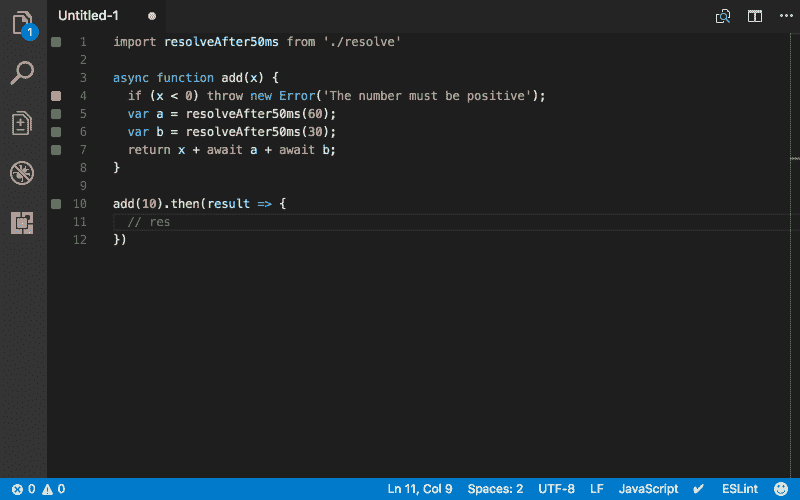
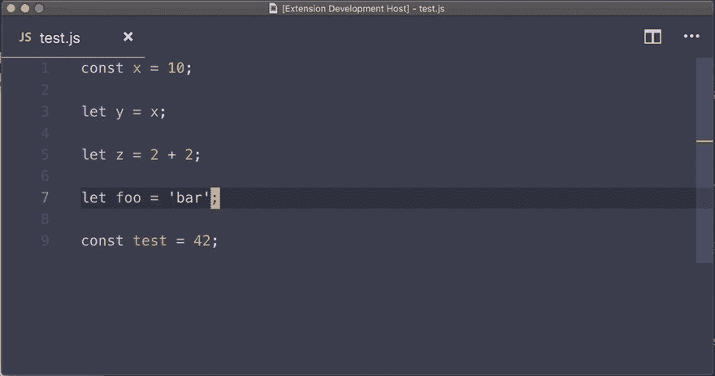

# 10 分钟内克隆一个

> 原文：<https://dev.to/satansdeer/quokka-clone-in-10-minutes-vscode-extention-tutorial-3g1k>

在本教程中，我们将学习如何创建一个 VSCode 扩展，它将与 Node Inspector 通信以收集执行数据——基本上是一个 Quokka.js 克隆。

对于那些不知道 Quokka.js 是什么的人来说——它是一个用于 Javascript/Typescript 的实时暂存区，允许您在编辑器中查看代码执行的结果。

[](https://res.cloudinary.com/practicaldev/image/fetch/s--5iqIeSwi--/c_limit%2Cf_auto%2Cfl_progressive%2Cq_66%2Cw_880/https://maksimivanov.com/vsc1-ba472c0a119812b781861024b2261c78.gif)

我们将构建的扩展将被称为 Wombat.js，因为袋熊很酷，它们会排泄立方体。

[](///static/9c3e58268b52f345aeb729b3835e2b7f/4fcb7/wombat.jpg)

我将使用 Typescript，因为当我使用不熟悉的模块/库时，我喜欢使用类型注释和智能代码完成。

## 引导新 VSCode 扩展

我们将首先创建我们的 VSCode 扩展。

VSCode 提供了一个 Yeoman 生成器来引导新的扩展。

确保您已经在全球范围内安装了约曼。

```
npm i -g yeoman 
```

<svg width="20px" height="20px" viewBox="0 0 24 24" class="highlight-action crayons-icon highlight-action--fullscreen-on"><title>Enter fullscreen mode</title></svg> <svg width="20px" height="20px" viewBox="0 0 24 24" class="highlight-action crayons-icon highlight-action--fullscreen-off"><title>Exit fullscreen mode</title></svg>

运行 vscode 扩展生成器:

```
yo code . 
```

<svg width="20px" height="20px" viewBox="0 0 24 24" class="highlight-action crayons-icon highlight-action--fullscreen-on"><title>Enter fullscreen mode</title></svg> <svg width="20px" height="20px" viewBox="0 0 24 24" class="highlight-action crayons-icon highlight-action--fullscreen-off"><title>Exit fullscreen mode</title></svg>

它会问你一堆关于你的项目的问题。回答它们，它将创建文件结构。

这里我假设您也会选择 Typescript 作为首选语言。

在 VSCode:
中打开项目

```
code <project name> 
```

<svg width="20px" height="20px" viewBox="0 0 24 24" class="highlight-action crayons-icon highlight-action--fullscreen-on"><title>Enter fullscreen mode</title></svg> <svg width="20px" height="20px" viewBox="0 0 24 24" class="highlight-action crayons-icon highlight-action--fullscreen-off"><title>Exit fullscreen mode</title></svg>

这里你需要输入你实际的项目名称，而不是`<project name>`。

> 这里我假设您安装了一个控制台命令，允许您从终端启动 VSCode。如果不是-这样做:
> 
> *   以常规方式启动 VSCode。
> *   打开命令面板(`⇧⌘P`在 Mac 上)，键入`shell command`找到 *Shell 命令:在 PATH 命令中安装‘code’命令。*

## 从节点检查器获取数据

因为 6.3 版本节点提供了一个内置的检查器，我们将使用哪个 API 来获取关于代码的运行时信息。

打开文件`src/extention.ts`并添加以下导入:

```
import * as path from "path";
import * as util from "util";
import * as inspector from "inspector"; 
```

<svg width="20px" height="20px" viewBox="0 0 24 24" class="highlight-action crayons-icon highlight-action--fullscreen-on"><title>Enter fullscreen mode</title></svg> <svg width="20px" height="20px" viewBox="0 0 24 24" class="highlight-action crayons-icon highlight-action--fullscreen-off"><title>Exit fullscreen mode</title></svg>

使激活函数异步，我们需要使用承诺和`async/await`来代替默认情况下`inspector`提供的回调 API。

```
export async function activate(context: vscode.ExtensionContext) { // ... 
```

<svg width="20px" height="20px" viewBox="0 0 24 24" class="highlight-action crayons-icon highlight-action--fullscreen-on"><title>Enter fullscreen mode</title></svg> <svg width="20px" height="20px" viewBox="0 0 24 24" class="highlight-action crayons-icon highlight-action--fullscreen-off"><title>Exit fullscreen mode</title></svg>

发射检查员:

```
export async function activate(context: vscode.ExtensionContext) { 
    inspector.open();

    // ... 
```

<svg width="20px" height="20px" viewBox="0 0 24 24" class="highlight-action crayons-icon highlight-action--fullscreen-on"><title>Enter fullscreen mode</title></svg> <svg width="20px" height="20px" viewBox="0 0 24 24" class="highlight-action crayons-icon highlight-action--fullscreen-off"><title>Exit fullscreen mode</title></svg>

这相当于运行`node --inspector somefile.js`。

在这里阅读更多

开始新的客户端会话。激活`inspector`后添加这些行。

```
const session = new inspector.Session();
session.connect(); 
```

<svg width="20px" height="20px" viewBox="0 0 24 24" class="highlight-action crayons-icon highlight-action--fullscreen-on"><title>Enter fullscreen mode</title></svg> <svg width="20px" height="20px" viewBox="0 0 24 24" class="highlight-action crayons-icon highlight-action--fullscreen-off"><title>Exit fullscreen mode</title></svg>

将`session.post`包入`promisify`中。

```
const post = <any>util.promisify(session.post).bind(session); 
```

<svg width="20px" height="20px" viewBox="0 0 24 24" class="highlight-action crayons-icon highlight-action--fullscreen-on"><title>Enter fullscreen mode</title></svg> <svg width="20px" height="20px" viewBox="0 0 24 24" class="highlight-action crayons-icon highlight-action--fullscreen-off"><title>Exit fullscreen mode</title></svg>

不幸的是，我们必须在这里使用类型`any`。通常，我尽可能避免使用`any`，但是这里它会使用错误的类型，因为`session.post`函数是如何被类型化的。

这是因为`session.post`是重载的，对于它调用的不同动作有不同的 arity，并且默认情况下 typescript 会选择它找到的最后一个函数定义。

在有`post`的情况下——应该是:

```
 post(method: "HeapProfiler.stopSampling", callback?: (err: Error | null, params: HeapProfiler.StopSamplingReturnType) => void): void; 
```

<svg width="20px" height="20px" viewBox="0 0 24 24" class="highlight-action crayons-icon highlight-action--fullscreen-on"><title>Enter fullscreen mode</title></svg> <svg width="20px" height="20px" viewBox="0 0 24 24" class="highlight-action crayons-icon highlight-action--fullscreen-off"><title>Exit fullscreen mode</title></svg>

正如你所看到的，这种类型只允许将`HeapProfiler.stopSampling`作为`method`，我们想使用普通的`string`类型。

在本教程中，我不想处理复杂的类型注释。或者，您可以创建自定义的`promisify`函数来克服这个限制。

使`registedCommand`回调异步。

要搜索`vscode.commands.registerCommand`并在回调定义前添加`async`。

```
let disposable = vscode.commands.registerCommand(
"extension.wombat",
async () => { // ... 
```

<svg width="20px" height="20px" viewBox="0 0 24 24" class="highlight-action crayons-icon highlight-action--fullscreen-on"><title>Enter fullscreen mode</title></svg> <svg width="20px" height="20px" viewBox="0 0 24 24" class="highlight-action crayons-icon highlight-action--fullscreen-off"><title>Exit fullscreen mode</title></svg>

我们的应用程序需要从当前打开的文件中获取文本，所以获取`activeTextEditor`实例。

```
const activeEditor = vscode!.window!.activeTextEditor;
if (!activeEditor) {
  return;
} 
```

<svg width="20px" height="20px" viewBox="0 0 24 24" class="highlight-action crayons-icon highlight-action--fullscreen-on"><title>Enter fullscreen mode</title></svg> <svg width="20px" height="20px" viewBox="0 0 24 24" class="highlight-action crayons-icon highlight-action--fullscreen-off"><title>Exit fullscreen mode</title></svg>

如果我们得不到编辑器实例，我们会立即停止执行。

这是我第二次用 Typescript 偷工减料。

看到那些`!.`——它告诉 Typescript 肯定有，100%肯定有，我以上帝的名义发誓是前一个领域的一个价值。

它叫做[非空断言操作符](https://github.com/Microsoft/TypeScript/wiki/What's-new-in-TypeScript#non-null-assertion-operator)。重要的是，它不同于`?.`即[可选链接操作符](https://tc39.es/proposal-optional-chaining/)(Ruby、C#和其他语言用户可能很熟悉)，而且目前在 Typescript 和 Javascript 中都不可用。

获取`document`和`fileName`以备后用:

```
const document = activeEditor!.document;
const fileName = path.basename(document.uri.toString()) 
```

<svg width="20px" height="20px" viewBox="0 0 24 24" class="highlight-action crayons-icon highlight-action--fullscreen-on"><title>Enter fullscreen mode</title></svg> <svg width="20px" height="20px" viewBox="0 0 24 24" class="highlight-action crayons-icon highlight-action--fullscreen-off"><title>Exit fullscreen mode</title></svg>

从编辑器编译脚本:

```
const { scriptId } = await post("Runtime.compileScript", {
  expression: document.getText(),
  sourceURL: fileName,
  persistScript: true
}); 
```

<svg width="20px" height="20px" viewBox="0 0 24 24" class="highlight-action crayons-icon highlight-action--fullscreen-on"><title>Enter fullscreen mode</title></svg> <svg width="20px" height="20px" viewBox="0 0 24 24" class="highlight-action crayons-icon highlight-action--fullscreen-off"><title>Exit fullscreen mode</title></svg>

这里我们使用`document.getText()`来获取源代码。我们得到了下一步需要的`scriptId`。

运行脚本:

```
await post("Runtime.runScript", {
  scriptId
}); 
```

<svg width="20px" height="20px" viewBox="0 0 24 24" class="highlight-action crayons-icon highlight-action--fullscreen-on"><title>Enter fullscreen mode</title></svg> <svg width="20px" height="20px" viewBox="0 0 24 24" class="highlight-action crayons-icon highlight-action--fullscreen-off"><title>Exit fullscreen mode</title></svg>

获取全局命名空间中的所有变量:

```
const data = await post("Runtime.globalLexicalScopeNames", {
  executionContextId: 1
}); 
```

<svg width="20px" height="20px" viewBox="0 0 24 24" class="highlight-action crayons-icon highlight-action--fullscreen-on"><title>Enter fullscreen mode</title></svg> <svg width="20px" height="20px" viewBox="0 0 24 24" class="highlight-action crayons-icon highlight-action--fullscreen-off"><title>Exit fullscreen mode</title></svg>

这里我硬编码了`executionContextId`。或者，您也可以通过订阅`Runtime.executionContextCreated`事件来获取。

它将返回一个数组，其中包含全局名称空间中可用的`var`、`let`或`const`定义的列表。

在接下来的步骤中，我们将获取它们的值。

当然，这不是 Quokka.js 的做法，但对于本教程来说，这已经足够了。

映射变量名并获取它们的值:

```
data.names.map(async (expression: string) => {
    const {
      result: { value }
    } = await post("Runtime.evaluate", {
      expression,
      contextId: 1
    });
}) 
```

<svg width="20px" height="20px" viewBox="0 0 24 24" class="highlight-action crayons-icon highlight-action--fullscreen-on"><title>Enter fullscreen mode</title></svg> <svg width="20px" height="20px" viewBox="0 0 24 24" class="highlight-action crayons-icon highlight-action--fullscreen-off"><title>Exit fullscreen mode</title></svg>

我们通过在运行脚本的相同上下文中将变量名作为表达式执行来做到这一点。

获取可变位置。将此添加到`map`功能中。

```
const { result } = await post("Debugger.searchInContent", {
  scriptId,
    query: expression
  }); 
```

<svg width="20px" height="20px" viewBox="0 0 24 24" class="highlight-action crayons-icon highlight-action--fullscreen-on"><title>Enter fullscreen mode</title></svg> <svg width="20px" height="20px" viewBox="0 0 24 24" class="highlight-action crayons-icon highlight-action--fullscreen-off"><title>Exit fullscreen mode</title></svg>

## 在用户界面显示信息

现在我们需要以某种方式显示这些信息。

我想知道 Quokka.js 是怎么做到的。

令人惊讶的是，在 VSCode 中找到允许在文本顶部显示信息的 API 非常麻烦，因为在功能的`API`部分中没有提到它。于是我只好直接跳到了`references`段。

它在 API 文档中被称为`decorators`，我觉得这个名字有点不直观。我在寻找类似“覆盖 API”的东西——当然是零成功。

回到教程:

定义`addDecorationWithText`功能:

```
const addDecorationWithText = (
  contentText: string,
  line: number,
  column: number,
  activeEditor: vscode.TextEditor
) => {
  const decorationType = vscode.window.createTextEditorDecorationType({
    after: {
      contentText,
      margin: "20px"
    }
  });

  const range = new vscode.Range(
    new vscode.Position(line, column),
    new vscode.Position(line, column)
  );

  activeEditor.setDecorations(decorationType, [{ range }]);
}; 
```

<svg width="20px" height="20px" viewBox="0 0 24 24" class="highlight-action crayons-icon highlight-action--fullscreen-on"><title>Enter fullscreen mode</title></svg> <svg width="20px" height="20px" viewBox="0 0 24 24" class="highlight-action crayons-icon highlight-action--fullscreen-off"><title>Exit fullscreen mode</title></svg>

由于这些装饰的工作方式，我们需要为每个案例创建一个单独的`decorationType`，因为我们希望有不同的`contextText`值。

然后我们定义范围——在我们的例子中，只有一行，所以这个范围的开始和结束部分是相同的。

最后，我们给`activeEditor`添加了一个装饰。

使用`addDecorationWithText`的时间。在我们之前定义的名字`map`中调用这个函数:

```
addDecorationWithText(
  `${value}`,
  result[0].lineNumber,
  result[0].lineContent.length,
  activeEditor
); 
```

<svg width="20px" height="20px" viewBox="0 0 24 24" class="highlight-action crayons-icon highlight-action--fullscreen-on"><title>Enter fullscreen mode</title></svg> <svg width="20px" height="20px" viewBox="0 0 24 24" class="highlight-action crayons-icon highlight-action--fullscreen-off"><title>Exit fullscreen mode</title></svg>

将它添加到该函数的末尾。

## 启动分机

是时候检查我们的扩展如何工作了。

按下`F5`或`Debug -> Start Debugging`。

它将在调试模式下启动一个新的 VSCode 窗口。

打开一些简单的 Javascript 文件:

```
const x = 10;

let y = x;

let z = 2 + 2;

let foo = 'bar';

const test = 42; 
```

<svg width="20px" height="20px" viewBox="0 0 24 24" class="highlight-action crayons-icon highlight-action--fullscreen-on"><title>Enter fullscreen mode</title></svg> <svg width="20px" height="20px" viewBox="0 0 24 24" class="highlight-action crayons-icon highlight-action--fullscreen-off"><title>Exit fullscreen mode</title></svg>

这是我用过的文件。

运行`wombat`命令。

打开`Command Pallete`(Mac 上的`⇧⌘P`，输入`wombat`。然后按回车。

[](https://res.cloudinary.com/practicaldev/image/fetch/s--yTllaZA2--/c_limit%2Cf_auto%2Cfl_progressive%2Cq_66%2Cw_880/https://maksimivanov.com/wombat-0570e01cb6d84a4991562aee84cedffc.gif)

## 发布您的扩展

使用`vsce`工具发布 VSCode 扩展。

在 VSCode 文档中有一个[指南](https://code.visualstudio.com/api/working-with-extensions/publishing-extension)解释了如何做到这一点。

您需要获得您的个人`publishedID`，然后运行`vsce publish`。

## 最后的话

当然，我们做的这个扩展非常基础，缺少真正使用它所需的 99.9999999%的功能。

实际上，我相信您还必须获得脚本的 AST 树，才能知道您想要跟踪的所有变量的确切位置。

此外，您必须有一些状态管理来存储脚本执行时的值。

我相信您还必须在开始时暂停执行，然后一步一步地执行脚本，记录每次迭代的当前状态。

但所有这些都不是本教程的重点。我想尝试一下可用的 API，做一个有趣的项目。

源代码可以在 [github](https://github.com/satansdeer/wombat) 上获得。该扩展本身可以在 [VSCode marketplace](https://marketplace.visualstudio.com/items?itemName=satansdeer.wombat) 中获得。如果你有任何问题，请在电报上给我[打电话。](https://t.me/satansdeer)