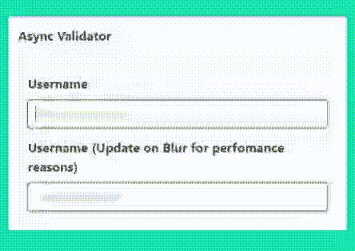

# 如何向角度反应式表单添加异步验证器

> 原文：<https://dev.to/mainawycliffe/how-to-add-async-validators-to-an-angular-reactive-form-3ohb>

有时，您可能希望根据异步源(即 HTTP 后端)提供的数据来验证表单输入。例如，在提交表单之前检查用户名或电子邮件地址是否存在。在 Angular 中，你可以使用异步验证器来实现这一点，我们将在本文中讨论这一点。

我们将构建一个简单的反应式表单。它将包含一个名为用户名的表单字段。然后，每当用户输入他们的用户名时，我们将检查它是否存在并返回响应。如果用户名存在，那么表单将报告以下错误–`The username is already taken.`,如下所示。

[](https://res.cloudinary.com/practicaldev/image/fetch/s--Z2igyEIM--/c_limit%2Cf_auto%2Cfl_progressive%2Cq_66%2Cw_880/https://codinglatte.com/posts/angular/how-to-add-async-validators-to-an-angular-reactive-form/demo.gif)

完整演示[此处](https://mainawycliffe.github.io/angular-async-validator/)。

> 如果您不熟悉角度反应式，请参考本指南[这里的](https://angular.io/guide/reactive-forms)开始使用。

事不宜迟，我们开始吧。

### 先决条件

我将跳过建立一个新的 Angular 项目的过程。一旦你有了你的角度项目设置，在你的应用模块中，你将需要从`@angular/forms`导入`ReactiveFormsModule`。这是我们在角度应用程序中使用反应式表单所需的唯一模块。

```
@NgModule({
  // ...
  imports: [
   BrowserModule,
   ReactiveFormsModule
  ],
  // ...
})

export class AppModule {} 
```

<svg width="20px" height="20px" viewBox="0 0 24 24" class="highlight-action crayons-icon highlight-action--fullscreen-on"><title>Enter fullscreen mode</title></svg> <svg width="20px" height="20px" viewBox="0 0 24 24" class="highlight-action crayons-icon highlight-action--fullscreen-off"><title>Exit fullscreen mode</title></svg>

接下来，让我们添加一个查找用户名方法的方法。

### 用户名查找方法

首先，我们将添加一个方法来检查用户的用户名是否存在。在一个普通的应用程序中，这是您向后端 API 发出 HTTP 请求的地方——可以是 REST、GraphQL API 等。但是出于本文的目的，我们将使用 [RXJS 延迟操作符](http://reactivex.io/documentation/operators/delay.html)来模拟一个 HTTP 请求。这将使我们的响应延迟大约一秒钟，并返回一个可观察的结果，就像 Angular 中的 HTTP 请求一样。

为此，我们将创建一个接受用户名的数组- `takenUsernames`。

```
takenUsernames = [
  'hello',
  'world',
  'username'
  // ...
]; 
```

<svg width="20px" height="20px" viewBox="0 0 24 24" class="highlight-action crayons-icon highlight-action--fullscreen-on"><title>Enter fullscreen mode</title></svg> <svg width="20px" height="20px" viewBox="0 0 24 24" class="highlight-action crayons-icon highlight-action--fullscreen-off"><title>Exit fullscreen mode</title></svg>

然后给定一个用户名，我们将使用 array includes 方法确定它是否存在于数组中。之后，无论结果如何，我们将延迟响应大约一秒钟，并以布尔可观察值的形式返回结果。

```
checkIfUsernameExists(username: string): Observable<boolean> {
  return of(this.takenUsernames.includes(username)).pipe(delay(1000));
} 
```

<svg width="20px" height="20px" viewBox="0 0 24 24" class="highlight-action crayons-icon highlight-action--fullscreen-on"><title>Enter fullscreen mode</title></svg> <svg width="20px" height="20px" viewBox="0 0 24 24" class="highlight-action crayons-icon highlight-action--fullscreen-off"><title>Exit fullscreen mode</title></svg>

### 添加异步验证器

接下来，我们将创建我们的异步验证器。要创建这个，我们只需要实现 [`AsyncValidatorFn`](https://angular.io/api/forms/AsyncValidatorFn) 接口。要实现`AsyncValidatorFN`接口，您需要一个接收表单控件类(又名 [`AbstractControl`](https://angular.io/api/forms/AbstractControl) )作为参数的方法。然后，该方法需要返回一个承诺或一个`ValidationErrors`或`null`的可观察值。如果有错误，该方法返回`ValidationErrors`，否则只返回 null。

一个`ValidationErrors`是另一个接口，只是所有抛出错误的[键值映射](https://angular.io/api/forms/ValidationErrors)，如下图:

```
type ValidationErrors = {
    [key: string]: any;
}; 
```

<svg width="20px" height="20px" viewBox="0 0 24 24" class="highlight-action crayons-icon highlight-action--fullscreen-on"><title>Enter fullscreen mode</title></svg> <svg width="20px" height="20px" viewBox="0 0 24 24" class="highlight-action crayons-icon highlight-action--fullscreen-off"><title>Exit fullscreen mode</title></svg>

例如，我们在这个帖子演示中的错误看起来应该是这样的`{ usernameExists: true }`。返回的错误的关键字允许您检查表单上的特定错误，并将它们显示给用户。这允许你给用户一个更精确的反馈，而不是泛泛的反馈。

> 请注意，当没有错误时，您应该总是返回 null。如果不返回 null，你的角形将处于无效状态。这可能会产生一些不良的副作用。

在我们检查错误的方法中，我们将把来自上面的`checkIfUsernameExists`方法的布尔响应映射到一个`ValidationErrors`或空响应。如果为假，它将返回 null，如果为真，它将返回一个`ValidationErrors`对象。

```
usernameValidator(): AsyncValidatorFn {
  return (control: AbstractControl): Observable<ValidationErrors | null> => {
    return this.checkIfUsernameExists(control.value).pipe(
      map(res => {
        // if res is true, username exists, return true
        return res ? { usernameExists: true } : null;
        // NB: Return null if there is no error
      })
    );
  };
} 
```

<svg width="20px" height="20px" viewBox="0 0 24 24" class="highlight-action crayons-icon highlight-action--fullscreen-on"><title>Enter fullscreen mode</title></svg> <svg width="20px" height="20px" viewBox="0 0 24 24" class="highlight-action crayons-icon highlight-action--fullscreen-off"><title>Exit fullscreen mode</title></svg>

我们将在用户名查找服务中加入上述方法。

### 向我们的反应式表单添加异步验证器

现在我们有了一个完整的工作服务，我们需要使用我们刚刚在上面创建的异步验证器。这是一个在同步验证器之后添加异步验证器数组的简单问题，如下所示。

```
return this.fb.group({
  username: [
    null, [Validators.required],  [this.usernameService.usernameValidator()]
  ]
}); 
```

<svg width="20px" height="20px" viewBox="0 0 24 24" class="highlight-action crayons-icon highlight-action--fullscreen-on"><title>Enter fullscreen mode</title></svg> <svg width="20px" height="20px" viewBox="0 0 24 24" class="highlight-action crayons-icon highlight-action--fullscreen-off"><title>Exit fullscreen mode</title></svg>

记住将`usernameLookupService`注入到你正在使用它的组件中。

```
constructor(private fb: FormBuilder, private usernameService: UsernameValidationService) {
  // ...
} 
```

<svg width="20px" height="20px" viewBox="0 0 24 24" class="highlight-action crayons-icon highlight-action--fullscreen-on"><title>Enter fullscreen mode</title></svg> <svg width="20px" height="20px" viewBox="0 0 24 24" class="highlight-action crayons-icon highlight-action--fullscreen-off"><title>Exit fullscreen mode</title></svg>

### UI 实现

最后，在模板内部，您可以检查表单是否有错误。您可以检查模板中的表单域是否有验证错误，如下所示。

```
frmAsyncValidator.controls['username'].errors?.usernameExists 
```

<svg width="20px" height="20px" viewBox="0 0 24 24" class="highlight-action crayons-icon highlight-action--fullscreen-on"><title>Enter fullscreen mode</title></svg> <svg width="20px" height="20px" viewBox="0 0 24 24" class="highlight-action crayons-icon highlight-action--fullscreen-off"><title>Exit fullscreen mode</title></svg>

如果有错误，则返回 true，否则未定义，因此使用 [`safe navigation operator (?)`](https://angular.io/guide/template-syntax#safe-navigation-operator) 。这是我们表单的完整模板:

```
<form [formGroup]="frmAsyncValidator">
  <div class="field has-text-left">
    <label class="label">Username </label>
    <div [ngClass]="{'is-loading':
frmAsyncValidator.controls['username'].pending }" class="control">
      <input [ngClass]="{'is-danger': hasError('username', 'any')}" formControlName="username" class="input is-focused" type="username" placeholder="Your username">
    </div>
    <div class="has-text-danger" *ngIf="frmAsyncValidator.controls['username'].errors?.usernameExists">
      This username is already taken!
    </div>
  </div>
</form> 
```

<svg width="20px" height="20px" viewBox="0 0 24 24" class="highlight-action crayons-icon highlight-action--fullscreen-on"><title>Enter fullscreen mode</title></svg> <svg width="20px" height="20px" viewBox="0 0 24 24" class="highlight-action crayons-icon highlight-action--fullscreen-off"><title>Exit fullscreen mode</title></svg>

### 关于性能的说明

目前，我们已经实现了我们的异步验证器，它在表单值改变时运行。对于同步验证器，您可能永远不会注意到任何性能影响。然而，对于异步验证器，这可能会有一些不希望的副作用。这是因为您最有可能将 HTTP 请求发送到某种后端进行验证。对表单值更改运行验证可能会因为过多的请求而使后端不堪重负。

因此，您可以将验证器改为运行`onBlur`，而不是在表单值改变时运行。您可以通过为单个表单控件或整个表单的`{ updateOn: 'blur' }`添加`updateOn`属性来实现这一点:

这就是如何为整个表单设置`{ updateOn: 'blur' }`属性:

```
this.fb.group({/** field here */}, { updateOn: 'blur' }); 
```

<svg width="20px" height="20px" viewBox="0 0 24 24" class="highlight-action crayons-icon highlight-action--fullscreen-on"><title>Enter fullscreen mode</title></svg> <svg width="20px" height="20px" viewBox="0 0 24 24" class="highlight-action crayons-icon highlight-action--fullscreen-off"><title>Exit fullscreen mode</title></svg>

这就是你如何为一个单独的表单控件做的:

```
username: [
  null,
  {
    validators: [Validators.required],
    asyncValidators: [this.usernameService.usernameValidator()],
    updateOn: 'blur'
  }
] 
```

<svg width="20px" height="20px" viewBox="0 0 24 24" class="highlight-action crayons-icon highlight-action--fullscreen-on"><title>Enter fullscreen mode</title></svg> <svg width="20px" height="20px" viewBox="0 0 24 24" class="highlight-action crayons-icon highlight-action--fullscreen-off"><title>Exit fullscreen mode</title></svg>

### 结论

在这篇文章中，你可以在 GitHub 上的这里找到这篇文章示例[的代码。如果您有任何疑问/问题/建议，请随时使用下面的评论部分。你也可以在我的新休闲频道](https://github.com/mainawycliffe/angular-async-validator)[这里](https://forms.gle/PdD4RcAS8kK6TMbF9)或者[推特](https://twitter.com/coding_latte)上加入我，我会尽我所能提供帮助。

谢谢你。